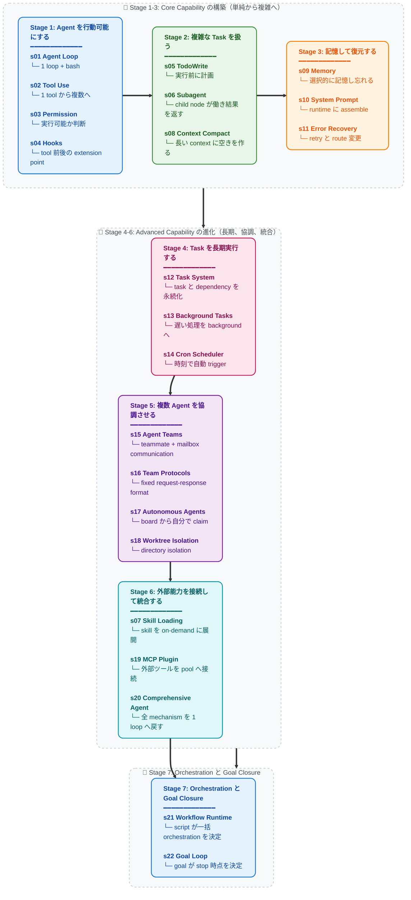

# Learn Claude Code -- 本物の Agent Harness Engineering

[English](./README.md) | [中文](./README.zh.md) | [日本語](./README.ja.md)

## Agency はモデルから生まれる。Agent 製品 = モデル + Harness

コードを論じる前に、1 つ明確にしておきましょう。

**Agency、つまり知覚し、推論し、行動する能力はモデルの訓練から生まれ、外部コードの orchestration からは生まれません。** ただし、実際に働く Agent 製品にはモデルと Harness の両方が必要です。モデルが運転者、Harness が乗り物です。この repository は、その乗り物の作り方を教えます。

### Agency はどこから来るのか

Agent の core は neural network、つまり Transformer、RNN、訓練された関数です。何十億回もの gradient update を行動系列データに適用し、環境の知覚、目標の推論、行動を学びます。Agency は周囲のコードから与えられたのではなく、モデルが訓練によって獲得したものです。

人間が最も分かりやすい例です。何百万年もの進化的訓練で形成された生物学的 neural network が、感覚を通して世界を知覚し、脳で推論し、身体で行動します。DeepMind、OpenAI、Anthropic が「agent」と言うとき、core は同じです。**訓練を通じて行動を学んだモデルと、特定の環境で働けるようにする infrastructure の組み合わせです。**

歴史はすでに強い証拠を残しています。

- **2013 -- DeepMind DQN が Atari をプレイ。** 生の pixel と game score だけを受け取る 1 つの neural network が Atari 2600 の 7 game を学び、従来の全 algorithm を超え、そのうち 3 game では人間の expert に勝ちました。2015 年には同じ architecture が [49 game へ拡張され、professional human tester の水準に到達](https://www.nature.com/articles/nature14236)し、*Nature* に掲載されました。game 固有の rule も decision tree もありません。経験から学ぶ 1 つのモデル。そのモデルこそが Agent でした。

- **2019 -- OpenAI Five が Dota 2 を制覇。** 5 つの neural network が 10 か月で [45,000 年分の Dota 2 を self-play](https://openai.com/index/openai-five-defeats-dota-2-world-champions/)し、San Francisco の live match で TI8 world champion の **OG** を 2-0 で破りました。その後の public arena では 42,729 試合で勝率 99.4% でした。scripted strategy も metaprogrammed team coordination もなく、モデルは self-play だけで teamwork、戦術、real-time adaptation を学びました。

- **2019 -- DeepMind AlphaStar が StarCraft II を制覇。** AlphaStar は closed match で [professional player に 10-1 で勝利](https://deepmind.google/blog/alphastar-mastering-the-real-time-strategy-game-starcraft-ii/)し、その後 European server で [Grandmaster rank](https://www.nature.com/articles/d41586-019-03298-6)、90,000 人中上位 0.15% に到達しました。不完全情報、real-time decision、chess や Go をはるかに超える combinatorial action space を持つ game です。Agent は何だったのでしょう。モデルです。programmed ではなく、trained です。

- **2019 -- Tencent Juewu が Honor of Kings を制覇。** Tencent AI Lab の Juewu は 2019 年 8 月 2 日、World Champion Cup semifinal で [KPL professional player を 5v5 で破りました](https://www.jiemian.com/article/3371171.html)。1v1 mode では professional が [15 試合中 1 勝しかできず、最長でも 8 分未満](https://developer.aliyun.com/article/851058)でした。訓練強度は 1 日で人間の 440 年分です。2021 年には全 hero pool の BO5 で KPL professional 水準を全面的に超えました。手書きの hero counter table も scripted lineup orchestration もありません。1 つのモデルが self-play で game 全体をゼロから学びました。

- **2024-2025 -- LLM Agent が software engineering を変える。** Claude、GPT、Gemini は、人間の code と reasoning の広がり全体で訓練された large language model であり、coding agent として展開されています。codebase を読み、実装を書き、障害を debug し、team で協調します。architecture は過去の Agent と同じです。訓練されたモデルを環境へ置き、知覚と行動の tool を与えます。違うのは、学んだ内容の規模と解ける task の一般性だけです。

すべての milestone が同じ事実を示します。**Agency、つまり知覚し、推論し、行動する能力は trained であり、coded ではありません。** 同時に、すべての Agent には働く環境も必要です。Atari emulator、Dota 2 client、StarCraft II engine、IDE、terminal。モデルが intelligence を、環境が action space を提供し、両方で完全な Agent になります。

### Agent ではないもの

Prompt Chain、orchestration library、state graph、workflow builder は、いずれも有効な Harness tool になり得ます。control flow を明示し、state を永続化し、処理を route し、retry や approval を強制し、反復可能な process を観察可能かつ復元可能にします。

ただし、それ自体が Agency を生み出すわけではありません。固定された graph はモデル周辺の実行を制約し、協調させられますが、未知の状況を解釈し、推論し、行動を選ぶ能力は trained model から生まれます。問題は orchestration の利用ではなく、orchestration の構造をモデルの intelligence と取り違えることです。

実務上の境界は明確です。process を固定すべき場所では deterministic orchestration を使い、次の step に判断が必要な場所ではモデルに任せます。優れた Agent 製品は多くの場合、両方を組み合わせます。Harness が環境と実行を組織し、モデルが訓練で得た行動能力を提供します。

### Mindshift: 「Agent を開発する」から Harness を開発するへ

「Agent を開発している」という言葉が意味するのは、2 つのどちらかだけです。

**1. モデルを訓練する。** reinforcement learning、fine-tuning、RLHF、その他の gradient-based method で weight を調整します。task trajectory data、つまり実世界の domain における知覚、推論、行動の実際の系列を集め、モデルの behavior を形成します。DeepMind、OpenAI、Tencent AI Lab、Anthropic が行うことで、最も文字どおりの Agent development です。

**2. Harness を構築する。** モデルに operational environment を与えるコードを書きます。私たちの多くが行っていることで、この repository の core です。

Harness は、Agent が特定の domain で働くために必要なすべてです。

```
Harness = Tools + Knowledge + Observation + Action Interfaces + Permissions

    Tools:          file I/O、shell、network、database、browser
    Knowledge:      product docs、domain references、API specs、style guides
    Observation:    git diff、error logs、browser state、sensor data
    Action:         CLI commands、API calls、UI interactions
    Permissions:    sandbox isolation、approval workflows、trust boundaries
```

モデルが決め、Harness が実行します。モデルが推論し、Harness が context を提供します。モデルが運転者、Harness が乗り物です。

**Coding agent の Harness は IDE、terminal、filesystem です。** agricultural agent なら sensor array、irrigation control、weather data。hotel agent なら booking system、customer communication channel、facility-management API です。Agent、つまり intelligence と decision-maker は常にモデルです。Harness は domain ごとに変わり、Agent は domain をまたいで generalize します。

この repository は programming 用の乗り物を作る方法を教えます。しかし design pattern は estate management、agriculture、hotel operation、factory manufacturing、logistics、healthcare、education、scientific research など、あらゆる domain に一般化できます。知覚し、推論し、実行すべき task があるなら、Agent には Harness が必要です。

### Harness engineer は何をするのか

この repository を読んでいるなら、あなたはおそらく Harness engineer です。それは強い identity です。実際の仕事は次のとおりです。

- **ツールを実装する。** Agent に手を与えます。file read/write、shell execution、API call、browser control、database query。各ツールは環境内で Agent が取れる 1 つの action です。atomic、composable、明確に説明された形で設計します。

- **知識を curate する。** Agent に domain expertise を与えます。product documentation、architecture decision record、style guide、compliance requirement。s07 のように必要時に load し、前もって prompt へ詰め込みません。何が利用できるかを Agent に知らせ、必要なものは自分で取得させます。

- **Context を管理する。** Agent にきれいな memory を与えます。s06 の subagent isolation は noise leak を防ぎ、s08 の context compaction は履歴が現在を埋めることを防ぎ、s12 の task system は goal を 1 回の会話より長く保持します。

- **Permission を制御する。** Agent に boundary を与えます。file access を sandbox 化し、destructive operation に approval を要求し、Agent と外部 system の間に trust boundary を設けます。security engineering と Harness engineering が交わる場所です。

- **Task trajectory data を集める。** Harness 内で Agent が実行するすべての action sequence は training signal です。実際の deployment における perception-reasoning-action trajectory は、次世代 Agent model を fine-tune する原材料です。Harness は Agent に奉仕するだけでなく、Agent の進化にも役立ちます。

あなたは intelligence を書いているのではありません。intelligence が住む世界を構築しています。その世界の質、Agent がどれほど明確に見て、正確に行動し、豊富な知識を使えるかが、intelligence をどれほど有効に表現できるかを直接決めます。

**良い Harness を作れば、モデルが残りを行います。**

### Claude Code を選ぶ理由 -- Harness Engineering の masterclass

なぜこの repository は Claude Code を詳しく分解するのでしょうか。

Claude Code は、私たちが見た中で最も elegant で完全な Agent Harness implementation だからです。巧妙な trick があるからではなく、*しないこと*が理由です。自分自身が Agent になろうとせず、rigid workflow を強制せず、入念な decision tree でモデルの判断を置き換えません。モデルに tools、knowledge、context management、permission boundary を与え、道を空けます。

Claude Code を本質まで剥がすと、次のようになります。

```
Claude Code = 1 つの agent loop
            + tools (bash, read, write, edit, glob, grep, browser...)
            + on-demand skill loading
            + context compaction
            + subagent spawning
            + dependency graph 付き task system
            + async mailbox による team coordination
            + worktree-isolated parallel execution
            + permission governance
```

これだけです。これが architecture 全体です。各 component は Harness mechanism、Agent が住む世界の一部です。Agent 自身は何でしょう。Claude というモデルです。Anthropic が人間の reasoning と code の広がり全体で訓練しました。Harness が Claude を賢くしたのではありません。Claude はすでに賢く、Harness が手、目、workspace を与えました。

Claude Code が教材として重要なのは、**モデルを信頼し、engineering effort を Harness へ集中すると何が起こるかを示すからです。** この repository の s01-s22 は、Claude Code architecture の Harness mechanism を段階的に分解して再構成します。終えると Claude Code の動作だけでなく、あらゆる domain と Agent に通用する Harness engineering の一般原則を理解できます。

教訓は「Claude Code を copy する」ではありません。**最高の Agent 製品は、自分の仕事が intelligence ではなく Harness だと理解する engineer から生まれます。**

---

## Vision: 本物の Agent で宇宙を満たす

これは coding agent だけの話ではありません。

人間が複雑で multi-step、判断を必要とする仕事を行うあらゆる domain は、正しい Harness があれば Agent が働ける domain です。この repository の pattern は普遍的です。

```
estate management agent = model + property sensors + maintenance tools + tenant communication
agricultural agent       = model + soil/weather data + irrigation controls + crop knowledge
hotel operations agent   = model + booking system + customer channels + facility APIs
medical research agent   = model + literature search + lab equipment + protocol documents
manufacturing agent      = model + production sensors + quality control + logistics systems
education agent          = model + curriculum knowledge + student progress + assessment tools
```

loop は変わりません。tools が変わり、knowledge が変わり、permission が変わります。Agent = Model (LLM) + Generalized Operational Environment (Harness) です。

この repository を読む Harness engineer は、software engineering をはるかに超える pattern を学んでいます。intelligent で automated な未来の infrastructure を作る方法です。実世界の domain に良い Harness が 1 つ展開されるたび、Agent が知覚し、推論し、行動できる場所が 1 つ増えます。

まず workshop を満たし、次に farm、hospital、factory、そして city、planet へ進みます。

**Bash is all you need. Real agents are all the universe needs.**

---

```
                    THE AGENT PATTERN
                    =================

    User --> messages[] --> LLM --> response
                                      |
                            stop_reason == "tool_use"?
                           /                          \
                         yes                           no
                          |                             |
                    execute tools                    return text
                    append results
                    loop back -----------------> messages[]


    これが最小 loop です。すべての AI Agent に必要です。
    モデルが tool を呼ぶ時と stop する時を決めます。
    コードはモデルの要求を実行するだけです。
    この repository は loop の周囲すべて、つまり
    特定 domain で Agent を有効に働かせる Harness の作り方を教えます。
```

**単純な loop から完全な Harness まで、22 の段階的 lesson。**
**各 lesson が 1 つの Harness mechanism を追加し、各 mechanism に 1 つの motto があります。**

> **s01** &nbsp; *「One loop & Bash is all you need」* &mdash; 1 tool + 1 loop = 1 Agent
>
> **s02** &nbsp; *「ツールを 1 つ加えるなら、handler を 1 つ加える」* &mdash; loop は変えず、新ツールを dispatch map へ登録
>
> **s03** &nbsp; *「先に boundary を引き、その後 freedom を与える」* &mdash; 操作可能か、user approval が必要かを判断
>
> **s04** &nbsp; *「loop に接続し、loop の中へ書かない」* &mdash; main loop を変えず、ツール前後に extension point を残す
>
> **s05** &nbsp; *「計画のない Agent は行き当たりばったり」* &mdash; 行動前に step を列挙し、completion rate を倍増
>
> **s06** &nbsp; *「大きな task を分け、小さな task に clean context を与える」* &mdash; subagent が自分で働き、結果だけを持ち帰る
>
> **s07** &nbsp; *「必要時に load し、すべてを prompt へ詰め込まない」* &mdash; skill inventory を先に示し、必要時に展開
>
> **s08** &nbsp; *「context は必ず満杯になる。空きを作る」* &mdash; 4 層の compaction、安い処理から高い処理へ
>
> **s09** &nbsp; *「覚えるべきものを覚え、忘れるべきものを忘れる」* &mdash; selection、extraction、consolidation の 3 subsystem
>
> **s10** &nbsp; *「prompt は hard-code せず、assemble する」* &mdash; segment を on-demand に構成
>
> **s11** &nbsp; *「error は終点ではなく、recovery の開始点」* &mdash; retry、空間確保、route 変更
>
> **s12** &nbsp; *「大きな goal を小さな task に分け、順序を決め、永続化する」* &mdash; file-persisted task graph、multi-agent 協調の基盤
>
> **s13** &nbsp; *「遅い処理は background へ送り、Agent は考え続ける」* &mdash; background thread で command を実行し、完了通知を注入
>
> **s14** &nbsp; *「人が押さなくても、時刻で trigger する」* &mdash; time schedule で task を自動起動
>
> **s15** &nbsp; *「1 人で無理なら、team を組む」* &mdash; persistent teammate + asynchronous mailbox
>
> **s16** &nbsp; *「teammate の間には取り決めが必要」* &mdash; fixed request-response format で通信
>
> **s17** &nbsp; *「teammate が board を見て、仕事があれば claim する」* &mdash; Lead の個別割当なしで self-organize
>
> **s18** &nbsp; *「別々の directory で働き、互いに干渉しない」* &mdash; task は goal、worktree は directory を管理し、ID で binding
>
> **s19** &nbsp; *「能力が足りない？MCP を接続する」* &mdash; 外部ツールを同じ tool pool へ接続
>
> **s20** &nbsp; *「仕組みは多数、loop は 1 つ」* &mdash; それまでの全 mechanism を 1 つの完全な Harness へ戻す
>
> **s21** &nbsp; *「モデルが単一 step を決め、script が orchestration を決める」* &mdash; 1 回の tool_use で決定的な multi-agent flow を background 実行
>
> **s22** &nbsp; *「いつ止まるかは goal が決める」* &mdash; モデルの宣言だけでは止まらず、trusted evidence が condition を満たして終了

---

## Core Pattern

```python
def agent_loop(messages):
    while True:
        response = client.messages.create(
            model=MODEL, system=SYSTEM,
            messages=messages, tools=TOOLS,
        )
        messages.append({"role": "assistant",
                         "content": response.content})

        if response.stop_reason != "tool_use":
            return

        results = []
        for block in response.content:
            if block.type == "tool_use":
                output = TOOL_HANDLERS[block.name](**block.input)
                results.append({
                    "type": "tool_result",
                    "tool_use_id": block.id,
                    "content": output,
                })
        messages.append({"role": "user", "content": results})
```

各 lesson はこの loop の上に 1 つの Harness mechanism を重ねます。loop 自体は変わりません。loop は Agent に属し、mechanism は Harness に属します。

## Version Notes

この course には現在、2 つの tutorial track があります。

- **現在の main track: この course directory の `s01-s22`**
  `learn-claude-code/` 内の `s01_*` から `s22_*` が primary version で、現在の推奨 reading path です。各章に 3 言語の完全な narrative README、実行可能な `code.py`、必要な diagram があります。
- **legacy transition track: `docs/` と `agents/`**
  既存読者と旧 link のため、旧 12 章 system を一時的に保持しています。

新しい読者は `learn-claude-code/s01_agent_loop/` から `learn-claude-code/s22_goal_loop/` まで進んでください。legacy と現在の track では chapter number が完全には対応しないため、混在させないでください。

### Legacy-to-Current Mapping

| 旧 12 章版 | 現在の 22 章版 | Topic |
|---|---|---|
| old s01 | new s01 | Agent Loop |
| old s02 | new s02 | Tool Use |
| old s03 | new s05 | TodoWrite |
| old s04 | new s06 | Subagent |
| old s05 | new s07 | Skill Loading |
| old s06 | new s08 | Context Compact |
| old s07 | new s12 | Task System |
| old s08 | new s13 | Background Tasks |
| old s09 | new s15 | Agent Teams |
| old s10 | new s16 | Team Protocols |
| old s11 | new s17 | Autonomous Agents |
| old s12 | new s18 | Worktree Isolation |
| 新規追加 | s03、s04、s09、s10、s11、s14、s19、s20、s21、s22 | Permission、Hooks、Memory、System Prompt、Error Recovery、Cron、MCP、Comprehensive Agent、Workflow Runtime、Goal Loop |

## Scope（重要）

この repository は 0-to-1 の Harness engineering 学習 project であり、Agent model を囲む working environment を構築します。learning path を明確にするため、一部の production mechanism は意図的に簡略化または省略しています。

- `PreToolUse`、`SessionStart/End`、`ConfigChange` など、完全な event / hook bus behavior。
  s12 は教材用の最小 append-only lifecycle event stream だけを提供します。
- rule-based permission governance と trust workflow。
- resume/fork などの session lifecycle control と、より完全な worktree lifecycle management。
- transport、OAuth、resource subscription、polling など、完全な MCP runtime detail。

この repository の team JSONL mailbox protocol は教材 implementation であり、特定 production system の内部実装を主張するものではありません。

## Quick Start

### 新しい 22 章 Main Track

```sh
git clone https://github.com/Bill-Billion/learn-claude-code.git learn-agent-harness
cd learn-agent-harness/learn-claude-code
pip install -r requirements.txt
cp .env.example .env   # .env を編集し、ANTHROPIC_API_KEY を設定

python s01_agent_loop/code.py         # 起点: 1 loop + bash
python s08_context_compact/code.py    # context compaction（複雑な章）
python s22_goal_loop/code.py          # 終点章: 全 mechanism を 1 loop へ戻し、goal で閉じる
```

### 旧 12 章 Transition Track

```sh
python agents/s01_agent_loop.py
python agents/s12_worktree_task_isolation.py
python agents/s_full.py
```

### Web Platform

Web platform は build 時に、この course directory の `s01_*` から `s22_*` までの現在の 22 章を抽出します。`npm run dev` と `npm run build` は、どちらもこの抽出を自動実行します。

```sh
cd web && npm install && npm run dev   # http://localhost:3000
```

## Learning Path

main line: 行動できる → 複雑な task を扱う → 記憶して復元する → 長期実行する → 協調する → 拡張して統合する



## 全 Chapter

| Chapter | Topic | Key Concepts |
|---|---|---|
| [s01](./s01_agent_loop/) | Agent Loop | `messages` / `while True` / `stop_reason` |
| [s02](./s02_tool_use/) | Tool Use | `TOOL_HANDLERS` / dispatch map / concurrency |
| [s03](./s03_permission/) | Permission | `PermissionRule` / approval pipeline |
| [s04](./s04_hooks/) | Hooks | `PreToolUse` / `PostToolUse` / extension points |
| [s05](./s05_todo_write/) | TodoWrite | `TodoItem` / plan before execution |
| [s06](./s06_subagent/) | Subagent | `fresh messages[]` / context isolation |
| [s07](./s07_skill_loading/) | Skill Loading | `SkillManifest` / on-demand injection |
| [s08](./s08_context_compact/) | Context Compact | snip / micro / budget / auto の 4 compaction layer |
| [s09](./s09_memory/) | Memory | selection / extraction / consolidation |
| [s10](./s10_system_prompt/) | System Prompt | runtime assembly / segmented composition |
| [s11](./s11_error_recovery/) | Error Recovery | token escalation / fallback model / retry policy |
| [s12](./s12_task_system/) | Task System | `TaskRecord` / `blockedBy` / disk persistence |
| [s13](./s13_background_tasks/) | Background Tasks | thread execution / notification queue |
| [s14](./s14_cron_scheduler/) | Cron Scheduler | persistent scheduling / session-scoped triggers |
| [s15](./s15_agent_teams/) | Agent Teams | `MessageBus` / inboxes / permission bubbling |
| [s16](./s16_team_protocols/) | Team Protocols | shutdown handshake / plan approval |
| [s17](./s17_autonomous_agents/) | Autonomous Agents | idle loop / automatic claiming |
| [s18](./s18_worktree_isolation/) | Worktree Isolation | `WorktreeRecord` / task-directory binding |
| [s19](./s19_mcp_plugin/) | MCP Plugin | multiple transports / channel routing / tool-pool assembly |
| [s20](./s20_comprehensive/) | Comprehensive Agent | 全 mechanism を 1 loop へ戻す |
| [s21](./s21_workflow_runtime/) | Workflow Runtime | script orchestration / background execution / journal-cached resume |
| [s22](./s22_goal_loop/) | Goal Loop | goal gate / trusted evidence / automatic continuation |

## Project Structure

```
learn-agent-harness/
  learn-claude-code/       # この course directory
    s01_agent_loop/        # chapter ごとに 1 folder
      README.md            #   英語の lesson 本文（完全な narrative）
      README.zh.md         #   中国語訳
      README.ja.md         #   日本語訳
      code.py              #   単独で実行可能なコード
      images/              #   SVG flow diagram
    s02_tool_use/
    ...
    s19_mcp_plugin/
    s20_comprehensive/
    s21_workflow_runtime/
    s22_goal_loop/         # 最終章
    agents/                # 旧 12 章の実行可能 copy + s_full.py
    skills/                # s07 が使う skill file
    docs/                  # 移行期間に残す旧 12 章 docs
    web/                   # build 時に現在の course を抽出
    tests/
```

## Course の後 -- 理解から実装へ

22 lesson を終えると、Harness engineering を内側から外側まで理解できます。知識を製品へ変える方法は 2 つあります。

### Kode Agent CLI -- Open-Source Coding Agent CLI

> `npm i -g @shareai-lab/kode`

Skill と LSP を support し、Windows に対応し、GLM、MiniMax、DeepSeek などの open model へ接続できます。install 後すぐに使えます。

GitHub: **[shareAI-lab/Kode-CLI](https://github.com/shareAI-lab/Kode-CLI)**

### Kode Agent SDK -- Agent capability を application へ埋め込む

公式 Claude Code Agent SDK は内部で完全な CLI process と通信するため、concurrent user ごとに terminal process が必要です。Kode SDK は per-user process overhead のない standalone library で、backend、browser extension、embedded device など任意の runtime に埋め込めます。

GitHub: **[shareAI-lab/kode-agent-sdk](https://github.com/shareAI-lab/kode-agent-sdk)**

---

## Sister Tutorial: 一時的で受動的な Session から、能動的な常駐 Assistant へ

この repository の Harness は **ephemeral** です。terminal を開き、Agent に task を渡し、完了したら閉じ、次回は新しい session から始めます。Claude Code はこの model です。

しかし [OpenClaw](https://github.com/openclaw/openclaw) は別の可能性を示しました。同じ Agent core の上に 2 つの Harness mechanism を追加すると、Agent は「押されたときだけ動く」状態から「30 秒ごとに自分で起き、仕事を探す」状態へ変わります。

- **Heartbeat** -- 30 秒ごとに Harness が Agent へ message を送り、仕事があるか確認させます。なければ眠り、あればすぐ行動します。
- **Cron** -- Agent は未来の仕事を自分で schedule し、時刻になると自動実行できます。

さらに WhatsApp、Telegram、Slack、Discord など 13 以上の platform にまたがる multi-channel IM routing、消えない context memory、Soul personality system を加えると、Agent は一時 tool から常時 online の personal AI assistant へ変わります。

**[claw0](https://github.com/shareAI-lab/claw0)** は sister teaching repository として、これらの Harness mechanism をゼロから分解します。

```
claw agent = agent core + heartbeat + cron + IM chat + memory + soul
```

```
learn-claude-code                   claw0
(agent harness core:                (proactive resident harness:
 loop, tools, planning,              heartbeat, scheduled tasks, IM channels,
 teams, worktree isolation)           memory, Soul personality)
```

## License

MIT

---

**Agency はモデルから生まれる。Harness が agency を実用化する。良い Harness を作れば、モデルが残りを行う。**

**Bash is all you need. Real agents are all the universe needs.**
