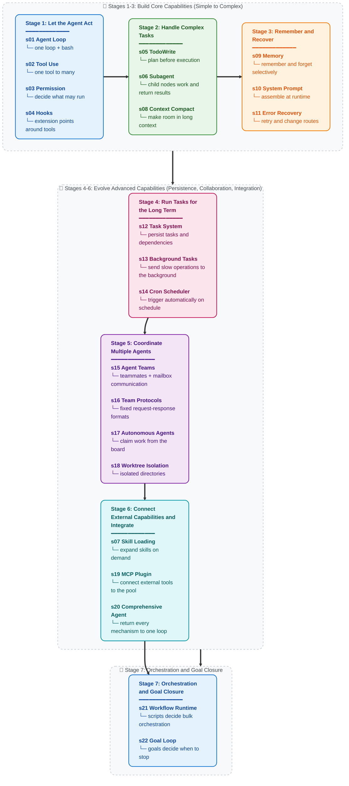

# Learn Claude Code -- Real Agent Harness Engineering

[English](./README.md) | [中文](./README.zh.md) | [日本語](./README.ja.md)

## Agency Comes from the Model. An Agent Product = Model + Harness

Before discussing code, one thing needs to be clear.

**Agency -- the capacity to perceive, reason, and act -- comes from model training, not from external code orchestration.** But a working agent product needs both the model and the harness. The model is the driver. The harness is the vehicle. This repository teaches you how to build the vehicle.

### Where Agency Comes From

At the core of an agent is a neural network -- a Transformer, an RNN, a trained function -- shaped by billions of gradient updates on sequences of action. It learned to perceive an environment, reason about goals, and take action. Agency was never bestowed by the surrounding code; it was learned during training.

Humans are the best example. A biological neural network refined by millions of years of evolutionary training perceives the world through senses, reasons through a brain, and acts through a body. When DeepMind, OpenAI, or Anthropic says "agent," the core meaning is the same: **a model that learned to act through training, plus infrastructure that lets it operate in a particular environment.**

History has already supplied the evidence:

- **2013 -- DeepMind DQN plays Atari.** A neural network receiving only raw pixels and game scores learned seven Atari 2600 games, surpassing every previous algorithm and beating human experts in three. By 2015, the same architecture had scaled to [49 games at the level of professional human testers](https://www.nature.com/articles/nature14236) in a paper published by *Nature*. No game-specific rules. No decision tree. One model learning from experience. That model was the agent.

- **2019 -- OpenAI Five conquers Dota 2.** Five neural networks played [45,000 years of Dota 2 against themselves](https://openai.com/index/openai-five-defeats-dota-2-world-champions/) over ten months, then defeated **OG**, the TI8 world champions, 2-0 in a live San Francisco match. In the public arena that followed, the AI won 99.4% of 42,729 games. No scripted strategy. No metaprogrammed coordination logic. The models learned teamwork, tactics, and real-time adaptation entirely through self-play.

- **2019 -- DeepMind AlphaStar masters StarCraft II.** AlphaStar [defeated professional players 10-1](https://deepmind.google/blog/alphastar-mastering-the-real-time-strategy-game-starcraft-ii/) in closed matches, then reached [Grandmaster rank](https://www.nature.com/articles/d41586-019-03298-6) on the European server, the top 0.15% among 90,000 players. It faced incomplete information, real-time decisions, and a combinatorial action space far larger than chess or Go. What was the agent? The model. Trained, not programmed.

- **2019 -- Tencent Juewu dominates Honor of Kings.** Tencent AI Lab's Juewu [defeated KPL professionals in 5v5](https://www.jiemian.com/article/3371171.html) at the World Champion Cup semifinal on August 2, 2019. In 1v1 mode, professionals [won only one of fifteen matches and lasted less than eight minutes at best](https://developer.aliyun.com/article/851058). Its training intensity made one day equivalent to 440 human years. By 2021, Juewu had surpassed KPL professional level across the full hero pool in BO5. No hand-written hero counter table. No scripted lineup orchestration. One model learned the entire game from scratch through self-play.

- **2024-2025 -- LLM agents reshape software engineering.** Claude, GPT, and Gemini, large language models trained on the breadth of human code and reasoning, are deployed as coding agents. They read codebases, write implementations, debug failures, and collaborate in teams. The architecture is identical to every previous agent: a trained model placed in an environment and given tools for perception and action. The only difference is the scale of what they learned and the generality of the tasks they can solve.

Every milestone points to the same fact: **agency -- the capacity to perceive, reason, and act -- is trained, not coded.** But every agent also needs an environment in which to work: an Atari emulator, the Dota 2 client, the StarCraft II engine, an IDE, and a terminal. The model supplies intelligence. The environment supplies the action space. Together they form a complete agent.

### What an Agent Is Not

Prompt chains, orchestration libraries, state graphs, and workflow builders can all be useful harness tools. They make control flow explicit, persist state, route work, enforce retries and approvals, and make repeatable processes observable and recoverable.

What they do not do is create agency. A fixed graph can constrain and coordinate execution around a model, but the capacity to interpret an unfamiliar situation, reason about it, and choose an action still comes from the trained model. The mistake is not using orchestration; it is mistaking orchestration structure for model intelligence.

The practical boundary is simple: use deterministic orchestration where the process should be fixed, and use the model where the next step requires judgment. A strong agent product often combines both. The harness organizes the environment and execution; the model supplies the learned capacity to act.

### The Mindshift: From "Building Agents" to Building Harnesses

When someone says, "I am building an agent," they can mean only one of two things:

**1. Training a model.** Adjusting weights through reinforcement learning, fine-tuning, RLHF, or another gradient-based method. Collecting task-trajectory data, real sequences of perception, reasoning, and action in a target domain, and using it to shape model behavior. This is what DeepMind, OpenAI, Tencent AI Lab, and Anthropic do. It is agent development in the most literal sense.

**2. Building a harness.** Writing code that gives a model an operational environment. This is what most of us do, and it is the focus of this repository.

A harness is everything an agent needs to work in a particular domain:

```
Harness = Tools + Knowledge + Observation + Action Interfaces + Permissions

    Tools:          file I/O, shell, network, database, browser
    Knowledge:      product docs, domain references, API specs, style guides
    Observation:    git diff, error logs, browser state, sensor data
    Action:         CLI commands, API calls, UI interactions
    Permissions:    sandbox isolation, approval workflows, trust boundaries
```

The model decides. The harness executes. The model reasons. The harness provides context. The model is the driver. The harness is the vehicle.

**A coding agent's harness is its IDE, terminal, and filesystem.** An agricultural agent's harness is its sensor array, irrigation controls, and weather data. A hotel agent's harness is its booking system, customer communication channels, and facility-management APIs. The agent, the intelligence and decision-maker, is always the model. Harnesses vary by domain. Agents generalize across domains.

This repository teaches you to build the vehicle: one designed for programming. But the design patterns generalize to any field, including estate management, agriculture, hotels, factories, logistics, healthcare, education, and scientific research. Whenever a task must be perceived, reasoned about, and executed, an agent needs a harness.

### What Harness Engineers Actually Do

If you are reading this repository, you are probably a harness engineer, and that is a powerful identity. Here is the actual work:

- **Implement tools.** Give the agent hands: file I/O, shell execution, API calls, browser control, and database queries. Every tool is one action the agent can take in its environment. Design tools to be atomic, composable, and clearly described.

- **Curate knowledge.** Give the agent domain expertise: product documentation, architecture decision records, style guides, and compliance requirements. Load it on demand, as in s07, rather than stuffing it all into the prompt. The agent should know what is available and retrieve what it needs.

- **Manage context.** Give the agent clean memory. Subagent isolation in s06 prevents noise from leaking. Context compaction in s08 keeps history from drowning the present. The task system in s12 lets goals persist beyond one conversation.

- **Control permissions.** Give the agent boundaries. Sandbox file access. Require approval for destructive operations. Enforce trust boundaries between the agent and external systems. This is where security engineering and harness engineering meet.

- **Collect task trajectories.** Every action sequence an agent executes inside your harness is training signal. Perception-reasoning-action trajectories from real deployments are raw material for fine-tuning the next generation of agent models. Your harness does not merely serve an agent; it can help evolve one.

You are not writing intelligence. You are building the world that intelligence inhabits. The quality of that world, how clearly the agent can see, how precisely it can act, and how rich its available knowledge is, directly determines how effectively intelligence can express itself.

**Build the harness well. The model will do the rest.**

### Why Claude Code -- a Masterclass in Harness Engineering

Why does this repository specifically dissect Claude Code?

Because Claude Code is the most elegant and complete agent-harness implementation we have seen. Not because of any clever trick, but because of what it *does not* do. It does not try to be the agent. It does not impose rigid workflows. It does not replace the model's judgment with carefully crafted decision trees. It gives the model tools, knowledge, context management, and permission boundaries, then gets out of the way.

Strip Claude Code to its essentials:

```
Claude Code = one agent loop
            + tools (bash, read, write, edit, glob, grep, browser...)
            + on-demand skill loading
            + context compaction
            + subagent spawning
            + task system with dependency graphs
            + async mailbox team coordination
            + worktree-isolated parallel execution
            + permission governance
```

That is it. That is the entire architecture. Every component is a harness mechanism, part of the world built for the agent to inhabit. The agent itself? Claude. A model trained by Anthropic on the breadth of human reasoning and code. The harness did not make Claude intelligent. Claude was already intelligent. The harness gave Claude hands, eyes, and a workspace.

That is why Claude Code matters as a teaching specimen: **it shows what happens when you trust the model and focus engineering effort on the harness.** The lessons in this repository, s01-s22, progressively disassemble and reconstruct the harness mechanisms in Claude Code's architecture. When you finish, you understand not only how Claude Code works but the general principles of harness engineering for any domain and any agent.

The lesson is not "copy Claude Code." The lesson is: **the best agent products are built by engineers who understand that their job is the harness, not the intelligence.**

---

## Vision: Fill the Universe with Real Agents

This is not only about coding agents.

Every domain in which humans perform complex, multi-step work requiring judgment is a domain where an agent can operate, given the right harness. The patterns in this repository are universal:

```
Estate management agent = model + property sensors + maintenance tools + tenant communication
Agricultural agent       = model + soil/weather data + irrigation controls + crop knowledge
Hotel operations agent   = model + booking system + customer channels + facility APIs
Medical research agent   = model + literature search + lab equipment + protocol documents
Manufacturing agent      = model + production sensors + quality control + logistics systems
Education agent          = model + curriculum knowledge + student progress + assessment tools
```

The loop never changes. The tools change. The knowledge changes. The permissions change. Agent = Model (LLM) + Generalized Operational Environment (Harness).

Every harness engineer reading this repository is learning patterns that reach far beyond software engineering. You are learning to build infrastructure for an intelligent, automated future. Every good harness deployed in a real domain gives an agent one more place to perceive, reason, and act.

Fill the workshop first. Then the farms, hospitals, and factories. Then cities. Then planets.

**Bash is all you need. Real agents are all the universe needs.**

---

```
                    THE AGENT PATTERN
                    =================

    User --> messages[] --> LLM --> response
                                      |
                            stop_reason == "tool_use"?
                           /                          \
                         yes                           no
                          |                             |
                    execute tools                    return text
                    append results
                    loop back -----------------> messages[]


    This is the minimal loop. Every AI agent needs it.
    The model decides when to call tools and when to stop.
    The code only executes what the model asks for.
    This repository teaches you to build everything around that loop --
    the harness that makes an agent effective in a particular domain.
```

**22 progressive lessons, from a simple loop to a complete harness.**
**Each lesson adds one harness mechanism. Each mechanism has a motto.**

> **s01** &nbsp; *"One loop & Bash is all you need"* &mdash; one tool + one loop = one agent
>
> **s02** &nbsp; *"Adding a tool means adding one handler"* &mdash; the loop stays untouched; new tools register in the dispatch map
>
> **s03** &nbsp; *"Set boundaries first, then grant freedom"* &mdash; decide what may run and what requires user approval
>
> **s04** &nbsp; *"Attach to the loop; do not write into the loop"* &mdash; leave extension points around tools without changing the main loop
>
> **s05** &nbsp; *"An agent without a plan wanders"* &mdash; list steps before acting and double the completion rate
>
> **s06** &nbsp; *"Break big tasks down; give each small task clean context"* &mdash; subagents work independently and bring back only results
>
> **s07** &nbsp; *"Load it when needed; do not stuff everything into the prompt"* &mdash; list the skill inventory first and expand entries on demand
>
> **s08** &nbsp; *"Context always fills up; make room"* &mdash; four compaction layers, cheap first and expensive last
>
> **s09** &nbsp; *"Remember what matters; forget what does not"* &mdash; three subsystems: selection, extraction, consolidation
>
> **s10** &nbsp; *"A prompt is assembled, not hard-coded"* &mdash; segments composed on demand
>
> **s11** &nbsp; *"An error is not the end; it is the start of recovery"* &mdash; retry, free space, and change routes
>
> **s12** &nbsp; *"Break large goals into small tasks, order them, persist them"* &mdash; a file-persisted task graph, the basis for multi-agent collaboration
>
> **s13** &nbsp; *"Send slow operations to the background and let the agent keep thinking"* &mdash; run commands in background threads and inject notifications when complete
>
> **s14** &nbsp; *"Trigger on schedule without a human push"* &mdash; start tasks automatically by time
>
> **s15** &nbsp; *"When one is not enough, form a team"* &mdash; persistent teammates + asynchronous mailboxes
>
> **s16** &nbsp; *"Teammates need agreements"* &mdash; communicate through fixed request-response formats
>
> **s17** &nbsp; *"Teammates inspect the board and claim available work"* &mdash; self-organization without assignments from the lead
>
> **s18** &nbsp; *"Separate directories, separate work, no interference"* &mdash; tasks manage goals, worktrees manage directories, and IDs bind them
>
> **s19** &nbsp; *"Need more capability? Plug in MCP"* &mdash; connect external tools to the same tool pool
>
> **s20** &nbsp; *"Many mechanisms, one loop"* &mdash; bring every previous mechanism back into one complete harness
>
> **s21** &nbsp; *"The model decides each step; the script decides the orchestration"* &mdash; one tool_use runs a deterministic multi-agent flow in the background
>
> **s22** &nbsp; *"The goal decides when to stop"* &mdash; the model cannot stop on its word alone; trusted evidence must satisfy the condition

---

## Core Pattern

```python
def agent_loop(messages):
    while True:
        response = client.messages.create(
            model=MODEL, system=SYSTEM,
            messages=messages, tools=TOOLS,
        )
        messages.append({"role": "assistant",
                         "content": response.content})

        if response.stop_reason != "tool_use":
            return

        results = []
        for block in response.content:
            if block.type == "tool_use":
                output = TOOL_HANDLERS[block.name](**block.input)
                results.append({
                    "type": "tool_result",
                    "tool_use_id": block.id,
                    "content": output,
                })
        messages.append({"role": "user", "content": results})
```

Every lesson layers one harness mechanism on top of this loop. The loop itself never changes. The loop belongs to the agent. The mechanisms belong to the harness.

## Version Notes

This course currently preserves two tutorial tracks:

- **Current main track: this course directory's `s01-s22`**
  The `s01_*` through `s22_*` directories inside `learn-claude-code/` are the primary version and the recommended reading path. Each chapter contains a complete narrative README in three languages, runnable `code.py`, and any necessary diagrams.
- **Legacy transition track: `docs/` and `agents/`**
  These retain the old 12-lesson system temporarily for existing readers and old links.

New readers should start at `learn-claude-code/s01_agent_loop/` and continue through `learn-claude-code/s22_goal_loop/`. The legacy chapter numbers do not correspond perfectly to the current track, so do not mix them.

### Legacy-to-Current Mapping

| Legacy 12-lesson version | Current 22-lesson version | Topic |
|---|---|---|
| old s01 | new s01 | Agent Loop |
| old s02 | new s02 | Tool Use |
| old s03 | new s05 | TodoWrite |
| old s04 | new s06 | Subagent |
| old s05 | new s07 | Skill Loading |
| old s06 | new s08 | Context Compact |
| old s07 | new s12 | Task System |
| old s08 | new s13 | Background Tasks |
| old s09 | new s15 | Agent Teams |
| old s10 | new s16 | Team Protocols |
| old s11 | new s17 | Autonomous Agents |
| old s12 | new s18 | Worktree Isolation |
| New additions | s03, s04, s09, s10, s11, s14, s19, s20, s21, s22 | Permission, Hooks, Memory, System Prompt, Error Recovery, Cron, MCP, Comprehensive Agent, Workflow Runtime, Goal Loop |

## Scope (Important)

This repository is a 0-to-1 harness-engineering learning project: it builds a working environment around an agent model. To keep the learning path clear, some production mechanisms are intentionally simplified or omitted:

- Full event / hook bus behavior, such as `PreToolUse`, `SessionStart/End`, and `ConfigChange`.
  s12 provides only a minimal append-only lifecycle event stream for teaching.
- Rule-based permission governance and trust workflows.
- Session lifecycle controls such as resume/fork, plus more complete worktree lifecycle management.
- Full MCP runtime details such as transport, OAuth, resource subscription, and polling.

The team JSONL mailbox protocol in this repository is a teaching implementation, not a claim about any specific production system's internals.

## Quick Start

### Current 22-Lesson Main Track

```sh
git clone https://github.com/Bill-Billion/learn-agent-harness.git
cd learn-agent-harness/learn-claude-code
pip install -r requirements.txt
cp .env.example .env   # Edit .env and add your ANTHROPIC_API_KEY

python s01_agent_loop/code.py         # Starting point: one loop + bash
python s08_context_compact/code.py    # Context compaction (a complex chapter)
python s22_goal_loop/code.py          # Final chapter: every mechanism in one loop, closed by a goal
```

### Legacy 12-Lesson Transition Track

```sh
python agents/s01_agent_loop.py
python agents/s12_worktree_task_isolation.py
python agents/s_full.py
```

### Web Platform

The web platform extracts the current 22-lesson track from the `s01_*` through `s22_*` directories in this course directory. Both `npm run dev` and `npm run build` run that extraction automatically.

```sh
cd web && npm install && npm run dev   # http://localhost:3000
```

## Learning Path

Main line: take action → handle complex tasks → remember and recover → run for the long term → collaborate → extend and integrate



## All Chapters

| Chapter | Topic | Key Concepts |
|---|---|---|
| [s01](./s01_agent_loop/) | Agent Loop | `messages` / `while True` / `stop_reason` |
| [s02](./s02_tool_use/) | Tool Use | `TOOL_HANDLERS` / dispatch map / concurrency |
| [s03](./s03_permission/) | Permission | `PermissionRule` / approval pipeline |
| [s04](./s04_hooks/) | Hooks | `PreToolUse` / `PostToolUse` / extension points |
| [s05](./s05_todo_write/) | TodoWrite | `TodoItem` / plan before execution |
| [s06](./s06_subagent/) | Subagent | `fresh messages[]` / context isolation |
| [s07](./s07_skill_loading/) | Skill Loading | `SkillManifest` / on-demand injection |
| [s08](./s08_context_compact/) | Context Compact | four compaction layers: snip / micro / budget / auto |
| [s09](./s09_memory/) | Memory | selection / extraction / consolidation |
| [s10](./s10_system_prompt/) | System Prompt | runtime assembly / segmented composition |
| [s11](./s11_error_recovery/) | Error Recovery | token escalation / fallback model / retry policy |
| [s12](./s12_task_system/) | Task System | `TaskRecord` / `blockedBy` / disk persistence |
| [s13](./s13_background_tasks/) | Background Tasks | thread execution / notification queue |
| [s14](./s14_cron_scheduler/) | Cron Scheduler | persistent scheduling / session-scoped triggers |
| [s15](./s15_agent_teams/) | Agent Teams | `MessageBus` / inboxes / permission bubbling |
| [s16](./s16_team_protocols/) | Team Protocols | shutdown handshake / plan approval |
| [s17](./s17_autonomous_agents/) | Autonomous Agents | idle loop / automatic claiming |
| [s18](./s18_worktree_isolation/) | Worktree Isolation | `WorktreeRecord` / task-directory binding |
| [s19](./s19_mcp_plugin/) | MCP Plugin | multiple transports / channel routing / tool-pool assembly |
| [s20](./s20_comprehensive/) | Comprehensive Agent | every mechanism returned to one loop |
| [s21](./s21_workflow_runtime/) | Workflow Runtime | script orchestration / background execution / journal-cached resume |
| [s22](./s22_goal_loop/) | Goal Loop | goal gate / trusted evidence / automatic continuation |

## Project Structure

```
learn-agent-harness/
  learn-claude-code/       # This course
    s01_agent_loop/        # One folder per chapter
      README.md            #   English lesson (complete narrative)
      README.zh.md         #   Chinese translation
      README.ja.md         #   Japanese translation
      code.py              #   Standalone runnable code
      images/              #   SVG flow diagrams
    s02_tool_use/
    ...
    s19_mcp_plugin/
    s20_comprehensive/
    s21_workflow_runtime/
    s22_goal_loop/         # Final chapter
    agents/                # Legacy 12-lesson runnable copies + s_full.py
    skills/                # Skill files used by s07
    docs/                  # Legacy 12-lesson docs retained during transition
    web/                   # Extracts the current course at build time
    tests/
```

## After the Course -- From Understanding to Deployment

After 22 lessons, you understand harness engineering from the inside out. There are two ways to turn that knowledge into a product:

### Kode Agent CLI -- Open-Source Coding Agent CLI

> `npm i -g @shareai-lab/kode`

Supports Skill and LSP, works on Windows, and connects to open models such as GLM, MiniMax, and DeepSeek. Install and run.

GitHub: **[shareAI-lab/Kode-cli](https://github.com/shareAI-lab/Kode-cli)**

### Kode Agent SDK -- Embed Agent Capabilities in Your Application

The official Claude Code Agent SDK communicates with a complete CLI process underneath, so each concurrent user requires a terminal process. Kode SDK is a standalone library with no per-user process overhead and can be embedded in backends, browser extensions, embedded devices, and other runtimes.

GitHub: **[shareAI-lab/Kode-agent-sdk](https://github.com/shareAI-lab/Kode-agent-sdk)**

---

## Sister Tutorial: From Ephemeral Reactive Sessions to a Proactive Resident Assistant

The harness in this repository is **ephemeral**: open a terminal, give the agent a task, close it when the work is done, and start a fresh session next time. Claude Code follows this model.

But [OpenClaw](https://github.com/openclaw/openclaw) demonstrates another possibility. Add two harness mechanisms above the same agent core, and an agent changes from "move only when kicked" to "wake every 30 seconds and look for work":

- **Heartbeat** -- Every 30 seconds, the harness sends the agent a message asking it to check for work. If there is none, it sleeps again; if there is, it acts immediately.
- **Cron** -- The agent can schedule future work for itself and execute it automatically at the appointed time.

Add multi-channel IM routing across WhatsApp, Telegram, Slack, Discord, and more than thirteen platforms, persistent context memory, and a Soul personality system, and the agent changes from a temporary tool into an always-online personal AI assistant.

**[claw0](https://github.com/shareAI-lab/claw0)** is our sister teaching repository. It dissects these harness mechanisms from first principles:

```
claw agent = agent core + heartbeat + cron + IM chat + memory + soul
```

```
learn-claude-code                   claw0
(agent harness core:                (proactive resident harness:
 loop, tools, planning,              heartbeat, scheduled tasks, IM channels,
 teams, worktree isolation)           memory, Soul personality)
```

## License

MIT

---

**Agency comes from the model. The harness makes agency operational. Build the harness well, and the model will do the rest.**

**Bash is all you need. Real agents are all the universe needs.**
