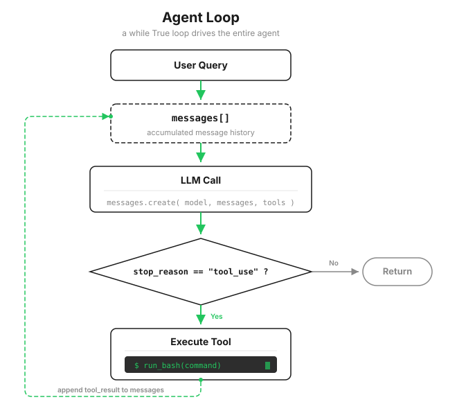

# s01: Agent Loop — One Loop Is All You Need

[中文](README.zh.md) · [English](README.md) · [日本語](README.ja.md)

`s01` → [s02](../s02_tool_use/) → s03 → s04 → ... → s20
> *"One loop & Bash is all you need"* — one tool + one loop = one Agent.
>
> **Harness layer**: The loop — the model's first connection to the real world.

---

Give a model in a chat window a task: "Show me which Python files are in my local directory, then run hello.py."

It replies with a perfectly reasonable bash command, then stops. You copy the command into a terminal and run it. You paste the output back. It reads that output and gives you the next command, so you run and paste again.

The model plans the task, but you do all the work. A real development task can easily take dozens of commands, which means dozens of rounds of manual message passing. This lesson does exactly one thing: replace *you* in that back-and-forth with a `while` loop. Once that happens, an Agent is born.



---

## First, Understand What One Model Call Really Is

Before writing the loop, look closely at what we have. Calling the model API is essentially sending a list and receiving one response:

```python
messages = [{"role": "user", "content": "Show me the Python files in this directory"}]
response = client.messages.create(model=MODEL, messages=messages, ...)
```

Every item in `messages` has two fields: `role` says who spoke (`user` or `assistant`), and `content` holds what they said.

One fact is essential: the model is stateless. It does not remember the previous call; every request looks like the first time it has met you. A "multi-turn conversation" simply means sending the entire history again on every call. The model reads that history and continues from there.

So "continue the conversation" means only one thing in code: append new content to `messages`, then send the whole list again.

Remember the other side of that design too: the complete history is resent on every turn, so it only gets longer. By s08, that becomes a real problem.

---

## The Model Has No Hands

The model runs on a server in the cloud; your terminal is local. It can write `ls *.py` in a response, but it cannot touch your shell or execute a single command. Only one thing can do that: the Python program running on your machine.

The API therefore provides an ordering protocol called tool use:

1. In the request's `tools` parameter, you tell the model which tools exist, what each one does, and what its arguments look like.
2. When the model wants a tool, it returns a `tool_use` block instead of ordinary text: a tool name, arguments, and an `id`.
3. Your program sees the `tool_use`, performs the real operation, then sends the output back in a `tool_result` block carrying the same ID.
4. The model reads the result and keeps reasoning.

For now, the menu has one item: `bash`.

```python
TOOLS = [{
    "name": "bash",
    "description": "Run a shell command.",
    "input_schema": {                       # JSON Schema for the arguments
        "type": "object",
        "properties": {"command": {"type": "string"}},
        "required": ["command"],
    },
}]
```

The execution side is an ordinary function. Each of its three safeguards has a specific purpose:

```python
def run_bash(command: str) -> str:
    # Deny list: block these strings (s03 replaces this with a real permission system)
    dangerous = ["rm -rf /", "sudo", "shutdown", "reboot", "> /dev/"]
    if any(d in command for d in dangerous):
        return "Error: Dangerous command blocked"
    try:
        r = subprocess.run(command, shell=True, cwd=os.getcwd(),
                           capture_output=True, text=True, timeout=120)
        out = (r.stdout + r.stderr).strip()
        # Cap output at 50,000 characters so a 500 KB log cannot crowd out the conversation
        return out[:50000] if out else "(no output)"
    except subprocess.TimeoutExpired:
        # Give up after 120 seconds so a stuck command cannot stop the loop forever
        return "Error: Timeout (120s)"
```

The division of responsibility is fixed from this point on: the model makes decisions (whether to act and what to run); the program executes them (actually runs the command and brings back the result). The model's request is not the action. Your code is the pair of hands. Every capability added in later lessons follows this same split.

---

## Turn the Manual Relay into a Loop

Now translate the opening routine — you run the command, you paste the result — into code. It takes five steps.

**Step 1**: Put the user's question in the first message.

```python
messages = [{"role": "user", "content": query}]
```

**Step 2**: Send the messages and tool menu to the model.

```python
response = client.messages.create(
    model=MODEL, system=SYSTEM, messages=messages,
    tools=TOOLS, max_tokens=8000,
)
```

`system` is a standing instruction that defines the model's role and working style. Here it says: you are a coding Agent; use bash to do the work; act more and explain less. s10 is devoted to building this instruction well.

**Step 3**: Append the model's response to the history, then decide whether it wants to act or is finished. The signal is `stop_reason`: when the model requests a tool, its value is `"tool_use"`; otherwise the model considers the task complete and the loop exits.

```python
messages.append({"role": "assistant", "content": response.content})
if response.stop_reason != "tool_use":
    return
```

**Step 4**: Execute every requested tool and collect the results, preserving the matching IDs.

```python
results = []
for block in response.content:
    if block.type == "tool_use":
        output = run_bash(block.input["command"])
        results.append({
            "type": "tool_result",
            "tool_use_id": block.id,   # Match this result to the original call
            "content": output,
        })
```

**Step 5**: Append the results as a new `user` message, then return to step 2.

```python
messages.append({"role": "user", "content": results})
```

Calling a tool result a `user` message may look odd at first: the program produced it, so how is the user speaking? From the model's perspective, `assistant` means "what I said" and `user` means "information arriving from the outside world." Command output is exactly that: an echo from the outside world.

Put the pieces together:

```python
def agent_loop(messages):
    while True:
        response = client.messages.create(
            model=MODEL, system=SYSTEM, messages=messages,
            tools=TOOLS, max_tokens=8000,
        )
        messages.append({"role": "assistant", "content": response.content})

        if response.stop_reason != "tool_use":
            return

        results = []
        for block in response.content:
            if block.type == "tool_use":
                output = run_bash(block.input["command"])
                results.append({
                    "type": "tool_result",
                    "tool_use_id": block.id,
                    "content": output,
                })
        messages.append({"role": "user", "content": results})
```

Walk one concrete task through the loop and watch `messages` grow. For `Create a file called hello.py that prints "Hello, World!"`, a typical run looks like this (the exact calls may vary, but the shape does not):

```text
messages[0]  user       Create a file called hello.py ...
messages[1]  assistant  tool_use: bash("echo 'print(...)' > hello.py")   ← turn 1
messages[2]  user       tool_result: (no output)
messages[3]  assistant  tool_use: bash("python hello.py")                ← turn 2
messages[4]  user       tool_result: Hello, World!
messages[5]  assistant  text: File created and verified.                 ← no tool_use; loop ends
```

Nobody told it to verify the file on turn 2. The model saw that turn 1 had succeeded and chose the next step itself. That is the whole value of the loop: it lets the model observe a result before deciding what to do next, connecting planning, execution, and verification. The loop recognizes only two signals:

| Signal | Meaning | Loop behavior |
|--------|---------|---------------|
| `stop_reason == "tool_use"` | The model requests a tool | Execute it, return the result, continue |
| `stop_reason != "tool_use"` | The model requests no tool | Generation is complete; exit |

> Real Claude Code does not rely on `stop_reason`. In a streaming response, that field may not be updated even after a `tool_use` block has arrived, so the production loop checks the response content directly and continues whenever it contains a `tool_use`. The teaching version uses `stop_reason` because it is accurate enough for non-streaming calls and makes the decision easy to see.

---

## Three Easy Mistakes

**Every `tool_result` must pair with a `tool_use`.** Each result must carry a `tool_use_id` and appear in the immediately following `user` message. Omit it or move it out of place and the API returns a 400 error. This pairing rule follows us all the way to s08: when we trim history, these two blocks must never be separated.

**Return results verbatim, including errors.** Do not swallow failed command output such as `command not found` or a Python traceback. Put it in the `tool_result`. The model can correct course only if it sees what went wrong.

**`while True` has no fuse.** The teaching version deliberately has no turn limit: the model alone decides when the loop stops. Most tasks end naturally; if one does not, use `Ctrl+C`. A production system cannot run this bare. s11 and s22 add turn limits, budgets, and other safeguards.

---

## Try It

> **Teaching demo note**: This code executes shell commands generated by the model. Run it in a temporary test directory so it cannot affect your project files. s03 introduces a real permission system.

**Setup** (first run only):

```sh
pip install -r requirements.txt
cp .env.example .env
# Edit .env and set ANTHROPIC_API_KEY and MODEL_ID
```

**Run**:

```sh
python s01_agent_loop/code.py
```

Try these three tasks. The yellow `$ ...` lines are commands executed by the loop; count how many turns each task takes:

1. `Create a file called hello.py that prints "Hello, World!"`: usually two turns — create, then verify on its own.
2. `List all Python files in this directory`: usually one turn — it can answer as soon as it sees the list.
3. `What is the current git branch?`: one turn. Then ask `Now count how many commits this branch has` and watch it continue from the same history.

Watch for the boundary: when does the model call another tool and keep the loop running, and when does it answer directly and end the loop? The number of turns is never hardcoded. Exiting is a model decision.

---

## What's Next

The model currently has only bash. Reading a file means `cat`; writing one means `echo ... >`; finding one means `find`. These commands are indirect and easy to get wrong.

s02 Tool Use → Give it five proper tools. Will the model call more than one at a time? Can concurrent tools step on each other?

<!-- translation-sync: zh@v2, en@v2, ja@v2 -->
