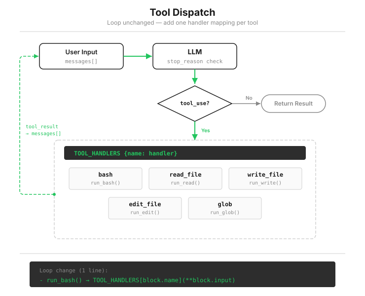

# s02: Tool Use — Each New Tool Adds One Line

[中文](README.zh.md) · [English](README.md) · [日本語](README.ja.md)

s01 → `s02` → [s03](../s03_permission/) → s04 → ... → s20
> *"Each new tool adds one handler"* — the loop stays untouched; register the tool in the dispatch map.
>
> **Harness layer**: Tool dispatch — look up the handler by tool name and call it.

---

The Agent from the previous lesson can work on its own, but it has only one Swiss Army knife: bash. This is how it writes a file:

```bash
echo 'print("hello")' > hello.py
```

That works for simple content. Once single quotes, double quotes, and line breaks mix together, the command gets buried in escaping. One wrong character gives you a broken file and costs another turn to repair.

This lesson replaces that one knife with five specialized tools. The tools themselves are not the main point. What matters is how we add them: not one line of the loop has to change.



---

## Why Bash Alone Is Not Enough

Bash can theoretically do everything. The problem lies elsewhere.

**It adds a translation layer.** The model intends to "read this file," but must first translate that intent into `cat path/to/file`. Every translation is another chance to fail, and quoting is the most common failure.

**Its output is uncontrolled.** `cat` has no line limit, so a 5,000-line file floods the conversation in full. A dedicated read tool can accept a `limit` and return only the first N lines. s08 calculates the cost of letting history grow without bound.

**The program cannot tell what a command means.** To your code, a bash string is a black box: `cat` and `rm -rf` are both just strings. By contrast, `read_file` and `write_file` are tools with different names, so the distinction is explicit. That may seem minor now, but it becomes critical in s03. You must know whether an operation reads or writes before you can decide whether to block it.

The direction is clear: give common operations dedicated tools, and keep bash as the fallback.

---

## One Definition, One Registration

s01 had one item on the menu. Now it has five, each represented by one entry in `TOOLS`:

```python
TOOLS = [
    {"name": "bash",       "description": "Run a shell command.", ...},
    {"name": "read_file",  "description": "Read file contents.",  ...},   # accepts limit
    {"name": "write_file", "description": "Write content to a file.", ...},
    {"name": "edit_file",  "description": "Replace exact text in a file once.", ...},
    {"name": "glob",       "description": "Find files matching a glob pattern.", ...},
]
```

Behind every tool is an ordinary function. First meet the guard that all file tools must pass:

```python
def safe_path(p: str) -> Path:
    path = (WORKDIR / p).resolve()
    if not path.is_relative_to(WORKDIR):    # The resolved path must remain inside the workspace
        raise ValueError(f"Path escapes workspace: {p}")
    return path
```

The model may pass a path such as `../../etc/passwd`. `safe_path` resolves it to an absolute path, then verifies that it did not escape the working directory. This is the first real security boundary in the course. It protects only the file tools; bash does not pass through it. s03 closes that gap.

The four new tools are short:

```python
def run_read(path, limit=None):
    lines = safe_path(path).read_text().splitlines()
    if limit and limit < len(lines):
        lines = lines[:limit] + [f"... ({len(lines) - limit} more lines)"]
    return "\n".join(lines)

def run_write(path, content):
    file_path = safe_path(path)
    file_path.parent.mkdir(parents=True, exist_ok=True)   # Create missing parent directories
    file_path.write_text(content)
    return f"Wrote {len(content)} bytes to {path}"

def run_edit(path, old_text, new_text):
    file_path = safe_path(path)
    text = file_path.read_text()
    if old_text not in text:                 # Fail clearly when the source text is absent
        return f"Error: text not found in {path}"
    file_path.write_text(text.replace(old_text, new_text, 1))   # Replace only the first match
    return f"Edited {path}"
```

Two choices in `edit_file` deserve attention. The old text must match exactly; otherwise the edit fails. This forces the model to read before it writes. If its memory is wrong, the error sends it back to the file instead of changing the wrong location. Replacing only the first match prevents one edit from touching unrelated copies of the same text.

Next comes registration. One dictionary maps tool names to functions:

```python
TOOL_HANDLERS = {
    "bash":       run_bash,
    "read_file":  run_read,
    "write_file": run_write,
    "edit_file":  run_edit,
    "glob":       run_glob,
}
```

The corresponding change inside the loop is one line. s01 called a hardcoded function; s02 performs a lookup:

```python
for block in response.content:
    if block.type == "tool_use":
        handler = TOOL_HANDLERS.get(block.name)                       # Look up by tool name
        output = handler(**block.input) if handler else f"Unknown: {block.name}"
        results.append({"type": "tool_result", "tool_use_id": block.id, "content": output})
```

`while True`, the `stop_reason` check, and message appending all remain exactly the same. That is the lesson in one sentence: **the loop stays fixed while the menu grows.** Every later capability follows the same pattern: one definition in `TOOLS`, one registration in `TOOL_HANDLERS`.

---

## The Model Orders Several Things at Once

s01 ended with two questions: will the model call several tools in one response, and can those tools step on each other?

The answer to the first is yes, and it happens often. Ask it to "read a.py and b.py" and one response may contain two `tool_use` blocks. The loop needs no special case: `for block in response.content` already visits every block, executes each call, collects each result, and returns all the `tool_result` blocks in one `user` message.

For the second question, the teaching version executes calls one by one in their original order. They cannot step on each other, but this is slower — two independent reads could have run at the same time.

> Real Claude Code does not simply execute one call at a time. It groups consecutive concurrency-safe calls and runs each group in parallel. Safety is decided from the actual input, so a read-only bash command such as `ls` can qualify. A state-changing call ends the group and runs alone, while order between groups is preserved. The teaching version stays sequential because it is sufficient and easier to read.

---

## Changes from s01

| Component | Before (s01) | After (s02) |
|-----------|--------------|-------------|
| Tool count | 1 (bash) | 5 (+read, write, edit, glob) |
| Execution | Hardcoded `run_bash()` | Dispatch through `TOOL_HANDLERS` |
| Path safety | None | `safe_path` validation for file tools |
| Loop | `while True` + `stop_reason` | Exactly the same as s01 |

---

## Try It

```sh
cd learn-claude-code
python s02_tool_use/code.py
```

The yellow `> tool_name` lines now print the tool name rather than the full command. Try these tasks:

1. `Read the file README.md and tell me what this project is about`: watch it choose `read_file` instead of `cat`.
2. `Create a file called test.py that prints "hello", then read it back`: one write and one read, with no quoting problems.
3. `Find all Python files in this directory`: `glob` returns the result in one turn.
4. `Read both README.md and requirements.txt, then create a summary file`: see whether one response contains two `read_file` calls. The terminal will print two consecutive `> read_file` lines.

Then try an escaping path: `Use read_file to read ../../etc/passwd`. `safe_path` returns `Path escapes workspace`. Watch what the model does next. If it stops, good. If it switches to bash and succeeds with `cat`, you have seen the protection gap between file tools and bash firsthand. The next lesson closes it.

---

## What's Next

The Agent now has five specialized tools, and `safe_path` keeps file operations inside the workspace. Bash is still unrestricted: its old deny list blocks only a few strings, so a command such as `rm -rf ./src` still runs.

s03 Permission → Put a gate before execution: is this operation safe, and does it require user approval?

<!-- translation-sync: zh@v2, en@v2, ja@v2 -->
