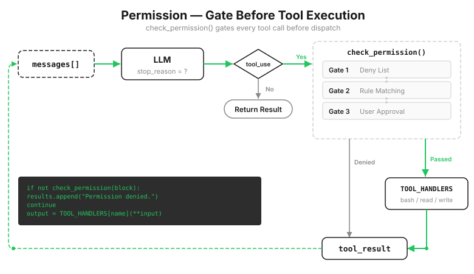
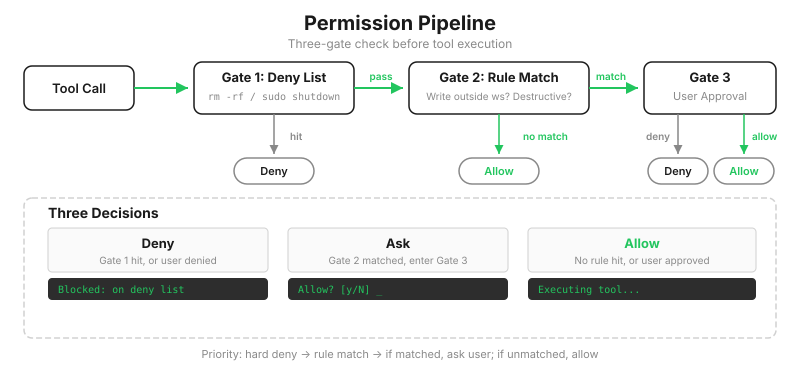

# s03: Permission — Decide Before You Execute

[中文](README.zh.md) · [English](README.md) · [日本語](README.ja.md)

s01 → s02 → `s03` → [s04](../s04_hooks/) → s05 → ... → s20
> *"Check permissions before a tool runs"* — the permission pipeline decides which operations need approval.
>
> **Harness layer**: Permission pipeline (deny / ask / allow).

---

The previous lesson left a gap: `safe_path` keeps file tools inside the workspace, but bash remains free. Tell the Agent to "clean up the project" and it may happily run `rm -rf ./src`.

The deny list hidden inside s01's `run_bash` cannot save you. It contains `rm -rf /`, not `rm -rf ./src`. Your source code is still deleted.

This lesson pulls safety out of individual tool implementations and turns it into one shared checkpoint before execution.



---

## Why a Deny List Inside the Tool Fails

s01 and s02 used the most obvious approach: check a list of dangerous strings at the start of `run_bash`, and reject any match. It has three problems.

**It has only two outcomes and misses the most useful third one.** A deny list can only allow or reject. Most risky operations in the real world depend on context: `rm /tmp/cache.txt` is harmless, while `rm src/main.py` is disastrous. Code cannot always tell the difference, but a person can. The decision therefore needs three states: **never allowed (deny), ask in context (ask), and run directly (allow).**

**The safety logic lives in the wrong place.** If the check is inside `run_bash`, where does the check for `write_file` go? Repeating security logic inside every new tool guarantees that one will eventually be missed. Interception belongs on the shared path every tool must take: immediately before dispatch.

**A silent rejection informs nobody.** When the deny list blocks an operation without explanation, the user does not know what the Agent attempted and the model only sees a failure. An operation that needs human approval should present what it wants to do and why.

So this lesson removes the deny list from `run_bash` and replaces it with three gates before execution.



---

## Gate 1: The Hard Deny List

The first gate handles operations that are never acceptable. There is nothing to discuss and no reason to interrupt the user:

```python
DENY_LIST = [
    "rm -rf /", "sudo", "shutdown", "reboot",
    "mkfs", "dd if=", "> /dev/sda",
]

def check_deny_list(command: str) -> str | None:
    for pattern in DENY_LIST:
        if pattern in command:
            return f"Blocked: '{pattern}' is on the deny list"
    return None   # No match; move to the next gate
```

A match is rejected immediately. The terminal prints ⛔ and never asks for approval.

An honest warning: simple string matching is not a reliable security mechanism. Command variations and shell expansion can bypass it. The teaching version uses it to make the shape of the pipeline visible.

This gate handles "never," but not "it depends." Whether `rm ./src` should run depends on what the user intends right now, which cannot be written into a static list.

---

## Gate 2: Rules That Recognize When to Ask

The second gate is a set of rules. Every rule states three things: which tools it covers, what counts as a match, and what reason to show the user:

```python
PERMISSION_RULES = [
    {"tools": ["write_file", "edit_file"],
     # The resolved target path leaves the workspace
     "check": lambda args: not (WORKDIR / args.get("path", "")).resolve().is_relative_to(WORKDIR),
     "message": "Writing outside workspace"},
    {"tools": ["bash"],
     # The command deletes, writes into a system directory, or changes permissions
     "check": lambda args: any(kw in args.get("command", "") for kw in ["rm ", "> /etc/", "chmod 777"]),
     "message": "Potentially destructive command"},
]

def check_rules(tool_name: str, args: dict) -> str | None:
    for rule in PERMISSION_RULES:
        if tool_name in rule["tools"] and rule["check"](args):
            return rule["message"]
    return None
```

Notice the boundary of responsibility: a rule only identifies a situation that needs a person. It does not make the final decision. The next gate does that.

---

## Gate 3: Put the Decision in Front of the User

When a rule matches, the program pauses and waits for a person:

```python
def ask_user(tool_name: str, args: dict, reason: str) -> str:
    print(f"\n⚠  {reason}")
    print(f"   Tool: {tool_name}({args})")
    choice = input("   Allow? [y/N] ").strip().lower()
    return "allow" if choice in ("y", "yes") else "deny"
```

The uppercase N in `[y/N]` is deliberate: pressing Enter means no. Interrupting one task costs far less than approving one accidental destructive operation.

The three gates form one pipeline:

```python
def check_permission(block) -> bool:
    if block.name == "bash":
        reason = check_deny_list(block.input.get("command", ""))   # Gate 1
        if reason:
            print(f"\n⛔ {reason}")
            return False
    reason = check_rules(block.name, block.input)                  # Gate 2
    if reason:
        decision = ask_user(block.name, block.input, reason)       # Gate 3
        if decision == "deny":
            return False
    return True   # No gate blocked it; allow execution
```

---

## Put It Back in the Loop: A Rejection Still Needs a Result

The change inside the loop follows the familiar pattern: add one check before execution.

```python
for block in response.content:
    if block.type != "tool_use":
        continue

    # New in s03: pass through the permission pipeline before execution
    if not check_permission(block):
        results.append({"type": "tool_result", "tool_use_id": block.id,
                        "content": "Permission denied."})
        continue

    handler = TOOL_HANDLERS.get(block.name)
    output = handler(**block.input) if handler else f"Unknown: {block.name}"
    results.append({"type": "tool_result", "tool_use_id": block.id, "content": output})
```

Two rules are hidden in this small block of code.

**Rejected does not mean skipped.** A blocked call still receives a `tool_result` containing `"Permission denied."` s01 established the pairing rule: every `tool_use` needs a matching `tool_result`, or the API returns a 400 error. The rejection is also useful information. Once the model sees it, it can choose another route instead of waiting forever.

**Deny comes before ask.** The order of the gates cannot be reversed. If the program asks first and checks the hard deny list second, even `sudo rm -rf /` becomes a question — handing an absolute boundary to one accidental keystroke.

> Real Claude Code does not have just one rule table. Rules from eight configuration sources — user, project, local, enterprise policy, CLI arguments, in-session grants, and others — merge by priority. There are four decision behaviors, including `passthrough`, which delegates when a tool makes no decision. Auto mode can also use a classifier model first: safe actions proceed automatically, and only uncertain ones prompt the user. The teaching version compresses this into one table and three gates so the structure is easy to see.

---

## Changes from s02

| Component | Before (s02) | After (s03) |
|-----------|--------------|-------------|
| Safety model | Deny list inside `run_bash` | Three-gate permission pipeline |
| Decisions | Allow / reject | deny / ask / allow |
| New functions | — | `check_deny_list`, `check_rules`, `ask_user`, `check_permission` |
| Loop | Execute every tool directly | Insert `check_permission()` before execution |

---

## Try It

```sh
cd learn-claude-code
python s03_permission/code.py
```

The terminal now shows three outcomes: direct execution with no prompt, ⚠ followed by `Allow? [y/N]` when gate 2 matches, and ⛔ when gate 1 matches. Trigger each one:

1. `Create a file called test.txt in the current directory`: the write remains inside the workspace, so no rule matches and it runs directly.
2. `Delete the file test.txt`: the model uses bash to run `rm test.txt`, which matches the `"rm "` rule and waits for y or N.
3. `Run sudo whoami`: the hard deny list matches, so ⛔ rejects it without asking.
4. `Try to write a file to /etc/something`: writing outside the workspace triggers gate 2. Deliberately press y and observe what happens: `safe_path` still returns `Path escapes workspace` during execution. Approval at the interaction layer does not override the path boundary. The two defenses do not trust each other.

After a rejection, watch the model's next move. Once it receives `Permission denied.`, it will usually explain the limitation or choose another approach. That is why a rejection still needs a result.

---

## What's Next

Permission checks exist, but the loop still calls them directly. What if you want to log every tool call, or run a formatter after every file edit? Adding each requirement to the loop would soon turn it into a tangled block of special cases.

s04 Hooks → Add attachment points to the loop. Extension logic hangs from hooks while the loop itself stays clean.

<!-- translation-sync: zh@v2, en@v2, ja@v2 -->
