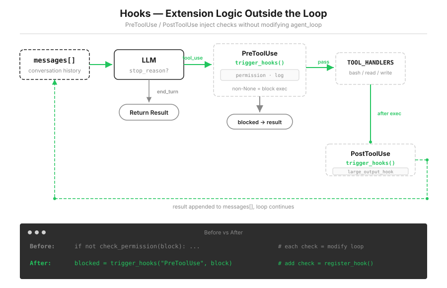

# s04: Hooks — 挂在循环上，不写进循环里

[中文](README.zh.md) · [English](README.md) · [日本語](README.ja.md)

s01 → s02 → s03 → `s04` → [s05](../s05_todo_write/) → s06 → ... → s20

> *"挂在循环上, 不写进循环里"* — hook 在工具执行前后注入扩展逻辑。
>
> **Harness 层**: hook，扩展点不侵入循环。

---

上一课的权限检查能用了，但它是硬编码在循环里的一次函数调用。现在再来两个很普通的需求：每次工具调用留一行日志；输出太大时给个提醒。照旧的办法，继续往循环里塞：

```python
def agent_loop(messages):
    while True:
        # ... LLM call ...
        for block in response.content:
            if block.type != "tool_use":
                continue
            log_to_file(block)          # 加一行
            check_permission(block)     # 加一行
            notify_slack(block)         # 又加一行
            output = execute(block)
            auto_git_add(block)         # 再加一行
            # ... 很快循环就认不出来了
```

问题在姿势上：你想扩展的是 Agent 的行为，动的却是它的引擎。s01 说过，后面每一课都在这个循环上加东西，循环本身不变。要兑现这句话，扩展就不能写进循环，得挂在循环上。



---

## 直接改循环，坏在哪

**每个需求都动核心代码。** 循环是 Agent 的心脏，日志、通知、自动提交都是外围需求。为外围需求反复开胸，改坏一次，所有功能一起停摆。

**需求之间互相纠缠。** 想删掉 Slack 通知？去循环里找那一行。想让日志只记 bash？再去循环里加判断。每个需求的开关都埋在同一个函数里，谁也别想独立进退。

**主干被淹没。** 循环本来五步就讲完了。塞进七八个扩展后，新读者要从一堆 `log_`、`notify_`、`auto_` 里把主干挖出来。

换个思路：在循环的关键节点上预留几个挂载点，循环只负责在节点处喊一嗓子"到这儿了"，具体做什么，由挂上来的函数自己决定。

---

## 注册表：事件名对回调列表

整个 hook 系统就是一个字典加两个函数：

```python
HOOKS = {"UserPromptSubmit": [], "PreToolUse": [], "PostToolUse": [], "Stop": []}

def register_hook(event: str, callback):
    HOOKS[event].append(callback)          # 注册：往列表里追加

def trigger_hooks(event: str, *args):
    for callback in HOOKS[event]:
        result = callback(*args)
        if result is not None:             # 教学捷径：非 None = 拦截/干预
            return result
    return None
```

约定很简单：hook 返回 `None`，表示"我看过了，放行"；返回任何非 `None` 值，表示"到此为止"，链上剩下的 hook 也不再执行。

四个事件，正好卡在一轮 agent cycle 的四个关键节点上：

| 事件 | 触发时机 | 教学版挂了什么 |
|------|---------|---------|
| `UserPromptSubmit` | 用户输入提交后、进入 LLM 前 | 打一行工作目录日志 |
| `PreToolUse` | 工具执行前 | 权限检查、调用日志 |
| `PostToolUse` | 工具执行后 | 大输出提醒 |
| `Stop` | 循环即将退出时 | 本轮工具调用统计 |

---

## PreToolUse：s03 的权限检查搬进 hook

s03 的 `check_permission()` 整个搬进一个 hook 函数，逻辑一行没变，变的只是住址：

```python
def permission_hook(block):
    """s03 的权限逻辑，现在以 hook 的身份运行。"""
    if block.name == "bash":
        for pattern in DENY_LIST:
            if pattern in block.input.get("command", ""):
                return "Permission denied by deny list"     # 非 None → 拦截
        for kw in DESTRUCTIVE:
            if kw in block.input.get("command", ""):
                choice = input("   Allow? [y/N] ").strip().lower()
                if choice not in ("y", "yes"):
                    return "Permission denied by user"
    ...
    return None                                             # 放行

def log_hook(block):
    """每次工具调用留一行日志。"""
    print(f"[HOOK] {block.name}(...)")
    return None

register_hook("PreToolUse", permission_hook)
register_hook("PreToolUse", log_hook)
```

循环里那行 `if not check_permission(block)` 换成了：

```python
blocked = trigger_hooks("PreToolUse", block)
if blocked:
    results.append({"type": "tool_result", "tool_use_id": block.id,
                    "content": str(blocked)})   # 拦截理由原样喂给模型
    continue
```

s03 的规矩原样延续：拦截也要回 `tool_result`，而且拦截理由就是内容本身，模型读到 `Permission denied by user` 会自己换路。

这里有一条容易被忽略的硬规矩：**注册顺序就是执行顺序。** `permission_hook` 注册在 `log_hook` 之前，于是被拦下的调用连日志都不会留（权限 hook 返回非 `None`，短路了后面的整条链）。想要"拦没拦都记一笔"，把 `log_hook` 注册到前面去，行为立刻不同。顺序不是排版问题，是语义。

---

## PostToolUse：执行后看一眼输出

```python
def large_output_hook(block, output):
    if len(str(output)) > 100000:      # 超过 100KB 的输出，提醒一声
        print(f"[HOOK] ⚠ Large output from {block.name}: {len(str(output))} chars")
    return None

register_hook("PostToolUse", large_output_hook)
```

现在它只会喊一嗓子，拦不住这 100KB 涌进对话历史。真正处理大输出要等 s08，到时候你会发现处理逻辑插入的位置，就是这个节点。

---

## UserPromptSubmit 和 Stop：一头一尾

输入这一头，在用户敲完回车、内容进入 `messages` 之前触发：

```python
query = input("s04 >> ")
trigger_hooks("UserPromptSubmit", query)   # 进入 LLM 之前
history.append({"role": "user", "content": query})
```

教学版只打一行日志。生产系统在这里做输入检查、注入项目上下文，位置比动作重要：这是所有输入的必经关口。

退出那一尾更有意思。循环准备收工时，先问一遍 Stop hook：

```python
if response.stop_reason != "tool_use":
    force = trigger_hooks("Stop", messages)   # 退出之前最后问一句
    if force:
        messages.append({"role": "user", "content": force})
        continue                              # hook 说"还没完"，续跑
    return
```

教学版的 `summary_hook` 只统计本轮用了几次工具，返回 `None` 放行退出。但注意这个机制的分量：一个返回非 `None` 的 Stop hook，可以拒绝让 Agent 收工，把它按回去继续干。s01 说过"退出循环是模型的一个决定"，从这一课起，这个决定第一次有了程序层的否决权。s22 会把这件事做成完整的目标循环。

> 真实 Claude Code：hook 事件有 27 个（会话、压缩、子 Agent、团队协作各有埋点），返回值是 14 个字段的结构体而不是 None/非 None。最关键的一条安全不变式：hook 返回 allow 也压不过 settings.json 里的 deny/ask 规则，扩展点永远不能成为越权通道。教学版的 4 事件加单通道返回值，是同一模式的最小可运行版。

---

## 相对 s03 的变更

| 组件 | 之前 (s03) | 之后 (s04) |
|------|-----------|-----------|
| 扩展方式 | `check_permission()` 硬编码在循环里 | `HOOKS` 注册表 + `trigger_hooks()` |
| 新函数 | — | `register_hook`, `trigger_hooks` |
| hook 回调 | — | `context_inject_hook`, `permission_hook`, `log_hook`, `large_output_hook`, `summary_hook` |
| 退出控制 | 无 | Stop hook 返回非 None 可强制续跑 |
| 输入关口 | 无 | `UserPromptSubmit` 在进入 LLM 前触发 |

---

## 试一下

```sh
cd learn-claude-code
python s04_hooks/code.py
```

1. `Read the file README.md`：看一轮完整的 hook 时间线，输入后先出 `[HOOK] UserPromptSubmit`，工具执行前出 `[HOOK] read_file(...)`，收工时出 `[HOOK] Stop: session used N tool calls`；
2. `Use read_file to read web/src/data/generated/docs.json without a limit`：这个文件 700 多 KB，超过 100KB 阈值，`PostToolUse` 的大输出警告会现身；
3. `Create a file called test.txt, then delete it`：写文件静默通过，`rm` 触发权限询问。这里按一次 N，注意被拦下的那次调用没有 `[HOOK] bash(...)` 日志，这就是注册顺序在起作用：权限 hook 在日志 hook 前面，拦截短路了整条链。

---

## 接下来

Agent 能安全执行、能被观测扩展了，但给它一个复杂任务，它依然是拿起来就干，走一步看一步，既不列计划，你也看不到它打算怎么走。

s05 TodoWrite → 给 Agent 一个计划工具。先列清单，再动手。

<!-- translation-sync: zh@v2, en@v2, ja@v2 -->
