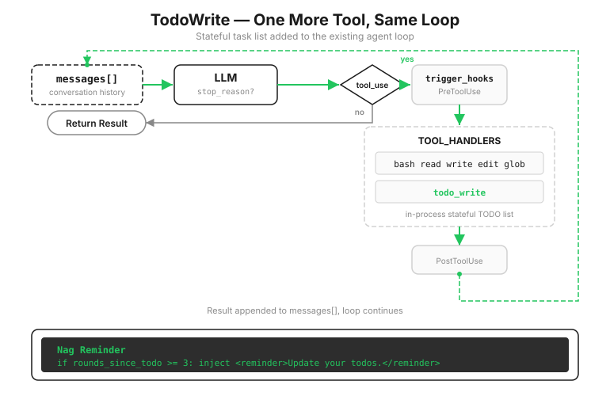

# s05: TodoWrite — 計画のない Agent は途中で道を外れる

[中文](README.zh.md) · [English](README.md) · [日本語](README.ja.md)

s01 → s02 → s03 → s04 → `s05` → [s06](../s06_subagent/) → s07 → ... → s20

> *"計画のない Agent は行き当たりばったりになる"* — 先に手順を書けば、長いタスクでも抜け漏れが減る。
>
> **Harness レイヤー**: 計画 — `todo_write` ツールでタスクリストを管理する。

---

前章までで、Agent は作業でき、止められ、観測できるようになった。ここで本格的な複数ステップのタスクを与える。「すべての Python ファイルを snake_case の名前に変更し、テストを実行して、失敗を直して」。

Agent は三つのファイルを変更し、テストを実行し、二つの失敗を見つけて修正を始める。修正しているうちに、「snake_case へ変更する」という元の仕事はどこかへ消える。最新のテストエラーが注意をすべて奪ったからだ。

原因は s01 から存在する。モデルには記憶がなく、あるのはコンテキストだけだ。そしてコンテキストで最も大きな声を持つのは、常に最新のツール結果である。最初の目標は何十件も前のメッセージに埋もれている。十段階の refactor も、三段階終えた頃には即興になり、四から十までが注意から外れていく。



---

## 「目標を忘れるな」と言うだけでは、なぜ足りないのか

最初に思いつくのは system prompt で強く念を押すことだ。「常に元のタスクを覚えておくこと」。だが目標は変わらなくても、進捗は変わる。固定テキストは「第 3 ステップは完了、第 4 ステップは途中」という生きた状態を記録できない。

では harness がタスクを分解し、一つずつモデルへ渡せばよいのか。それも違う。分解はまさにモデルの得意分野で、harness はタスクの内容を理解しておらず、適切に分けられない。

役割分担はこうなる。分解して記録するのはモデル。その「記録」の置き場所を用意し、モデルが更新を忘れたときに促すのが harness。その置き場所が新しいツールだ。

---

## todo_write：作業をしないツール

`todo_write` はファイルを読めず、コマンドも実行できない。Agent の実行能力は一つも増えない。役割は、モデルの頭にある計画を状態付きの一覧へ変え、保存し、見えるようにすることだけだ。

```python
CURRENT_TODOS: list[dict] = []

def run_todo_write(todos: list) -> str:
    global CURRENT_TODOS
    todos, error = _normalize_todos(todos)   # 先に検証。モデルが生成した引数は信用しない
    if error:
        return error
    CURRENT_TODOS = todos

    lines = ["\n## Current Tasks"]           # ターミナルに現在の一覧を描画
    for t in CURRENT_TODOS:
        icon = {"pending": " ", "in_progress": "▸", "completed": "✓"}[t["status"]]
        lines.append(f"  [{icon}] {t['content']}")
    print("\n".join(lines))
    return f"Updated {len(CURRENT_TODOS)} tasks"
```

`_normalize_todos` の行で立ち止まろう。ツール引数はモデルが生成し、モデルは間違える。配列を文字列で包んだり、`status` を抜かしたりする。そこで先に検証し、誤りなら明確なエラーを返す。モデルはエラーを見て自分で送り直す。s02 の `edit_file` が元の文を見つけられないときに失敗するのと同じ考え方だ。意図を推測せず、エラーで正しい道へ戻す。

接続方法は s02 の合言葉どおり。定義を一つ、登録を一行、dispatch は変更しない。

```python
TOOLS = [
    ...,   # 既存の 5 ツール
    {"name": "todo_write",
     "description": "Create and manage a task list for your current coding session.",
     "input_schema": {"type": "object", "properties": {"todos": {"type": "array",
         "items": {"type": "object", "properties": {
             "content": {"type": "string"},
             "status": {"type": "string", "enum": ["pending", "in_progress", "completed"]}},
             "required": ["content", "status"]}}}, "required": ["todos"]}},
]
TOOL_HANDLERS["todo_write"] = run_todo_write
```

モデルはいつ使うべきかをどう知るのか。system prompt に一つの指示を加える。

```python
SYSTEM = (
    f"You are a coding agent at {WORKDIR}. "
    "Before starting any multi-step task, use todo_write to plan your steps. "
    "Update status as you go."
)
```

理想のリズムはこうなる。タスクを受けたら一覧を作る（すべて `pending`）。着手する項目を `in_progress` にし、終わったら `completed` にして、次の `pending` を見る。

しかし指示はあくまで指示だ。作業に集中すると、モデルは何ターンも続けて実行し、一覧を放置する。一覧が古くなれば、存在する意味がなくなる。

---

## Nag reminder：忘れたら一押しする

harness はターン数を数える。三ターン連続でツールを使いながら `todo_write` に触れなかったら、次にモデルを呼ぶ前に `messages` へ一つの reminder を入れる。

```python
rounds_since_todo = 0

def agent_loop(messages):
    global rounds_since_todo
    while True:
        # 3 ターン連続で todo を更新しなければ reminder を注入
        if rounds_since_todo >= 3 and messages:
            messages.append({"role": "user",
                             "content": "<reminder>Update your todos.</reminder>"})
            rounds_since_todo = 0

        response = client.messages.create(...)
        ...
            # モデルが todo_write を呼んだらカウンターをリセット
            if block.name == "todo_write":
                rounds_since_todo = 0
```

三つの点に注目しよう。

**reminder は `user` ロールで入る。** s01 で見たように、モデルにとって `user` は「外の世界から来た情報」だ。ツール結果と同じく、この reminder は世界の声であり、モデルの独り言ではない。

**reminder は強制ではない。** harness はコンテキストへ一文を置くだけだ。次のターンでそれを見ても、一覧を更新するかはモデル自身が決める。背中を押すことと、代わりに計画することはまったく違う設計で、このコードは一貫して前者を選ぶ。

**カウンターが数えるのは「ターン」で、「回数」ではない。** 一ターンで複数のツールを並べて呼ぶことがある。その中に `todo_write` がなければ、そのターンを一回として数える。

> 実際の Claude Code に「3 ターン」という固定値はない。nudge はもっと賢く、一覧がすべて完了しているのに検証作業が一つもなければ、検証ステップを足すよう促す。また二つのタスクシステムが共存する。TodoWrite のようなメモリ上の一覧と、ファイル永続化、依存グラフ、並行 lock を持つ完全なタスクシステムだ。後者は s12 で作る。

---

## s04 からの変更

| コンポーネント | 変更前 (s04) | 変更後 (s05) |
|----------------|--------------|--------------|
| ツール数 | 5 (bash, read, write, edit, glob) | 6 (+`todo_write`) |
| 計画能力 | なし | 状態付き TODO リスト + nag reminder |
| SYSTEM prompt | 汎用の指示 | `todo_write` の利用指示を追加 |
| ループ | 変更なし | dispatch は同じ、`rounds_since_todo` と reminder 注入を追加 |

---

## 試してみる

```sh
cd learn-claude-code
python s05_todo_write/code.py
```

1. `Refactor s05_todo_write/example/hello.py: add type hints, docstrings, and a main guard`：最初のツール呼び出しが `todo_write` か、`## Current Tasks` に何ステップ並ぶかを見る。
2. `Create a Python package under s05_todo_write/example/demo_pkg with __init__.py, utils.py, and tests/test_utils.py`：アイコンの変化を見る。`▸` は常に現在のステップにあり、完了項目は `✓` になるか。
3. `Review Python files under s05_todo_write/example and fix any style issues`：reminder の間接的な証拠を見る。モデルが一覧に触れず数ターン読み書きした後、次のターンで突然 todo を先に更新したら、`<reminder>` が届いたということだ。注入自体は表示されない。

---

## 次へ

Agent は計画できるようになった。しかし「認証モジュール全体を refactor する」のようなタスクは、一覧だけでは大きすぎる。何十もの小タスクがあり、それぞれが大量のファイルを読み、多数の途中結果を残す。すべてを一つの会話へ入れれば、一覧が明確でもコンテキストのほうが先に限界へ達する。

s06 Subagent → 大きな仕事を外へ分ける。各サブタスクに独立した Agent とクリーンなコンテキストを与え、結論だけを持ち帰る。

<!-- translation-sync: zh@v2, en@v2, ja@v2 -->
