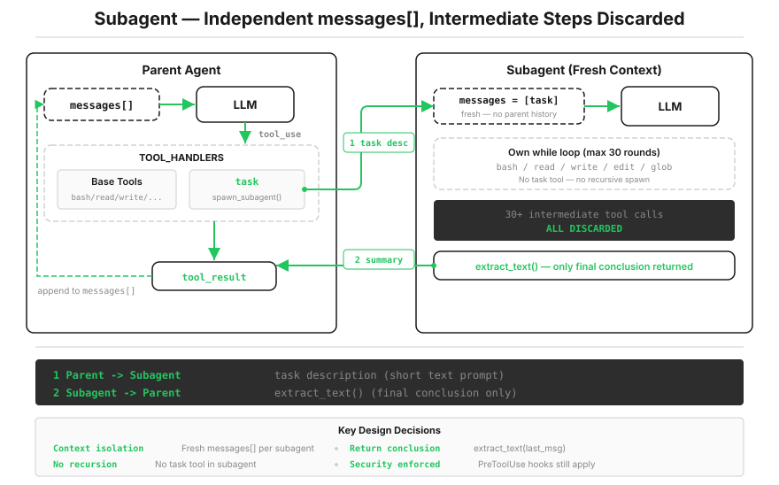

# s06: Subagent — 大任务拆小，每个拿到的都是干净上下文

[中文](README.zh.md) · [English](README.md) · [日本語](README.ja.md)

s01 → s02 → s03 → s04 → s05 → `s06` → [s07](../s07_skill_loading/) → s08 → ... → s20

> *"大任务拆小, 每个小任务干净的上下文"* — Subagent 用独立 `messages[]`, 不污染主对话。
>
> **Harness 层**: 子 Agent — 上下文隔离, 注意力不漂移。

---

上一课的清单管住了顺序，但管不住体积。

Agent 在修一个 bug：为了跟踪调用链，读了 30 个文件，来回 60 轮，`messages` 涨到 120 条。其中大半是跟踪过程的中间产物，和"修 bug"这个目标已经没关系了，却还占着上下文。等它回头要修最初那个 bug 时，bug 的描述反而被挤得快看不见了。

你自己遇到这种事会怎么做？开一个新终端去查调用链，查完把结论记在便签上，关掉终端，回原来的地方接着修。中间翻过的 30 个文件，不会跟着你回来。

这一课给 Agent 同样的能力：派一个子 Agent，拿全新的上下文去干脏活，只带一句结论回来。



---

## 让主 Agent 自己干到底，为什么不行

符合直觉的做法是主 Agent 自己把调用链跟踪完、接着修。问题刚才已经看到了：跟踪过程会永久留在主对话里。s08 会讲上下文满了怎么压缩，但比压缩更好的，是让垃圾根本不进主对话。

那把中间过程"用完就删"呢？不行，删消息会破坏 `tool_use`/`tool_result` 配对（s01 的规矩），而且哪些算"用完了"，主 Agent 自己也说不准。

出路是外包：把"跟踪调用链"整个装进另一个对话里去跑。那个对话可以随便脏，反正用完整个扔掉，回来的只有一段摘要。

---

## 子 Agent 就是 s01 那个循环的第二份拷贝

`spawn_subagent` 没有引入任何新概念，它就是再开一个 s01 式的循环，喂一份全新的 `messages[]`：

```python
def spawn_subagent(description: str) -> str:
    messages = [{"role": "user", "content": description}]   # 全新上下文，只有任务本身

    for _ in range(30):                                     # 安全上限：最多 30 轮
        response = client.messages.create(
            model=MODEL, system=SUB_SYSTEM,                 # 子 Agent 有自己的 system 提示
            messages=messages, tools=SUB_TOOLS, max_tokens=8000,
        )
        messages.append({"role": "assistant", "content": response.content})
        if response.stop_reason != "tool_use":
            break
        results = []
        for block in response.content:
            if block.type == "tool_use":
                blocked = trigger_hooks("PreToolUse", block)   # 权限照查，不因外包而豁免
                if blocked:
                    results.append({"type": "tool_result", "tool_use_id": block.id,
                                    "content": str(blocked)})
                    continue
                handler = SUB_HANDLERS.get(block.name)
                output = handler(**block.input) if handler else f"Unknown: {block.name}"
                results.append({"type": "tool_result", "tool_use_id": block.id,
                                "content": output})
        messages.append({"role": "user", "content": results})

    # 只带结论回家，整份对话历史就地丢弃
    result = extract_text(messages[-1]["content"])
    ...
    return result
```

`SUB_SYSTEM` 只有一句话的差别："完成任务，返回简洁摘要，不要再委派。"`SUB_TOOLS` 是主 Agent 工具的子集：有 `bash`/`read`/`write`/`edit`/`glob`，没有 `task`，也没有 `todo_write`。

主 Agent 这边，接入方式还是那句口号，定义一条、注册一行：

```python
TOOLS.append({
    "name": "task",
    "description": "Launch a subagent to handle a complex subtask. Returns only the final conclusion.",
    "input_schema": {"type": "object", "properties": {"description": {"type": "string"}}, "required": ["description"]},
})
TOOL_HANDLERS["task"] = spawn_subagent
```

对主循环来说，`task` 和 `read_file` 没有任何区别：一个调用，一个结果。只是这个"结果"背后，是另一个 Agent 完整跑完的一生。

---

## 四条不能省的防线

这段代码里有四个刻意的设计，每一个都对应一种翻车方式。

**子 Agent 没有 `task` 工具。** 如果给了，子 Agent 会派孙 Agent，孙 Agent 再派曾孙。一条跑偏的委派链，每层最多 30 轮，几层下去就能烧穿你的 API 预算。递归到子这一层为止，是用工具集硬性保证的，不靠模型自觉。

**权限不随外包豁免。** 子 Agent 的每次工具调用照样过 `PreToolUse` hook。如果跳过这一层，"派子 Agent"就成了权限逃逸通道：主 Agent 自己被拦的命令，写进任务描述让子 Agent 跑就是了。上下文隔离和权限隔离是两回事，前者是效率设计，后者是安全边界。

**结论提取有兜底。** 30 轮上限撞上时，最后一条消息可能是 `tool_result`，里面没有模型的文本。直接取最后一条会返回空字符串，主 Agent 拿到一句空结论只会更懵。所以代码会往回找最近一条 assistant 文本，实在没有就返回固定说明 `"Subagent stopped after 30 turns without final answer."`，让主 Agent 知道发生了什么。

**摘要之外的信息就是不存在。** 子 Agent 读过的文件内容、试错的过程，主 Agent 永远看不到。这是委派的本质：主动接受一次有损压缩，换主对话的干净。摘要该带什么信息，取决于任务描述写得够不够清楚，这也是为什么 `task` 的 `description` 值得认真写。

> 真实 Claude Code：子 Agent 有三种执行模式，其中 fork 模式恰恰不清空上下文——它构造与父对话逐字一致的消息前缀，为的是命中 Anthropic API 的 prompt cache，省钱省时。还有异步路径，子 Agent 后台跑、完成后通知父 Agent，s13 会亲手做一个。

---

## 相对 s05 的变更

| 组件 | 之前 (s05) | 之后 (s06) |
|------|-----------|-----------|
| 工具数量 | 6 (`bash`, `read`, `write`, `edit`, `glob`, `todo_write`) | 7 (+`task`) |
| 新函数 | — | `spawn_subagent`（独立 `messages[]` + 30 轮上限） |
| 上下文隔离 | 全部在主对话中 | 子 Agent 用全新的 `messages[]` |
| 循环 | 不变 | dispatch 不变，子 Agent 有独立 `SUB_SYSTEM` 和 hook 保护 |

---

## 试一下

```sh
cd learn-claude-code
python s06_subagent/code.py
```

1. `Use a subtask to find what testing framework this project uses`：看 `[Subagent spawned]`、缩进的 `[sub] read_file: ...` 行、`[Subagent done]` 三段式输出，主 Agent 最后只拿到一句结论；
2. `Delegate: read all Python files in s01_agent_loop/ and s02_tool_use/ and summarize what each one does`：子 Agent 读了好几个文件。等它做完，接着问主 Agent 一句 `Quote the exact SYSTEM prompt string from s01's code.py`——它答不上来（或者只能重新去读），因为那些细节留在了被丢弃的子上下文里。这就是隔离真的发生了的证据；
3. `Use a task to create s06_subagent/example/string_tools.py with a slugify(text: str) function, then verify it from the parent agent`：子 Agent 写的文件留在磁盘上，主 Agent 能读到。对话上下文隔离了，文件系统没有隔离，这两件事要分清。

---

## 接下来

Agent 现在能拆任务了。但每类任务需要的知识不一样：改前端要懂组件规范，写 SQL 要懂表结构。把所有领域知识全塞进 system prompt，等于让每个任务都背着全部说明书跑步。

s07 Skill Loading → 知识按需加载：目录常驻，正文用到才读，和读文件一样自然。

<!-- translation-sync: zh@v3, en@v3, ja@v3 -->
