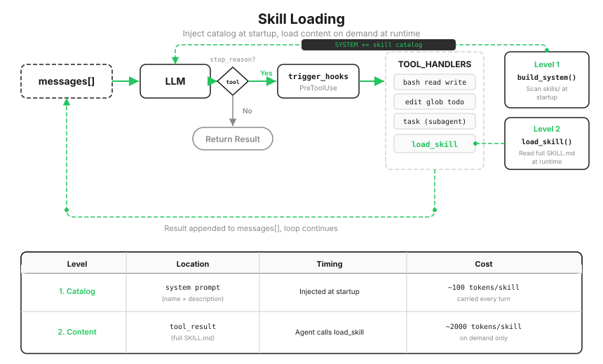

# s07: Skill Loading — Load It Only When You Need It

[中文](README.zh.md) · [English](README.md) · [日本語](README.ja.md)

s01 → s02 → s03 → s04 → s05 → s06 → `s07` → [s08](../s08_context_compact/) → s09 → ... → s20
> *"Load it when you need it; don't stuff everything into the prompt"* — inject full content through `tool_result`, not the system prompt.
>
> **Harness layer**: Knowledge — load on demand instead of filling context.

---

The previous lesson ended with a problem: every kind of task needs different knowledge. Your project has a React component standard, a SQL style guide, and an API design document. The Agent must follow these rules while it works. Where should they come from?

The most direct idea is to put everything in the system prompt:

```python
SYSTEM = (
    f"You are a coding agent. "
    + open("docs/react-style.md").read()       # 2,000 lines
    + open("docs/sql-style.md").read()         # 1,500 lines
    + open("docs/api-design.md").read()        # 3,000 lines
)
```

That is a 6,500-line system prompt. s01 established that the model is stateless, so all 6,500 lines are sent again on every call. The Agent may be changing one CSS color, yet the SQL guide and API document are billed on every turn. The arithmetic is simple: if one guide is roughly 2,000 tokens, ten guides create a fixed 20,000-token cost, even when 99% of the content is irrelevant.



---

## Why Not Let the Agent Read the Files Itself?

The second instinct is to split the guides into project files and let the Agent call `read_file` for whichever one it needs.

That is one step short. The Agent does not know which guides exist. It has to know *what is available* before it can choose *which one to use*. Asking it to `glob` the whole project for documentation before every task is luck, not design.

Separate the two needs and the answer appears: **the list of what exists must stay present; the full meaning can load on demand.** The permanent layer must be cheap — a name and one sentence. The expensive layer is the complete guide.

| Layer | Location | When | Cost |
|-------|----------|------|------|
| Catalog | System prompt | Injected at startup | ~100 tokens/skill on every turn |
| Content | `tool_result` | When the Agent calls `load_skill` | ~2,000 tokens/skill only when used |

---

## Layer 1: Scan at Startup, Put the Catalog in SYSTEM

Each skill is a directory containing a `SKILL.md`; its frontmatter provides a name and one-sentence description:

```
skills/
  agent-builder/SKILL.md
  code-review/SKILL.md
  mcp-builder/SKILL.md
  pdf/SKILL.md
```

At startup, the harness scans the directories, parses frontmatter, and fills a registry:

```python
SKILL_REGISTRY: dict[str, dict] = {}

def _scan_skills():
    for d in sorted(SKILLS_DIR.iterdir()):
        manifest = d / "SKILL.md"
        if manifest.exists():
            raw = manifest.read_text()
            meta, body = _parse_frontmatter(raw)          # Parse YAML frontmatter
            name = meta.get("name", d.name)
            desc = meta.get("description", ...)
            SKILL_REGISTRY[name] = {"name": name, "description": desc, "content": raw}

_scan_skills()   # Run once at startup

def build_system() -> str:
    catalog = "\n".join(f"- **{s['name']}**: {s['description']}"
                        for s in SKILL_REGISTRY.values())
    return (
        f"You are a coding agent at {WORKDIR}. "
        f"Skills available:\n{catalog}\n"
        "Use load_skill to get full details when needed."
    )

SYSTEM = build_system()
```

From then on, the model always sees what it can do: four catalog lines, each containing a name and a sentence, cheap enough to keep present.

But the catalog is only one sentence per skill. When the Agent needs the full code-review checklist, it still cannot reach it.

---

## Layer 2: load_skill Fetches Content on Demand

The model decides that the current task needs the `code-review` skill, then calls a tool to retrieve the full text:

```python
def load_skill(name: str) -> str:
    skill = SKILL_REGISTRY.get(name)      # Query the registry; never construct a path
    if not skill:
        return f"Skill not found: {name}"
    return skill["content"]
```

Integration follows the old rule: one definition, one registration, zero loop changes.

Two design decisions hide in these few lines, each preventing a bad alternative.

**Query the registry; do not construct a path.** An implementation such as `open(f"skills/{name}/SKILL.md")` turns `name` into a path-injection point. `load_skill("../../.env")` could read your key and feed it to the model. The registry is fixed at startup. At runtime, every name is only a dictionary lookup; an unknown name returns `Skill not found`.

**Put content in `messages`, not SYSTEM.** The full skill enters the conversation as a `tool_result`, just like the result of reading a file. Appending it to the system prompt would make it permanent: resent every turn, even after the task no longer needs it. In `messages`, it follows every history-management rule. The next lesson immediately uses that property.

One more boundary matters: **Subagents have no skill system.** `SUB_SYSTEM` contains no catalog and `SUB_TOOLS` has no `load_skill`. If a delegated task needs domain knowledge, include the important parts in the task description. This mirrors s06's rule that information outside the summary does not exist: context isolation works in both directions.

> Real Claude Code merges skills from roughly a dozen sources, including user and project directories, plugins, remote MCP skills, and built-ins. Catalog injection has a budget of about 1% of the context window and a maximum of 8,000 characters. A `SKILL.md` can also declare `context: fork` and run the skill directly as a Subagent. The teaching version keeps one directory and one tool, but the two-layer structure is the same.

---

## Changes from s06

| Component | Before (s06) | After (s07) |
|-----------|--------------|-------------|
| Tool count | 7 (bash, read, write, edit, glob, todo_write, task) | 8 (+`load_skill`) |
| Knowledge loading | None | Two layers: catalog in SYSTEM + content on demand in `messages` |
| SYSTEM prompt | Static string | Scan `skills/` at startup and inject the catalog |
| Skill registry | None | `SKILL_REGISTRY`, filled at startup to prevent path injection |
| Loop | Unchanged | Unchanged |

---

## Try It

```sh
cd learn-claude-code
python s07_skill_loading/code.py
```

1. `What skills are available?`: the model lists all four skills directly. No `[HOOK]` line appears because the catalog is already in SYSTEM and no tool is called.
2. `Without loading anything, tell me the exact review steps the code-review skill prescribes`: it cannot answer precisely and can only guess from the one-sentence description. That limit is deliberate.
3. `Load the code-review skill and use it to review s02_tool_use/code.py`: now `[HOOK] load_skill` appears, and the review follows the structure in `SKILL.md`. Compare this with experiment 2 to see the difference between a permanent catalog and on-demand content.

---

## What's Next

Take inventory of `messages`: tool results, file contents, command output, and now complete skill documents. They only enter and never leave. In a long enough task, one call eventually fails with `prompt_too_long`.

s08 Context Compact → A four-step cleanup pipeline. Run cheap operations first and expensive ones last; organize whenever possible, summarize only when necessary.

<!-- translation-sync: zh@v4, en@v4, ja@v4 -->
