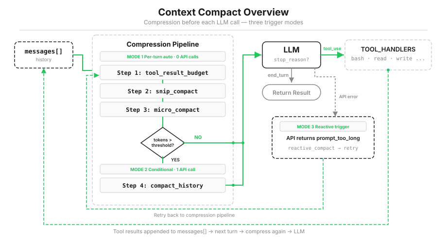
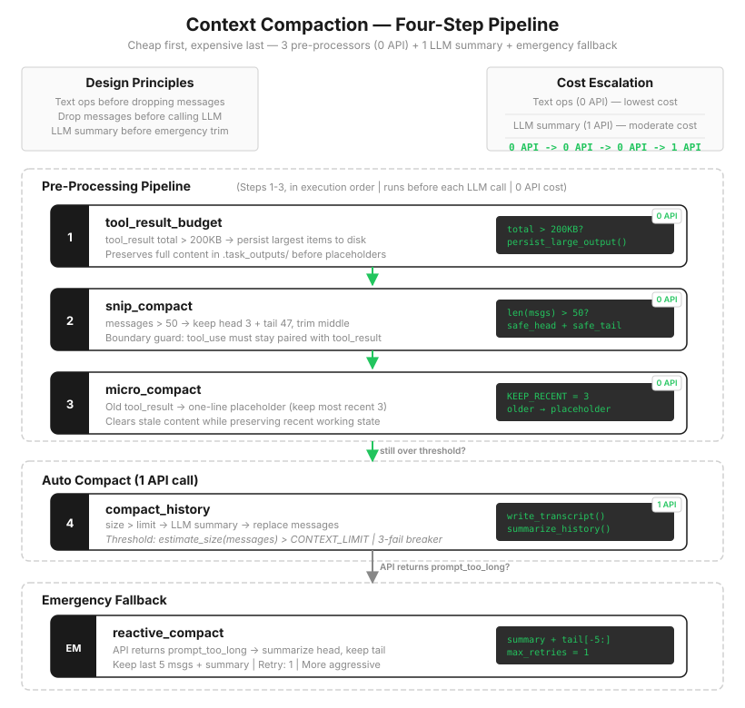

# s08: Context Compact — Context Always Fills Up: Tidy First, Summarize Last

[中文](README.zh.md) · [English](README.md) · [日本語](README.ja.md)

s01 → s02 → s03 → s04 → s05 → s06 → s07 → `s08` → [s09](../s09_memory/) → s10 → ... → s20

---

By s07, the Agent can use tools, manage permissions, send work to Subagents, and load skills on demand. A new problem appears on long tasks: after enough files and commands, one model call suddenly fails with `prompt_too_long`.

This lesson explains what that error means, why it is inevitable, and how to keep an Agent working through tasks of any length.



---

## First, Understand Context

When you solve a problem, you spread out scratch paper. The assignment, your current step, intermediate results, and copied reference material all sit on that page where you can see them.

A model has the same kind of scratch paper: the context window. Everything you say, every model response, every tool request, and every tool result is written there in order. When the model reasons, it can see everything on the page.

The page has one defining property: its size is fixed. Some models have larger pages than others, but every page has a limit. Once it is full, new content cannot fit and the request fails.

Conversation is not what takes most of the space. Tool results do:

- reading a 1,000-line source file puts all 1,000 lines into context;
- running tests can add tens of kilobytes of logs;
- searching a dozen files stacks one result after another.

Suppose a context window holds 200,000 tokens and an ordinary file averages 5,000 tokens. Reading 40 files fills the window. A real development task can easily make dozens or hundreds of tool calls across files, commands, and error logs.

> Given a long enough task, context will fill up. It is not a question of probability, only time.

Problems begin even before the window is full. With too much on the page, the model loses the main thread; important constraints drown in old logs and requirements fade from attention. Context compaction is not only about preventing an error. It keeps the model able to see what it is doing.

---

## Why the Obvious Fix Cannot Come First

The first idea is usually: have the model summarize everything so far into a few sentences and make room.

We will eventually do that, but not as the first step. When scratch paper fills up, you do not immediately tear out the earlier pages and rewrite them as an outline. There are three reasons.

First, summaries always lose detail. An outline cannot contain as much information as the original work. A function argument, the exact wording of an error, or a small user constraint can disappear. Once a summary replaces history, omitted details are no longer in current context.

Second, summarization has a cost. It requires another model call, which takes time and money. There is no reason to ask a model to rewrite content that ordinary code can organize.

Third, and most importantly, the largest content often does not deserve a summary. Files remain on disk and commands can run again. If the Agent needs the information later, it can retrieve the complete version instead of carrying it forever.

The right approach is as ordinary as cleaning scratch paper: first organize without losing information. Put away what can be stored and erase what can be recreated. Write an outline only when those steps still do not free enough room.

The four stages follow that order. Earlier stages lose less information and cost less. Later stages reclaim more space at a higher price.



---

## Step 1: tool_result_budget — Persist Large Results First

Sometimes the problem is not a long history but the size of the newest batch. If the Agent reads several large files at once, the `tool_result` blocks in the last message can exceed 200 KB. They are new, so we cannot delete them, but they do not need to remain fully expanded in context.

Treat them like copied reference material: save the full text in a notebook and leave a note on the scratch page saying where it went. In code, write the complete output to disk and leave only the path and a short preview in context.


```python
def tool_result_budget(messages, max_bytes=200_000):
    # Inspect only tool results in the newest message
    blocks = [b for b in messages[-1]["content"] if b.get("type") == "tool_result"]
    total = sum(len(str(b["content"])) for b in blocks)

    if total <= max_bytes:      # Already within budget
        return messages

    # Persist the largest results first
    for block in sorted(blocks, key=lambda b: len(str(b["content"])), reverse=True):
        # Save the full content; keep only a path and 2,000-character preview in context
        block["content"] = persist_large_output(block["tool_use_id"], str(block["content"]))
        total = sum(len(str(b["content"])) for b in blocks)
        if total <= max_bytes:
            break
    return messages
```

This step loses nothing. It only changes where the content is stored, makes no model call, and finishes in milliseconds. The model still knows where the full output lives and how it begins; it can read the file later if needed.

But this handles only the size of the newest batch. It does nothing about the number of messages accumulating over time.

---

## Step 2: snip_compact — Remove the Old Middle

Across many pages of scratch work, the two useful regions are often the edges: the beginning contains the assignment and rules, while the end contains the current calculation. Finished work in the middle mostly takes up space.

`snip_compact` keeps the beginning and end, removes old messages from the middle, and inserts a note saying how many were omitted:

```python
def snip_compact(messages, max_messages=50):
    if len(messages) <= max_messages:   # No need to trim a short history
        return messages

    head = safe_head(messages, 3)                  # First three: original task
    tail = safe_tail(messages, max_messages - 3)   # End: current work
    snipped = len(messages) - len(head) - len(tail)

    return head + [
        {"role": "user", "content": f"[snipped {snipped} messages]"}
    ] + tail
```

One rule is absolute: never separate an `assistant` message's `tool_use` from its corresponding `tool_result`. If split, the model sees a result with no origin and the API rejects the request. `safe_head` and `safe_tail` are therefore not ordinary slices. They move a cut point away from a pair boundary (see `code.py`).

This step reduces the number of messages. It does not shrink old `tool_result` content inside the messages that remain; a 30 KB file result is still 30 KB.

---

## Step 3: micro_compact — Replace Earlier Tool Results with Placeholders

After an Agent reads ten files, it may still compare the newest two or three; it rarely needs every earlier one. Those results are recoverable: files remain on disk and commands can run again.

`micro_compact` keeps the three newest results in full. Older results longer than 120 characters become one-line placeholders:


```python
KEEP_RECENT = 3   # Keep the three newest results in full

def micro_compact(messages):
    results = collect_tool_results(messages)

    # Replace longer, earlier results with a placeholder
    for _, _, block in results[:-KEEP_RECENT]:
        if len(block.get("content", "")) > 120:
            block["content"] = "[Earlier tool result compacted. Re-run if needed.]"
    return messages
```

This differs from step 1: persistence keeps a copy; a placeholder does not. The replaced content exists neither in context nor in a saved output file. Recovering it means running the tool again. That is acceptable for reproducible content such as files and command output.

At this point, everything easy to store has been stored and everything easy to recreate has been erased, without a single model call. If context is still too large, only one option remains: ask the model to help.

---

## Step 4: compact_history — Summarize Only After Tidying

This step runs only if the first three are insufficient. It does three things: save the complete conversation, ask the model for a summary, and replace the history with that summary.


```python
def compact_history(messages):
    transcript_path = write_transcript(messages)  # 1 Save the complete conversation
    summary = summarize_history(messages)         # 2 Ask the model for a summary
    return [{
        "role": "user",
        "content": f"[Compacted]\n\n{summary}",   # 3 Replace history with the summary
    }]
```

The summary prompt asks the model to preserve five things: current goal, user constraints, important findings, files changed, and next steps.

This stage reclaims the most space and has the highest cost. It is lossy: even a detailed summary omits information, and generating it takes a model call. The complete history remains on disk, but on later turns the model can see only the summary. Details left out of it temporarily cease to exist from the model's perspective.

That is why it must come last. If the first three steps solve the problem, never reach this one.

---

## Why the Order Cannot Change

The four stages have two ordering constraints.

The first is cost and loss: persistence is lossless, trimming is low-loss, and placeholders are recoverable; none of those three calls a model. Summarization is lossy and costs a call. Run cheap steps first, expensive steps last. Often the fourth stage never needs to run.

The second is a hard dependency: `tool_result_budget` must run before `micro_compact`. They handle content differently. Persistence writes complete output to disk, while a placeholder preserves nothing. If `micro_compact` runs first and the newest batch contains more than three results, the extra results may become placeholders before `tool_result_budget` sees them. By the time persistence runs, the full content is already gone.

Reversing the order does not produce an error. It silently turns a lossless operation into a lossy one, which is harder to notice than a crash.

---

## Emergency: reactive_compact After an Error

Cleanup runs before every call, but `estimate_size` is an estimate and estimates can be wrong. A single tool output can also spike unexpectedly. The API may still return `prompt_too_long`. In that case, run one more aggressive pass: save the complete transcript, keep only the last five messages, and summarize everything before them.

```python
def reactive_compact(messages):
    write_transcript(messages)         # Preserve the complete record
    tail = safe_tail(messages, 5)      # Keep five messages without breaking pairs
    summary = summarize_history(messages[:len(messages) - len(tail)])

    return [{
        "role": "user",
        "content": f"[Reactive compact]\n\n{summary}",
    }] + tail
```

This path runs only after an error and retries once (`MAX_REACTIVE_RETRIES = 1`). Without a limit, another failure could create a summary of a summary of a summary, losing more information each time until the model no longer knows what it is doing. If one retry fails, stop and let a person inspect the problem.

---

## Put It Back in the Agent Loop

```python
def agent_loop(messages):
    reactive_retries = 0
    while True:
        # Run three tidiers before each model call (zero API calls)
        messages[:] = tool_result_budget(messages)   # 1 Persist large results
        messages[:] = snip_compact(messages)         # 2 Trim the old middle
        messages[:] = micro_compact(messages)        # 3 Placeholder old results

        # Summarize only if tidying still leaves too much (one API call)
        if estimate_size(messages) > CONTEXT_LIMIT:
            messages[:] = compact_history(messages)

        try:
            response = client.messages.create(
                model=MODEL, system=SYSTEM,
                messages=messages, tools=TOOLS, max_tokens=8000)
        except Exception as e:
            if "prompt_too_long" in str(e).lower() and reactive_retries < MAX_REACTIVE_RETRIES:
                messages[:] = reactive_compact(messages)
                reactive_retries += 1
                continue
            raise

        # ... execute tools and append their results to messages ...
```

One teaching simplification is worth naming. `estimate_size` uses `len(str(messages))`, which counts characters rather than real tokens. Exact counting requires a tokenizer and would distract from the mechanism. The teaching `CONTEXT_LIMIT` is deliberately small — 50,000 characters — so you can actually see automatic summarization occur.

---

## The compact Tool: Let the Model Raise Its Hand

The previous stages trigger automatically in code. Another useful moment is visible only to the model: the task enters a new phase and details from the previous phase are no longer needed. Give the model a `compact` tool so it can request cleanup:

```python
{"name": "compact",
 "description": "Summarize earlier conversation to free context space.",
 "input_schema": {"type": "object", "properties": {"focus": {"type": "string"}}}}
```

```python
if block.name == "compact":
    messages[:] = compact_history(messages)
    results.append({"type": "tool_result", "tool_use_id": block.id,
                    "content": "[Compacted. Conversation history has been summarized.]"})
    messages.append({"role": "user", "content": results})
    break   # End this turn; continue next turn with compacted context
```

The responsibility split remains clear: the model decides that this is a good moment to tidy; the program actually archives, summarizes, and replaces history. Raising a hand to say "I should clean this up" is not the same as doing the cleanup.

---

## Try It

```bash
cd learn-claude-code
python s08_context_compact/code.py
```

**Experiment 1: placeholders.** Read five files in sequence:

```text
Use read_file separately to read s01_agent_loop/README.md, s02_tool_use/README.md, s03_permission/README.md, s04_hooks/README.md, and s05_todo_write/README.md. Then say done.
```

Then ask:

```text
Without re-reading, quote the first heading of s01_agent_loop/README.md.
```

With `KEEP_RECENT = 3`, the first two of the five results have become `[Earlier tool result compacted. Re-run if needed.]`. The model either says the old result was compacted or reads the file again. That is step 3 at work.

**Experiment 2: persisting a large result.** Read a file larger than 700 KB:

```text
Use read_file to read web/src/data/generated/docs.json without a limit. Then say what kind of file it is.
```

The result exceeds the 200 KB budget and is persisted. Check two places: `.task_outputs/tool-results/` gains a `toolu_*.txt` file containing the full output, and the model mentions that it received only a preview and path. That is step 1.

**Experiment 3: automatic summary.** Read two files whose combined size exceeds the threshold:

```text
Use read_file to read s08_context_compact/code.py and s09_memory/code.py without a limit. Then explain the main difference between them.
```

At roughly 24.7K + 27.1K characters, they cross the teaching `CONTEXT_LIMIT = 50000`. After the second read, the terminal prints `[auto compact]` and `[transcript saved: ...]`; the model continues from a summary beginning with `[Compacted]`. The complete conversation remains in `.transcripts/`.

---

## Optional: Production Systems Must Consider Prompt Caching

The four-stage pipeline is complete. Real Claude Code has another constraint that strongly shapes compaction: the prompt cache.

Return to the scratch-paper metaphor. A few lines at the top never change: "you are a coding assistant," "these tools are available," "follow these rules." Reprocessing the same fixed prefix on every call costs time and money. Model platforms can cache a stable prefix and reuse it when the next request begins with exactly the same content.

In the Anthropic API, reading a cache hit is much cheaper than ordinary input. Writing the cache the first time costs extra, and cache entries expire. It is not free; it is an optimization whose value increases as the prefix stays stable across repeated calls.

This affects compaction order because cache reuse depends on a byte-for-byte stable prefix. Change content before a cache breakpoint and the cache likely misses; change only content after it and the prefix may remain reusable. A production compactor therefore tries not to disturb the beginning:

- step 1 handles only the newest result batch;
- step 2 preserves the initial task and rules, keeping a stable prefix;
- step 3 changes earlier reproducible tool content, not system instructions or tool definitions;
- step 4 rewrites the entire history shape and has the largest cache impact, so it comes last.

Strictly speaking, editing only the middle does not guarantee a cache hit. It depends on breakpoint placement, whether system and tool definitions changed, and whether the prefix is identical. Still, "organize the tail and middle before rewriting history" has a practical benefit beyond information preservation: stable prefixes live longer. It cannot prevent every invalidation, but it avoids unnecessary ones.

The teaching version implements no API-level cache and computes no cache breakpoints. It uses observable code to explain the trade-off. Real Claude Code has more layers, more fallbacks, and extensive cache optimization, but the underlying order is the same: tidy before summarizing; preserve recoverable information before compressing it into a lossy summary.

---

## Changes from s07

| Component | s07 | s08 |
|-----------|-----|-----|
| Context management | None | Tidy before every model call |
| Tool results | Stay in context forever | Persist large results; placeholder old ones |
| Message history | Accumulates forever | Old middle history can be removed |
| Over the limit | Request fails | Tidy first, summarize only if needed |
| New tool | None | `compact` |

---

## Recap

This lesson has one core principle:

> Tidy whatever you can. Do not summarize what you can recover. Only when that is not enough should the model summarize history.

Four functions implement the four stages, all following one ordinary order: lossless before lossy, zero-cost before model calls. With that pipeline, the Agent is no longer crushed by its own history.

But this only solves "the scratch paper is full." Some information deserves to live much longer without being rediscovered. s09 asks what to keep and how to keep it.

<!-- translation-sync: zh@v6, en@v6, ja@v6 -->
