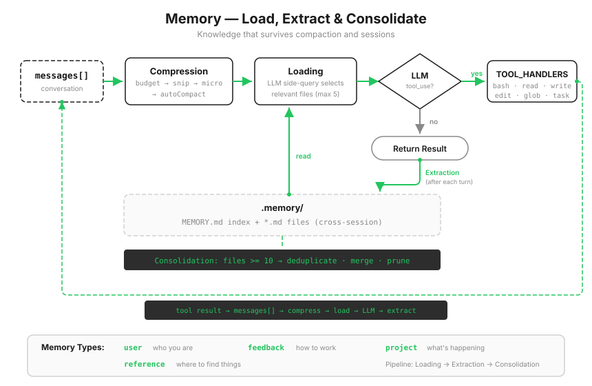
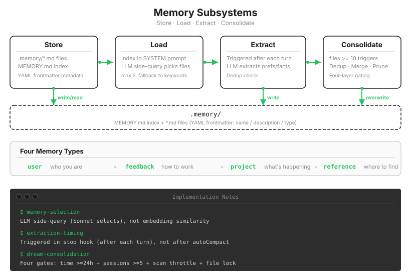

# s09: Memory — 压缩会丢细节，重要的得记在上下文之外

[中文](README.zh.md) · [English](README.md) · [日本語](README.ja.md)

s01 → ... → s07 → s08 → `s09` → [s10](../s10_system_prompt/) → s11 → ... → s20
> *"压缩会丢细节, 重要的得记在上下文之外"* — 文件仓库 + 索引 + 按需加载，跨压缩、跨会话。
>
> **Harness 层**: 记忆 — 跨压缩、跨会话的知识积累。

---

上一课结尾的问题是：哪些信息值得长期留下来。

先看它有多现实。你告诉过 Agent"用 tab 缩进，别用空格"。四十轮之后 s08 的摘要一跑，这句话大概率变成了"用户有代码风格偏好"，具体是什么偏好，丢了。更狠的是第二天：新开一个会话，全新的 `messages`，连那份摘要都不存在。你昨天教的规矩，今天等于没教过。

草稿纸的比方到这里要补最后一块：草稿纸会满、会被整理，这没办法；但有些东西本来就不该记在草稿纸上。"这位老师判卷严""这类题我总在符号上出错"，这些是跨越具体题目的经验，该记在一个单独的本子上，每次做题前翻一眼。

这一课给 Agent 这个本子。



---

## 写进 system prompt，为什么不行

直觉方案：把重要的偏好写进一个固定文件，启动时塞进 system prompt。

方向没错，但有两个问题。第一，谁来写？用户的偏好散落在日常对话里（"用 tab 比空格好"是随口说的，不是填表填的），指望用户手动维护一个偏好文件，等于没有这个系统。第二，全部常驻又掉进 s07 算过的那笔账：记忆越攒越多，每轮全量重发，90% 和当前任务无关。

s07 已经给过答案的形状：**索引常驻，内容按需。** 记忆系统可以看作技能系统的可写版本——s07 的技能是人写的、只读的；s09 的记忆是 Agent 自己写的，会生长，也会新陈代谢。

要自己写，就得回答四个问题：存成什么样、怎么读、什么时候写、多了怎么办。



---

## 存储：一个记忆一个文件，外加一份索引

每个记忆是 `.memory/` 下的一个 Markdown 文件，frontmatter 记元数据：

```markdown
---
name: user-preference-tabs
description: User prefers tabs for indentation
type: user
---

User prefers using tabs, not spaces, for indentation.
**Why:** Consistency with existing codebase conventions.
**How to apply:** Always use tabs when writing or editing files.
```

`type` 有四类，各回答一种问题：

| 类型 | 回答什么 | 示例 |
|------|---------|------|
| user | 你是谁 | "用 tab 不用空格" |
| feedback | 怎么做事 | "别 mock 数据库" |
| project | 正在发生什么 | "auth 重写是合规驱动" |
| reference | 东西在哪找 | "pipeline bug 在 Linear INGEST" |

`MEMORY.md` 是索引，一行一条，每次写入后自动重建：

```python
def write_memory_file(name, mem_type, description, body):
    slug = name.lower().replace(" ", "-")
    (MEMORY_DIR / f"{slug}.md").write_text(
        f"---\nname: {name}\ndescription: {description}\ntype: {mem_type}\n---\n\n{body}\n"
    )
    _rebuild_index()   # 索引永远和文件同步
```

---

## 读：索引常驻，正文临时注入

索引走 s07 的老路，进 SYSTEM：

```python
def build_system() -> str:
    index = read_memory_index()
    memories_section = f"\n\nMemories available:\n{index}" if index else ""
    return (
        f"You are a coding agent at {WORKDIR}."
        f"{memories_section}\n"
        "Relevant memories are injected below. Respect user preferences from memory."
        ...
    )
```

正文按需。每次用户开启新一轮，`select_relevant_memories()` 把最近对话和记忆目录发给模型做一次轻量 side-query，让它挑出真正相关的几条（最多 5 条）：

```python
prompt = (
    "Given the recent conversation and the memory catalog below, "
    "select the indices of memories that are clearly relevant. "
    "Return ONLY a JSON array of integers, e.g. [0, 3]. ..."
)
```

side-query 失败（API 错误、JSON 解析不出来）就降级成关键词匹配，宁可选得糙，不能选不出。

选中的记忆正文怎么进对话，是这一段最容易做错的地方。教学版的做法：**拼进本轮请求的副本，不写进 `messages` 历史。**

```python
request_messages = messages.copy()
request_messages[memory_turn] = {
    **messages[memory_turn],
    "content": memories_content + "\n\n" + messages[memory_turn]["content"],
}
response = client.messages.create(..., messages=request_messages, ...)
```

如果图省事直接 `messages.append()`，两个后果马上来：同一条记忆每轮被反复注入，历史越滚越肥；而且注入的记忆正文会被 s08 的压缩管线当成普通消息处理，占位、裁剪、进摘要，全乱了。注入必须是临时的，每次现拼现用，历史里干干净净。

---

## 写：收工时提取，而且要用压缩前的对话

用户不会每次都说"记住这个"。偏好散落在正常对话里，得有人在旁边留心听。`extract_memories()` 就是这个旁听者，在每轮收工时（模型不再调工具）运行：

```python
if response.stop_reason != "tool_use":
    extract_memories(pre_compress)   # 注意：用压缩前的快照
    consolidate_memories()
    return
```

`pre_compress` 这个参数是一条硬约束。循环每一圈都在跑 s08 的压缩管线，等到收工时，`messages` 里较早的对话可能已经被裁掉、被换成占位符了。"用 tab 比空格好"那句话如果恰好在被裁的区间里，对着压缩后的历史提取，等于对着残卷考古。所以循环每圈都留一份压缩前的快照，提取永远对着全文进行。s08 和 s09 在执行顺序上就此咬合：压缩可以随便压，提取必须看原文。

提取的 prompt 里还带着已有记忆的清单，让模型只在"确实有新东西"时返回内容，避免同一条偏好写十遍。

---

## 整理：攒多了就合并，但顺序碰不得

记忆文件会积累：重复的、过时的、互相矛盾的。文件数达到阈值（教学版 10 个）就触发一次整理，让模型把全部记忆去重合并，保留重要偏好：

```python
try:
    response = client.messages.create(...)          # ① 先拿到合并后的新清单
    items = json.loads(match.group())               # ② 解析成功
    for f in MEMORY_DIR.glob("*.md"):               # ③ 这时才删旧文件
        if f.name != "MEMORY.md":
            f.unlink()
    for mem in items:
        write_memory_file(...)                      # ④ 写入新文件
except Exception:
    pass                                            # 任何一步失败，旧文件原封不动
```

这里的顺序和 s08 的"先存盘再摘要"是同一根神经：**先确认新的拿到手，再销毁旧的。** 反过来写（先删再调 API），一次网络抖动就把 Agent 的全部记忆清了零，而且没有任何备份。

> 真实 Claude Code：整理过程叫 Dream，有四层门控（距上次 ≥24 小时、扫描节流、≥5 个会话有变动、文件锁防并发），并由受限权限的 fork agent 执行；选记忆同样是模型 side-query 挑选，不是向量检索；此外还分 user memory（跨会话）和 session memory（跨压缩）两层。教学版把这些收成一个阈值和三个函数，四个环节的职责划分是一样的。

---

## 相对 s08 的变更

| 组件 | 之前 (s08) | 之后 (s09) |
|------|-----------|-----------|
| 记忆能力 | 无（压缩后偏好随摘要退化） | 存储 + 加载 + 提取 + 整理 |
| 新函数 | — | `write_memory_file`, `select_relevant_memories`, `load_memories`, `extract_memories`, `consolidate_memories` |
| 存储 | — | `.memory/MEMORY.md` 索引 + `.memory/*.md` 文件 |
| 工具 | 9 个 | 6 个（本章教学骨架收窄到 bash, read_file, write_file, edit_file, glob, task，聚焦记忆本身） |
| 循环 | 每轮只做压缩 | 注入记忆 + 压缩 + 收工提取 + 定期整理 |

---

## 试一下

```sh
cd learn-claude-code
python s09_memory/code.py
```

1. `I prefer using tabs for indentation, not spaces. Remember that.`：收工时看 `[Memory: extracted N new memories]`，然后翻 `.memory/` 目录，应该多了一个 `.md` 文件，`MEMORY.md` 索引里多了一行；
2. `Create a Python file called test.py`：看它写出来的缩进是不是 tab；
3. 输入 `q` 退出，**重新运行程序**，问 `What are my preferences?`：全新的会话、全新的 `messages`，它仍然答得上来。这是本课和 s08 的分水岭：摘要活不过会话，记忆活得过；
4. 连续多聊几轮不同话题再观察：side-query 只会挑相关的记忆注入，不相关的躺在文件里不动。

---

## 接下来

记忆、压缩、工具都齐了。回头看看 SYSTEM prompt：身份是一段硬编码字符串，技能目录一段、记忆索引一段，各章各拼各的，散在各处。换个项目、换套工具，就得回来改代码。

s10 System Prompt → 分段 + 运行时组装。不同项目、不同工具，拼出不同的 prompt。

<!-- translation-sync: zh@v2, en@v2, ja@v2 -->
