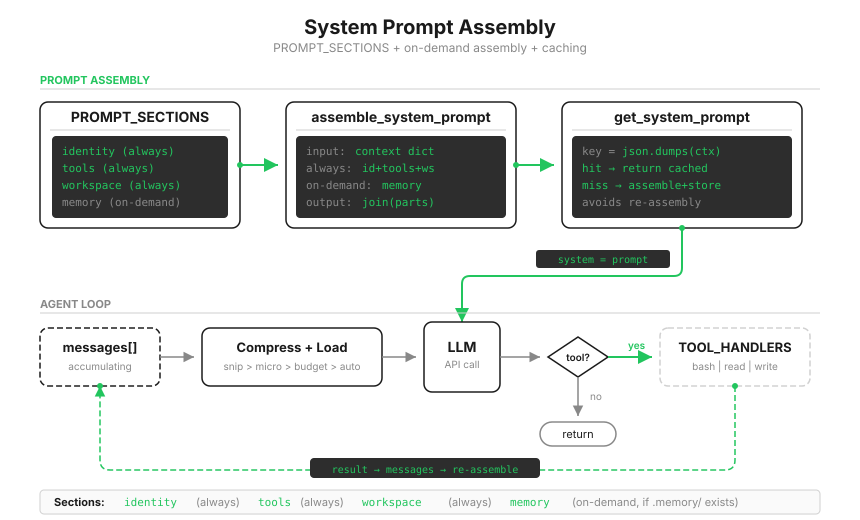

# s10: System Prompt — ハードコードせず、実行時に組み立てる

[中文](README.zh.md) · [English](README.md) · [日本語](README.ja.md)

s01 → ... → s08 → s09 → `s10` → [s11](../s11_error_recovery/) → s12 → ... → s20
> *"prompt は組み立てるもので、書き固めるものではない。"* section + 条件付き連結 + cache。
>
> **Harness レイヤー**: prompt の実行時組み立て。

---

SYSTEM prompt がどう増えてきたか振り返ろう。s01 では identity が一文だけ。s05 で TodoWrite の指示、s07 で skill catalog、s09 で memory index が加わった。各章が同じ文字列へ別の断片を溶接している。

```python
SYSTEM = (
    f"You are a coding agent at {WORKDIR}. "
    "Use tools to solve tasks. Act, don't explain. "
    "Before starting any multi-step task, use todo_write. "
    "Skills are available via list_skills and load_skill. "
    "Relevant memories are injected below when available. "
    # ... 機能を増やすたびに断片を溶接
)
```

三つの問題が続く。プロジェクトを変えると全体を書き直す必要があるが、溶接後はどこが共通でどこが project 固有か分けられない。新しい指示が以前の文と衝突しても、一つの文字列では見つけにくい。そして s08 で見た prompt cache は、prefix の完全一致を必要とする。巨大な一文字列に動的な字が一つでもあれば、SYSTEM 全体が毎ターン「新しい prefix」になる。

三つの問題を直す第一歩は同じだ。文字列を分ける。



---

## section に分ける：一つの主題を一つの段落へ

```python
PROMPT_SECTIONS = {
    "identity": "You are a coding agent. Act, don't explain.",
    "tools": "Available tools: bash, read_file, write_file.",
    "workspace": f"Working directory: {WORKDIR}",
    "memory": "Relevant memories are injected below when available.",
}
```

section は独立して保守できる。`tools` を変えても `identity` に触れず、`memory` を足しても `workspace` を変えない。各 section が一つの主題だけを扱うので、衝突も見えるようになる。

分割は第一歩にすぎない。このターンにどの section を載せるか、誰が決めるのか。

---

## keyword ではなく状態から組み立てる

```python
def assemble_system_prompt(context: dict) -> str:
    sections = []

    # 常時：identity、tools、workspace は毎ターン必要
    sections.append(PROMPT_SECTIONS["identity"])
    sections.append(PROMPT_SECTIONS["tools"])
    sections.append(PROMPT_SECTIONS["workspace"])

    # 条件付き：会話内の keyword ではなく、実際の状態を見る
    memories = context.get("memories", "")
    if memories:
        sections.append(f"Relevant memories:\n{memories}")

    return "\n\n".join(sections)
```

判断材料が重要だ。memory section を載せるかは `.memory/MEMORY.md` が存在し、空でないかで決める。これはファイルシステム上の事実だ。ユーザーの発言に「覚えて」「好み」といった語があるかで判断する方法は推測にすぎず、言い方が変われば失敗する。状態による組み立ては決定的で test できる。

context 自体も実際の状態から作る。

```python
def update_context(context: dict, messages: list) -> dict:
    memories = ""
    if MEMORY_INDEX.exists():                       # 会話ではなくファイルシステムを見る
        content = MEMORY_INDEX.read_text().strip()
        if content:
            memories = content
    return {
        "enabled_tools": list(TOOL_HANDLERS.keys()),  # 実際に登録されたツール
        "workspace": str(WORKDIR),
        "memories": memories,
    }
```

ループは各ターンのツール実行後に context を再計算する。理由は実務的だ。ツールは世界を変える。前のターンでモデルが `MEMORY.md` を書いたなら、次の prompt はそれを反映すべきだ。

---

## cache：同じ状態を二度組み立てない

複数ターンで context が変わらないことは多く、毎回文字列を連結するのは無駄だ。serialize した context を key にする cache を足す。

```python
def get_system_prompt(context: dict) -> str:
    global _last_context_key, _last_prompt
    key = json.dumps(context, sort_keys=True, ensure_ascii=False, default=str)
    if key == _last_context_key and _last_prompt:
        return _last_prompt                     # [cache hit]
    _last_context_key = key
    _last_prompt = assemble_system_prompt(context)
    return _last_prompt                         # [assembled]
```

なぜ手軽な `hash()` ではなく `json.dumps(sort_keys=True)` なのか。悪い場合が二つある。Python の文字列 hash は process ごとに randomize され、同じ context でも別の実行では key が変わる。また context には list と dict があり、`hash()` は `unhashable type` を投げる。決定的な serialize が安定した選択で、`sort_keys` は辞書順による差も消す。

正直な境界もある。この cache が節約するのは local process 内の文字列組み立てで、s08 の API 側 prompt cache とは別物だ。ただし section 分割は API cache の準備にもなる。安定 section を前へ、変化する section を後ろへ置けるため、安定 prefix を長く保てる。

> 実際の Claude Code は section 数が固定ではなく、feature flag、出力 style、実行 mode で増減する。静的 section は一つの global cache block にまとまり、動的 section は `SYSTEM_PROMPT_DYNAMIC_BOUNDARY` の外へ置かれる。全構成で唯一常に変化しやすい section は `mcp_instructions` で、MCP server がターン間で接続・切断するためだ。教学版の四 section と二戦略は、同じ構造の最小版である。

---

## s09 からの変更

| コンポーネント | 変更前 (s09) | 変更後 (s10) |
|----------------|--------------|--------------|
| prompt | ハードコードした SYSTEM 文字列 | `PROMPT_SECTIONS` + `assemble_system_prompt` |
| cache | なし | `get_system_prompt`（`json.dumps` による検出 + cache） |
| 新しい関数 | — | `assemble_system_prompt`, `get_system_prompt`, `update_context` |
| ツール | 6 | 3、本章では bash, read_file, write_file に絞る |
| ループ | 固定 SYSTEM | ツール後に context を再計算し、prompt を取得 |

---

## 試してみる

```sh
cd learn-claude-code
python s10_system_prompt/code.py
```

ターミナルの二つの label が本章の観察点だ。`[assembled] sections: ...` は再組み立てと section 一覧を示し、`[cache hit]` は状態が変わらず cache を再利用したことを示す。

1. `Read the file README.md`：最初の組み立てにどの三 section が入るかを見る。直前に s09 を動かし `.memory/` に記憶があれば、最初から `memory` も現れる。
2. 続けて別の質問をする。context が変わらないため、今度は `[cache hit]` になるはずだ。
3. memory がなければ `Create a file called .memory/MEMORY.md with content "- [test](test.md) — test memory"`。書込後の次ターンで `[assembled]` が再び出て、section に `memory` が増える。モデルがファイルシステムを変え、prompt が追従した。これが状態による組み立てだ。

---

## 次へ

prompt は組み立てられ、必要な機能もある。しかしすべてが「API 呼び出しは必ず成功する」という仮定に立つ。現実には network failure、rate limit、出力切断、context overflow が日常的に起きる。今のコードはどれに遭っても crash する。

s11 Error Recovery → 四つの回復経路。token 上限を上げ、context を圧縮し、指数 backoff し、model を切り替える。

<!-- translation-sync: zh@v2, en@v2, ja@v2 -->
