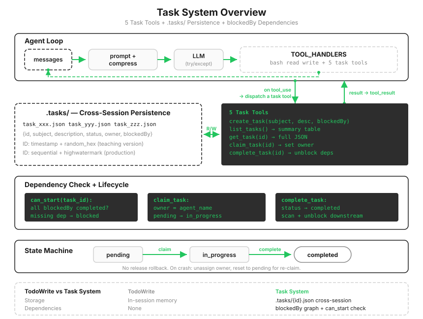

# s12: Task System — Break Large Goals into Small Tasks

[中文](README.zh.md) · [English](README.md) · [日本語](README.ja.md)

s01 → ... → s10 → s11 → `s12` → [s13](../s13_background_tasks/) → s14 → ... → s20

> *"Break large goals into small tasks, put them in order, and persist them"* — A file-persisted task graph, the foundation for multi-agent collaboration.
>
> **Harness layer**: Tasks — persistent goals and recoverable progress.

---

Give an agent a project-sized job: set up the database, write the API, and add tests. It makes a checklist with s05's TodoWrite and starts working through it in order. Halfway through the API, it realizes the tables do not exist and goes back to add them. Once the tables are ready, it starts the tests, only to discover that the API signatures have changed again.

The problem is not a poorly written checklist. It is the checklist data structure itself: a flat list cannot express "the schema must exist before the API can be written." The relationships between tasks form a graph, not a sequence. On a construction schedule, "raise the beams" must be tied to "erect the columns first"; merely placing it on the third line is not enough.

There is also a simpler problem: the s05 checklist lives in process memory and evaporates as soon as you press `q`. If you stop halfway through a project, tomorrow's agent should be able to pick up where you left off.



---

## Three Things TodoWrite Is Missing

| | TodoWrite (s05) | Task System (s12) |
|---|---|---|
| Role | Execution checklist for the current task | Recoverable task system |
| Storage | Process memory | `.tasks/{id}.json` files |
| Dependencies | None | `blockedBy` dependency graph |
| Lifecycle | Current session | Persists across sessions |
| Ownership | None | `owner` field + claiming mechanism |

In one sentence: **the checklist manages steps; the task system manages collaboration.** Dependencies impose ordering constraints, persistence lets progress survive restarts, and ownership answers "who is working on what?" The third item looks unnecessary while there is only one agent, but once multiple agents arrive in s15, it becomes the key to stopping two of them from grabbing the same job.

To keep the teaching code focused on the task system, this chapter returns to the basic loop and does not carry over s11's error recovery. That is not a conflict in design: task CRUD and error recovery are independent layers, and a real system naturally stacks them together.

---

## Storage: One JSON File per Task

```python
@dataclass
class Task:
    id: str
    subject: str
    description: str
    status: str          # pending | in_progress | completed
    owner: str | None    # Who claimed it (multi-agent scenarios)
    blockedBy: list[str] # IDs of upstream dependencies

def save_task(task: Task):
    (TASKS_DIR / f"{task.id}.json").write_text(json.dumps(asdict(task), indent=2))
```

Why use one file per task instead of one large JSON file containing everything? It lays the groundwork for concurrency. When several agents work at once, each updates the task it claimed, so they modify different files and minimize the surface for conflicts. The full weight of this decision becomes apparent in s15.

Declare dependencies when creating a task:

```python
def create_task(subject, description="", blockedBy=None) -> Task:
    task = Task(id=f"task_{int(time.time())}_{random.randint(0, 9999):04d}",
                subject=subject, description=description,
                status="pending", owner=None, blockedBy=blockedBy or [])
    save_task(task)
    return task
```

---

## Dependency Checks: All Upstream Work Must Be Complete

```python
def can_start(task_id: str) -> bool:
    task = load_task(task_id)
    for dep_id in task.blockedBy:
        if not _task_path(dep_id).exists():
            return False          # A missing dependency counts as blocked
        if load_task(dep_id).status != "completed":
            return False
    return True
```

Notice the "dependency does not exist" branch. Models do mistype IDs, as s05 warned: tool arguments come from the model and cannot be trusted completely. Calling `load_task` directly on a bad ID would crash; silently allowing the task to proceed would be worse, because it would make the dependency check meaningless. Treating it as blocked is the safest defense: the task cannot move, but the model sees the suspicious ID in the "Blocked by" error and can correct it.

---

## Claiming and Completing: Two Actions, Three States

```
pending ──claim──→ in_progress ──complete──→ completed
```

```python
def claim_task(task_id: str, owner: str = "agent") -> str:
    task = load_task(task_id)
    if task.status != "pending":
        return f"Task {task_id} is {task.status}, cannot claim"   # Already claimed or completed
    if not can_start(task_id):
        return f"Blocked by: {...}"                               # Upstream work is unfinished
    task.owner = owner
    task.status = "in_progress"
    save_task(task)
```

Both reasons for rejecting a claim are returned to the model directly as the `tool_result`: either the state is wrong or upstream work remains. When the model receives `Blocked by: [task_xxx]`, it knows what to work on first. The harness does not need explicit scheduling logic; the error message itself provides the guidance.

Completing a task does one extra thing: it scans every task and announces the ones that have just become unblocked.

```python
def complete_task(task_id: str) -> str:
    task = load_task(task_id)
    if task.status != "in_progress":
        return f"Task {task_id} is {task.status}, cannot complete"
    task.status = "completed"
    save_task(task)
    unblocked = [t.subject for t in list_tasks()
                 if t.status == "pending" and t.blockedBy and can_start(t.id)]
    ...   # "Unblocked: create API endpoints, write docs"
```

That announcement is the payoff of the graph structure: the instant the schema is complete, the model learns that both the endpoints and the docs can proceed, without repeatedly polling for itself.

---

## Two Gaps Deliberately Left in the Teaching Version

**There is no cycle detection.** If two tasks list each other in `blockedBy`, `can_start` returns False for both and neither can be claimed. That is a deadlock. The teaching version does not detect it, which gives you a useful failure to create by hand in the exercise below. A production system must verify that dependencies remain acyclic when they are created.

**There is no release fallback.** The state machine has no `in_progress → pending` edge. If the agent that claimed a task crashes, that task stays `in_progress` forever and nobody else can take it; the only escape is manually deleting the JSON. When a teammate terminates in the real Claude Code, its tasks have their owner cleared and their state reset to `pending`, so another teammate can claim them.

> In the real Claude Code, `claimTask` uses file locks to prevent races. It re-reads the task inside the lock to prevent TOCTOU, checks `already_claimed` and `blocked`, and only then assigns the owner. IDs are increasing integers backed by a `.highwatermark` file so deleted IDs are not reused. Dependencies are maintained by `TaskUpdate` through `addBlocks/addBlockedBy`, rather than declared only at creation time. The five functions in the teaching version correspond to its four tools and share the same underlying structure.

---

## Changes from s11

| Component | Before (s11) | After (s12) |
|------|-----------|-----------|
| Task management | None | `Task` dataclass + 5 tools |
| Storage | No persistence | `.tasks/{id}.json` across sessions |
| Dependencies | None | `blockedBy` graph + `can_start` checks |
| Tools | bash, read_file, write_file (3) | +create_task, list_tasks, get_task, claim_task, complete_task (8) |
| Lifecycle | — | pending → in_progress → completed (no release fallback) |

---

## Try It

```sh
cd learn-claude-code
python s12_task_system/code.py
```

1. `Create tasks: setup database schema, create API endpoints (depends on schema), write tests (depends on endpoints), write docs (depends on schema)`: open the `.tasks/` directory. Four JSON files are there, with their dependencies recorded faithfully in `blockedBy`.
2. `Claim and complete the first unblocked task`: when the schema completes, watch the `[unblocked]` announcement. The endpoints and docs become available at the same time.
3. Press `q` to exit, **start the program again**, and enter `List all tasks`: the list returns exactly as it was, including which work is complete. The in-memory checklist from s05 cannot do this.
4. **Create a deadlock by hand**: `Create task A blocked by task B, and task B blocked by task A. Then try to claim either one.` Both sides return `Blocked by`, and neither can move. That is the cost of having no cycle detection. Remember how it feels; it is the sort of failure that comes back to mind when you design a task system later.

---

## Next

The task graph is in place, but the main agent still runs every task itself and cannot start the next one until the current one finishes. Some jobs are inherently slow: a full test suite may take ten minutes, while a build and deployment may take half an hour. Making a token-metered loop sit idle for a slow command burns both money and time.

s13 Background Tasks → Put slow operations in the background, let the agent continue with other work, and collect the result when it is ready.

<!-- translation-sync: zh@v2, en@v2, ja@v2 -->
