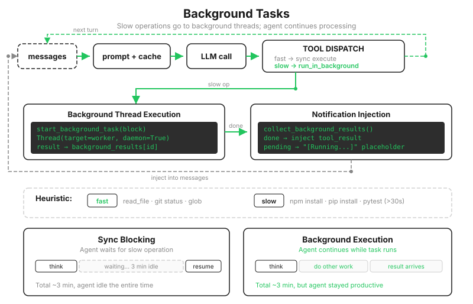

# s13: Background Tasks — Put Slow Operations in the Background

[中文](README.zh.md) · [English](README.md) · [日本語](README.ja.md)

s01 → ... → s11 → s12 → `s13` → [s14](../s14_cron_scheduler/) → s15 → ... → s20

> *"Send slow operations to the background and let the agent keep working"* — A background thread runs the command, then injects a notification when it finishes.
>
> **Harness layer**: Background work — asynchronous execution without blocking the main loop.

---

Ever since s01, `run_bash` has contained a line that had not caused trouble yet: `timeout=120`. If a command takes longer than two minutes, it is killed. A full test suite that needs ten minutes could never reach the finish line in any previous chapter.

Increasing the timeout only changes the shape of the problem. `subprocess.run` blocks, so a ten-minute command makes the agent stand still for ten minutes. It cannot call the model or do other work. The terminal does not move, and you cannot tell whether the command is running or dead.

You would not work that way yourself. After putting clothes in the washing machine, you do not stare at the drum; you make dinner and come back when it chimes. This chapter gives the agent the same workflow: dispatch a slow command, turn to other work, and collect the result when it is ready.



---

## What Goes into the Background: The Model Decides, with a Heuristic Fallback

The first question is classification. Which commands belong in the background?

```python
def is_slow_operation(tool_name: str, tool_input: dict) -> bool:
    """Fallback heuristic: commands with these keywords will probably exceed 30 seconds."""
    if tool_name != "bash":
        return False
    cmd = tool_input.get("command", "").lower()
    slow_keywords = ["install", "build", "test", "deploy", "compile",
                     "docker build", "pip install", "npm install",
                     "cargo build", "pytest", "make"]
    return any(kw in cmd for kw in slow_keywords)

def should_run_background(tool_name: str, tool_input: dict) -> bool:
    if tool_input.get("run_in_background"):   # An explicit model request goes straight to the background
        return True
    return is_slow_operation(tool_name, tool_input)   # Otherwise, fall back to the heuristic
```

The model is much better than a keyword list at judging whether a command will be slow, so the `bash` tool gains a `run_in_background` argument, and an explicit request from the model takes priority. The heuristic is only a fallback: if the model forgets the argument, an `npm install` should not freeze the loop.

To be honest about the flaw in that fallback, keyword matching inevitably produces false positives. `echo running tests` contains "test," so it goes to the background too. Also notice the shape of the code: an explicit `True` overrides the heuristic, but an explicit `False` does not. The teaching version gives the model only one-way control. It is a simplification you will encounter directly in the exercise.

---

## Dispatch: A Thread and a Registry

```python
background_tasks: dict[str, dict] = {}   # bg_id → {tool_use_id, command, status}
background_results: dict[str, str] = {}  # bg_id → output
background_lock = threading.Lock()

def start_background_task(block) -> str:
    global _bg_counter
    _bg_counter += 1
    bg_id = f"bg_{_bg_counter:04d}"

    def worker():
        result = execute_tool(block)          # Actually run it in the child thread
        with background_lock:
            background_tasks[bg_id]["status"] = "completed"
            background_results[bg_id] = result

    with background_lock:
        background_tasks[bg_id] = {"tool_use_id": block.id,
                                   "command": ..., "status": "running"}
    threading.Thread(target=worker, daemon=True).start()
    return bg_id
```

That `background_lock` is not decorative. A worker may be writing `status` while the main thread iterates over or removes entries from the two dictionaries. Without a lock, that is a data race: at best one notification disappears; at worst the dictionary structure is corrupted. The rule is simple: either thread must hold the lock whenever it touches these dictionaries.

`daemon=True` is another boundary worth knowing. When the main process exits, the background thread dies with it and any unfinished result is lost. The teaching version accepts that limitation; a production system puts background work in a separate process and persists it to disk.

---

## The Claim Ticket: The Pairing Rule Cannot Wait

Dispatch solves the blocking problem and immediately runs into the old rule from s01: every `tool_use` must have a corresponding `tool_result` in the next user message. But the real result is still running in another thread. What can this turn send back to the API?

Send a claim ticket:

```python
if should_run_background(block.name, block.input):
    bg_id = start_background_task(block)
    results.append({"type": "tool_result",
                    "tool_use_id": block.id,
                    "content": f"[Background task {bg_id} started] "
                               f"Command: ... Result will be available when complete."})
```

The pairing rule is satisfied in the same turn, and the model receives a ticket number. When it sees "Result will be available when complete," it knows to do something else instead of waiting in place.

---

## Collecting Results: Notifications Use the Text Channel, Not a Fake Tool Result

Once a background task finishes, how does its result get back into the conversation? The easiest mistake is to reuse the original `tool_use_id` and inject another `tool_result`. That does not work: the ticket already paired that ID in the original turn, and the API allows each ID to be paired only once. Reusing it causes an error.

The notification therefore uses the other channel introduced in s01: a `user` message is the voice of the outside world. A background result is fresh news from that world, so it is injected as an ordinary text block in structured XML that the model can recognize easily:

```python
notifications.append(
    f"<task_notification>\n"
    f"  <task_id>{bg_id}</task_id>\n"
    f"  <status>completed</status>\n"
    f"  <command>{task['command']}</command>\n"
    f"  <summary>{summary}</summary>\n"
    f"</task_notification>")
```

Injection happens after each tool round. The current round's `tool_result` blocks and any accumulated background notifications are packed into the same user message. This exposes a boundary in the teaching version: **notifications are injected only after tool rounds.** If the model is already done and you do not send another request that requires a tool, the completed result remains in the registry waiting. A real system solves this with a persistent message queue that is consumed every turn.

> The real Claude Code does not use threads. It runs on Node.js's single-threaded event loop, where "background" means not awaiting the operation; command output is redirected to a file while the process runs independently. Background tasks come in seven types, including local commands, local and remote agents, workflows, and monitors, each with its own lifecycle. Background bash tasks also have a stall watchdog: if output does not grow for 45 seconds, it checks whether the process is stuck on an interactive prompt such as `(y/n)`.

---

## Changes from s12

| Component | Before (s12) | After (s13) |
|------|-----------|-----------|
| Slow commands | Block the main loop (and are killed after 120s) | Run in a background thread while the main loop continues |
| bash argument | `command` | +`run_in_background` (explicit model request) |
| New functions | — | `is_slow_operation`, `should_run_background`, `start_background_task`, `collect_background_results` |
| Returning results | Same-round `tool_result` | Claim ticket + injected `<task_notification>` text |
| Thread safety | Not applicable | `threading.Lock` protects the registry |

---

## Try It

```sh
cd learn-claude-code
python s13_background_tasks/code.py
```

1. **See the complete timeline at once**: `Run this command: echo running tests`. The "test" keyword triggers the heuristic, so even this instant command is sent to the background. It finishes quickly enough for you to see the whole sequence in one turn: `[background] dispatched`, `[background done]`, and `[inject] 1 background notification(s)`. This is also a live example of a keyword false positive.
2. **Real concurrency**: `In the background, run 'sleep 15 && echo finished'. While waiting, write a short poem about waiting to wait.md`. "sleep" is not in the keyword list, so the model must pass `run_in_background` itself. Watch the agent write the poem immediately after dispatch instead of blocking.
3. **Notification timing**: after experiment 2, wait about fifteen seconds and enter `Read wait.md`. That request produces a tool round, so the `<task_notification>` rides into the conversation with it and the model mentions that the background command finished. If you send only small talk that needs no tool, the notification remains in the registry. You can observe the "only after tool rounds" boundary for yourself.

---

## Next

Long commands no longer hold the agent hostage, but every job still starts only after you say something. What if you want it to run the tests every morning at nine or check the service every five minutes? Hiring someone to press Enter on schedule would rather defeat the point.

s14 Cron Scheduler → Give the agent an alarm clock.

<!-- translation-sync: zh@v2, en@v2, ja@v2 -->
