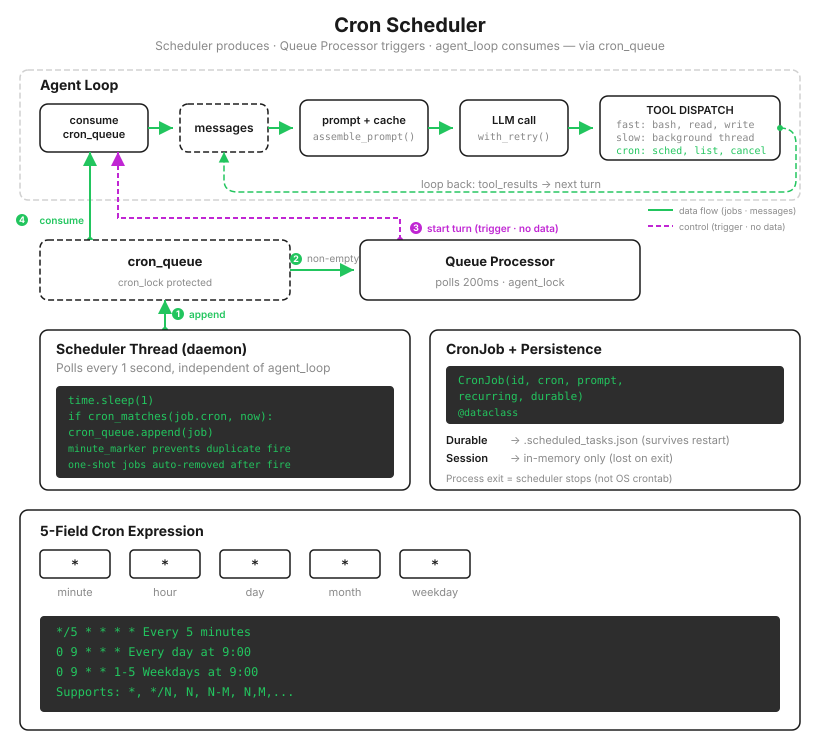

# s14: Cron Scheduler — スケジュールから仕事を生み出す

[中文](README.zh.md) · [English](README.md) · [日本語](README.ja.md)

s01 → ... → s12 → s13 → `s14` → [s15](../s15_agent_teams/) → s16 → ... → s20
> *「スケジュールから仕事を生み出し、スケジューリングと実行を分離する」* — 永続またはセッション単位の cron スケジューリング。
>
> **Harness 層**: スケジューリング — 独立スレッドが時刻を判定し、キュー経由でトリガーを渡します。

---

s13 によって Agent は長い処理で止まらなくなりましたが、すべての仕事はまだあなたの一言から始まります。「毎朝 9 時にテストを実行」「30 分ごとに CI を確認」といった仕事のために、決まった時刻に Enter を押す人を雇うわけにはいきません。

最初はモデルへ「毎日 9 時にテストすることを覚えておいて」と頼みたくなるかもしれません。この言葉は、これまで明示してこなかった事実を露わにします。**モデルは呼び出されている間しか存在しません。** リクエストが来なければ、静止した重みの集まりです。context に「毎日 9 時」と書いてあっても、9 時になったとき、それを読みに起きるものはありません。時間感覚はモデルの中に育つ場所がなく、Harness にしか置けません。

Harness にはどう実装すればよいでしょう。main loop を 9 時まで `sleep` させると、Agent 全体が凍ります。答えは目覚まし時計と同じです。独立して常に起きている小さな部品が時刻表だけを見て、時間になったら声を上げます。



---

## 登録: 不正な式は入口で止める

タスクは 5 フィールドの cron 式（分、時、日、月、曜日）で記述し、登録時にすぐ検証します。

```python
@dataclass
class CronJob:
    id: str
    cron: str        # "0 9 * * *"
    prompt: str      # トリガー時に Agent へ注入するメッセージ
    recurring: bool  # True=繰り返し、False=一度だけ
    durable: bool    # True=ディスクへ保存し、再起動をまたぐ

def schedule_job(cron, prompt, recurring=True, durable=True):
    err = validate_cron(cron)      # 先に検証し、不正な式はその場で拒否
    if err:
        return err
    job = CronJob(id=f"cron_{random.randint(0, 999999):06d}", ...)
    with cron_lock:
        scheduled_jobs[job.id] = job
    if durable:
        save_durable_jobs()        # .scheduled_tasks.json へ保存
```

なぜ登録時に検証する必要があるのでしょう。逆を想像してください。`99 99 * * *` が入り込み、scheduler が各ジョブを照合するとき初めて例外になります。scheduler thread は全体で 1 本しかないため、1 件の不正なジョブがすべての目覚ましを黙らせます。教材版は二重に守ります。登録時の検証で大半を止め、scheduler loop では各ジョブを個別の try/except で囲み、1 件が失敗してもログだけを残してスレッドは生かします。

---

## 照合: 毎秒確認しても、鳴るのは 1 分に 1 回だけ

scheduler thread は毎秒起き、現在時刻と各ジョブの式を照合します。

```python
def cron_scheduler_loop():
    while True:
        time.sleep(1)
        now = datetime.now()
        minute_marker = now.strftime("%Y-%m-%d %H:%M")   # 日付を含むことに注目
        with cron_lock:
            for job in list(scheduled_jobs.values()):
                try:
                    if cron_matches(job.cron, now):
                        if _last_fired.get(job.id) != minute_marker:
                            cron_queue.append(job)               # トリガー: キューへ入れる
                            _last_fired[job.id] = minute_marker  # この分にはもう鳴らさない
                        if not job.recurring:
                            scheduled_jobs.pop(job.id, None)     # 1 回限りのジョブは使ったら削除
                except Exception as e:
                    print(f"[cron error] {job.id}: {e}")         # 1 件の不正ジョブでスレッドを殺さない
```

間違えやすい 2 つの細部が `minute_marker` に隠れています。まず、毎秒ポーリングすると同じ分に 60 回一致しますが、ジョブが鳴るのは 1 回だけでよいので、「このジョブはこの分にすでに鳴った」と記録する必要があります。次に、marker には日付も必要です。`09:00` だけを記録すると、毎日 9 時のジョブは初日に鳴ったあと、翌日の 9 時にも同じ marker を見て二度と鳴りません。この種の bug は公開から 1 日たって初めて発生するため、特に調査しづらいものです。

`cron_matches` は伝統的 cron の奇妙な仕様も忠実に再現します。日と曜日の両方に制約がある場合、意味は AND ではなく **OR** です。`0 9 13 * 5` は「13 日または金曜日の 9 時」を意味します。「13 日かつ金曜日の 9 時」は標準 cron では表現できません。教材版はこれを「修正」しません。癖まで含めて互換性だからです。

---

## 分離: Scheduler はキューへ入れるだけで、実行しない

時刻になったとき scheduler thread が行うのは、ジョブを `cron_queue` に追加して時刻監視へ戻ることだけです。自分で agent turn を実行することはありません。理由は 2 つあります。agent の 1 turn が数分かかれば scheduler が止まり、その後すべてのトリガーが遅れます。また、その瞬間にユーザーが Agent と会話中かもしれません。2 つの turn が同じ履歴へ同時に書くと、メッセージが交錯し、s01 のペアリング規則が即座に壊れます。

目覚まし時計は鳴るだけで、あなたをベッドから引きずり出しません。それは別の役割が担います。

```python
def queue_processor_loop():
    """キューに仕事があり、Agent が空いているとき、自動で 1 turn 開始する。"""
    while True:
        time.sleep(0.2)
        if not has_cron_queue():
            continue
        if not agent_lock.acquire(blocking=False):   # ロックを取れない = Agent は作業中。次回また試す
            continue
        try:
            run_agent_turn_locked()                  # agent turn を自動で開始
        finally:
            agent_lock.release()
```

`agent_lock` はこの構造全体の軸です。ユーザーが Enter を押す経路と、定時トリガーの経路が同じロックを取り合うため、同時に実行できる agent turn は 1 つだけです。定時ジョブは進行中の会話へ割り込まず、あなたが話し終えた隙間を待ちます。

最後の処理は `agent_loop` の冒頭にあり、発火したジョブを user メッセージとして、同じ「世界の声」の経路へ注入します。

```python
fired = consume_cron_queue()
for job in fired:
    messages.append({"role": "user", "content": f"[Scheduled] {job.prompt}"})
```

4 層がそれぞれ役割を持ちます。scheduler（時刻を見る）→ queue（バッファする）→ queue processor（空き時間を探す）→ consumer（注入して実行する）。各層は 1 つのことだけを行います。これが「スケジューリングと実行を分離する」の全体です。

durable ジョブは `.scheduled_tasks.json` に保存され、プログラム起動時に再読込されます。ディスク上のファイルは手作業で壊される可能性があるため、読込時にも再検証し、不正なジョブはログを残してスキップします。

> 実際の Claude Code では登録上限が 50 ジョブで、繰り返しジョブは 7 日後に自動失効します。トリガー時刻には jitter も加わり、繰り返しジョブは間隔の最大 10% まで遅延します。世界中の「9 時ちょうど」が同じ秒に API へ殺到する thundering herd を防ぐためです。cron が始めたリクエストは低優先度 workload として扱われ、容量が厳しいときは対話中のユーザーへ譲ります。

---

## s13 からの変更点

| コンポーネント | 変更前 (s13) | 変更後 (s14) |
|------|-----------|-----------|
| トリガー | ユーザー入力 | +cron 式による定時トリガー |
| 新しいスレッド | バックグラウンド実行スレッド | +scheduler thread（1 秒ポーリング）+ queue processor thread |
| 新しいツール | — | `schedule_cron`, `list_crons`, `cancel_cron`（合計 11） |
| 永続化 | `.tasks/` のタスク | +`.scheduled_tasks.json` の durable ジョブ |
| 並行制御 | `background_lock` | +`cron_lock`, `agent_lock`（ユーザー turn と定時 turn を排他） |

---

## 試してみる

```sh
cd learn-claude-code
python s14_cron_scheduler/code.py
```

1. **自分で動き出す様子を見る**: `Schedule a cron job that runs every minute: report the current time`。次の分ちょうどになると、何も入力していないのにターミナルが動き始めます。`[cron fire]` → `[queue processor] delivering scheduled work` → `[inject cron]` と続き、Agent が時刻を報告する 1 turn を完走します。このコースで初めて、あなたの入力なしに仕事が始まります。
2. **不正な式は入れない**: `Schedule a cron job with expression "99 99 * * *" that says hi`。登録は `minute: Value 99 out of bounds [0-59]` で拒否され、scheduler は無傷です。
3. **再起動をまたぐ**: `q` で終了して再起動すると、起動ログに `[cron] loaded 1 durable job(s)` が現れ、次の分にも変わらず鳴ります。確認できたら `Cancel that cron job` を実行し、`.scheduled_tasks.json` が空になったことも見てください。
4. **会話中には割り込まない**: 分が変わる直前に、複数のツールラウンドを必要とする質問を Agent へ送ります。cron が発火しても `[queue processor]` はすぐ配信せず、現在の turn が終わるまで待ちます。それが `agent_lock` の働きです。

---

## 次へ

Agent は仕事ができ、時刻も守れるようになりましたが、まだ 1 人で働いています。本当のプロジェクトは、フロントエンド、バックエンド、テストを並行して進める必要があります。s06 の subagent は直列に手伝い、s13 の background thread はコマンドを実行するだけです。どちらも「複数の Agent が同時に着手し、それぞれの領域を担当する」ものではありません。

s15 Agent Teams → main Agent を lead にして、複数の teammate を立ち上げ、それぞれの仕事をファイルベースのメールボックスでつなぎます。

<!-- translation-sync: zh@v2, en@v2, ja@v2 -->
