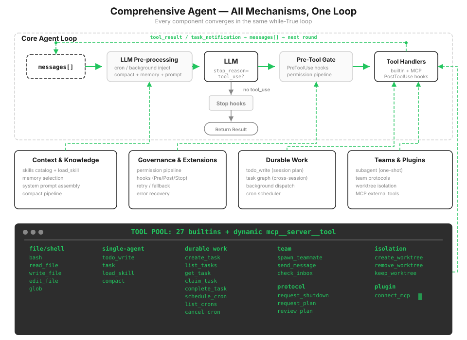

# s20: Comprehensive Agent — Every Mechanism, One Loop

[中文](README.zh.md) · [English](README.md) · [日本語](README.ja.md)

s01 → ... → s18 → s19 → `s20`

> *"Many mechanisms, one loop"* — Tools, permissions, memory, tasks, teams, and plugins all hang from the same `while True`.
>
> **Harness layer**: Integration — return the mechanisms from the first 19 chapters to one runnable system.

---

After nineteen chapters, you have nineteen parts, and each works on its own. But a real agent is not nineteen demos. It is one process: compaction must yield to memory extraction, permissions must run before dispatch, and cron must not interrupt an active user turn. Even correct parts fall apart when assembled in the wrong order.

This chapter invents no new mechanism. It answers one question: **where does each part attach to the loop, and why does it belong there?**



The entire diagram in text form looks like this:

```text
User input
  → UserPromptSubmit hooks
  → inject cron/background notifications
  → context compact
  → assemble system prompt from memory + skills + MCP state
  → LLM
  → contains a tool_use block?
      no  → Stop hooks → return
      yes → PreToolUse hooks + permission
          → TOOL_HANDLERS / MCP handlers / background dispatch
          → PostToolUse hooks
          → tool_result / task_notification back into messages
          → next round
```

The loop itself is still the five steps from s01: call the model, see whether it wants tools, execute them, feed results back, and repeat. What has become complete is everything around the loop.

> The real Claude Code does not even trust `stop_reason` to answer "did it request a tool?" It inspects the content for `tool_use` blocks because of the streaming behavior explained in s01. The final teaching chapter still checks `stop_reason`; it is sufficiently reliable without streaming.

---

## Where Components Sit in the Loop

| Position | Component | Purpose |
|------|------|------|
| Around user input | `UserPromptSubmit` hooks | Record, inject, and audit user input |
| Before the LLM | cron queue | Inject scheduled prompts into `messages` |
| Before the LLM | background notifications | Inject completed background work as `<task_notification>` |
| Before the LLM | compaction pipeline | Persist large results, trim history, replace old results, then summarize if necessary |
| Before the LLM | memory / skills / MCP state | Assemble the system prompt so the model sees current capabilities and long-term context |
| LLM call | error recovery | Back off on 429/529, escalate `max_tokens`, and reactively compact on overflow |
| Before tool execution | `PreToolUse` hooks + permission | Block dangerous commands, out-of-bounds writes, and destructive MCP tools |
| Tool dispatch | `assemble_tool_pool` | Rebuild built-in + dynamic MCP tools every round |
| During tool execution | background dispatch | Run slow work in daemon threads and let the main loop continue with a claim ticket |
| After tool execution | `PostToolUse` hooks | Warn about large output, log activity, and perform other post-processing |
| Return to loop | tool_result | Match every `tool_use` with one `tool_result` for the next round |
| On stop | `Stop` hooks | Collect statistics and clean up; a non-None return can refuse to stop |

---

## Assembly Order Is Not Arbitrary

The hard constraints from each chapter become assembly rules when placed in one machine. Their individual failure modes were explained earlier; here they are collected into one checklist:

| Rule | What breaks if reversed | Source |
|------|------------|------|
| `tool_result_budget` before `micro_compact` | A large result becomes a placeholder before it can be persisted and is lost forever | s08 |
| Extract memory from the pre-compaction snapshot | Important preferences are already placeholders when you try to recover them from trimmed history | s09 |
| Permission checks before tool dispatch | The command has already run, so interception becomes a postmortem notice | s03/s04 |
| Rejections and blocks still return `tool_result` | Pairing breaks and the API returns 400 | s01/s03 |
| Background notifications never reuse `tool_use_id` | The ID is already paired; reuse fails, so notifications use user text | s13 |
| Cron and user turns share `agent_lock` | Two turns write the same history concurrently and interleave messages | s14 |
| A single mailbox-consumption entry point routes first | A protocol response is removed without registration and remains pending forever | s16 |
| Verify before destruction (persist / parse / count changes) | One failure empties memory or destroys work still inside a workspace | s08/s09/s18 |
| Validate every model-provided name first | Path injection reads `.env` or creates a workspace outside the repository | s02/s07/s18/s19 |

This table is the skeleton of the entire course. Each row looks like a small precaution on its own; together they express one position: **the model makes decisions, while the harness prevents those decisions from causing structural damage.**

---

## What Is in code.py

**Tools and dispatch.** There are 27 built-in tools: bash, files, todo, task/subagent, skill, compact, five task-graph tools, three cron tools, six team tools, three worktree tools, and `connect_mcp`. They share a pool with dynamically discovered MCP tools, rebuilt by `assemble_tool_pool()` every round. The table-driven dispatch from s02 survives unchanged all the way to the final chapter.

**Two planning layers.** `todo_write` manages one agent's current session and prevents drift, as in s05. The task graph manages cross-session collaboration through dependencies, claiming, and persistence, as in s12. The two layers are not redundant: one is a sticky note, the other a project board.

**Two forms of delegation.** `task` starts a one-shot subagent with clean context that returns only a summary, as in s06. `spawn_teammate` starts a persistent teammate with mailbox communication and autonomous claiming, as in s15-s17. The first isolates context; the second supports long-running concurrency.

**Prompt and knowledge.** `assemble_system_prompt(context)` builds from real state, following s10: identity, tools, workspace, skill inventory, memory index, and connected MCP servers. Skills and memories both keep their inventories resident while loading bodies only when needed, following s07 and s09.

**Compaction and recovery.** The four-step pre-LLM pipeline comes from s08. The call itself is wrapped in s11 recovery: backoff for 429/529, two-step `max_tokens` escalation, and reactive compaction on overflow.

**Background work and scheduling.** Slow commands move into threads, return claim tickets, and inject notifications as in s13. An independent cron thread watches the clock, sends triggers through a queue, and excludes scheduled turns from user turns as in s14.

**Isolation and external tools.** Tasks can bind to worktrees where teammates operate, following s18. Discovered MCP tools enter the pool with prefixes, following s19.

---

## Changes from s19

| Component | s19 | s20 |
|------|-----|-----|
| Tool pool | Built-in + MCP | Every tool from s01-s18 restored |
| Permissions | Omitted from the teaching focus | Executed in the `PreToolUse` hook |
| Hooks | Omitted | All four events attached |
| todo / skill / compact | Omitted | All restored |
| Error recovery | Simplified try/except | Backoff / escalation / reactive compact |
| background / cron | Omitted | Background threads + durable scheduling |
| multi-agent / worktree | Preserved | Preserved; teammates execute inside workspaces |

---

## Try It

```sh
cd learn-claude-code
python s20_comprehensive/code.py
```

1. `Create a todo list for inspecting this repo, then list Python files`: s05's sticky note and s02's tools operate in the same round.
2. `Connect to the docs MCP server and search for agent loop`: discovery and assembly from s19.
3. `Create two tasks, create worktrees for them, then spawn alice and bob. Ask them to submit plans before claiming tasks.`: four mechanisms from s12, s15, s16, and s18 interlock. Watch teammates wait for plan approval, claim only after approval, and then work in separate worktrees.
4. `Remind me of the meeting in 3 minutes.`: the alarm from s14 wakes the terminal when the time arrives.
5. `Run 'sleep 20 && echo build done' in the background and continue reading README.md`: the ticket and notification from s13.

Watch for the `[HOOK]` line before every tool call, newly available tools in the round after `connect_mcp`, background claim tickets, automatic scheduled reminders, whether teammates pause before approval, and their execution directories after worktree binding. The log markers from all nineteen chapters are present.

---

## The End Is Also a Beginning

From s01 through s20, the surface code grows more complex while the core never changes:

```python
while True:
    response = LLM(messages, tools)
    if not has_tool_use(response.content):
        return
    results = execute_tools(response.content)
    messages.append(tool_results)
```

Claude Code's complexity is not another "agent brain." It is the complexity of a mature harness. The model judges and chooses; the harness organizes environment, tools, permissions, memory, teams, and external capabilities while enforcing the assembly rules in the table above.

This closes the s01-s20 main line. The loop, however, is still single-step and model-driven: the model chooses one tool each round. When the orchestration shape is already fixed, such as parallel fan-out, per-item pipelines, or checkpointed resume, it is better to encode it as a deterministic, recoverable script than make the model drive every round.

Next: [s21 Workflow Runtime](../s21_workflow_runtime/) — The model decides each step; a script decides the orchestration.
