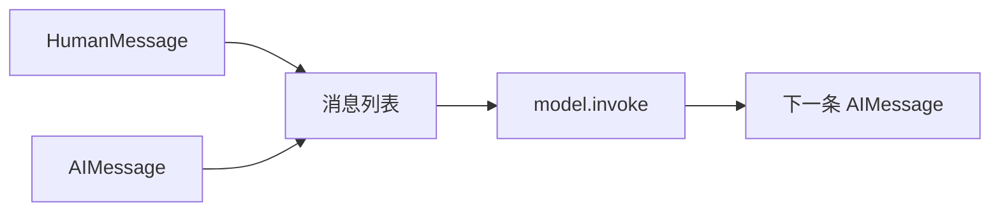

# 第2课 模型每次都失忆？用消息列表承载多轮上下文

上一节课我们用 `init_chat_model` 搭好了统一的模型调用入口，单轮一问一答已经能稳定跑通。但再多聊一轮就会露馅：每次调用模型都像开启全新对话，上一轮说过的内容，下一轮它就全忘了。

这节课就解决这一件事：模型为什么会“失忆”，把历史拼进字符串为什么撑不住，以及怎么用结构化的消息列表，让模型清晰、稳定地承接完整对话上下文。



---
## 先搞懂：为什么纯字符串撑不起多轮对话？
s01 里我们直接把字符串传给 `model.invoke()`，LangChain 会默认把它当成一条用户消息。这个便捷入口在本课之后也不会作废——字符串仍然可以直接传给 `model.invoke()`，等价于单条用户消息；但它只有“当前这一句”，天然没有历史对话的概念。

最直觉的补救是拼接：把之前的对话都塞进同一个字符串里，手动加上“用户：”“助手：”的前缀，再整体传给模型。这种办法偶尔也能出效果，但本质是靠文本内容去“暗示”模型身份，而不是协议层面的结构化约定。隐患非常明显：
- 身份没有强约束：模型可能误把前缀当成正文，也可能混淆发言角色，上下文越长越容易出错；
- 扩展性极差：后续要加系统规则、工具返回结果，都得继续往字符串里塞格式，越拼越乱，维护成本极高；
- 没有统一标准：不同模型对拼接格式的敏感度不一样，换模型很可能直接失效。

这条界线可以画得很清楚：
> 只要对话超过一轮，纯字符串就只是临时凑活的方案。结构化的消息列表，才是多轮对话的标准载体。

还不只是“能记住上文”这么简单。
所有后续的能力——系统提示、工具调用、多模态内容、记忆模块——全都建立在消息列表的基础上。把消息结构定下来，后面的扩展才能顺理成章。

---
## 最直接的拼接法，为什么不推荐？
还是会有人不服气：不就是区分身份吗？写个拼接函数，把历史对话按格式拼好，不也能用？

这个思路能解决最简单的场景，但它始终是脆弱的，就像用胶带把几张纸粘在一起当本子用，翻几次就散了：
第一，**格式容错率极低**。
多一个换行、少一个前缀，都可能让模型认错身份。一旦对话正文里本身出现了“用户：”“助手：”这样的字样，整个上下文的角色就全乱了。

第二，**扩展成本极高**。
今天只有用户和助手两种角色，拼接逻辑还简单。后面要加系统提示、加工具调用结果、加多模态内容，每加一种角色，就要改一次拼接规则，很容易出 bug。

第三，**不符合通用协议**。
现在主流大模型都遵循「消息列表+角色」的接口标准。自己拼接字符串，等于放着官方标准不用，重新造了一个不稳定的轮子。

所以正确的思路非常朴素：
> 不用靠文本暗示身份，给每一句话都配上明确的角色标签，组成结构化的消息列表。

我们接下来讲的两步实现，就是严格按照这个逻辑来的：先给每条消息标清身份，再整体交给模型处理。越靠前越基础，是整个对话系统的核心数据结构。

---
## 第一步：构造带角色标签的消息列表
就像聊天软件里每条消息都有发送人一样，结构化对话里的每一句话，也都自带明确的角色。

LangChain 里用两个最基础的消息类型来区分对话双方：
- `HumanMessage`：代表用户输入的内容
- `AIMessage`：代表模型返回的内容

每一条消息都是独立的对象，`content` 字段存放文本内容，角色（role）由类型本身决定，不需要写在正文里。

我们写一个函数来构造带历史的消息列表：
```python
def build_messages(question: str):
    return [
        HumanMessage(content="我正在学习 LangChain。"),
        AIMessage(content="很好，我们一次只学一个机制。"),
        HumanMessage(content=question),
    ]
```

逻辑非常简单：
- 前面两条是已经发生过的历史对话，用户与模型各一句；
- 最后一条是用户的新问题，也是模型本次要响应的输入。

这一步是多轮对话最核心的约定：
**所有上下文都以消息列表的形式存在，每条消息的角色由类型保证，不依赖文本格式。**
后面所有课程都会延续这个结构，只是不断增加新的消息类型而已。

---
## 第二步：传入消息列表，获取本轮回复
消息列表构造好之后，调用方式和 s01 几乎没有区别——同样用 `model.invoke()`，只是输入从字符串换成了消息列表。

```python
def continue_conversation(question: str, model=None) -> str:
    if model is None:
        model = init_chat_model(os.environ["LANGCHAIN_MODEL"])
    response = model.invoke(build_messages(question))
    return message_text(response)
```

逻辑也很直白：
- 传入构造好的消息列表，模型会完整读取所有历史上下文；
- 返回值仍然是标准的 `AIMessage` 对象，用 `message_text()` 提取文本的方式和上一课完全一致。

> 这一课真正值钱的不是“能发多条消息了”，而是**清晰的上下文边界**。哪句来自用户、哪句来自助手、哪句是当前问题，全部由消息类型明确界定。后面所有课程——系统规则、工具结果、跨轮记忆——本质上都是往这个消息列表里加入不同角色的新消息。

---
## 为什么消息列表是行业通用标准？
不是我们非要把简单的事情拆成对象，而是这套结构化的消息协议，是整个大模型对话体系的基础：
1.  **身份零歧义**：角色由消息类型保证，不会和正文内容混淆，模型永远不会认错说话人。
2.  **扩展性极强**：后续加入系统提示、工具调用、多模态内容，只需要新增对应的消息类型，不用改动已有的对话逻辑。
3.  **跨模型兼容**：主流大模型厂商都遵循「消息+角色」的接口规范，统一入口+消息列表的组合，能在不同模型间无缝切换。

这就像快递单上的收发件人信息，不是写在包裹内容里的备注，而是单独的结构化字段。分拣系统只需要读取字段就够了，不用拆开包裹猜里面写了什么。消息列表的角色标签，就是对话里的“快递单字段”。

---
## 动手试一试
现在你可以亲手跑一跑，看看消息列表是怎么承载上下文的。
先进入对应的文件夹运行程序：
```bash
cd learn-langchain
uv run python -m s02_messages.code
uv run pytest s02_messages/tests -q
```

### 实验1：查看消息列表的真实结构
在代码里打印 `build_messages("测试问题")` 的返回值，你会看到三条独立的消息对象，每条都有明确的类型和内容。
注意观察：角色信息是对象本身带有的，不是写在 `content` 文本里的。这就是结构化和字符串拼接最本质的区别。

### 实验2：修改历史内容，观察回复变化
把列表里第二条 `AIMessage` 的内容改成别的话，再用同一个问题提问，你会得到不同的回答。
这说明模型确实读取了历史上下文——它“记得”上一轮自己说过什么，历史变了，回答也会跟着变。

### 实验3：对比字符串输入的差异
可以试一下把同样的历史内容拼成一个纯字符串传给 `model.invoke()`，对比两种输入的回复效果。
多数简单场景下两者结果相近，但一旦对话变复杂、加入更多角色，结构化消息列表的稳定性会明显高于纯字符串拼接。

---
## 相对上一课的变化
s02 在 s01 的基础上只扩展了输入形式，核心的调用约定和返回类型完全保持不变。

| 维度 | s01 单轮调用 | s02 多轮调用 |
| --- | --- | --- |
| `invoke` 输入 | 裸字符串 | 结构化消息列表 |
| 用到的消息类型 | 仅返回 `AIMessage` | 显式构造 `HumanMessage` / `AIMessage` |
| 上下文能力 | 无，每次调用相互独立 | 显式携带历史对话，支持多轮接续 |
| 调用与返回约定 | `invoke(输入) → AIMessage` | `invoke(输入) → AIMessage`，约定不变 |

**本课新增的核心原语**：`HumanMessage` / `AIMessage`
**保持不变的基础约定**：`model.invoke()` 调用方式、`AIMessage` 返回对象、`message_text()` 文本提取。

---
## 检查点
学完本节，你应该能回答这几个问题：
- 打印 `build_messages()` 的返回值，能准确说出每条消息的类型和作用吗？
- 修改历史里的助手回答，同一个新问题会得到不同的回复，这是为什么？
- 为什么说拼接字符串实现多轮对话不是规范的做法？

---
## 本节课小结
这节课的核心道理就一条：
> 多轮对话的本质不是长文本拼接，而是给每一句话标清身份，用结构化的消息列表来承载上下文。

把字符串换成对象列表，改动很小，分量不小：对话从“临时凑活”走向了“标准可扩展”，后面所有的对话能力都有了统一的载体。

但现在还有个问题：像“你是什么角色”“回答要遵守什么规则”这类稳定的要求，只能塞进用户消息里反复说，不仅占地方，还容易被当成普通问题。下一节课，我们就给这类规则一个专门的位置。

进入下一课：[s03 系统提示 — 给模型定下稳定的行为规则](../s03_system_prompt/)
