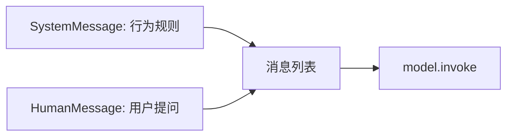

# 第3课 规则每次都要重写？用系统提示分离稳定约束与用户提问

上一节课我们用结构化的消息列表实现了多轮对话，模型终于能稳定承接上下文了。但你很快会遇到一个很别扭的问题：像“你是一个耐心的助教，回答要少用术语”这类角色设定与行为规则，每次提问都要重复说一遍，还只能塞进 `HumanMessage` 里，和用户的实际问题混在一起。
这节课就给这类内容找一个正式的家：为什么规则不能和提问混放？以及怎么用专属的消息类型，把稳定不变的行为约束和每次变化的用户提问清晰分开。



---
## 先搞懂：规则混在提问里有什么问题？
s02 里我们所有对话内容都用 `HumanMessage` 和 `AIMessage` 承载，角色设定、行为规则这类内容，也只能塞进用户消息里。这种写法在单一场景下能跑通，但本质是把两种完全不同性质的内容揉在了一起。

具体来说有三个明显的问题：
- **语义边界模糊**：模型没法明确区分“这是需要遵守的规则”和“这是用户的问题”，有时会把规则当成提问内容来回应，规则的引导权重也不稳定。
- **重复冗余严重**：每一次提问都要带上一遍规则，既占用上下文空间，又容易出现漏写、写错的情况。
- **维护成本很高**：规则一旦要调整，所有调用的地方都要逐一修改，很容易出现不一致。

判断标准同样清晰：
> 只要规则是稳定复用的，混在用户提问里就只是权宜之计。给规则一个专属的位置，才是规范的做法。

而且这件事的意义超出“方便维护”：把规则和提问分层，是整个提示工程的基础。后面的模板、工具、Agent 逻辑，全都建立在“系统提示管规则，用户消息管任务”的分层约定之上。

---
## 直接拼在问题前面，为什么不是长久之计？
有一个看起来等价的做法：把规则拼在用户问题的最前面，让模型先看到规则，效果不就一样了？

这个思路能实现基础的效果，但它始终是脆弱的，就像把说明书直接写在作业本上，每次写作业都要抄一遍，还容易和题目混在一起：
第一，**引导强度不足**。
混在用户消息里的规则，模型会把它当成用户输入的一部分，而不是全局约束。对话越长、用户内容越多，前面的规则就越容易被忽略。
第二，**复用效率极低**。
同一个规则要在多个地方使用时，只能复制粘贴。一旦要修改，就要改所有地方，很容易出现版本不一致。
第三，**浪费了结构化协议的价值**。
主流大模型原生就支持专门的系统角色，就是用来承载全局规则的。放着标准协议不用，硬靠文本拼接实现，等于退回到了非结构化的写法。

出路也很直接：
> 不同作用的内容，对应不同的消息类型。稳定的规则交给专门的系统消息，和用户提问彻底分开。

下面的两步就是这么拆的：先定义稳定的规则消息，再和用户提问组合成完整上下文。

---
## 第一步：用 SystemMessage 承载稳定规则，放在列表首位
就像正式文件里，总则永远放在最前面一样，对话里的全局规则，也应该用专属的消息类型，放在上下文的最开头。

LangChain 里提供了 `SystemMessage` 专门用来做这件事：它属于消息列表的一部分，内容通常是角色设定、回答边界、输出风格这类稳定不变的约束。模型会优先接收这部分信息，再处理后续的用户提问。

我们写一个函数来构造带角色规则的消息列表：
```python
def build_role_messages(question: str, role: str, style: str):
    return [
        SystemMessage(content=f"你是{role}。回答风格：{style}。"),
        HumanMessage(content=question),
    ]
```

逻辑非常简单：
- 列表第一条是 `SystemMessage`，存放稳定的角色与规则；
- 后面跟上 `HumanMessage`，存放用户本轮的具体问题。

这里有一个约定要说明：LangChain 本身并不强制系统消息必须放在第一位，但放在列表首位是行业通用的最佳实践，既符合人类的阅读逻辑，也和绝大多数模型的处理习惯对齐。

这一步是提示分层最核心的约定：
**稳定规则归系统消息，动态提问归用户消息，权责清晰，互不混淆。**
后面所有课程都会延续这个分层方式，只是不断丰富规则和提问的内容。

---
## 第二步：组合消息列表，按原约定发起调用
消息列表构造好之后，调用方式和前两课完全一致——同样用 `model.invoke()`，输入是消息列表，返回值仍然是标准的 `AIMessage` 对象。

```python
def ask_with_role(question: str, role: str, style: str, model=None) -> str:
    if model is None:
        model = init_chat_model(os.environ["LANGCHAIN_MODEL"])
    response = model.invoke(build_role_messages(question, role, style))
    return message_text(response)
```

逻辑也很直白：
- 把包含系统提示和用户问题的消息列表传给模型；
- 模型读取规则后响应用户问题，返回结果的提取方式和之前完全相同。

> 这一课立起来的是**清晰的行为规则边界**：稳定的角色、约束、风格放进 `SystemMessage`，每次变化的具体提问放进 `HumanMessage`。有一点需要明确：系统提示不是权限系统，它不能百分百锁死模型的行为，本质上仍然是模型上下文中的一部分，只是权重更高的引导信息。

---
## 为什么这层分离至关重要？
不是我们非要多拆一种消息类型，而是这层分离，直接划定了“稳定约束”和“动态任务”的边界：
1.  **引导更稳定**：模型原生识别系统角色的全局约束属性，规则的生效效果比混在用户消息里更可靠。
2.  **维护更高效**：同一条规则可以在多处复用，修改时只需要改一处，就能全局生效。
3.  **结构更清晰**：不同性质的内容各司其职，后续扩展模板、工具、记忆模块时，分层逻辑不会乱。

这就像公司里的规章制度和具体工作任务：制度统一发布、全员遵守，任务单独下发、各有不同。如果把制度写在每一张任务单里，既冗余又容易走样。系统提示和用户消息的分离，就是在对话里做同样的权责划分。

> 补充说明：不同模型厂商对系统消息的支持程度略有差异，个别模型可能会将系统消息转译为特殊格式的用户消息。但在 LangChain 的统一接口下，你只需要按标准写法使用 `SystemMessage` 即可，底层差异由框架统一适配。

---
## 动手试一试
现在你可以亲手跑一跑，看看系统提示是怎么影响模型行为的。
先进入对应的文件夹运行程序：
```bash
cd learn-langchain
uv run python -m s03_system_prompt.code
uv run pytest s03_system_prompt/tests -q
```

### 实验1：切换角色，观察回答风格变化
保持同一个问题，只修改 `SystemMessage` 里的角色参数，比如分别设置为“初中老师”和“后端工程师”，对比两次的回答结果。
你会发现回答的深度、用词、视角都会发生明显变化——这就是系统提示在引导模型的行为模式。

### 实验2：调整消息位置，验证最佳实践
可以试着把 `SystemMessage` 移到消息列表的最后面，再运行同样的问题，对比和放在首位的效果差异。
多数场景下放在首位的引导效果更稳定，这也是行业默认将系统提示放在开头的原因——它不是框架的强制校验，而是经过验证的最佳实践。

### 实验3：离线测试验证消息结构
运行测试用例，观察 fake model 的校验逻辑。
离线测试只会验证消息列表的结构是否正确、调用通路是否通顺，不会真实判断角色引导的效果。要验证实际的回答差异，需要运行接入真实模型的示例。

---
## 相对上一课的变化
s03 在 s02 的基础上只新增了一种消息类型，核心的调用约定与返回结构完全保持不变。

| 维度 | s02 基础多轮 | s03 规则分离 |
| --- | --- | --- |
| 类型契约 | 消息列表 → `AIMessage` | 消息列表 → `AIMessage`，约定不变 |
| 消息组成 | 仅 `HumanMessage` / `AIMessage` | 新增 `SystemMessage`，通常置于列表首位 |
| 规则存放方式 | 塞进 `HumanMessage` 重复携带 | 独立为 `SystemMessage`，全局复用 |
| 稳定内容与动态内容 | 混合在同一种消息里 | 按消息类型明确分离 |

**本课新增的核心原语**：`SystemMessage`
**保持不变的基础约定**：消息列表结构、`model.invoke()` 调用方式、`AIMessage` 返回对象、`message_text()` 文本提取。

---
## 检查点
学完本节，你应该能回答这几个问题：
- `SystemMessage` 和 `HumanMessage` 在作用上有什么核心区别？
- 能用同一个问题，分别构造“老师视角”和“工程师视角”的消息列表吗？
- 为什么说系统提示不是权限系统，只是上下文的一部分？

---
## 本节课小结
这节课把一条分层原则定了下来：
> 性质不同的内容要分层管理。稳定的规则用专属的消息类型承载，不要和动态的用户提问混在一起。

新增的只是一种消息对象，但从此“模型该怎么回答”和“模型要回答什么”有了各自的位置——提示从“能用”走向“规范”，就是从这层边界开始的。

但现在系统提示和用户问题里的内容还都是写死的字符串。一旦里面出现主题、对象、风格这类每次都变的变量，纯手写拼接很容易出错。下一节课，我们就用提示模板来管理这些动态变量。

进入下一课：[s04 提示模板 — 用模板管理动态提示变量](../s04_prompt_template/)
