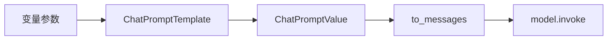

# 第4课 提示全靠手写拼接？用模板分离骨架与变量

上一节课我们用 `SystemMessage` 把稳定规则和用户提问分离开，提示的结构终于清晰了。但你很快会遇到新的问题：提示里的角色、主题、受众这些内容每次都在变化，全靠手写字符串拼接，变量多了很容易出错，也很难复用。
这节课就来收拾这种“散装提示”：为什么手写拼接是脆弱的方案？以及怎么用提示模板，把不变的提示骨架和每次变化的变量分开管理。



---
## 先搞懂：手写拼接提示有什么问题？
s03 里的系统提示和用户提问都是写死的字符串。但在真实场景里，提示内容往往包含大量动态参数：系统提示里的 `{role}`、用户提问里的 `{topic}` 和 `{audience}`，每次调用都不一样。

用 f-string 直接拼当然最顺手，简单场景下也确实能用，但这种写法有三个很隐蔽的问题：
- **错误难以发现**：变量未定义会抛出 `NameError`，但如果只是忘了写前缀 `f`，占位符会作为普通文本原样发给模型，程序不会报错，线上问题往往要很久才能发现。
- **变量分散难维护**：变量名、固定文案散落在多段字符串里，没有统一的地方能看清一次调用到底依赖哪些变量，修改和排查都很麻烦。
- **骨架无法复用**：同样的提示结构换个场景就要重新写一遍，很容易出现格式不一致、规则遗漏的情况。

把标准说破也就一句话：
> 只要提示里存在可变参数，手写字符串拼接就只能撑住一时。把固定骨架和动态变量分离，才是可维护的做法。

省下的也不只是几行代码：模板化是提示工程的基础。后续的少样本示例、动态消息组合、多语言提示，全都建立在“骨架与数据分离”的基础之上。

---
## 纯 f-string 拼接，为什么走不远？
也许你会想：不就是替换几个变量吗，f-string 完全够用，没必要多套一层模板。

这个思路能解决最简单的替换场景，但它本质上还是“骨架和变量混在一起”的写法，就像每次打印文档都手动改内容再打印，没有固定的底稿，出错率会随着复杂度上升快速增加：
第一，**没有统一的校验机制**。
漏传变量、变量名拼写错误，要么静默失败（忘写 f 前缀），要么零散地抛出运行时错误，没有一个统一的入口做参数校验。
第二，**结构与数据强耦合**。
提示的结构（几条消息、分别是什么角色）和变量赋值混在业务代码里，想复用同一个提示骨架，就得连赋值逻辑一起复制，很容易出现版本不一致。
第三，**扩展能力非常有限**。
后续要加入少样本示例、条件分支消息、多模态内容，纯字符串拼接的逻辑会越来越臃肿，维护成本指数级上升。

真正的解法是换一种切分方式：
> 把固定的提示结构抽成可复用的骨架，把动态内容作为变量单独传入，两者彻底分开管理。

对应到代码里就是两步：先定义提示骨架，再填充变量生成标准消息列表。

---
## 第一步：用 `ChatPromptTemplate` 定义消息骨架
就像标准化的填空答题卡，题目和格式是固定的，每次只需要填写答案。提示模板就是对话的“答题卡”：消息的角色、固定文案、占位位置都提前定义好，使用时只需要传入变量值。

LangChain 里用 `ChatPromptTemplate.from_messages()` 来定义对话模板，接收一组 `(角色, 文案)` 元组，文案里用 `{变量名}` 的形式做占位。角色用字符串声明，模板会自动转换成对应的消息对象，不需要手动构造。

```python
PROMPT = ChatPromptTemplate.from_messages(
    [
        ("system", "你是{role}。回答要{style}。"),
        ("human", "请向{audience}解释：{topic}"),
    ]
)
```

逻辑非常清晰：
- 模板一次性定义好所有消息的角色、固定文案和变量占位符；
- 所有需要外部传入的变量都集中在模板里，一目了然。

这一步是提示复用最核心的约定：
**骨架只定义一次，可在多处反复调用；变量作为输入单独传递，与结构完全解耦。**
后面所有涉及提示构造的场景，都会沿用这种模板化的方式。

---
## 第二步：传入变量，生成标准消息列表
模板定义完成后，调用时只需要传入变量字典，模板会自动完成填充，生成最终的消息列表。

```python
def build_messages(topic: str, audience: str, role: str, style: str):
    prompt_value = PROMPT.invoke(
        {"topic": topic, "audience": audience, "role": role, "style": style}
    )
    return prompt_value.to_messages()
```

执行过程分为两步：
1.  调用 `prompt.invoke(变量字典)` 完成填充，得到 `ChatPromptValue` 中间对象；
2.  调用 `.to_messages()` 转换成我们熟悉的 `SystemMessage` / `HumanMessage` 列表，和 s02/s03 手动构造的消息列表完全等价。

补充说明：`ChatPromptValue` 可以直接传给 `model.invoke()`，不需要显式调用 `.to_messages()`。本课特意保留这一步，是为了让你看清模板的本质——它最终输出的仍然是标准消息列表，只是把手动拼接字符串的过程，替换成了结构化的模板填充。

> 模板真正带来的是**骨架与变量的分离**：固定结构一次编写、多处复用；变量集中校验，漏传会在模板阶段直接报错，不会带着占位符发到模型侧，从根源上避免静默错误。

---
## 为什么这层分离至关重要？
不是我们非要多引入一层模板，而是骨架与变量的分离，直接解决了提示构造的三个核心痛点：
1.  **可维护性强**：所有提示结构集中管理，修改文案、调整消息顺序，只需要改模板一处，全局自动生效。
2.  **可靠性更高**：变量缺失、拼写错误会在模板填充阶段抛出明确错误，不会把带占位符的异常提示发给模型，大幅降低线上静默故障的概率。
3.  **复用性更好**：同一个模板可以在不同函数、不同业务场景里调用，保证提示规则和格式的一致性。

这就像企业里的公文模板：模板的格式、固定条款是统一的，每次发文只需要填写具体事由和对象。不用每次写公文都从头起草，既高效又能保证规范统一。

---
## 动手试一试
现在你可以亲手跑一跑，看看提示模板是怎么工作的。
先进入对应的文件夹运行程序：
```bash
cd learn-langchain
uv run python -m s04_prompt_template.code
uv run pytest s04_prompt_template/tests -q
```

### 实验1：漏传变量，观察校验报错
故意漏掉一个变量（比如不传 `audience`），运行代码，观察 LangChain 是否会抛出明确的错误。
对比 f-string 忘写 f 前缀的静默错误，体会模板集中校验的价值——问题在调用模型之前就暴露出来，不会带着错误内容请求模型。

### 实验2：打印模板输出，观察消息结构
先打印 `build_messages()` 的返回值，再调用模型。
观察模板生成的消息列表，和前两课手动构造的消息列表对比——两者结构完全一致。模板只是替代了手动拼接的过程，最终喂给模型的仍然是标准的消息对象。

### 实验3：新增变量，扩展模板
在系统提示里新增一个 `{tone}` 变量，调整对应的文案，然后更新调用代码，验证能否正常生成新的消息列表。
感受模板扩展的便捷性：只需要改模板定义和传参两处，不需要调整消息构造的逻辑。

---
## 相对上一课的变化
s04 在 s03 的基础上升级了提示的构造方式，最终输出和调用约定完全保持不变。

| 维度 | s03 手写消息 | s04 模板生成 |
| --- | --- | --- |
| 喂给模型的内容 | 手动构造的消息列表 | 模板生成的消息列表，格式完全一致 |
| 消息构造方式 | 手写 `SystemMessage` / `HumanMessage` | `ChatPromptTemplate` 填充变量自动生成 |
| 变量管理 | f-string 分散在代码中，无统一校验 | 模板集中声明变量，漏传时 `invoke` 阶段报错 |
| 角色管理 | 手动指定消息类型 | 模板内部统一管理 |
| 最终输出 | 消息列表 | 仍是标准消息列表（`to_messages()`） |

**本课新增的核心原语**：`ChatPromptTemplate` / `from_messages` / `to_messages()`
**保持不变的基础约定**：最终产出标准消息列表喂给 `model.invoke()`，消息类型、调用方式、返回对象均无变化。

---
## 检查点
学完本节，你应该能回答这几个问题：
- 能指出模板定义里所有的变量名吗？
- 故意漏传一个变量，能复现 LangChain 的报错吗？
- 能在模板里新增一个 `tone` 变量，并更新对应测试用例吗？

---
## 本节课小结
这节课沉淀下来的认识是：
> 提示的本质是「固定结构 + 动态变量」，把骨架抽成模板单独管理，数据与结构解耦，才能兼顾复用性和可靠性。

从手写拼接到模板管理，表面上是换了个写法，实际上是把提示纳入了工程化轨道。有了模板化的输入管理，后续再复杂的提示结构都能有序扩展。

到目前为止，我们已经稳稳地控制了输入侧——消息、系统提示、模板变量都有了规范的管理方式。但模型返回的还都是自由文本，程序要从中提取信息只能靠正则匹配，非常脆弱。下一节课，我们反过来控制输出，让模型直接返回程序可以直接使用的结构化对象。

进入下一课：[s05 结构化输出 — 让模型返回可直接使用的对象](../s05_structured_output/)
