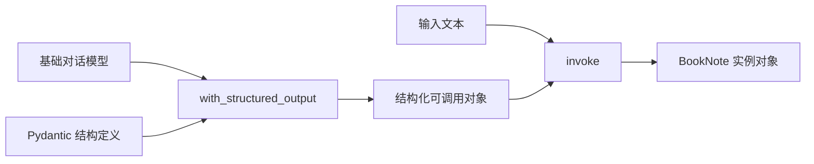

# 第5课 输出全靠正则解析？用结构化输出让模型返回程序可读对象

上一节课我们用提示模板实现了输入侧的骨架与变量分离，提示的构造已经规范可控。但你很快会遇到输出侧的头疼问题：模型返回的始终是自由文本，想从中提取固定字段，只能靠正则或者字符串分割，只要模型的表述稍有变化，解析逻辑就会失效。
这节课换到输出侧来立规矩：为什么自由文本对程序来说是噩梦？以及怎么用预先定义的结构契约，让模型直接返回程序可读取、可验证的结构化对象。



---
## 先搞懂：自由文本输出为什么是程序的噩梦？
前四课我们把输入侧打磨得越来越规范，但输出侧始终停留在“自然语言”阶段。对人来说，自由文本读起来很自然；但对程序来说，自由文本意味着没有标准、没有约定，解析起来非常脆弱。

最典型的场景就是信息提取：你想让模型从一段材料里抽出书名、摘要、标签，结果它今天返回“书名：xxx，标签：a, b”，明天返回“标题是 xxx，tags: [a,b]”，格式完全不固定。具体来说有三个核心痛点：
- **格式不稳定**：模型的表达是自由的，没有强制约束的情况下，输出格式千变万化，解析逻辑永远追不上表述变化。
- **没有类型保障**：返回的内容全是字符串，该是数字的字段可能返回了文字，该是列表的字段可能拼成了一句话，程序还要额外做类型转换和校验。
- **扩展成本极高**：每新增一个提取字段，就要新增一套解析规则，字段越多，解析逻辑越臃肿，维护成本指数级上升。

边界在这里：
> 只要输出结果需要程序自动处理，自由文本就永远是临时方案。程序和模型之间，必须有一份明确的输出结构契约。

还不只是省掉正则这么简单。
输入可控、输出可验证，是所有自动化大模型应用的基础。在让模型自主执行动作之前，必须先把输出的边界立住，不然后续的工具调用、流程编排都会因为格式不稳定而失控。

---
## 纯正则解析，为什么走不远？
先看看土办法能走多远：不就是提取字段吗，写几条正则、多做几层字符串分割，也能凑合用。

这个思路能解决最简单的固定场景，但它本质上是让程序去适配模型的自由输出，就像去接一个形状每次都变的积木，接得住这次接不住下次：
第一，**覆盖能力极其有限**。
正则只能匹配预设的格式，模型的表达方式稍有变化，比如换个关联词、调整一下语序，解析就会直接失败。想覆盖所有变体，工作量会大到不现实。
第二，**没有原生类型校验**。
正则只能匹配文本形态，没法保证字段的类型正确性。比如要求返回数字列表，结果模型返回了文字描述，正则匹配不出来，还要额外写校验逻辑兜底。
第三，**维护成本随复杂度飙升**。
每加一个字段、改一条规则，就要调整整套解析逻辑，很容易出现改一处崩一片的情况，越往后越难维护。

方向要反过来：
> 不是让程序去适配模型的自由输出，而是预先定义好结构契约，让模型直接按约定的格式返回结果。

顺着这个方向，两步就够了：先定下结构契约，再让模型按契约输出，程序直接拿结果。

---
## 第一步：用 Pydantic 定义输出结构契约
就像做数据报表先画好表格，规定每一列的名称、数据类型和填写说明。模型只需要按表格填空，不用自己决定格式和表述方式。

在 LangChain 体系里，我们用 Pydantic 的 `BaseModel` 来定义这份契约：继承 `BaseModel` 声明一个类，每个字段指定明确的类型，再通过 `Field` 的 `description` 参数说明字段含义。注意，`description` 不是给开发者看的注释，是会传给模型、指导它正确填充内容的关键说明。

```python
class BookNote(BaseModel):
    title: str = Field(description="书名或材料标题")
    summary: str = Field(description="一句话摘要")
    tags: list[str] = Field(description="主题标签")
```

逻辑非常清晰：
- 类名代表输出的整体含义，这里是“读书笔记”；
- 每个字段有确定的类型，比如字符串、字符串列表；
- 每个字段附带描述，告诉模型这个位置该填什么内容。

这一步是结构化输出最核心的约定：
**契约先于调用，字段、类型、语义全部提前明确，模型负责填空，程序负责直接使用。**
后续所有需要程序自动处理的模型输出，都会沿用这种先定义 schema 的方式。

---
## 第二步：包装模型，直接返回结构化对象
契约定义好之后，不需要自己写提示引导模型输出 JSON、再手动做解析。LangChain 提供了 `with_structured_output()` 方法，把基础对话模型和结构 schema 绑定，直接得到一个结构化的可调用对象。

```python
def extract_book_note(text: str, model=None) -> BookNote:
    if model is None:
        model = init_chat_model(os.environ["LANGCHAIN_MODEL"])
    structured_model = model.with_structured_output(BookNote)
    return structured_model.invoke(f"请把下面材料整理成结构化读书笔记：\n{text}")
```

执行逻辑也很直白：
- 调用方式仍然是 `.invoke()`，和之前的调用习惯完全一致；
- 返回值不再是 `AIMessage` 对象，而是直接返回填充好的 `BookNote` 实例，可以直接通过属性访问字段，也可以用 `.model_dump()` / `.model_dump_json()` 一键转成字典或 JSON。

> 这一课要带走的不是“会定义 Pydantic 类”，而是**输出结构可验证、字段类型可保证**。返回的对象可以直接落库、传给下游服务，不用再写正则做文本解析。
>
> 有两点需要明确：一是字段的 `description` 是引导模型理解语义的，不是硬校验规则，如果需要严格的数值范围、格式约束，还要依靠 Pydantic 本身的校验能力；二是不同模型厂商对结构化输出的底层支持略有差异，但 `with_structured_output` 是统一的上层接口，你的代码只需要依赖这份契约。

---
## 为什么结构化输出是 Agent 的前置基础？
不是我们非要按这个顺序讲，而是“输入可控、输出可验证”是所有自动化流程的前提。
如果模型输出的格式都不稳定，后续的工具调用、逻辑判断、流程编排全都无从谈起——程序连模型返回了什么都没法准确识别，更别说让它自主执行任务了。先把输入输出两侧的边界都立住，再让模型去执行动作，整个系统才不会失控。

这就像工厂流水线，得先规定好每个工位的输入输出标准，后面的自动化设备才能正常运转。如果上一个工位送过来的东西形状每次都变，下一个工位根本没法自动加工。

---
## 动手试一试
现在你可以亲手跑一跑，看看结构化输出是怎么工作的。
先进入对应的文件夹运行程序：
```bash
cd learn-langchain
uv run python -m s05_structured_output.code
uv run pytest s05_structured_output/tests -q
```

### 实验1：观察返回值的真实类型
运行代码，打印返回结果的类型，对比之前的 `AIMessage`。
尝试直接访问 `.title`、`.tags` 等属性，再调用 `.model_dump_json()` 输出 JSON 字符串。
体会和自由文本的核心区别：不需要任何文本解析，直接就能拿到结构化的数据。

### 实验2：调整字段描述，观察填充质量
修改某个字段的 `description`，比如写得更模糊或者更具体，对比两次返回的内容质量差异。
理解 `description` 的作用：它是给模型的填写说明，描述越清晰、越准确，模型填充的准确率就越高。

### 实验3：新增字段，扩展输出结构
在 `BookNote` 里新增一个 `difficulty` 字段（难度等级），补充对应的 description，运行代码验证能否正常返回新字段。
体会结构化输出的扩展便捷性：加字段只需要改 schema 定义，不需要改动任何解析逻辑。

---
## 相对上一课的变化
s05 在 s04 的基础上升级了输出侧的能力，底层的基础模型与调用约定保持延续。

| 维度 | s04 模板输入 | s05 结构化输出 |
| --- | --- | --- |
| 调用与类型契约 | `model.invoke(消息)` → `AIMessage` | `structured_model.invoke(输入)` → Pydantic 对象 |
| 控制方向 | 控制输入侧（提示结构） | 控制输出侧（返回结构） |
| `invoke` 返回值 | `AIMessage` 消息对象 | 自定义 Pydantic 实体对象 |
| 程序取值方式 | 通过 `message_text` 提取文本，再自行解析 | 直接访问对象属性 / 调用 `model_dump` 导出 |

**本课新增的核心原语**：`with_structured_output` / Pydantic `BaseModel`
**保持不变的基础约定**：基于统一的 chat model 实例，调用方式延续 `.invoke()` 风格。

---
## 检查点
学完本节，你应该能回答这几个问题：
- 结构化 schema、字段类型和自由文本输出的核心差别是什么？
- 能在 `BookNote` 里新增一个 `difficulty` 字段，并同步更新测试用例吗？
- 为什么结构化输出要放在 Agent 相关内容之前学习？

---
## 本节课小结
这节课做的事一句话能说完：
> 程序和模型之间要有明确的输出契约。先定好结构与类型，让模型按契约返回，而不是让程序靠正则去猜自由文本。

看起来只是多了一个 schema 定义，背后却是从“模型输出给人看”到“模型输出给程序用”的关键转变。输入可控、输出可验证，这是所有自动化大模型应用的基础。

到目前为止，输入输出两侧我们都已经规范好了，但模型还只能“输出内容”，没有实际执行的能力——它算不出一个字符串有多少个字符，也没法读取本地文件。下一节课，我们就给模型加上可执行的能力：把 Python 函数变成模型可以调用的工具。

进入下一课：[s06 第一个工具 — 把 Python 函数交给模型调用](../s06_first_tool/)
