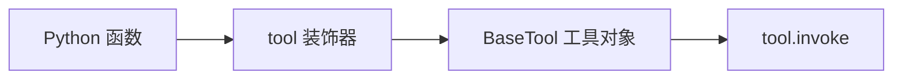

# 第6课 模型只会说不会做？用工具封装确定性执行逻辑

上一节课我们用结构化输出搞定了输出侧的契约，输入可控、输出可验证，模型和程序之间的交互终于稳定下来了。但你很快会发现一个本质局限：模型从头到尾都只会“生成内容”，没有真正的执行能力。你让它数一句话有几个词，它看似给出了答案，其实是猜的——它没有真的去数，只是凭语言习惯生成了一个看起来合理的数字。
这节课就从这道边界下手：为什么模型不擅长确定性计算？以及怎么用一套标准的工具协议，把普通的 Python 函数包装成模型可识别、可调用的能力，让“生成”与“执行”接上头。



---
## 先搞懂：模型为什么“会说不会做”？
前五节课我们一直在和模型的“生成能力”打交道：给它输入，它返回文本。很多人会下意识地觉得，模型既然这么聪明，算数、统计、查资料肯定也不在话下。

但事实恰恰相反：大模型的核心能力是语言理解与生成，对于精确计算、确定性逻辑，它天生不擅长。具体来说有三个本质问题：
- **结果不可靠**：模型给出的计算结果是“生成”出来的，不是“算”出来的。简单的问题可能蒙对，稍微复杂一点就很容易出错，而且你没法预判它什么时候会错。
- **成本不划算**：一个几行代码就能秒算的逻辑，交给模型生成既费 token 又费时间，性价比极低。
- **能力有边界**：模型本身读不了本地文件、调不了接口、操作不了数据库——所有需要和真实世界交互的逻辑，它都碰不到。

分工原则由此而来：
> 只要涉及确定性执行，就不该让模型自己来做。把确定的逻辑写成函数，再让模型在需要的时候调用它，才是正确的分工。

这背后还有更长远的一层：“模型负责判断，工具负责执行”是 Agent 系统的核心分工原则。这一课我们先把“工具”这个零件造出来，下一课再让模型自己决定什么时候用它。

---
## 直接把函数传给模型？为什么走不通
容易想到的捷径是：把函数名和用法写在提示里，让模型输出参数，我再手动调用——这不就等于模型会用函数了？

这个思路能跑通最简单的场景，但它本质上是“用自然语言描述接口”，和手写正则解析输出一样脆弱：
第一，**没有标准协议**。
工具叫什么、要传什么参数、分别是什么类型，全靠提示里的文字描述，工具多了很容易写漏、写错，模型也很容易理解偏差。
第二，**没有统一约定**。
每个工具的调用方式都不一样，参数校验、错误处理都要自己写一遍，工具越多，重复劳动越多。
第三，**扩展性很差**。
后续要加工具选择、多轮调用、错误重试，都要在业务代码里堆逻辑，很快就会乱成一团。

该做的事其实是标准化：
> 不是用自然语言给模型念说明书，而是把函数包装成带标准元数据的工具对象——有名字、有描述、有明确的参数 schema，模型能看懂，程序能执行。

LangChain 的设计思想也正在于此：所有可调用的组件都遵循统一的协议。模型是这样，工具也是这样，后面的链、Agent 全都是这样。

---
## 第一步：用 `@tool` 装饰器，把普通函数变成标准工具
就像货物要先装进标准集装箱，码头的吊机和货轮才能统一装卸。普通的 Python 函数，要先包装成标准的工具对象，模型才能识别它、调用它。

LangChain 提供了 `@tool` 装饰器来做这件事。你只需要给函数加上这个装饰器，它就会自动读取三样东西，生成完整的工具元数据：
1.  **函数名**：作为工具的名称，模型靠它识别不同工具；
2.  **参数签名**：提取参数名和类型注解，生成参数 schema；
3.  **docstring**：作为工具的功能描述，模型靠它判断“什么时候该用这个工具”。

```python
@tool
def count_words(text: str) -> str:
    """统计输入文本中按空白分隔的词数。"""
    words = [word for word in text.split() if word]
    return f"词数：{len(words)}"
```

这里有一个初学者最容易踩的坑：**docstring 不是给人看的注释，它是给模型看的工具说明书**。写得清不清楚，直接决定了模型会不会用、用得对不对。后面讲到 Agent 的时候你会发现，很多“模型不会调用工具”的问题，根源都是 docstring 写得太模糊。

如果工具参数比较多，还可以开启 `parse_docstring=True`，它会解析 Google 风格的 docstring，给每个参数都配上独立的描述：
```python
@tool(parse_docstring=True)
def search(query: str, limit: int) -> str:
    """搜索资料。
    Args:
        query: 搜索关键词。
        limit: 返回结果数量。
    """
    ...
```

这一步是工具体系最核心的约定：
**函数只管写业务逻辑，工具元数据由装饰器自动生成。描述、名称、参数 schema 全部标准化，模型和程序都能读懂。**

---
## 第二步：用统一的 `invoke` 方式调用工具
被 `@tool` 装饰之后，`count_words` 就不再是一个普通函数了，它变成了一个 `BaseTool` 工具对象。调用它的方式也从直接传参，变成了 `.invoke(参数字典)`。

```python
def run_count_words(text: str) -> str:
    return count_words.invoke({"text": text})
```

调用逻辑非常简单：
- 传入一个字典，key 是参数名，value 是参数值；
- 工具内部会先按 schema 校验参数，再执行底层的函数逻辑，最后返回执行结果。

你应该已经注意到了：工具的调用方式和模型完全一样，都是 `.invoke()`。这正是 LangChain 非常重要的一个设计思想——**统一可调用约定**。
不管是模型、工具、提示模板，还是后面的链、检索器，只要是可调用的组件，都遵循同一套调用接口。你不用记每种组件各自的调用方法，记住 `invoke` 就够了。

> 这一课的分量不在装饰器本身，而在**能力边界的第一次扩展**：原本只能生成文本的模型，从此可以通过标准化的工具协议，触达确定性的执行逻辑。
>
> 但要特别说明：这一课的工具还是我们手动调用的，模型还不会自己判断什么时候该用。“自主判断、自主循环调用”是下一课 Agent 的能力；这一课我们只负责把工具这个标准化零件造出来。

---
## 为什么要多一层工具对象？
到这里你可能还剩最后一个疑问：不就是调用个函数吗，为什么非要多套一层工具对象，直接用函数不行吗？

这层包装的价值，恰恰在于它建立了模型和执行逻辑之间的标准协议：
1.  **模型可理解**：工具自带名称、功能描述、参数说明，模型能看懂它是做什么的、该怎么传参，不需要我们额外写提示。
2.  **程序可校验**：调用前自动校验参数类型，不符合 schema 直接报错，不用在函数里自己写校验逻辑。
3.  **组件可组合**：因为遵循统一的 `invoke` 约定，工具可以和模型、模板、链自由组合，不用做额外的适配。

这就像集装箱改变航运：货物本身千差万别，但只要装进标准箱，吊机、货轮、卡车就能不加区分地处理。工具对象就是函数的标准集装箱，让它可以无缝接入 LangChain 的整个组件生态。

---
## 动手试一试
现在你可以亲手跑一跑，看看工具是怎么定义和调用的。
先进入对应的文件夹运行程序：
```bash
cd learn-langchain
uv run python -m s06_first_tool.code
uv run pytest s06_first_tool/tests -q
```

### 实验1：调用工具，验证确定性结果
运行 `count_words.invoke({"text": "hello world this is a test"})`，观察返回结果。
多试几次不同的输入，体会它和模型的区别：工具的结果是确定性的，同样的输入永远返回同样的答案，不会猜，也不会变。

### 实验2：查看工具的元数据
分别打印 `count_words.name`、`count_words.description`、`count_words.args`。
观察这三样东西分别对应函数里的什么内容——函数名变成了工具名，docstring 变成了工具描述，参数注解变成了 JSON schema。
这三样就是下一课模型判断“要不要用、怎么传参”的全部依据。试着把 docstring 改得模糊一点，想象一下模型看到这样的描述会是什么效果。

### 实验3：新增一个自定义工具
参照 `count_words` 的写法，新增一个 `count_characters` 工具，用来统计字符数量。
写好函数、加上 `@tool` 装饰器、写清楚 docstring，然后调用它验证结果。体会工具扩展的便捷性——只需要写业务逻辑，剩下的元数据和调用协议都由框架处理。

---
## 相对上一课的变化
s06 引入了全新的“工具”组件，但在调用约定上和之前的体系完全对齐。

| 维度 | s05 结构化输出 | s06 第一个工具 |
| --- | --- | --- |
| 核心组件 | chat model | BaseTool 工具对象 |
| 调用约定 | `.invoke(输入)` | `.invoke(参数字典)`，约定统一 |
| 返回结果 | Pydantic 结构化对象 | 工具执行结果字符串 |
| 模型角色 | 生成结构化输出 | 本课不参与执行，只定义工具零件 |
| 能力属性 | 生成能力 | 确定性执行能力 |

**本课新增的核心原语**：`@tool` 装饰器 / `BaseTool.invoke`
**保持不变的基础约定**：`invoke` 统一调用接口；底层执行逻辑仍来自普通 Python 函数。

---
## 检查点
学完本节，你应该能回答这几个问题：
- 能独立调用 `count_words.invoke({"text": "..."})` 并拿到正确结果吗？
- 为什么说 docstring 不是普通注释，而是工具说明的一部分？
- 能新增一个 `count_characters` 工具，并让它正常工作吗？

---
## 本节课小结
这节课定下的是一条分工原则：
> 模型负责判断与生成，工具负责确定性执行。用标准的工具协议把两者打通，而不是让模型硬做它不擅长的事。

一个装饰器，承载的是 LangChain 很核心的设计思想：统一的组件协议，清晰的能力边界。有了标准化的工具，模型才能真正具备“做事”的能力。

现在工具已经造好了，但目前还是我们手动在调用。什么时候该用工具、用完要不要继续调用、什么时候算结束，这些判断不该由人写 if-else 来控制，该交给模型自己决定。下一节课，我们就把工具交给模型，让它自主驱动整个流程——这就是 Agent。

进入下一课：[s07 第一个 Agent — 让模型自主驱动工具调用](../s07_first_agent/)