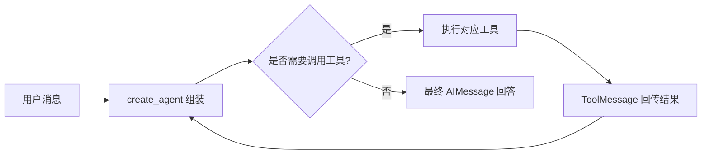

# 第7课 工具还要手动判断？用Agent把决策控制权交给模型

上一节课我们用 `@tool` 把普通函数包装成了标准工具，解决了“模型不会执行确定性逻辑”的问题。但新的问题也随之而来：用户问一句话，要不要调用工具、调用完要不要再调一次、什么时候该给出最终回答，这些判断都得我们自己写逻辑硬编码。
这节课就来完成这次交接：为什么人工写规则控制工具调用走不远？以及怎么把“何时调用工具”的决策权交给模型，用一个自动循环让整个流程自主运转起来。



---
## 先搞懂：人工控制工具调用的痛点在哪？
s06 里我们手动调用工具，逻辑很简单：想统计词数就主动调 `count_words.invoke()`。但放到真实对话场景里，这件事就没这么简单了——用户的提问千变万化，你没法提前知道哪句话需要调用工具。

最容易想到的是写关键词判断：问题里有“统计词数”就调工具，否则直接回答。但这种硬编码的方式，有三个绕不开的问题：
- **规则永远写不完**：自然语言的表达方式无穷无尽，“数一下有几个词”“帮我算字数”“这句话的词数是多少”，变体多到列不全，漏一个就会失效。
- **脱离上下文判断不准**：同样一句“统计一下”，有时候指统计词数，有时候指统计字符数，还有的时候只是随口一提，必须结合上下文才能判断，纯关键词匹配根本做不到。
- **扩展成本指数级上升**：每新增一个工具，就要加一堆判断规则。工具多了之后，逻辑会越来越臃肿，改一处就可能牵动全身。

把这条路走到头，答案自然就出来了：
> 只要对话是开放的，人工规则就永远追不上语言的变化。“该不该用工具、该用哪个工具”这件事，本来就该由读懂了上下文的模型自己来做。

而且这不只是省掉几行 if-else——把决策控制权交给模型，是从“人驱动流程”到“模型自主驱动流程”的关键一步。这也是 Agent 最核心的本质——不是模型变聪明了，而是它拿到了流程的控制权。

---
## 纯 if-else 判断，为什么走不远？
也许有人还想再挣扎一下：不就是判断要不要调用工具吗，多写几个分支也能凑合用。

这个思路能应对最简单的固定场景，但它本质上是让人去预判所有可能的对话情况，就像给自动回答机写固定话术，永远覆盖不了真实的对话变化：
第一，**决策质量低**。
硬编码规则只能处理预设好的情况，稍微换个说法、结合点上下文，判断就会出错。该调工具的时候没调，不该调的时候乱调，体验非常差。
第二，**维护负担重**。
每加一个工具、改一个场景，就要更新一遍判断逻辑。工具越多，规则之间的冲突和遗漏就越多，维护成本会越来越高。
第三，**违背能力分工原则**。
模型最擅长的就是理解语义、判断意图，放着模型的能力不用，让人去写规则模拟语义判断，等于用短处去碰长处。

分工应该反过来定：
> 专业的事交给专业的角色。模型负责判断意图、决定行动，工具负责执行具体逻辑，框架负责跑通循环。三者各司其职，不用人在中间写判断规则。

这正是 `create_agent` 的设计出发点：把通用的循环编排逻辑抽成框架能力，业务侧只需要提供组件——模型、工具、规则，剩下的流程自动运转。

---
## 第一步：用 `create_agent` 组装模型、工具与行为规则
就像组建一个自动运转的项目组：给它配一个决策者（模型）、一套可用的执行工具、一套行为规则（系统提示），剩下的具体执行步骤，由它自己安排。

`create_agent` 就是这个组装函数，它接收三个核心要素：
1.  `model`：负责做决策的模型，判断什么时候调用工具、什么时候给出答案；
2.  `tools`：所有可用的工具列表，模型只能从这里面选择调用；
3.  `system_prompt`：给模型的行为规则，划定能力边界和回答风格。

```python
def build_agent(model=None):
    if model is None:
        model = init_chat_model(os.environ["LANGCHAIN_MODEL"])
    return create_agent(
        model=model,
        tools=[count_words],
        system_prompt="你是一个会在需要时调用工具的 LangChain 助教。",
    )
```

这里有一个非常重要的细节：**工具还是 s06 里的 `count_words`，一行代码都不用改**。
这就是组件化设计的价值——工具一旦按标准协议定义好，就可以在任何场景下复用。手动调用可以，交给 Agent 自动调用也可以，不需要做任何改造。

---
## 第二步：传入消息，自动跑完整个流程
Agent 组装好之后，调用方式和我们之前学过的所有组件一样，用 `.invoke()`。输入是包含消息列表的字典，输出是包含完整执行轨迹的状态。

```python
def run_agent(query: str, model=None):
    agent = build_agent(model=model)
    return agent.invoke({"messages": [{"role": "user", "content": query}]})
```

调用之后，Agent 会自动在内部循环执行：
1.  模型读取消息上下文，判断是否需要调用工具；
2.  如果需要，就生成工具调用指令，执行对应工具，把结果以 `ToolMessage` 的形式加回消息列表；
3.  模型读取工具结果，再次判断：是继续调用工具，还是可以给出最终答案；
4.  直到模型决定结束，输出最终回答，循环终止。

我们可以从返回结果的 `messages` 里看到完整的执行轨迹：
```python
def answer(query: str, model=None) -> str:
    result = run_agent(query, model=model)
    return message_text(result["messages"][-1])
```

典型的轨迹顺序是：
`HumanMessage（用户提问） → AIMessage（带 tool_calls，内容为空） → ToolMessage（工具执行结果） → AIMessage（最终回答）`

> 这一课的关键词不是“Agent”这个名词，而是**控制流的移交**。“何时调用工具、是否继续调用”的决策权，从人写的 if-else 转移到了模型手里，循环执行由框架替你完成。
>
> 还有一个初学者最容易忽略的事实：`create_agent` 返回的不是一个黑盒的 `Agent` 对象，而是一张编译后的状态图（`CompiledStateGraph`，底层由 LangGraph 生成）。这也是为什么它天然支持 `.invoke()`、`.stream()`，甚至可以用 `agent.get_graph().draw_mermaid()` 画出内部的循环结构——它本质是一张可观测的流程图，不是一个魔法盒子。
>
> 你完全不需要先学 LangGraph 才能用 Agent：只需要关心输入是消息、输出是消息轨迹就够了，底层的编排框架是透明的。这也是 LangChain 一贯的设计原则：渐进式学习，组件可插拔。

---
## 为什么这种设计是合理的？
Agent 看起来是个新概念，但它的底层完全建立在前六课的基础之上，没有任何黑魔法。它的设计合理性，恰恰体现在对既有约定的完整复用上：
1.  **上下文载体不变**：所有决策、结果、状态，全部承载在消息列表里。新增的只是 `tool_calls` 字段和 `ToolMessage` 类型，主线依然是“消息承载上下文”。
2.  **调用约定不变**：Agent 同样用 `.invoke()` 调用，和模型、工具、模板的接口完全统一。学习成本很低，组件之间可以自由组合。
3.  **业务组件全复用**：模型是 s01 就定下的统一入口，工具是 s06 定义的标准工具，系统提示是 s03 的概念，没有一个组件需要为 Agent 重写。

这就像用标准积木搭房子：之前的每一块积木都能用，只是用一种新的方式把它们组织起来，形成了自动运转的流程。

### 拓展：工具出错了怎么办？
把工具交给自动循环后，多了一个新问题：如果工具执行报错，默认会直接中断整个 Agent 流程。
真实场景里，工具调外部接口、读文件，出错很常见。对于可恢复的错误，我们希望把错误信息交给模型，让它决定怎么处理，而不是直接崩溃。

LangChain 提供了 `ToolException` 和 `handle_tool_error` 来处理这种场景：
```python
from langchain_core.tools import ToolException

# 方式1：用 StructuredTool 显式开启
def _search(query: str) -> str:
    if not query.strip():
        raise ToolException("搜索词不能为空")
    return "搜索结果"

search_tool = StructuredTool.from_function(
    _search, name="search", description="搜索资料", handle_tool_error=True
)

# 方式2：给已有 @tool 工具开启
count_words.handle_tool_error = True
```

开启后，工具抛出的 `ToolException` 会被转换成可读的错误信息，以 `ToolMessage` 的形式回传给模型，由模型决定下一步怎么做。注意：只有 `ToolException` 会被降级处理，普通的 `ValueError`、网络异常等仍然会直接抛出，避免静默吞掉严重错误。

---
## 动手试一试
现在你可以亲手跑一跑，看看 Agent 内部是怎么自主运转的。
先进入对应的文件夹运行程序：
```bash
cd learn-langchain
uv run python -m s07_first_agent.code
uv run pytest s07_first_agent/tests -q
```

### 实验1：打印完整轨迹，看清内部执行步骤
运行下面的代码，逐行打印消息列表，观察每一步发生了什么：
```python
result = run_agent("统计这句话有几个词")
for msg in result["messages"]:
    print(type(msg).__name__, ":", str(msg.content)[:60])
```
你会清晰看到四步轨迹：用户提问、模型发起工具调用、工具返回结果、模型给出最终回答。
特别注意第二条 `AIMessage`：它的 `content` 是空的，但 `tool_calls` 字段里藏着调用指令。这就是模型“决定调用工具”的具体形态。

### 实验2：对比不同问题，观察自主决策效果
分别问两个问题：“统计这句话有几个词”和“LangChain 是什么”。
对比两次的消息轨迹：前者会触发工具调用，后者会直接回答。体会模型是如何根据问题内容自主判断的，不需要我们写任何关键词规则。

### 实验3：新增工具，验证多工具选择
把 s06 里写的 `count_characters` 工具加入 Agent 的工具列表，然后提问“这句话有多少个字符”。
观察模型能不能正确识别意图，选择对应的工具调用。体会 Agent 的扩展方式：加工具只需要往列表里加一项，不用改任何决策逻辑。

---
## 相对上一课的变化
s07 没有发明新的基础组件，只是把既有组件组织成了自动循环，核心约定全部延续。

| 维度 | s06 手动调用工具 | s07 Agent 自动循环 |
| --- | --- | --- |
| 上下文载体 | 工具本身无对话上下文 | 用 `messages` 承载完整上下文与执行轨迹 |
| 调用约定 | `tool.invoke(参数字典)` | `agent.invoke({"messages": [...]})`，统一 invoke 约定 |
| 工具本身 | `@tool` 装饰的 `count_words` | 完全同一个工具，一字未改 |
| 谁决定调用工具 | 人手动调用 | 模型自主判断 |
| 执行流程 | 单次调用即结束 | 模型 ↔ 工具循环，直到模型决定收尾 |
| 输入 | 函数参数字典 | 消息列表 |
| 返回值 | 工具结果字符串 | 完整消息轨迹，取最后一条为最终答案 |

**本课新增的核心原语**：`create_agent` / `tool_calls` / `ToolMessage`
**保持不变的基础约定**：消息承载上下文、`invoke` 统一调用接口、标准工具组件完全复用。

---
## 检查点
学完本节，你应该能回答这几个问题：
- 能在返回结果里指出 `AIMessage → ToolMessage → AIMessage` 的执行顺序吗？
- 为什么测试用的 fake 模型必须实现 `bind_tools()`？
- 能新增一个 `count_characters` 工具，让 Agent 在两个工具之间自主选择吗？

---
## 本节课小结
这节课完成了全课程最重要的一次转变：
> 把决策权还给模型，把循环交给框架。Agent 的本质不是什么神奇的智能体，而是“模型决策 + 工具执行 + 自动循环”的标准组合。

`create_agent` 只有一个函数的体量，却把前六课立下的约定全部兑现了：统一的组件协议，清晰的能力边界，渐进式的能力扩展。所有新能力都建立在既有基础之上，不用推倒重来。

现在 Agent 已经能自主跑通流程了，但它是执行完一次性返回全部结果。遇到长任务时，用户只能盯着空白页面等待，体验很差。下一节课，我们就来解决这个问题：用流式输出，把执行过程一点点呈现给用户。

进入下一课：[s08 流式输出 — 让结果逐段呈现、过程可见](../s08_streaming/)
