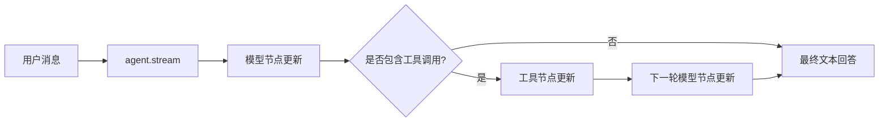

# 第8课 长任务只能傻等？用流式输出让执行进度逐步可见

上一节课我们用 Agent 实现了模型自主驱动工具调用，完整的任务流程可以自动跑通了。但你很快会遇到体验上的核心问题：Agent 用 `invoke` 调用时，要等所有思考、工具调用、最终回答全部跑完，才一次性返回结果。任务稍长一点，用户面前就是一片空白——不知道它正在思考、正在调用工具，还是已经卡住了。
这节课把执行过程打开给你看：为什么一次性全量返回不适合长任务？以及怎么用流式调用，让 Agent 的每一步执行进度都能实时呈现出来。



---
## 先搞懂：一次性全量返回的痛点在哪？
s07 里的 `invoke` 调用，逻辑很简单：传进去输入，等一会儿，拿到完整结果。但这种“全有或全无”的方式，只适合短平快的单轮任务。放到稍长的 Agent 流程里，有三个非常明显的问题：
- **用户无感知**：执行过程中没有任何反馈，用户不知道程序是在正常运行还是已经卡死，很容易重复触发，体验很差。
- **排错成本高**：工具调用成功还是失败、模型走到了哪一步，都得等全部跑完才知道。出了问题没法第一时间定位，调试非常不方便。
- **交互性很差**：如果任务需要执行很多步，用户只能长时间等待，没有任何进度感，很容易失去耐心。

对交互型应用来说：
> 只要 Agent 任务超过一步，一次性全量返回就只是基础能力。逐步反馈执行进度，是所有交互型 Agent 的标配。

受益的也不只是用户体验：流式输出本质上是把“黑盒执行”变成了“白盒可观测”。你不仅能拿到最终结果，还能看到每一步的状态，方便调试、排错、做进度展示，是工程化落地的必备能力。

---
## 自己拆开循环逐步返回？等于重写执行引擎
想要进度，最粗暴的办法是自己把 Agent 的循环拆开，每执行一步就返回一次。能不能行？

这个思路能实现最简单的进度提示，但它本质是放弃了框架的原生能力，自己重写一遍执行逻辑，隐患很多：
第一，**状态维护成本高**。
自己拆循环就要自己维护消息列表、管理工具调用、处理终止条件，很容易写出 bug，而且和框架原生的 Agent 逻辑很难对齐。
第二，**重复造轮子**。
LangChain 的状态图本身就支持多种消费模式，放着原生的 `stream` 不用，自己重写执行逻辑，等于重复开发，还容易遗漏边界情况。
第三，**扩展性差**。
后续加更多节点、更复杂的图结构，自己写的循环就要跟着改，维护成本会越来越高。

框架早就想到了这一层：
> 同一个 Agent，支持多种消费方式。全量结果用 `invoke`，逐步进度用 `stream`。底层执行逻辑完全一样，只是读取结果的方式不同。

这也是 LangChain 非常核心的设计思想：**统一的可运行组件，支持多种调用模式**。不管是模型、工具、链还是 Agent，只要是 Runnable 组件，都同时支持 `invoke`（全量）、`stream`（流式）、`batch`（批量）等标准调用方式，不用为不同模式写两套逻辑。

---
## 第一步：还是同一个 Agent，只是换一种调用方式
就像同一台电视机，你可以看完整的录播，也可以看实时直播，节目本身是一样的，只是播放方式不同。

s08 的 Agent 和 s07 完全没有区别：工具还是那个 `count_words`，循环还是 model ↔ tools 的循环，系统提示也一样。我们不需要修改 Agent 的任何构造逻辑，只需要把调用方式从 `invoke` 换成 `stream`。

```python
def build_agent(model=None):
    if model is None:
        model = init_chat_model(os.environ["LANGCHAIN_MODEL"])
    return create_agent(
        model=model,
        tools=[count_words],
        system_prompt="你是一个回答简洁的 LangChain 助教。",
    )
```

这里一定要明确：**Agent 本身的能力、执行逻辑、内部状态，和 s07 完全一致**。
变的只是我们读取结果的方式：`invoke` 是等全部跑完拿最终状态，`stream` 是跑一步返回一步的进度。这就是组件化设计的好处——执行逻辑和消费方式解耦，切换成本几乎为零。

---
## 第二步：逐段读取节点更新，跟踪执行进度
`stream` 调用会返回一个迭代器，每产出一个值，就代表 Agent 里的一个节点执行完成了。我们通过指定 `stream_mode="updates"`，拿到节点级的状态更新。

```python
def stream_updates(query: str, model=None) -> Iterator[dict]:
    agent = build_agent(model=model)
    yield from agent.stream(
        {"messages": [{"role": "user", "content": query}]}, stream_mode="updates"
    )
```

每一段 update 都是一个字典，key 是节点名称，value 是该节点的状态更新，通常包含本节点新增的消息。
在我们的单工具 Agent 示例里，如果模型选择调用工具，就会依次出现三个节点更新：
1.  **model 节点更新**：模型完成思考，决定调用工具，更新里带一条含 `tool_calls` 的 `AIMessage`；
2.  **tools 节点更新**：工具执行完成，更新里带一条 `ToolMessage`，存放执行结果；
3.  **model 节点更新**：模型看完工具结果，给出最终回答，更新里带最终的 `AIMessage`。

我们可以遍历所有更新，从中提取出最终的回答文本：
```python
def collect_final_text(query: str, model=None) -> str:
    final_text = ""
    for update in stream_updates(query, model=model):
        for node_update in update.values():
            for message in node_update.get("messages", []):
                final_text = message_text(message)
    return final_text
```

> 这里有一个非常容易混淆的概念，必须讲清楚：
> 本课讲的是**节点级进度更新**，不是逐字输出的打字机效果。`stream_mode="updates"` 返回的是“某个节点执行完了”的事件，不会把一句话拆成一个个 token 往外吐。
> 逐 token 的流式输出是另一种流模式，适合做打字机展示；而节点级更新适合做进度展示、步骤追踪、调试排错。两者都是流式，但粒度和用途不同。

> 这一课换来的是**Agent 的执行过程从黑盒变成白盒**。Agent 的能力没有变，执行逻辑也没有变，但你可以实时看到它走到了哪一步、哪个节点产出了什么结果，既可以做用户侧的进度提示，也可以做开发侧的调试排错。

---
## 为什么这种设计很优雅？
把结果拆成几次返回，听起来平平无奇，但这个设计恰好站在组件化思想的正中间：
1.  **执行与消费解耦**：Agent 的核心逻辑只写一次，`invoke` 和 `stream` 只是两种不同的消费方式，不用维护两套执行逻辑。
2.  **接口高度统一**：所有 Runnable 组件都支持 `invoke` 和 `stream`，模型是这样，Agent 也是这样，学习成本极低，用法可以无缝迁移。
3.  **可观测性原生支持**：进度、调试、监控不需要额外埋点，直接通过流式接口就能拿到完整的执行轨迹。

这就像快递物流：包裹本身只有一个运输过程，但你可以选择等送到了一次性签收，也可以选择看每一站的物流更新。运输过程没变，只是信息反馈的粒度变了。

---
## 动手试一试
现在你可以亲手跑一跑，看看流式节点更新是怎么工作的。
先进入对应的文件夹运行程序：
```bash
cd learn-langchain
uv run python -m s08_streaming.code
uv run pytest s08_streaming/tests -q
```

### 实验1：打印节点更新顺序，观察执行轨迹
用一个需要调用 `count_words` 的问题运行流式方法，逐行打印每个 update 的 key。
你会清晰看到节点按 `model → tools → model` 的顺序依次产出更新，和 Agent 的执行流程完全对应。
对比 `invoke` 一次性返回完整轨迹的方式，体会流式“走一步、报一步”的特点。

### 实验2：识别每段更新里的内容
在遍历更新时，打印每条消息的类型和内容：
- 第一段 model 更新里的 `AIMessage`，content 是空的，但带 `tool_calls` 字段，是模型的调用决策；
- tools 更新里的 `ToolMessage`，是工具执行的结果；
- 第二段 model 更新里的 `AIMessage`，是模型的最终回答。
理解每一个节点更新对应的实际意义，就能基于它做自定义的进度展示。

### 实验3：对比两种调用的最终结果
分别用 `invoke` 和 `stream` 拿到最终回答，对比两者是否一致。
体会核心结论：**两种调用方式底层执行完全相同，只是结果的返回形式不同**。`stream` 不会改变 Agent 的行为，只是让过程变得可见。

---
## 相对上一课的变化
s08 完全复用了 s07 的 Agent 构造，只是新增了流式调用方式，核心逻辑没有任何改动。

| 维度 | s07 全量调用 | s08 流式调用 |
| --- | --- | --- |
| Agent 上下文载体 | `messages` 消息列表 | 仍用 `messages` 承载上下文，完全一致 |
| 调用方式 | `invoke`，执行完一次性返回 | `stream`，逐节点返回更新 |
| 返回类型 | 完整最终状态 | 迭代器，每段是一个节点的状态更新 |
| Agent 本身 | count_words 工具 + model↔tools 循环 | 完全不变，执行逻辑与 s07 一致 |
| 可观测性 | 只能看到最终结果 | 可以看到每一步执行进度 |

**本课新增的核心原语**：`agent.stream` / `stream_mode="updates"`
**保持不变的基础约定**：Agent 构造方式、内部执行逻辑、消息承载上下文的核心主线全部延续。

---
## 检查点
学完本节，你应该能回答这几个问题：
- 能打印每个 update 的节点名，并指出 `model → tools → model` 三步分别对应什么动作吗？
- 为什么说 `stream_mode="updates"` 是节点级进度，而不是逐 token 流式输出？
- 能从最后一个 model 节点的更新里，提取出最终的回答文本吗？

---
## 本节课小结
这节课可以浓缩成一句话：
> 同一个组件，支持多种消费模式。执行逻辑和结果读取方式解耦，全量结果用 `invoke`，进度追踪用 `stream`。

一个 `stream` 方法的背后，是统一的 Runnable 接口和一致的调用体验。所有组件都遵循同一套约定，学起来顺，用起来也顺。

现在流式输出让单次任务的过程可见了，但每一次调用都是独立的——Agent 不记得上一轮对话说了什么。下一节课，我们就给 Agent 加上短期记忆，让它能在同一会话里承接历史对话。

进入下一课：[s09 短期记忆 — 让 Agent 记住同一会话的历史](../s09_short_term_memory/)