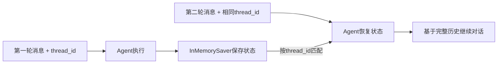

# 第9课 每轮对话都失忆？用Checkpointer给Agent装上短期记忆

上一节课我们用流式输出解决了长任务等待的问题，Agent的每一步执行都能实时看到了。但你很快会遇到一个更基础的体验问题：Agent是"金鱼记忆"——上一轮你告诉它"我叫浩然"，这一轮再问"我叫什么"，它一脸茫然。它不是笨，是根本没人帮它把上一轮的对话存下来。

这节课就把“记忆”这件事交给该管它的层：为什么多轮对话不能靠手动拼历史？以及怎么用一套标准的状态持久化机制，让Agent自动记住同一会话的上下文，还能做到不同会话之间互相隔离。



---
## 先搞懂：手动拼历史为什么不是长久之计？
s02里我们学过，多轮对话本质就是把历史消息都放进`messages`列表里。顺着s02的思路，自然会想：那我自己在外面维护一个消息列表不就行了？每轮对话把用户消息和AI回复都append进去，下次调用一起传给模型。

这个方法在最简单的demo里能跑通，但放到真实场景里有三个绕不开的问题：
- **状态和业务逻辑强耦合**：你要自己维护消息列表、处理工具调用返回的`ToolMessage`、管理不同会话的历史，Agent循环本身的逻辑和状态管理混在一起，很快就会乱。
- **会话隔离很麻烦**：同时服务多个用户时，你要给每个用户建一个独立的消息列表，自己做会话ID的映射和状态清理，代码里全是字典和if-else。
- **没法和框架能力对齐**：后面要加历史裁剪、持久化到数据库、人工介入修改状态这些能力时，你自己维护的列表很难和框架的扩展点对接。

责任的归属其实很清楚：
> 状态持久化是框架该提供的基础能力，不该让业务代码自己拼历史。

省代码只是最小的收益：把状态管理交给框架，是"业务逻辑"和"状态存储"的一次重要解耦——你只需要关心每轮传什么新消息，历史的存取、会话的隔离、状态的版本管理，全由框架统一处理。

---
## 自己维护消息列表，能撑多久？
先算一算这笔账：不就是存个列表吗，用一个字典按session_id存messages，也没多少代码。

这个思路能应付最简单的单用户demo，但它本质是在框架外面又套了一层自己的状态管理，就像自己给电器做接线板，看起来能用，隐患很多：
第一，**容易漏消息类型**。
Agent循环里不只有`HumanMessage`和`AIMessage`，还有工具调用产生的`ToolMessage`、系统提示、中间思考过程。自己维护很容易漏加某类消息，多轮之后上下文就不对了。

第二，**和框架扩展点脱节**。
LangChain的中间件、状态裁剪、断点续跑、人工审核这些能力，都是基于框架内部的状态机制工作的。你自己在外面维护列表，这些能力一个都用不上。

第三，**持久化要重写一遍**。
今天存在内存里，明天要存Redis、存数据库，后天要做状态版本回溯，你自己写的存储逻辑要全部推翻重写。

换个角度想就通了：
> 状态存在哪里、怎么存取、怎么隔离，这些都是通用问题，应该由框架统一解决。业务代码只需要告诉框架"这是哪一个会话"，剩下的自动完成。

Checkpointer机制就是这个思路的产物：把通用的横切关注点（状态管理、重试、缓存、可观测）抽成框架能力，业务侧只需要专注于组件本身——模型、工具、提示词。

---
## 第一步：给Agent挂上Checkpointer，开启状态持久化
就像你玩游戏要先开存档功能，Agent要记住对话，首先得给它配一个"存档器"。

`Checkpointer`就是LangChain的状态存档机制。我们先用最简单的内存版`InMemorySaver`——它把状态存在程序内存里，重启就会清空，非常适合入门理解原理。创建Agent的时候把它传进去就行：

```python
def build_agent(model=None, checkpointer=None):
    if model is None:
        model = init_chat_model(os.environ["LANGCHAIN_MODEL"])
    if checkpointer is None:
        checkpointer = InMemorySaver()
    return create_agent(
        model=model,
        tools=[],
        system_prompt="你是一个会使用同一线程上下文的 LangChain 助教。",
        checkpointer=checkpointer,
    )
```

逻辑非常简单：
- 初始化一个`InMemorySaver`作为存档器；
- 创建Agent时通过`checkpointer`参数传进去；
- 其他代码和s07的Agent完全一样，工具、模型、系统提示都不用改。

这一步是记忆机制最核心的约定：
**Agent本身不存状态，状态全部交给Checkpointer管理。同一个Checkpointer实例，是所有会话共享的存储后端。**

---
## 第二步：用thread_id区分不同会话，自动存取历史
有了存档器，还需要告诉框架"这次请求属于哪个会话"。这就是`thread_id`的作用——它是会话的唯一标识，相当于存档的 slot 编号。

调用Agent的时候，通过`config`参数传入`thread_id`，框架就会自动：
1.  执行前，从Checkpointer里取出这个`thread_id`对应的历史状态；
2.  把你这轮传的新消息加进去；
3.  执行完Agent循环后，把最新的状态存回Checkpointer。

```python
def run_turn(agent, thread_id: str, text: str):
    return agent.invoke(
        {"messages": [{"role": "user", "content": text}]},
        config={"configurable": {"thread_id": thread_id}},
    )
```

你不需要手动append任何历史消息，每轮只需要传**当前这一轮的用户消息**就够了。框架会自动把历史补全。

我们可以跑两轮验证一下：
```python
def answer_turn(agent, thread_id: str, text: str) -> str:
    result = run_turn(agent, thread_id, text)
    return message_text(result["messages"][-1])

# 第一轮：告诉它名字
answer_turn(agent, "user_001", "记住：我叫浩然。")
# 第二轮：问名字，它能答上来
answer_turn(agent, "user_001", "我叫什么？")  # 输出"你叫浩然"
```

> 别被"记忆"这个词带偏——Agent没有变聪明，只是**状态有了统一的安身之处**。历史消息不再需要你手动拼接，Checkpointer会按`thread_id`自动完成存取和隔离。
>
> 这里有一个初学者最容易踩的坑：`thread_id`本身不存储任何状态，它只是Checkpointer里的分区键。同样的`thread_id`，如果你换了一个全新的Checkpointer实例，拿到的还是一个空白对话——因为存档不在了。

---
## 为什么这种设计非常优雅？
Checkpointer的设计看起来只是多传了两个参数，但背后是LangChain非常一致的组件化思想：
1.  **存储与计算分离**：Agent只负责执行循环逻辑，状态存在哪里、怎么存，完全由Checkpointer决定。内存、SQLite、Redis、PostgreSQL，只是换一个Checkpointer实现，业务代码一行不用改。
2.  **会话隔离天然支持**：通过`thread_id`做分区，同一个Agent实例可以同时服务成千上万个会话，不需要为每个会话创建单独的Agent对象。
3.  **能力渐进式增强**：今天用内存版做开发，上线换数据库版做持久化，以后要加历史裁剪、状态回溯、人工审核，都是在Checkpointer这一层扩展，不影响Agent核心逻辑。

这就像酒店的房卡系统：房间（状态）都存在酒店（Checkpointer）里，你用房卡（thread_id）就能开门进自己的房间。不需要每个人自己带房子住酒店，也不需要酒店为每个客人单独建一栋楼。

### 拓展：历史太长怎么办？
记忆是把双刃剑：同一会话的历史会一直累积，对话一长，消息列表就会越来越大，最终撑爆模型的上下文窗口。

LangChain提供了`trim_messages`工具来自动裁剪历史：
```python
from langchain_core.messages import trim_messages

trimmed = trim_messages(
    messages,
    max_tokens=4096,
    strategy="last",          # 保留最近的消息
    start_on="human",         # 裁剪后从用户消息开始，避免半截对话
    include_system=True,      # 始终保留系统提示
    token_counter="approximate",
)
```

这一步本课不强制要求。要让裁剪真正生效，需要把它接进Agent的消息处理流程里；真正的生产级长对话，会同时使用Checkpointer持久化和自动历史裁剪。本课我们先把最基础的"自动记住"这一步走通。

---
## 动手试一试
现在你可以亲手跑一跑，看看短期记忆是怎么工作的。
先进入对应的文件夹运行程序：
```bash
cd learn-langchain
uv run python -m s09_short_term_memory.code
uv run pytest s09_short_term_memory/tests -q
```

### 实验1：验证同thread_id的记忆效果
跑示例代码，观察两轮对话的输出。
第一轮让它记住名字，第二轮问名字，它能正确回答。再手动加第三轮、第四轮，体会历史自动累积的效果——你每轮只传了最新的一句话，但它能看到之前所有的对话。

### 实验2：验证不同thread_id的隔离性
用同一个Agent实例，换一个不同的`thread_id`再问"我叫什么"。
你会发现它答不上来——因为这是一个全新的会话，历史是空的。体会Checkpointer的分区机制：同一个存储后端，不同`thread_id`的状态完全隔离，互不干扰。

### 实验3：验证Checkpointer实例的作用
新建一个全新的Agent（也就新建了一个全新的InMemorySaver），还用原来的`thread_id`问名字。
你会发现它还是答不上来——因为新的Checkpointer里没有这个thread_id的存档。理解核心结论：`thread_id`只是分区键，真正的状态存在Checkpointer实例里。

---
## 相对上一课的变化
s09给Agent加上了自动状态持久化，但核心的调用约定和Agent逻辑完全没有变化。

| 维度 | s08 流式输出 | s09 短期记忆 |
| --- | --- | --- |
| 上下文载体 | `messages`，仅当次执行 | 仍用`messages`，由Checkpointer跨轮自动保存 |
| 调用约定 | `agent.stream(...)` | `agent.invoke(..., config)`，仍符合统一invoke约定 |
| 跨轮记忆 | 无，每次调用都是全新的 | 复用Checkpointer，按thread_id自动存取历史 |
| 新增参数 | stream_mode | `checkpointer`构造参数 / `config`里的`thread_id` |
| 每轮输入 | 需要传完整消息列表 | 只传本轮新消息，历史自动补全 |

**本课新增的核心原语**：`Checkpointer` / `InMemorySaver` / `thread_id`
**保持不变的基础约定**：Agent构造方式、消息载体、invoke统一调用接口全部延续。

---
## 检查点
学完本节，你应该能回答这几个问题：
- 用同一个Agent、不同的`thread_id`问同一个问题，为什么结果不一样？
- 为什么说`thread_id`本身不存状态，它只是Checkpointer里的分区键？
- 自己在外面维护消息列表，和用Checkpointer比，缺了哪些能力？

---
## 本节课小结
这节课划清了一条责任线：
> 状态管理是框架的通用能力，不该让业务代码自己做。给Agent配上Checkpointer，用thread_id区分会话，多轮历史自动存取。

多传的只是两个参数，落定的却是关注点分离、通用能力下沉这两条原则。计算和存储解耦之后，Agent本身变得更轻，扩展能力也更强。

现在Agent能记住对话历史了，但面对复杂任务时，它还是想到哪做到哪，东一榔头西一棒子，没有计划性。下一节课，我们就给Agent装上标准化的规划能力——不用自己写逻辑，挂一个中间件就行。

进入下一课：[s10 Todo中间件 — 先做计划再动手](../s10_todo_middleware/)
