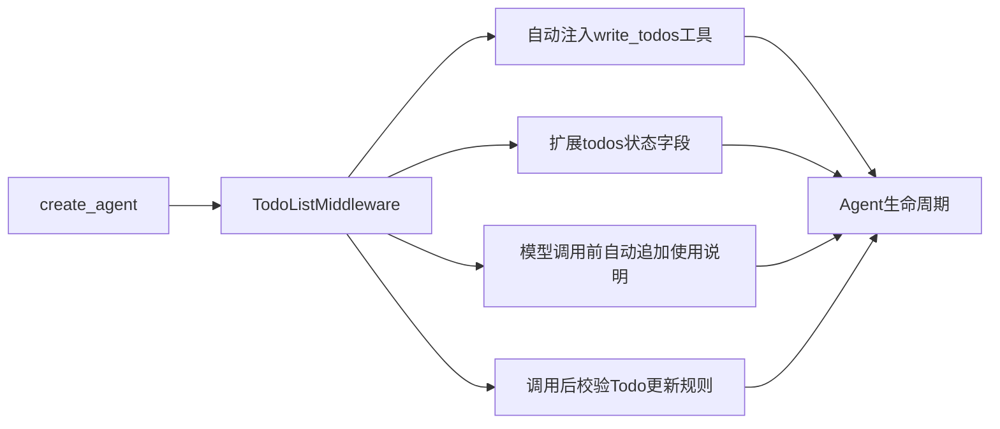

# 第10课 做任务东一榔头西一棒子？用中间件给Agent装上规划能力

上一节课我们用Checkpointer给Agent装上了短期记忆，同一会话里它能记住之前说过什么了。但你很快会发现另一个问题：面对复杂任务时，它总是想到哪做到哪——让它写一份调研报告，它可能直接开始写正文，写完才发现漏了数据收集；让它安排旅行，它可能先订酒店才想起没问日期。没有规划，做事情就容易乱。

这节课用规划能力当例子，讲清中间件这个扩展机制：为什么自己写Todo逻辑容易和框架打架？以及怎么在不修改Agent核心代码的前提下，给它插上标准化的新能力。



---
## 先搞懂：为什么Agent需要规划能力？
s07的Agent本质是一个"刺激-反应"循环：看到用户消息，判断要不要调工具，调完工具再判断要不要继续。这种模式处理单步任务非常高效，但遇到多步骤的复杂任务时，有三个很明显的问题：
- **容易漏步骤**：没有全局视角，做着做着就忘了最初的目标，漏掉关键环节；
- **顺序容易错**：想到什么做什么，经常出现"先写结论再找证据"这种顺序颠倒的问题；
- **无法追踪进度**：做到哪一步了、还有什么没做，用户和模型自己都不清楚，出了问题没法回滚。

经验规律是：
> 只要任务超过两步，纯反应式的Agent就容易乱。"先规划、再执行"是处理复杂任务的通用模式，不管是人还是AI都适用。

Todo只是引子：中间件机制本质是给Agent开了一个"生命周期扩展口"——你不光能加Todo规划，还能加日志、加权限校验、加缓存、加人工审核，所有横切关注点都可以通过中间件插拔，不用改Agent的核心代码。

---
## 自己硬写Todo逻辑，会跟框架打架
按s06学的套路，你可能想自己写一个`write_todos`工具，让模型调用它来更新计划。能行吗？

这个思路能实现最基础的功能，但它本质是把所有逻辑都堆在工具里，就像给手机焊死一个新功能，能用，但后续扩展非常麻烦：
第一，**状态要自己管**。
Todo列表存在哪里？怎么保证每轮都能看到最新的Todo？怎么和Agent已有的消息状态同步？这些都要你自己处理，很容易和Checkpointer的状态机制冲突。

第二，**使用说明要自己加**。
你要在系统提示里反复告诉模型"复杂任务要先写Todo""Todo更新要遵守什么规则""完成一项要标记为已完成"，提示词写得又长又乱，模型还不一定遵守。

第三，**规则校验要自己做**。
模型可能一轮更新好几个Todo、可能删除未完成的项、可能格式写错，这些校验逻辑你都要自己在工具里写，工具会变得越来越臃肿。

问题出在位置不对：
> 不是把所有逻辑都塞进工具里，而是利用Agent的生命周期扩展点，在正确的时机做正确的事——注册工具、扩展状态、注入提示、校验规则，各司其职。

LangChain的设计思想也正在于此：对扩展开放，对修改关闭。Agent的核心循环是稳定的，新能力通过中间件的方式插拔，不需要修改框架源码，也不需要重写Agent。

---
## 第一步：一行代码挂上TodoListMiddleware
就像给浏览器装插件，你不需要修改浏览器本身，点一下安装就能获得新功能。给Agent加规划能力也是一样——不需要改Agent的创建逻辑，只需要在`middleware`列表里加上`TodoListMiddleware`就行。

```python
def build_agent(model=None):
    if model is None:
        model = init_chat_model(os.environ["LANGCHAIN_MODEL"])
    return create_agent(
        model=model,
        tools=[],
        middleware=[TodoListMiddleware()],
        system_prompt="你是一个做复杂任务前会先规划的 LangChain 助教。",
    )
```

就这么一行，中间件会自动帮你做好四件事：
1.  **自动注册工具**：给Agent注入一个`write_todos`工具，模型可以调用它来创建、更新、完成待办项；
2.  **扩展状态字段**：在Agent的状态里新增`todos`字段，专门用来存储待办列表，和消息状态分开管理；
3.  **自动注入提示**：每次调用模型前，自动在提示里加上Todo的使用说明，不用你自己在system_prompt里写；
4.  **自动校验规则**：模型返回后自动检查Todo更新是否合法，比如同一轮不能并行更新多个Todo，避免状态冲突。

这里有一个非常重要的细节：**模型、工具、Checkpointer这些之前的组件，一行代码都不用改**。
中间件是透明的，挂上去就生效，摘下来就恢复原样，完全符合开闭原则。

---
## 第二步：像普通Agent一样调用，规划自动发生
中间件挂好之后，Agent的调用方式和之前完全一样，还是用`.invoke()`，还是传消息列表。什么时候写Todo、什么时候更新Todo、什么时候标记完成，全部由模型自己判断。

```python
def answer(query: str, model=None) -> str:
    agent = build_agent(model=model)
    result = agent.invoke({"messages": [{"role": "user", "content": query}]})
    return message_text(result["messages"][-1])
```

你不需要额外传任何参数，也不需要手动调用任何Todo相关的方法。遇到简单问题（比如"1+1等于几"），模型可能根本不会写Todo，直接回答；遇到复杂多步骤问题，它会自动先调用`write_todos`列出计划，再一步步执行。

我们可以看一下返回的状态，除了`messages`之外，还多了一个`todos`字段，里面就是当前的待办列表：
```python
result = agent.invoke({"messages": [{"role": "user", "content": "帮我做一份LangChain入门教程的大纲"}]})
print(result["todos"])  # 能看到模型列的待办项
```

> Todo在这一课里只是教具，真正要学的是**Agent的生命周期扩展机制**。你学会的不只是怎么加待办规划，更是怎么在不修改核心代码的前提下，给Agent增加任意横切能力。
>
> 还有一个很重要的认知：中间件只是"提供能力"和"约束规则"，它不会强迫模型一定要做什么。简单问题不写Todo是完全正常的，是否使用规划能力，最终还是由模型根据任务复杂度自己判断。

---
## 为什么中间件机制设计得这么好？
第一次接触中间件，容易把它看成"高级点的装饰器"，但它背后是LangGraph状态图非常经典的扩展设计：
1.  **关注点完全分离**：核心循环只做"模型-工具"的基础循环，规划、日志、权限、缓存这些横切能力，全部放到中间件里实现，互不干扰。
2.  **能力可插拔**：需要什么能力就挂什么中间件，不需要就摘掉，组合非常灵活。你可以同时挂Todo中间件、日志中间件、权限校验中间件，它们之间不会冲突。
3.  **生命周期钩子标准化**：所有中间件都遵循同样的接口——模型调用前、模型调用后、工具调用前、工具调用后、Agent启动、Agent结束，你想在哪一步插入逻辑都可以。

这就像开头说的浏览器插件体系：浏览器只做好渲染、标签页这些核心能力，翻译、截图、广告拦截都靠插件加装，装上就生效、卸掉就还原、彼此互不干扰。中间件就是Agent的"插件机制"。

### 拓展：中间件还能做什么？
TodoListMiddleware只是官方提供的一个最常用的中间件示例，理解了机制之后，你完全可以写自己的中间件：
- **日志中间件**：在模型调用前后打印输入输出，方便调试；
- **权限中间件**：检查用户有没有调用某个工具的权限；
- **缓存中间件**：相同的问题直接返回缓存结果，不调用模型；
- **人工审核中间件**：敏感操作先暂停，等人审核通过再继续执行。

所有这些能力，都可以通过中间件的方式实现，不需要改Agent的一行核心代码。

---
## 动手试一试
现在你可以亲手跑一跑，看看Todo中间件是怎么工作的。
先进入对应的文件夹运行程序：
```bash
cd learn-langchain
uv run python -m s10_todo_middleware.code
uv run pytest s10_todo_middleware/tests -q
```

### 实验1：验证工具自动注册
`create_agent` 返回的是编译后的状态图，没有公开的工具列表属性，但可以从模型侧观察：中间件把 `write_todos` 绑定给了模型。用本课测试同款的 fake model 就能离线验证，不需要 API key：
```python
from langchain_core.messages import AIMessage
from shared.testing import ToolCallingFakeChatModel

model = ToolCallingFakeChatModel(messages=iter([AIMessage(content="好的")]))
agent = build_agent(model=model)
agent.invoke({"messages": [{"role": "user", "content": "帮我规划一次3天的长沙旅行"}]})
print(model.bound_tool_names)  # ['write_todos']
```
体会中间件的透明性：你没有手动加这个工具，是中间件在初始化时自动帮你注入的。接真实模型时，同样可以在返回轨迹的 `AIMessage.tool_calls` 里看到 `write_todos` 调用。

### 实验2：对比简单问题和复杂问题
分别问两个问题：一个非常简单的（比如"你好"），一个是复杂的多步骤任务（比如"帮我规划一次3天的长沙旅行"）。
看返回结果里的`todos`字段：简单问题可能根本不会生成Todo，复杂问题会先列出清晰的待办列表。体会"规划是按需触发的"，不是所有问题都需要先写计划。

### 实验3：观察Todo的更新过程
问一个需要多步完成的复杂任务，用 s08 学过的 `agent.stream(..., stream_mode="updates")` 代替 `invoke`，逐节点观察这一次执行的内部过程：模型会多次调用 `write_todos`，每完成一步就把对应待办标记为完成，`todos` 字段随之逐步变化。整个过程不需要你做任何干预，中间件会自动维护Todo状态的一致性。
注意一个边界：本课的 `build_agent` 没有挂 checkpointer，每次调用都是独立会话，todos 不会跨轮保留。想让计划跨多轮对话延续，要像 s09 那样传入 `checkpointer`，并在调用时带上 `thread_id`。

---
## 相对上一课的变化
s10引入了全新的中间件扩展机制，但Agent的核心调用约定和之前完全一致。

| 维度 | s09 短期记忆 | s10 Todo中间件 |
| --- | --- | --- |
| 核心调用方式 | `agent.invoke(消息, config)` | 还是`agent.invoke(消息)`，调用方式完全不变 |
| 状态管理 | Checkpointer管messages | 中间件自动扩展todos状态字段 |
| 能力扩展方式 | 构造Agent时传checkpointer参数 | 通过middleware列表插拔中间件 |
| 新增组件 | InMemorySaver | TodoListMiddleware |
| 谁决定是否规划 | 无规划能力 | 模型自主判断，中间件只提供能力和规则 |

**本课新增的核心原语**：`middleware`参数 / `TodoListMiddleware`
**保持不变的基础约定**：Agent构造方式、invoke统一调用接口、消息承载上下文、Checkpointer记忆机制全部延续。

---
## 检查点
学完本节，你应该能回答这几个问题：
- 为什么说自己写write_todos工具不如用中间件？中间件帮你做了哪些事？
- 为什么简单问题模型可能不写Todo？这是bug吗？
- 能说出中间件机制除了加Todo之外，还能实现哪些能力吗？

---
## 本节课小结
这节课把一条经典的软件设计原则搬进了Agent：
> 对扩展开放，对修改关闭。核心逻辑保持稳定，通用能力通过中间件插拔，这就是框架可扩展性的秘密。

一个middleware参数，撑起的是"稳定内核+灵活扩展口"的组件化设计——框架既好用又好扩展的秘密就在这里。

现在Agent能记、能规划、能调用工具了，但它还是个"空脑壳"——它的知识全来自训练时的权重，你问它这门课讲了什么、你自己的文档里写了什么，它要么瞎编要么说不知道。下一节课开始，我们就来解决"给Agent喂知识"的问题：先把检索这一步走通。

进入下一课：[s11 检索基础 — 让程序能查到你的本地资料](../s11_retrieval_basics/)
