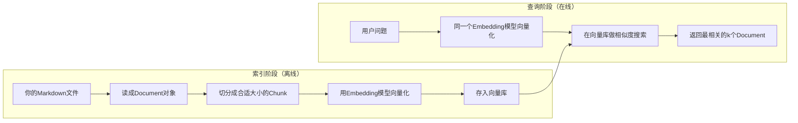

# 第11课 模型不知道你的私有文档？先把检索这一步走通

上一节课我们用中间件给Agent装上了规划能力，复杂任务它也能先列计划再执行了。但你很快会遇到一个本质的天花板：模型的知识是训练时就定死的，它不知道你电脑里的文档、不知道这门课的内容、不知道你们公司的内部资料。你问它"s07讲了什么"，它要么瞎编，要么说不知道。

这节课先解决"找得到"的问题：怎么让程序检索你自己的资料？以及为什么说向量检索只是一种实现方式，真正重要的是Retriever这个统一抽象。



---
## 先搞懂：为什么不能直接把文档塞给模型？
最直接的想法：不就是让模型看文档吗？把所有文档内容拼在提示词里不就行了？

这个方法在文档特别短的时候能用，但只要资料稍微多一点，就有三个绕不开的问题：
- **上下文窗口有限**：再大的模型也有token上限，你不可能把几百页文档一次性全塞进去；
- **成本高速度慢**：每次提问都传一遍全部文档，token费用会非常高，响应速度也会很慢；
- **噪声太多**：大部分内容和当前问题无关，把无关内容也塞给模型，反而会干扰它的判断。

这就是检索存在的理由：
> 只要你想让模型用到训练数据之外的私有知识，就必须先检索——只把和问题相关的那一小部分内容找出来，再交给模型。

它的价值也不止"省token"：检索本质是在"模型的静态知识"和"你的动态私有数据"之间架了一座桥。有了检索能力，模型就不用重新训练，也能用到你最新的、私有的资料。这就是大家常说的RAG（检索增强生成）的第一步。

---
## 关键词匹配，为什么不够用？
说到检索，老办法是关键词匹配：问题里有什么词，就在文档里搜包含这个词的段落。它够用吗？

关键词搜索（比如传统的数据库like查询、Elasticsearch的全文检索）确实能用，但它有三个本质缺陷：
第一，**理解不了语义**。
你问"怎么给Agent加记忆"，文档里写的是"Checkpointer实现状态持久化"，关键词匹配搜不到，因为没有一模一样的词，但语义上它们是一回事。

第二， **处理不了同义词和变体**。
"大模型"、"LLM"、"语言模型"说的是同一个东西，但关键词匹配会把它们当成完全不同的词。

第三， **排序能力差**。
关键词匹配只能按"有没有出现"来判断，没法判断"哪段内容和问题最相关"，很容易把不相关但碰巧有这个词的内容排在前面。

语义检索换的是匹配的维度：
> 检索的本质不是"字符串匹配"，而是"语义相似度匹配"。把文字变成向量（Embedding），在向量空间里找离问题最近的内容，就能理解语义、处理同义词、按相关度排序。

LangChain在这之上又抽了一层：先定义统一的Retriever接口——输入一个问题字符串，返回相关的Document列表。至于底层是向量检索、关键词检索、数据库查询还是搜索引擎，都只是这个接口的不同实现。

---
## 第一步：离线建索引——把文档变成可检索的向量
就像图书馆要先给每本书编目、做索引，读者才能快速找到书，你的文档也要先经过一系列处理，才能被快速检索到。这个过程叫"索引"，一般离线做一次就够了。

整个索引过程分四步走：

**1. 把文件读成统一的Document对象**
不管是Markdown、PDF、Word还是网页，先统一读成LangChain的`Document`对象——它就是一段文本加上一些元数据（比如来源文件名）。
```python
DEFAULT_KNOWLEDGE_DIR = Path(__file__).resolve().parent / "knowledge"

def load_markdown_docs(folder: str | Path) -> list[Document]:
    docs: list[Document] = []
    for path in _markdown_paths(folder):
        docs.append(Document(
            page_content=path.read_text(encoding="utf-8"),
            metadata={"source": path.name},  # 记录来源，后面引用要用
        ))
    return docs
```

**2. 把长文档切分成小块（Chunk）**
一整篇文档太长了，检索粒度太粗，也容易超token。我们用`RecursiveCharacterTextSplitter`把文档切成小段，优先按段落、换行、空格切，尽量保持语义完整。
```python
def split_docs(docs: list[Document]) -> list[Document]:
    splitter = RecursiveCharacterTextSplitter(
        chunk_size=220,    # 每块大概220字符
        chunk_overlap=40,  # 相邻块重叠40字符，避免把句子从中间切断
        add_start_index=True,
    )
    return splitter.split_documents(docs)
```

**3. 用Embedding模型把文本变成向量**
Embedding模型可以把一段文字变成一个高维向量，语义相近的文字，向量在空间中的距离也近。这里我们用OpenAI的Embedding模型，注意：**建索引和查问题必须用同一个Embedding模型**，不然向量不在同一个空间里，没法比相似度。

**4. 把向量存进向量库**
把切好的Chunk一个个向量化，存进`InMemoryVectorStore`——这是一个存在内存里的向量库，适合入门学习，生产环境可以换成Chroma、Pinecone、PGVector等持久化向量库。

最后调用`as_retriever()`，把向量库包装成一个标准的Retriever对象：
```python
def build_retriever(folder=DEFAULT_KNOWLEDGE_DIR, embeddings=None, k: int = 2):
    docs = load_markdown_docs(folder)
    splits = split_docs(docs)
    if embeddings is None:
        embeddings = OpenAIEmbeddings()
    store = InMemoryVectorStore(embeddings)
    store.add_documents(splits)
    return store.as_retriever(search_kwargs={"k": k})  # 返回最相关的2个
```

---
## 第二步：在线查询——输入问题，返回相关文档
索引建好了，查询就非常简单了——和所有LangChain组件一样，Retriever也用统一的`.invoke()`方法调用，输入问题字符串，返回相关的Document列表。

```python
def search_notes(query, folder=DEFAULT_KNOWLEDGE_DIR, embeddings=None) -> list[Document]:
    retriever = build_retriever(folder=folder, embeddings=embeddings)
    return retriever.invoke(query)
```

调用之后发生的事情和索引阶段正好反过来：
1.  把用户的问题用同一个Embedding模型变成向量；
2.  在向量库里做相似度搜索，找出离问题向量最近的k个Chunk；
3.  把这k个Chunk包装成Document列表返回，每个Document都带文本内容和来源元数据。

> 向量库只是本课的载体，要带走的是**Retriever这个统一抽象**。你只需要记住：Retriever就是"输入问题，返回相关Document"的组件，至于底层怎么实现的，上层代码不需要关心。
>
> 这里有一个初学者很容易踩的坑：我们现在用的是无阈值的top-k检索——它返回的是"库里面最像的k个"，不是"足够像的k个"。哪怕你问的问题和库里面的内容完全无关，它也会硬返回k个结果给你。真正的生产系统还要加相似度阈值、重排等步骤，本课先把最基础的流程走通。

---
## 为什么这层抽象非常重要？
搜个文档为什么要搞这么多概念？这层抽象的价值，和第一节课的统一模型入口是同一个道理：
1.  **实现可替换**：今天用内存向量库，明天换成Pinecone云服务，后天加一个关键词检索做混合搜索，上层调用代码一行都不用改，因为都是Retriever接口。
2.  **能力可组合**：Retriever可以套娃——你可以做一个"多路Retriever"，同时搜向量库、搜搜索引擎、搜数据库，最后合并结果去重；也可以做一个"上下文压缩Retriever"，把返回的结果再精简一遍。
3.  **和Agent生态无缝对接**：后面我们把Retriever包装成工具给Agent用的时候，Agent不需要知道你是怎么搜的，它只要知道"这个工具输入问题返回相关内容"就够了。

这就像图书馆的咨询台：你只管把问题递过去，馆员是翻书库、查期刊还是检索数字库，你完全不用关心。Retriever就是大模型应用的"资料咨询台"。

---
## 动手试一试
现在你可以亲手跑一跑，看看检索是怎么工作的。
先进入对应的文件夹运行程序：
```bash
cd learn-langchain
uv run python -m s11_retrieval_basics.code
uv run pytest s11_retrieval_basics/tests -q
```

### 实验1：观察切分后的Chunk数量
打印`split_docs()`返回的列表长度，和原始文件数量对比一下。
你会发现一篇文档被切成了好几个Chunk，理解为什么要切分——太长的文本不仅检索不准，也塞不进模型的上下文。试着改一改`chunk_size`和`chunk_overlap`参数，看看切分结果有什么变化。

### 实验2：测试语义检索效果
问几个语义相关但用词不一样的问题，比如：
- "怎么给Agent加记忆？"
- "Checkpointer是用来做什么的？"
- "多轮对话怎么实现？"
你会发现虽然这些问题用词不一样，但都能正确找到s09相关的内容，这就是语义检索和关键词匹配的区别。

### 实验3：测试无阈值top-k的特性
问一个完全不相关的问题，比如"怎么做红烧肉？"。
观察返回结果——它还是会返回k个Chunk，只是这些内容和问题其实不相关。理解为什么说"top-k不保证相关性"，生产环境为什么要加阈值过滤。再试着把k从2改成3、改成5，看看返回结果数量的变化。

---
## 相对上一课的变化
s11引入了全新的检索组件，但依然严格遵循LangChain统一的invoke调用约定。

| 维度 | s10 Todo中间件 | s11 检索基础 |
| --- | --- | --- |
| 核心组件 | Agent + Middleware | Retriever |
| 调用约定 | `agent.invoke(...)` | `retriever.invoke(查询字符串)`，依然是统一的invoke接口 |
| 返回类型 | 带messages和todos的状态字典 | Document列表 |
| 有没有模型参与 | 有Chat Model做决策 | 只有Embedding模型做向量化，没有Chat Model |
| 解决的问题 | Agent的能力扩展 | 私有知识的查找 |

**本课新增的核心原语**：`Document` / `RecursiveCharacterTextSplitter` / `Embeddings` / `InMemoryVectorStore` / `Retriever`
**保持不变的基础约定**：统一的invoke调用约定，组件之间通过明确的输入输出类型对接。

---
## 检查点
学完本节，你应该能回答这几个问题：
- 为什么不能直接把所有文档都塞给模型，而要先检索？
- 为什么建索引和查问题必须用同一个Embedding模型？
- 为什么说top-k返回的结果不一定是相关的？举个例子说明。

---
## 本节课小结
这节课的重点浓缩起来是：
> 先抽象接口，再谈实现。Retriever的本质就是"输入问题，返回相关文档"，向量检索只是最常用的一种实现方式，不是检索的全部。

把文档变成向量存起来再搜出来，只是流程；真正要记住的是设计取向：面向接口编程，而不是面向实现编程。只要接口稳定，底层实现可以随便换，上层代码不用动。

现在Retriever已经能帮我们找到相关的文档片段了，但它只会"找"，不会"答"——返回一堆片段给用户，用户还要自己读自己总结。下一节课，我们就把检索出来的片段交给模型，让它根据资料组织成自然语言回答，这就是最小可用的RAG。

进入下一课：[s12 最小RAG — 先找资料，再根据资料回答](../s12_minimal_rag/)
