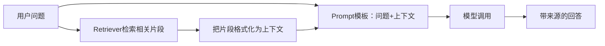

# 第12课 找到了资料还不会答？把检索和生成串起来就是最小RAG

上一节课我们搭好了检索的基础：输入问题，Retriever能帮我们找到相关的文档片段。但这还不够——Retriever只会返回一堆零散的文本片段，用户还要自己读、自己总结、自己判断哪段有用。更糟的是，如果直接让模型回答，它还是会用训练时的旧知识，甚至一本正经地胡说八道。

这节课把RAG拆开揉碎讲明白：它到底是什么？以及怎么用最简单的方式，把"检索"和"生成"这两段串起来，让模型只根据你给的资料回答，资料不足就说不知道。



---
## 先搞懂：为什么光有检索还不够？
"RAG就是接个向量库"是最常见的误解，实际上检索只是RAG的一半。你把资料找出来了，不代表模型就会用，这里面有三个很实际的问题：
- **模型不知道要用资料**：你不特意告诉它，模型还是会优先用自己训练时的知识，检索出来的内容它可能看都不看；
- **模型会瞎编**：哪怕资料里没有答案，它也会按照自己的理解编一个看起来很合理的答案，你根本分不清哪句是资料里有的，哪句是它编的；
- **没有来源追溯**：它说的内容到底来自哪份文档？你没法验证，出了错也不知道是检索错了还是模型理解错了。

先把定义摆正：
> RAG不是"模型突然有了知识库"，而是两段程序的明确分工：检索负责找对资料，生成负责根据资料组织答案，中间靠Prompt把两者接起来。

它带来的也不只是"能回答私有文档的问题"：最小RAG的本质，是给模型的回答划了一条明确的边界：只能用我给你的资料回答，不许自己瞎编。这是解决大模型幻觉问题最基础、最有效的手段。

---
## 直接把检索结果塞给模型？为什么容易出问题
检索接生成，看起来把片段拼在问题后面发给模型就完事了。真这么干会遇到什么？

这么做能跑通最简单的demo，但很容易出问题，就像你让别人查资料写报告，不告诉他要求，他很容易自由发挥：
第一，**模型会忽略资料**。
你只是把片段贴在那里，没有明确告诉模型"只能用这些内容回答"，模型还是会按照自己的知识来，尤其是当问题它本来就会的时候，检索的资料它根本不看。

第二，**资料不足时硬编**。
如果检索出来的内容和问题不相关，或者根本没有答案，模型不会说"我不知道"，而是会硬编一个答案出来，看起来还特别像真的。

第三，**没有来源标注**。
回答里的每句话来自哪里，你完全不知道，想验证都没法验证，出了错也不好排查。

缺的其实是一纸说明：
> 不是把资料扔给模型就完事了，而是通过Prompt明确告诉它行为规则：只能用给定的上下文回答，资料不足就说不知道，回答要保留来源标签。

这套分工正好落在LangChain的组件观里：组件之间通过明确的契约协作。Retriever负责返回Document，Prompt模板负责把问题和上下文组装成模型能理解的格式，模型负责生成符合要求的回答，每个组件只做自己该做的事。

---
## 第一步：定义带行为约束的RAG提示模板
就像给员工布置工作要讲清楚要求，让模型根据资料回答，也要在Prompt里把规则说清楚。我们用s04学过的`ChatPromptTemplate`来定义RAG专用的提示模板。

模板分两部分：
- **System消息**：讲清楚行为规则——只能根据上下文回答，没有答案就说不知道，回答要保留来源标签；
- **Human消息**：把问题和上下文作为变量填进去。

```python
RAG_PROMPT = ChatPromptTemplate.from_messages([
    (
        "system",
        "你是课程助教。只能根据给定上下文回答；如果上下文没有答案，就说不知道。"
        "回答时保留 [文件名] 来源标签。",
    ),
    ("human", "问题：{question}\n\n上下文：\n{context}"),
])
```

这里有两个非常重要的细节：
1.  **"资料不足就说不知道"是软约束**：它能显著降低幻觉的概率，但不是100%保证——模型还是有可能忽略指令瞎编，真正的生产系统还要加答案验证、事实核查等机制；
2.  **来源标签只是文本标记**：`[文件名]`只是我们写在Prompt里让模型保留的标记，不是程序自动验证过的引用，模型有可能标错来源，这点要清楚。

---
## 第二步：把检索结果格式化为模型能读的上下文
Retriever返回的是Document对象列表，模型读不了对象，我们需要把它们拼成一段清晰的文本，每个片段前面标上来源文件名。这一步就是"检索结果"到"Prompt可读取字符串"的转换。

```python
def format_context(docs: list[Document]) -> str:
    return "\n\n".join(
        f"[{doc.metadata.get('source')}] {doc.page_content}"
        for doc in docs
    )
```

逻辑非常简单：
- 遍历所有检索到的Document；
- 每个片段前面加上`[来源文件名]`的标记；
- 片段之间用空行隔开，方便模型阅读。

这一步看起来不起眼，但非常重要——你把上下文格式整理得越清晰，模型越不容易看错，引用来源的准确率也越高。

---
## 第三步：串起完整流程：检索→拼Prompt→调用模型
现在所有零件都齐了，我们把它们串成一条直线：先检索，再拼上下文，再填Prompt，最后调用模型，拿到回答。

```python
def answer_question(question: str, retriever, model=None) -> str:
    if model is None:
        model = init_chat_model(os.environ["LANGCHAIN_MODEL"])
    # 1. 检索相关文档
    docs = retriever.invoke(question)
    # 2. 组装Prompt
    messages = RAG_PROMPT.invoke({
        "question": question,
        "context": format_context(docs)
    }).to_messages()
    # 3. 调用模型
    response = model.invoke(messages)
    return message_text(response)
```

整个流程没有任何黑魔法，就是三个我们之前都学过的组件，按照顺序串起来而已：
- `retriever.invoke()`是s11学的，负责找相关片段；
- `RAG_PROMPT.invoke()`是s04学的，负责组装带规则的提示；
- `model.invoke()`是s01学的，负责生成回答。

> 这一课的重点全在**检索和生成之间的接缝**上。找是找，答是答，中间通过明确的Prompt契约把两者连起来，这就是最小可用的RAG。
>
> 这里要特别说明：s12的RAG是你手动串起来的一条直线——什么时候检索、检索几次，都是你代码写死的。模型不会自己决定要不要去检索，也不会检索完觉得不够再检索一次。把"什么时候去检索"的决定权也交给模型，让Agent自己判断什么时候该查资料，是下一节课综合项目要做的事。

---
## 为什么这种设计足够简单又足够好用？
最小RAG看起来就是几个函数串起来，没有用任何复杂的概念，但它抓住了RAG最核心的本质：
1.  **边界清晰**：每个组件只做一件事，检索、格式化、提示、生成，职责分明，出了问题很容易定位是哪一步错了；
2.  **完全复用之前的知识**：没有引入任何新概念，用的全是前11课学过的原语——Prompt模板、模型调用、Retriever，你不需要学新东西就能理解；
3.  **可扩展**：今天是手动串的直线流程，明天想让Agent自动调用，只要把检索包装成工具就行，核心逻辑一行不用改。

这就像做番茄炒蛋：不需要什么复杂的厨具，鸡蛋、番茄、盐，按顺序炒就能吃。RAG也是一样，核心逻辑就是"找资料+根据资料答"，不需要一开始就上各种复杂的框架和概念。

---
## 动手试一试
现在你可以亲手跑一跑，看看最小RAG是怎么工作的。
先进入对应的文件夹运行程序：
```bash
cd learn-langchain
uv run python -m s12_minimal_rag.code
uv run pytest s12_minimal_rag/tests -q
```

### 实验1：打印格式化后的上下文
调用`format_context()`函数，打印它返回的字符串。
观察每个片段是不是都带了`[文件名]`来源标记，片段之间是不是用空行隔开了。理解为什么要做格式化——直接把Document对象扔给模型是没用的，必须转成它能读懂的文本格式。

### 实验2：测试资料里有的问题
问几个课程里明确有的问题，比如：
- "s07讲了什么？"
- "怎么给Agent加记忆？"
- "Checkpointer是做什么用的？"
观察模型的回答，是不是带上了来源标签，内容是不是和我们课程里讲的一致。对比一下不做RAG直接问模型，看看回答有什么区别。

### 实验3：测试资料里没有的问题
问一个资料里完全没有的问题，比如：
- "LangChain是什么时候成立的？"
- "怎么做红烧肉？"
观察模型会不会说"不知道"。多试几次，体会"说不知道"是软约束——有时候模型还是会忍不住瞎编，这也是为什么生产环境需要额外的验证机制。

---
## 相对上一课的变化
s12把检索和生成串成了最小RAG，但所有组件都是之前学过的，没有引入新原语。

| 维度 | s11 检索基础 | s12 最小RAG |
| --- | --- | --- |
| 核心流程 | 只有检索 | 检索 → 格式化 → 生成，一条直线 |
| 调用的组件 | Retriever | Retriever + ChatPromptTemplate + Chat Model |
| 返回结果 | Document列表 | 自然语言回答，带来源标签 |
| 模型参与 | 只有Embedding模型 | Chat Model负责生成回答 |
| 有没有Agent | 没有 | 没有，手动串联流程 |

**本课新增的核心原语**：无（全部是之前组件的组合）
**保持不变的基础约定**：所有组件还是用`.invoke()`调用，Retriever返回Document，模型返回AIMessage，契约全部不变。

---
## 检查点
学完本节，你应该能回答这几个问题：
- 为什么说"把检索结果直接扔给模型"是不够的？Prompt里需要明确哪些规则？
- 为什么说"资料不足就说不知道"是软约束，不是100%保证？
- 最小RAG的三步流程是什么？每一步分别负责什么？

---
## 本节课小结
这节课把RAG请下了神坛：
> RAG没有那么神秘，它就是检索和生成的明确分工：Retriever负责找对资料，Prompt负责讲清规则，模型负责组织答案。把这三步串起来，就是最小可用的RAG。

几个学过的组件、一条直线的流程，完成的却是很多人眼里"很高级"的RAG——简单组件通过明确契约组合，就能完成复杂任务。没有魔法，也没有黑盒。

现在我们已经有了所有需要的零件：模型、工具、Agent、记忆、中间件、检索、RAG。最后一节课，我们就把这些零件全部组装起来，做一个真正能用的课程助教——它能记住对话、能做计划、能自己决定什么时候查课程笔记、能根据资料回答问题。

进入下一课：[s13 综合项目 — 把所有零件组装成一个完整应用](../s13_comprehensive_project/)
