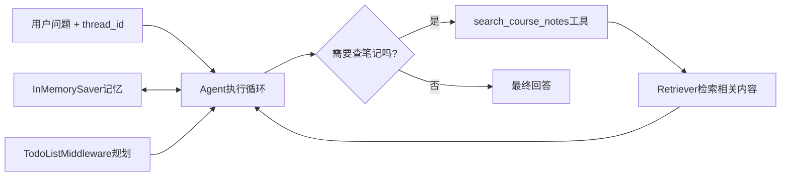

# 第13课 把零件组装起来：做一个真正能用的课程助教

前面12课，我们把LangChain最核心的原语一个个都造好了：统一的模型入口、消息列表、提示模板、结构化输出、工具、Agent循环、流式输出、短期记忆、中间件、检索、最小RAG。但这些零件一直是散的——s12的RAG是你手动检索再回答，不会自己查资料；s09的记忆和s11的检索也没有接起来。

最后一课我们不学任何新东西，只做一件事：选合适的零件，把它们组装成一个真正能用的课程助教。它能记住多轮对话、复杂任务会先做计划、课程问题会自动查笔记、根据资料回答还带来源。学完这一课，你就真的能用LangChain做东西了。



---
## 先搞懂：做应用不是堆功能
学完一堆API之后，做项目最常见的冲动是"把所有学过的东西都塞进去"——模板、结构化输出、流式、记忆、检索、中间件、多Agent……什么都要有，结果做出来一个四不像，复杂又难用。

这是做应用最大的误区：**不是功能越多越好，而是刚好满足需求就好**。我们要做的是一个"课程助教"，它的核心需求非常明确：
1.  能回答关于这门课的问题，回答要基于课程笔记，不能瞎编；
2.  能记住同一会话的上下文，多轮对话不用重复说；
3.  复杂问题能先规划再回答，不要东一榔头西一棒子。

就这三个核心需求，多一个功能都是冗余。所以我们不需要把所有学过的东西都用上——动态模板、结构化输出、逐token流式这些，这个场景暂时不需要，就不用加。

这一课先立规矩：
> 做应用的本质是做取舍。根据需求选合适的组件，用最简单的方式把它们接起来，跑通核心流程，比什么功能都堆重要得多。

助教本身也不是目的：这一课真正想教你的，是怎么用LangChain的组件化思想搭系统——拿到一个需求，先想清楚需要什么能力，每个能力对应哪个组件，然后把组件像搭积木一样拼起来，每个组件只做自己该做的事。

---
## 自己从头写一个Agent？没必要
学到这里你可能手痒：已经知道Agent循环是怎么回事了，要不自己从头写一个循环，把记忆、检索、规划都自己实现一遍？

当然可以，但这违背了我们用框架的初衷。就像你买了宜家的家具，不需要自己从砍树开始做木板：
第一，**重复造轮子**。
状态管理、工具调用循环、中间件机制、错误处理，这些框架已经帮你写好了，而且经过了大量测试，自己写很容易出bug。

第二，**扩展困难**。
今天你自己写了一个简单循环，明天要加流式、要加断点续跑、要加人工审核，又要全部重写。

第三，**失去生态优势**。
LangChain生态里的所有工具、中间件、向量库，都是基于标准的Agent接口做的，自己写的循环用不了这些生态。

结课项目要示范的恰恰相反：
> 相信框架的抽象，用标准的方式组装标准组件。你要做的不是重写框架，而是理解每个组件的边界，把它们放在正确的位置上。

这也是十三课反复出现的同一件事：所有组件都遵循统一的接口，你不需要知道它们内部怎么实现的，只要知道输入输出是什么，就能把它们拼起来。

---
## 第一步：把Retriever包装成标准工具
Agent不会自己去调用Retriever，它只会调用工具。所以我们要做的第一件事，就是用s06学过的`@tool`装饰器，把s11/s12的Retriever包装成一个Agent可以调用的工具。

这个工具做的事情非常简单：输入问题，调用Retriever找到相关片段，把片段格式化成带来源的字符串返回。
```python
def make_search_tool(retriever):
    @tool
    def search_course_notes(question: str) -> str:
        """在本课程笔记中搜索与问题相关的片段。"""
        docs = retriever.invoke(question)
        return "\n\n".join(
            f"[{doc.metadata.get('source')}] {doc.page_content}"
            for doc in docs
        )
    return search_course_notes
```

这里我们故意手写`@tool`包装，而不是用框架自带的`create_retriever_tool`，就是为了让你看清：检索工具没有任何特殊之处，它就是一个普通的工具，和s06里的`count_words`本质上是一样的——输入参数，执行逻辑，返回结果。

docstring依然是给模型看的说明书，要写清楚这个工具是做什么的，模型才会在合适的时候调用它。

---
## 第二步：组装所有组件，创建Agent
工具做好了，接下来就是创建Agent。你会发现`create_agent`的参数列表，就是我们这门课学过的"零件清单"——需要什么能力，就把对应的组件填到对应的参数里：

```python
SYSTEM_PROMPT = (
    "你是 LangChain 初学者课程助教。"
    "课程内容问题必须先搜索笔记。"
    "资料不足就明确说不知道。"
    "回答时保留 [文件名] 来源标签。"
)

def build_assistant(model=None, retriever=None):
    if model is None:
        model = init_chat_model(os.environ["LANGCHAIN_MODEL"])
    if retriever is None:
        retriever = build_retriever()
    return create_agent(
        model=model,                                     # s01：统一模型入口
        tools=[make_search_tool(retriever)],             # s06：检索工具
        system_prompt=SYSTEM_PROMPT,                     # s03：系统提示
        middleware=[TodoListMiddleware()],               # s10：规划中间件
        checkpointer=InMemorySaver(),                    # s09：短期记忆
    )
```

我们一个个来看这些参数分别对应哪一课、解决什么问题：
- `model`：s01学的统一模型入口，换模型只改配置，不改代码；
- `tools`：s06学的标准工具，这里我们放了包装好的课程笔记检索工具；
- `system_prompt`：s03学的系统提示，明确告诉Agent行为规则——课程问题必须先搜笔记，资料不足就说不知道，要保留来源；
- `middleware`：s10学的中间件，这里挂TodoListMiddleware，复杂任务自动先规划；
- `checkpointer`：s09学的状态持久化，自动记住多轮对话历史。

看到了吗？没有任何新东西，每一个参数都是我们前面学过的。你不需要记任何新的API，只要把学过的零件填到对应的槽里就行。

---
## 第三步：像普通Agent一样调用，自动拥有所有能力
Agent组装好了，调用方式和s09带记忆的Agent完全一样——传消息，传`thread_id`，剩下的事情Agent自己会做：
- 它会自己判断这个问题是不是需要先搜笔记；
- 需要的话它会自己调用`search_course_notes`工具；
- 拿到检索结果它会自己根据资料组织回答，保留来源；
- 复杂问题它会自己先写Todo计划；
- 同一`thread_id`的历史对话它会自动记住。

```python
def ask(agent, thread_id: str, question: str):
    return agent.invoke(
        {"messages": [{"role": "user", "content": question}]},
        config={"configurable": {"thread_id": thread_id}},
    )

def final_answer(agent, thread_id: str, question: str) -> str:
    result = ask(agent, thread_id, question)
    return message_text(result["messages"][-1])
```

你不需要写任何if-else来判断"要不要搜笔记"，不需要自己维护历史消息，不需要自己提醒它做计划——这些全是框架和模型的事。你只需要问问题，拿答案。

> 课程助教只是这门课的毕业作品，要带走的是**用组件化思想搭系统的方法**。你学会的不是怎么拼这一个应用，而是拿到任何需求，都能把它拆成一个个能力，对应到LangChain的标准组件，然后像搭积木一样把它们拼起来。
>
> 这里也要说清楚：我们在系统提示里写了"必须先搜索笔记""资料不足就说不知道"，这些依然是软约束。真实场景下模型还是有可能不搜就答、有可能瞎编、有可能标错来源，这些问题需要通过评估、提示工程、结果验证来逐步优化，不是搭完架子就100%完美了。

---
## 回头看：这门课到底教会了你什么？
13节课走下来，你会发现我们其实只在反复强调两件事：

**第一条主线：所有对话上下文，都用消息对象承载。**
从s02开始，不管是单轮问答、多轮对话、工具调用结果、系统提示，所有上下文都存在消息列表里。模型输入是消息，输出是消息，工具返回是消息，记忆存的也是消息。消息是整个LangChain对话系统的统一数据结构。

**第二条主线：所有组件都遵循统一的可调用约定。**
不管是模型、工具、Prompt模板、Retriever、Agent，只要是可运行的组件，都用`.invoke()`调用，都有明确的输入输出类型。你学会了一个组件的用法，其他组件拿过来就能用，不用记一堆乱七八糟的API。

这就是LangChain最核心的设计心智模型：**统一的数据结构 + 统一的调用接口**。在这个基础上，组件可以自由组合，能力可以渐进式添加，你不需要推倒重来，只要像搭积木一样往上加就可以了。

### 接下来可以学什么？
主线课程到这里就结束了，但LangChain的世界才刚刚打开大门。你可以根据自己的需求继续深入：

| 方向 | 学什么 | 承接哪一课 |
| --- | --- | --- |
| 长对话处理 | `trim_messages`自动裁剪历史，避免撑爆上下文 | s09 |
| 生产级记忆 | 从内存版`InMemorySaver`换成SQLite/Redis/Postgres持久化 | s09 |
| 高级检索 | 混合检索、重排、父子文档、查询改写 | s11/s12 |
| 可观测性 | LangSmith调试、回调函数、链路追踪 | s07 |
| LangGraph深入 | 揭开`create_agent`的盖子，自己写复杂状态图 | s07 |
| 多Agent协作 | 用LangGraph子图实现多个Agent分工合作 | s07 + LangGraph |
| 生产部署 | 错误重试、限流、缓存、评估体系 | 全部 |

> 关于LCEL管道语法：你可能在别的教程里见过`prompt | model | parser`这种管道写法，本课程故意没教——因为`create_agent`内部根本不用管道，它是用LangGraph状态图实现的。管道是Prompt、模型、解析器简单串联的语法糖，不是用Agent的前提。等你把主线吃透了，再去看管道语法，5分钟就能学会。

---
## 动手试一试
现在你可以亲手跑一跑这个完整的课程助教，感受一下组装完成的效果。
先进入对应的文件夹运行程序：
```bash
cd learn-langchain
uv run python -m s13_comprehensive_project.code
uv run pytest s13_comprehensive_project/tests -q
```

### 实验1：测试自动检索效果
问几个课程相关的问题，比如：
- "s09讲了什么？"
- "怎么给Agent加记忆？"
- "中间件是用来做什么的？"
打印完整的消息轨迹，观察Agent是不是自动调用了`search_course_notes`工具，回答是不是带了来源标签。

### 实验2：测试多轮记忆
用同一个`thread_id`连续对话：
- 第一轮："我叫浩然，记住我的名字。"
- 第二轮："s07讲了什么？"
- 第三轮："我叫什么？"
第三轮它应该能答出你的名字，说明记忆生效了。再换一个`thread_id`问名字，应该答不上来，验证会话隔离。

### 实验3：扩展助教的能力
试着给这个助教加一个新能力：比如让它能算词数，把s06的`count_words`工具也加到tools列表里。
你会发现加一个工具真的就只是往列表里加一项，其他代码一行都不用改——这就是组件化设计的威力。你还可以试试加新的笔记到knowledge文件夹，不用重启程序，它就能搜到新内容。

---
## 相对上一课的变化
s13没有引入任何新原语，只是把之前学过的组件组装起来，形成一个完整闭环。

| 维度 | s12 手动RAG | s13 完整助教 |
| --- | --- | --- |
| 谁决定检索 | 你代码写死每次都检索 | Agent自己判断要不要检索 |
| 执行流程 | 一条直线：检索→回答 | Agent循环：可以多次检索、可以规划、可以对话 |
| 有没有记忆 | 无，每轮独立 | Checkpointer自动跨轮记忆 |
| 有没有规划 | 无 | TodoListMiddleware按需规划 |
| 新原语 | 无 | 无，全部是之前组件的组合 |

**本课新增的核心原语**：无（综合应用）
**保持不变的基础约定**：所有组件的接口、调用方式、数据结构全部和之前一致。

---
## 检查点
学完本节，你应该能回答这几个问题：
- 为什么做应用不是功能堆得越多越好？我们这个助教为什么没加流式、结构化输出这些功能？
- 能说出助教里每个组件分别来自哪一课、解决什么问题吗？
- 如果想给助教加一个新工具（比如计算器），需要改哪些地方？

---
## 结课语
13节课到这里就全部结束了。

回头看，我们其实没有讲多少高大上的概念，也没有教你一堆奇技淫巧。我们从最简单的"调用一次模型"开始，一步步往上搭：先定统一接口，再加消息上下文，再加提示模板，再加结构化输出，再加工具，再加Agent循环，再加流式，再加记忆，再加中间件，再加检索，最后把它们拼起来。

整个过程中，最基础的那些约定——`init_chat_model`拿模型实例、`.invoke()`统一调用、消息承载上下文——从第一课定下来，就再也没有变过。这就是框架设计的魅力：用稳定的基础约定，支撑起上层千变万化的应用。

现在你已经掌握了LangChain最核心的心智模型。剩下的，就是去做你自己的应用吧。

---
**恭喜你，学完了LangChain初学者的全部主线课程！** 🎉
