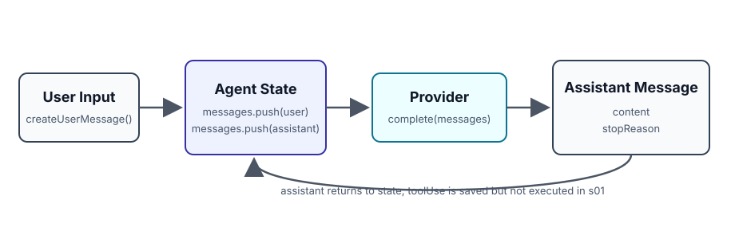

# s01 · Agent Loop

English · [中文](README.zh.md) · [日本語](README.ja.md)

[Contents](../README.md) · [s02 →](../s02_tool_schema/README.md)

> In one sentence: an agent loop is, first of all, a piece of control flow around messages and stopReason — user in, state turns over, assistant out.
>
> Where this sits in Pi: the minimal state flow of `@earendil-works/pi-agent-core`.

→ Open Pi and the first thing you see is the terminal and its commands — but underneath sits a control flow you can write in a few dozen lines
→ The minimal slice of one request: a user message goes in, the state turns over once, an assistant message comes out
→ stopReason carries three signals: stop / toolUse / error; in this lesson toolUse is only recorded, never executed

---

## The problem

Open Pi and you first run into the terminal UI, model selection, sessions, extensions, and a pile of commands. It's easy for a beginner to follow those threads and conclude that the agent's substance lives in the commands and the interface.

But in Pi's layering, what sits underneath is `@earendil-works/pi-agent-core`. It doesn't care what the terminal looks like, and it doesn't care how tools get executed. It asks a much smaller question: which `AgentMessage`s exist right now, which provider does the next request go to, and once the assistant replies, does this turn end, error out, or want to call a tool.

If this step stays blurry, everything that comes later — event streams, tools, the session tree, the extension runtime — turns into a pile of mechanism names. s01 does exactly one thing: run the state transition from one user message to one assistant message.

## The idea



Write a minimal `runOneTurn()`: put the user message into the state, hand the full state to the provider, then put the assistant message back into the state.

This lesson keeps only three signals:

| Signal | Meaning | What this lesson does |
|------|------|---------|
| `stopReason == "stop"` | assistant finished normally | record the assistant message |
| `stopReason == "toolUse"` | assistant wants to call a tool | keep the signal, execute nothing |
| `stopReason == "error"` | provider didn't get valid input | record the error message |

No tool execution here, no session files, no event streams, no terminal UI.

## Run it first

```sh
npm run session:s01
```

The output looks like this:

```text
User: hello
Assistant [stop]: Received: hello
User: does this lesson have tools?
Assistant [toolUse]: I want to call a tool, but this lesson has no tool executor yet.
Messages: 4
```

Those four messages are the current state:

```text
user
assistant
user
assistant
```

Watch the second turn: `stopReason=toolUse` flowed out of the provider, but no tool got executed. s01 just keeps it in the messages; it won't be wired to a real tool executor until s04.

## How the code works

Four steps.

**Step 1**: create the agent state. In s01 the state is just `messages`.

```ts
export function createInitialState(): AgentState {
  return { messages: [] };
}
```

**Step 2**: wrap the user input into an `AgentMessage` and append it to the state.

```ts
const userMessage = createUserMessage(userInput);
state.messages.push(userMessage);
```

**Step 3**: hand the current messages to the provider. The `DemoProvider` here is a fake model, so the course runs reliably without an API key. It fakes toolUse by scanning the input for the word `tool` — with a real provider, the model itself decides whether to call a tool; the string match here just makes the stopReason signal reproducible.

```ts
const assistantMessage = await provider.complete(state.messages);
```

**Step 4**: put the assistant message back into the state, and return this turn's result.

```ts
state.messages.push(assistantMessage);
return assistantMessage;
```

Assembled into the full function:

```ts
export async function runOneTurn(
  state: AgentState,
  provider: Provider,
  userInput: string,
): Promise<AssistantMessage> {
  const userMessage = createUserMessage(userInput);
  state.messages.push(userMessage);

  const assistantMessage = await provider.complete(state.messages);
  state.messages.push(assistantMessage);

  return assistantMessage;
}
```

Under 10 lines. It's not a full agent loop yet — just the minimal slice of one request. Pi's real loop keeps stacking onto this line: provider event streams, tool execution, hooks, sessions, and runtime modes.

## Try it yourself

Run it without `--demo` and you get an interactive REPL:

```sh
node s01_agent_loop/code.ts
```

Chat for a couple of turns, then type something containing `tool`, and watch `[stop]` turn into `[toolUse]`.

Then change a few things:

1. Add a third trigger to `DemoProvider` — when the input contains `fail`, return `stopReason: "error"`. Re-enter the REPL and confirm all three signals fire.
2. Add a `console.log(messages.length)` at the top of `provider.complete()` and chat a few more turns. You'll see 1, 3, 5… — the provider sees the full history every turn, not just the last message. That fact is the foundation every later lesson stands on.

When you're done, `npm run test:s01` confirms you haven't broken this lesson's behavior contract.

## Wiring into the main line

s01 has no previous lesson to compare against. What it puts down is the foundation every later lesson steps on:

| What this lesson establishes | Who uses it later |
| --- | --- |
| `AgentMessage` / `AgentState` | the s04 tool loop, s06 turn state, and the s07 session tree are all extensions of it |
| the `Provider` interface | s03 turns it into events, s04 starts calling it in a loop |
| `stopReason` | the s04 tool loop uses it to decide whether the turn continues or ends |

## Against the Pi source

Read [pi-source.md](pi-source.md) after finishing this lesson.

The mapping in one sentence: s01's `runOneTurn()` corresponds to the minimal path of `runAgentLoop()` plus `runLoop()` in Pi's `agent-loop.ts`; `AgentState.messages` corresponds to `AgentContext.messages`. Pi's real loop also has the event stream, context transformation, and tool execution — when you hit the provider event stream, feel free to skip ahead to s03; when you hit tool execution, stop, that's s04.

## Next up

The core can now run one user/assistant turn, but the assistant still can't reach any real capability. If the model wants to read files, write files, or run commands, it first needs to know which tools exist and what each tool's input looks like.

[s02 Tool Schema](../s02_tool_schema/README.md): Pi doesn't hand local functions straight to the model — it first describes each tool as a schema the provider can read.
