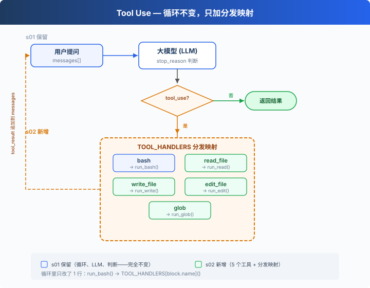

# s02: Tool Use — 每加一个工具，只加一行

[中文](README.zh.md) · [English](README.md) · [日本語](README.ja.md)

s01 → `s02` → [s03](../s03_permission/) → s04 → ... → s20
> *"每加一个工具，只加一个 handler"* — 循环不用动，新工具注册进 dispatch map 就行。
>
> **Harness 层**: 工具分发 — 根据工具名查表调用对应处理函数。

---

上一课的 Agent 已经能自己干活了，但手里只有 bash 一把瑞士军刀。它写文件的姿势是这样的：

```bash
echo 'print("hello")' > hello.py
```

内容简单时还行。一旦文件内容里有单引号、双引号、换行混着来，命令就得在转义里打滚：模型拼错一个字符，写进磁盘的就是坏文件，你还得再花一轮对话让它修。

这一课给它换上 5 个专用工具。重点不在工具本身，而在加工具的方式：循环一行都不用动。



---

## 只靠 bash，为什么不行

bash 理论上无所不能，问题出在别处。

**多了一层翻译。** 模型的意图是"读这个文件"，却要先翻译成 `cat path/to/file` 再输出。每次翻译都是一次出错机会，转义就是最常见的翻车点。

**输出不可控。** `cat` 不认行数，一个 5000 行的文件全量灌进对话。专用的读文件工具可以带 `limit` 参数，只取前 N 行。（历史无限膨胀的后果，s08 会专门算这笔账。）

**程序看不懂命令在干什么。** 对你的代码来说，一条 bash 字符串是黑盒：`cat` 和 `rm -rf` 都只是字符串，程序无法区分谁在读、谁在删。而 `read_file` 和 `write_file` 是两个名字不同的工具，读写一目了然。这个区别现在看着不起眼，到 s03 做权限控制时就是生死线：你总得先知道一个操作是读还是写，才能决定要不要拦。

所以方向很明确：常用操作各给一个专名工具，bash 留着兜底。

---

## 定义一条，注册一行

s01 的菜单上只有一道菜。现在扩到 5 道，每道菜就是 `TOOLS` 里的一条定义：

```python
TOOLS = [
    {"name": "bash",       "description": "Run a shell command.", ...},
    {"name": "read_file",  "description": "Read file contents.",  ...},   # 可带 limit 参数
    {"name": "write_file", "description": "Write content to a file.", ...},
    {"name": "edit_file",  "description": "Replace exact text in a file once.", ...},
    {"name": "glob",       "description": "Find files matching a glob pattern.", ...},
]
```

每个工具背后是一个普通函数。先看一个新面孔，所有文件工具都要过它这一关：

```python
def safe_path(p: str) -> Path:
    path = (WORKDIR / p).resolve()
    if not path.is_relative_to(WORKDIR):    # 解析后必须还在工作区内
        raise ValueError(f"Path escapes workspace: {p}")
    return path
```

模型传来的路径可能是 `../../etc/passwd` 这种越界货。`safe_path` 先把路径解析成绝对路径，再确认它没跑出工作目录。这是本课引入的第一道真正的安全边界。注意它只护住文件工具，bash 不经过它，这个口子留给 s03。

四个新工具的实现都很短：

```python
def run_read(path, limit=None):
    lines = safe_path(path).read_text().splitlines()
    if limit and limit < len(lines):
        lines = lines[:limit] + [f"... ({len(lines) - limit} more lines)"]
    return "\n".join(lines)

def run_write(path, content):
    file_path = safe_path(path)
    file_path.parent.mkdir(parents=True, exist_ok=True)   # 父目录不存在就建
    file_path.write_text(content)
    return f"Wrote {len(content)} bytes to {path}"

def run_edit(path, old_text, new_text):
    file_path = safe_path(path)
    text = file_path.read_text()
    if old_text not in text:                 # 找不到原文，明确报错
        return f"Error: text not found in {path}"
    file_path.write_text(text.replace(old_text, new_text, 1))   # 只替换第一处
    return f"Edited {path}"
```

`edit_file` 的两个设计值得停一下。原文必须精确匹配，找不到就报错，这是在逼模型先读后改：凭记忆改文件，记忆偏了就会改错地方，报错则会把它拉回去重读。只替换第一处，是防止一次替换把文件里不该动的同名文本也捎带改了。

然后是注册。工具名到函数的映射，一个字典写完：

```python
TOOL_HANDLERS = {
    "bash":       run_bash,
    "read_file":  run_read,
    "write_file": run_write,
    "edit_file":  run_edit,
    "glob":       run_glob,
}
```

循环里相应的改动只有一行。s01 是硬编码调用，s02 换成查表：

```python
for block in response.content:
    if block.type == "tool_use":
        handler = TOOL_HANDLERS.get(block.name)                       # 按工具名查表
        output = handler(**block.input) if handler else f"Unknown: {block.name}"
        results.append({"type": "tool_result", "tool_use_id": block.id, "content": output})
```

`while True`、`stop_reason` 判断、消息追加，全部原封不动。这就是本课的核心一句话：**循环不动，菜单在长。** 往后每一课加新能力，套路都一样：`TOOLS` 里一条定义，`TOOL_HANDLERS` 里一行注册。

---

## 模型一次点好几道菜

s01 结尾留了两个问题：模型会不会一次调用多个工具？会不会互相踩？

第一个问题的答案是会，而且很常见。你说"读一下 a.py 和 b.py"，模型的一条回复里就会带两个 `tool_use` 块。循环不需要为此做任何事：`for block in response.content` 本来就会遍历所有块，逐个执行、逐个收集结果，最后把所有 `tool_result` 装进同一条 `user` 消息发回去。

第二个问题：教学版按原始顺序逐个执行，天然不会互相踩，代价是慢——两个读文件明明可以同时跑。

> 真实 Claude Code：不是逐个执行。它把连续的"并发安全"调用切成一批并行跑（判断按具体输入来，`ls` 这样的只读 bash 也算安全），遇到会改状态的调用就截断、单独串行，批与批之间严格保序。教学版选顺序执行，因为它够用，而且好读。

---

## 相对 s01 的变更

| 组件 | 之前 (s01) | 之后 (s02) |
|------|-----------|-----------|
| 工具数量 | 1 (bash) | 5 (+read, write, edit, glob) |
| 工具执行 | 硬编码 `run_bash()` | `TOOL_HANDLERS` 查表分发 |
| 路径安全 | 无 | `safe_path` 校验（仅文件工具） |
| 循环 | `while True` + `stop_reason` | 与 s01 完全一致 |

---

## 试一下

```sh
cd learn-claude-code
python s02_tool_use/code.py
```

终端里的黄色 `> tool_name` 行现在打印的是工具名，不再是完整命令。试这几个任务：

1. `Read the file README.md and tell me what this project is about`：观察它选了 `read_file` 而不是 `cat`；
2. `Create a file called test.py that prints "hello", then read it back`：写和读各一轮，没有任何转义；
3. `Find all Python files in this directory`：`glob` 一轮出结果；
4. `Read both README.md and requirements.txt, then create a summary file`：看模型是不是在同一条回复里点了两个 `read_file`，终端会连续打出两行 `> read_file`。

再试一个越界路径：`Use read_file to read ../../etc/passwd`。`safe_path` 会报 `Path escapes workspace`。留意模型接下来的动作：如果它老老实实收手，很好；如果它转头用 bash 的 `cat` 读成功了，你就亲眼看到了文件工具和 bash 之间的防护落差。这个口子，正是下一课要堵的。

---

## 接下来

现在 Agent 有 5 个专用工具，文件操作被 `safe_path` 圈在工作区里。但 bash 还是不受限制：黑名单只挡了几个词，`rm -rf ./src` 这样的命令照跑不误。

s03 Permission → 在工具执行之前加一道门：这个操作安全吗？需要用户批准吗？

<!-- translation-sync: zh@v2, en@v0, ja@v0 -->
