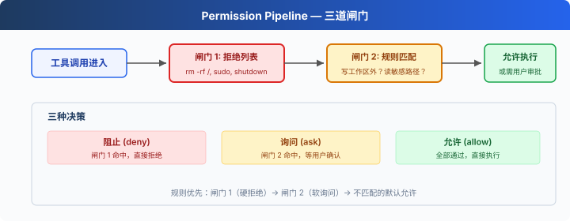

# s03: Permission — 执行前做权限判断

[中文](README.zh.md) · [English](README.md) · [日本語](README.ja.md)

s01 → s02 → `s03` → [s04](../s04_hooks/) → s05 → ... → s20
> *"工具执行前先做权限判断"* — 权限管线决定哪些操作需要审批。
>
> **Harness 层**: 权限管线（deny / ask / allow）。

---

上一课结尾留了个口子：文件工具被 `safe_path` 圈在工作区里，bash 却是自由的。现在让 Agent"清理一下项目"，它完全可能跑出一条 `rm -rf ./src`。

s01 藏在 `run_bash` 里的那张黑名单救不了场：名单上写的是 `rm -rf /`，而 `rm -rf ./src` 不在名单上。它删的还是你的代码。

这一课把安全这件事从工具实现里拿出来，做成执行前的一道统一关口。


---

## 把黑名单写死在工具里，为什么不行

s01 和 s02 的做法是最直觉的：在 `run_bash` 开头查一张危险词表，命中就拒绝。它有三个问题。

**只有两档，缺了最常用的第三档。** 黑名单的世界里只有"放行"和"拒绝"。可真实世界的大多数危险操作是"看情况"：`rm /tmp/cache.txt` 没事，`rm src/main.py` 要命。代码分不出这两者的区别，能分出来的只有人。所以决策不该是两种，而是三种：**永远不行（deny）、看情况问一下（ask）、直接放行（allow）。**

**安全逻辑长错了地方。** 检查写在 `run_bash` 里，那 `write_file` 的检查写哪儿？每加一个工具就得在实现里再写一遍安全逻辑，漏一个就是一个洞。拦截应该发生在所有工具的必经之路上：分发执行之前，统一一处。

**静默拒绝，谁也不知道。** 黑名单拦下操作时不出声，用户不知道 Agent 刚才想干什么，模型也只是碰了一鼻子灰。需要人批准的操作，应该把"是什么、为什么"摆到人面前。

所以这一课，`run_bash` 里的黑名单被删掉了，取而代之的是执行前的三道闸门。



---

## 闸门 1：硬拒绝表

第一道闸门管"永远不行"的操作。这类东西没有讨论余地，也不值得打扰用户：

```python
DENY_LIST = [
    "rm -rf /", "sudo", "shutdown", "reboot",
    "mkfs", "dd if=", "> /dev/sda",
]

def check_deny_list(command: str) -> str | None:
    for pattern in DENY_LIST:
        if pattern in command:
            return f"Blocked: '{pattern}' is on the deny list"
    return None   # 没命中，交给下一道闸门
```

命中就直接拒绝，终端打出 ⛔，连问都不问。

一句诚实的提醒：简单的字符串匹配不是可靠的安全机制，命令变体和 shell 展开都可能绕过它。教学版用它，是为了把管线结构讲清楚。

这道闸门管住了"永远不行"，但管不住"看情况"。`rm ./src` 该不该拦，取决于用户此刻的意图，表里写不出来。

---

## 闸门 2：规则匹配，识别"该问一下"的场景

第二道闸门是一组规则，每条规则说清三件事：管哪些工具、什么条件算命中、命中了给用户看什么理由：

```python
PERMISSION_RULES = [
    {"tools": ["write_file", "edit_file"],
     # 目标路径解析后跑出了工作区
     "check": lambda args: not (WORKDIR / args.get("path", "")).resolve().is_relative_to(WORKDIR),
     "message": "Writing outside workspace"},
    {"tools": ["bash"],
     # 命令里出现删除、写系统目录、改权限
     "check": lambda args: any(kw in args.get("command", "") for kw in ["rm ", "> /etc/", "chmod 777"]),
     "message": "Potentially destructive command"},
]

def check_rules(tool_name: str, args: dict) -> str | None:
    for rule in PERMISSION_RULES:
        if tool_name in rule["tools"] and rule["check"](args):
            return rule["message"]
    return None
```

注意规则的职责边界：它只负责识别"这个场景需要问人"，不做最终决定。决定权在下一道闸门。

---

## 闸门 3：把问题摆到用户面前

规则命中后，程序暂停，等一个活人拍板：

```python
def ask_user(tool_name: str, args: dict, reason: str) -> str:
    print(f"\n⚠  {reason}")
    print(f"   Tool: {tool_name}({args})")
    choice = input("   Allow? [y/N] ").strip().lower()
    return "allow" if choice in ("y", "yes") else "deny"
```

`[y/N]` 里大写的 N 是刻意的：直接回车等于拒绝。打断一次任务的代价，远小于放行一次误操作。

三道闸门串成一条管线：

```python
def check_permission(block) -> bool:
    if block.name == "bash":
        reason = check_deny_list(block.input.get("command", ""))   # 闸门 1
        if reason:
            print(f"\n⛔ {reason}")
            return False
    reason = check_rules(block.name, block.input)                  # 闸门 2
    if reason:
        decision = ask_user(block.name, block.input, reason)       # 闸门 3
        if decision == "deny":
            return False
    return True   # 三道都没拦，放行
```

---

## 放回循环：拒绝也要给模型一个交代

循环里的改动还是熟悉的配方，执行前加一道判断：

```python
for block in response.content:
    if block.type != "tool_use":
        continue

    # s03 新增：执行前过权限管线
    if not check_permission(block):
        results.append({"type": "tool_result", "tool_use_id": block.id,
                        "content": "Permission denied."})
        continue

    handler = TOOL_HANDLERS.get(block.name)
    output = handler(**block.input) if handler else f"Unknown: {block.name}"
    results.append({"type": "tool_result", "tool_use_id": block.id, "content": output})
```

这段代码里藏着两条不能破的规矩。

**拒绝不等于跳过。** 被拦下的调用也要回一条 `tool_result`，内容是 `"Permission denied."`。s01 讲过配对规矩：每个 `tool_use` 必须有对应的 `tool_result`，静默跳过会直接换来 API 报 400。而且这条"拒绝"消息本身就有价值：模型看到它，会换一条路接着完成任务，而不是傻等。

**先 deny，后 ask。** 闸门顺序不能反。要是先问用户再查硬拒绝表，`sudo rm -rf /` 也会被拿去问一句"允许吗？"，等于把"永远不行"的底线交给一次手滑。

> 真实 Claude Code：规则不止一张表，来自 8 个配置来源（用户、项目、本地、企业策略、CLI 参数、会话内授权等）按优先级合并；决策行为有四种（多一个 `passthrough`，工具不表态时交给通用管线）；auto 模式下还有一个分类器模型先行判断，安全操作自动放行，拿不准的才弹窗问人。教学版收成三道闸门一张表，是为了让结构一眼可见。

---

## 相对 s02 的变更

| 组件 | 之前 (s02) | 之后 (s03) |
|------|-----------|-----------|
| 安全模型 | `run_bash` 内置黑名单 | 三道闸门权限管线 |
| 决策种类 | 放行 / 拒绝 | deny / ask / allow |
| 新函数 | — | `check_deny_list`, `check_rules`, `ask_user`, `check_permission` |
| 循环 | 直接执行所有工具 | 执行前插入 `check_permission()` |

---

## 试一下

```sh
cd learn-claude-code
python s03_permission/code.py
```

终端会出现三种标记：直接执行（什么都不弹）、⚠ 加 `Allow? [y/N]`（闸门 2 命中）、⛔（闸门 1 命中）。逐个触发它们：

1. `Create a file called test.txt in the current directory`：写在工作区内，没有规则命中，直接执行；
2. `Delete the file test.txt`：模型会用 bash 跑 `rm test.txt`，命中"rm "规则，等你按 y 或 N；
3. `Run sudo whoami`：命中硬拒绝表，⛔ 直接拒绝，不会问你；
4. `Try to write a file to /etc/something`：写工作区外，闸门 2 弹出询问。这里可以故意按 y 放行，然后观察：执行时 `safe_path` 仍然报 `Path escapes workspace`。问答层放行不等于边界层放行，两道防线互不信任。

被拒绝之后，看模型的下一步：它收到 `Permission denied.` 后通常会解释原因或换一条路，这就是"拒绝也要给交代"的价值。

---

## 接下来

权限检查有了，但它是硬编码在循环里的一次函数调用。想在每次工具执行前后加日志？想在文件修改后自动跑一次格式化？每加一个这样的需求，循环就得改一次，很快就会膨胀成一团。

s04 Hooks → 给循环装上挂载点，扩展逻辑挂在钩子上，循环本身保持干净。

<!-- translation-sync: zh@v2, en@v1, ja@v1 -->
