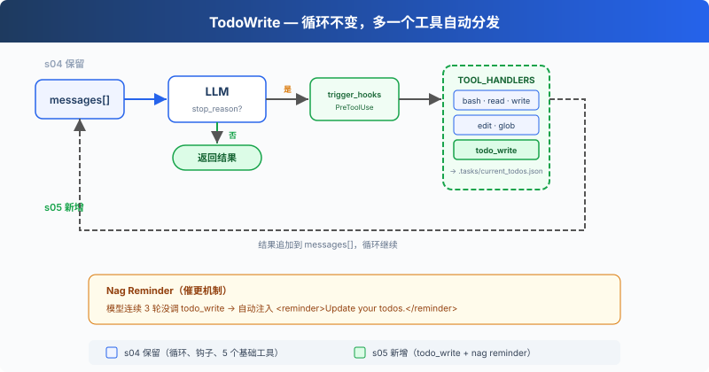

# s05: TodoWrite — 没有计划的 Agent，做着做着就偏了

[中文](README.zh.md) · [English](README.md) · [日本語](README.ja.md)

s01 → s02 → s03 → s04 → `s05` → [s06](../s06_subagent/) → s07 → ... → s20

> *"没有计划的 agent 走哪算哪"* — 先列步骤再动手，长任务更不容易漏项。
>
> **Harness 层**: 规划 — 用 todo_write 工具维护任务列表。

---

到上一课为止，Agent 能干活、能被拦、能被观测。现在给它一个真正的多步任务："把所有 Python 文件改成 snake_case 命名，然后跑测试，修好失败的。"

它改了 3 个文件，跑了测试，发现 2 个失败，开始修。修着修着，"改成 snake_case"这件事就没了下文，测试报错把它的注意力全部吸走。

原因在 s01 就埋下了：模型没有记忆，只有上下文。而上下文里嗓门最大的永远是最新的工具结果，最初的任务目标躺在几十条消息之外。一个 10 步的重构，做完前 3 步就开始即兴发挥，因为第 4 到 10 步已经被挤出注意力了。



---

## 提醒它"别忘了目标"，为什么不够

第一反应是在 system 提示里把要求写重些："始终牢记原始任务。"但目标不会变，进度在变。固定文本记不了"第 3 步做完了、第 4 步做到一半"这种活状态。

那让 harness 替模型拆解任务、逐步喂给它？也不对。拆解本身恰恰是模型的强项，harness 根本不理解任务内容，它拆不了。

分工应该是：模型负责拆和记，harness 负责给这份"记"一个载体，并在模型忘记维护时推一把。载体就是一个新工具。

---

## todo_write：一个不干活的工具

`todo_write` 不能读文件、不能跑命令，不给 Agent 增加任何执行能力。它唯一的作用，是把模型脑子里的计划变成一份带状态的清单，存下来、亮出来：

```python
CURRENT_TODOS: list[dict] = []

def run_todo_write(todos: list) -> str:
    global CURRENT_TODOS
    todos, error = _normalize_todos(todos)   # 先校验，模型传的参数不可全信
    if error:
        return error
    CURRENT_TODOS = todos

    lines = ["\n## Current Tasks"]           # 终端上实时画出清单
    for t in CURRENT_TODOS:
        icon = {"pending": " ", "in_progress": "▸", "completed": "✓"}[t["status"]]
        lines.append(f"  [{icon}] {t['content']}")
    print("\n".join(lines))
    return f"Updated {len(CURRENT_TODOS)} tasks"
```

`_normalize_todos` 那行值得停一下。工具的参数是模型生成的，模型会犯错：可能把数组包成字符串传过来，可能漏掉 `status` 字段。所以先校验，错了返回一句明确的报错，模型看到报错自己重传。这和 s02 里 `edit_file` 找不到原文就报错是同一个哲学：不猜测模型的意图，用报错把它拉回正轨。

接入方式回收 s02 的口号：定义一条，注册一行，循环零改动。

```python
TOOLS = [
    ...,   # 原有 5 个工具
    {"name": "todo_write",
     "description": "Create and manage a task list for your current coding session.",
     "input_schema": {"type": "object", "properties": {"todos": {"type": "array",
         "items": {"type": "object", "properties": {
             "content": {"type": "string"},
             "status": {"type": "string", "enum": ["pending", "in_progress", "completed"]}},
             "required": ["content", "status"]}}}, "required": ["todos"]}},
]
TOOL_HANDLERS["todo_write"] = run_todo_write
```

工具有了，模型怎么知道该用？system 提示里加一句引导：

```python
SYSTEM = (
    f"You are a coding agent at {WORKDIR}. "
    "Before starting any multi-step task, use todo_write to plan your steps. "
    "Update status as you go."
)
```

理想节奏从此变成：接到任务先列清单（全 `pending`），做哪步标哪步（`in_progress`），做完打钩（`completed`），再看下一个 `pending`。

但引导只是引导。任务一紧张，模型照样会连着好几轮闷头执行，清单晾在一边，清单一过期就失去了意义。

---

## Nag reminder：忘了就推一把

harness 数着轮次：模型连续 3 轮工具调用没碰过 `todo_write`，就在下一次调用模型前，往 `messages` 里塞一句提醒：

```python
rounds_since_todo = 0

def agent_loop(messages):
    global rounds_since_todo
    while True:
        # 连续 3 轮没更新 todo，注入一条提醒
        if rounds_since_todo >= 3 and messages:
            messages.append({"role": "user",
                             "content": "<reminder>Update your todos.</reminder>"})
            rounds_since_todo = 0

        response = client.messages.create(...)
        ...
            # 模型调了 todo_write，计数器清零
            if block.name == "todo_write":
                rounds_since_todo = 0
```

三个细节值得注意。

**提醒以 `user` 角色注入。** s01 讲过，对模型来说 `user` 就是"外部世界传来的信息"。这句提醒和工具结果一样，是世界的声音，不是模型的自言自语。

**提醒不是强制。** harness 只是把一句话放进上下文，模型下一轮看到了，仍然自己决定要不要更新清单。推一把和替它做，是两种截然不同的设计，这套代码始终站在前者。

**计数器管的是"轮"，不是"次"。** 一轮里模型可能并行调好几个工具，只要其中没有 `todo_write`，这一轮就记一笔。

> 真实 Claude Code：没有"3 轮"这个定数，它的 nudge 更聪明——发现清单上的事全打了钩、却没有一项是验证工作时，提醒模型补一步验证。另外它有两套任务系统并存：TodoWrite 这样的内存清单，和带文件持久化、依赖图、并发锁的完整任务系统。后者 s12 会亲手做一个。

---

## 相对 s04 的变更

| 组件 | 之前 (s04) | 之后 (s05) |
|------|-----------|-----------|
| 工具数量 | 5 (bash, read, write, edit, glob) | 6 (+`todo_write`) |
| 规划能力 | 无 | 带状态的 TODO 列表 + nag reminder |
| SYSTEM 提示 | 通用提示 | 加入 todo_write 使用引导 |
| 循环 | 不变 | dispatch 不变，新增 `rounds_since_todo` 计数与提醒注入 |

---

## 试一下

```sh
cd learn-claude-code
python s05_todo_write/code.py
```

1. `Refactor s05_todo_write/example/hello.py: add type hints, docstrings, and a main guard`：看它的第一次工具调用是不是 `todo_write`，终端上的 `## Current Tasks` 清单列了几步；
2. `Create a Python package under s05_todo_write/example/demo_pkg with __init__.py, utils.py, and tests/test_utils.py`：盯着图标变化，`▸` 是否总在当前步骤上、做完的是否变成 `✓`；
3. `Review Python files under s05_todo_write/example and fix any style issues`：观察 reminder 的间接证据——如果模型连着几轮只读只改、没碰清单，下一轮它多半会突然先更新一次 todo，那就是 `<reminder>` 到货了（注入本身不打印，只能从行为上看出来）。

---

## 接下来

Agent 能计划了。但如果任务本身太大，比如"重构整个认证模块"，光靠清单还是不够：这种任务是几十个小任务的集合，每个小任务都要读一堆文件、留一堆结果，全挤在同一个对话里，清单再清楚，上下文也先撑不住了。

s06 Subagent → 把大任务拆出去，每个子任务派一个独立的 Agent，用自己的干净上下文干活，只把结论带回来。

<!-- translation-sync: zh@v2, en@v1, ja@v1 -->
