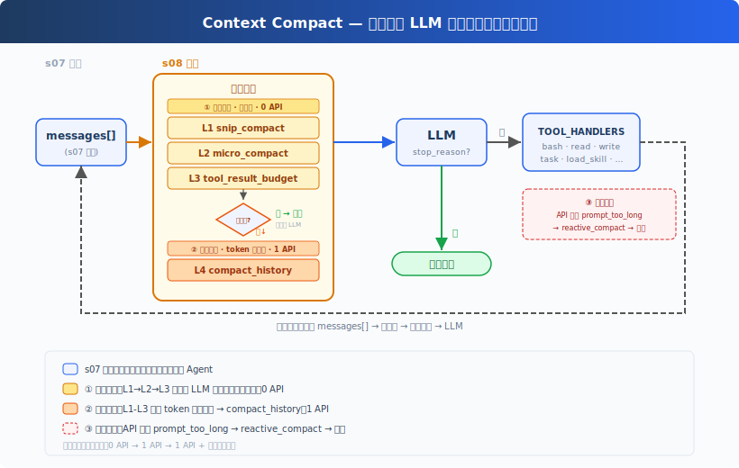
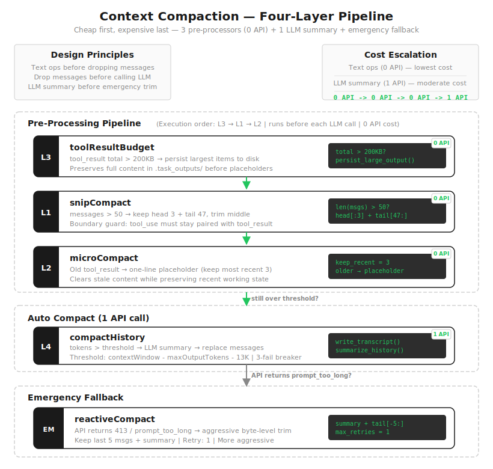
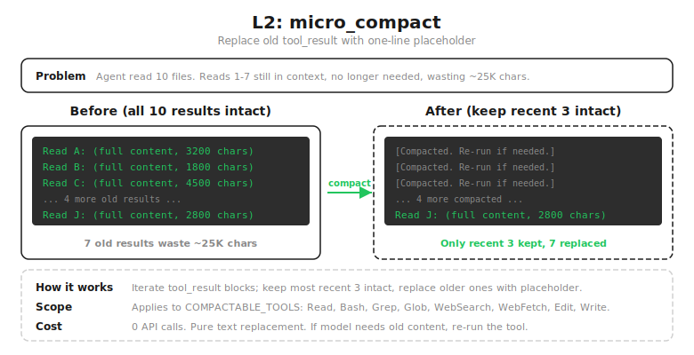
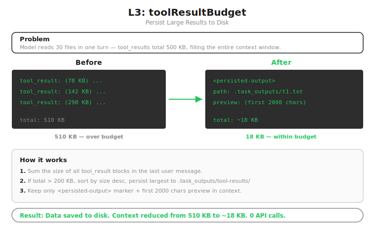
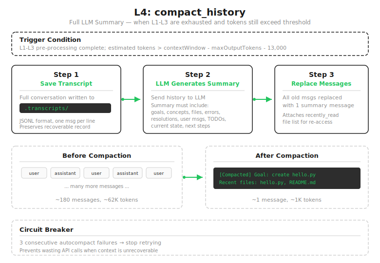

# s08: Context Compact — 上下文总会满，要有办法腾地方

[中文](README.zh.md) · [English](README.md) · [日本語](README.ja.md)

s01 → s02 → s03 → s04 → s05 → s06 → s07 → `s08` → [s09](../s09_memory/) → s10 → ... → s20
> *"上下文总会满, 要有办法腾地方"* — 四层压缩策略, 便宜的先跑贵的后跑。
>
> **Harness 层**: 压缩 — 上下文超限时自动摘要，保持会话可持续。

---

## 问题

上一章给 Agent 加了 Skills，它开始有了一点"领域经验"：遇到 PDF、MCP、代码审查，会先加载对应的操作说明再动手。

但 Agent 越会做事，另一个问题越明显。它读一个 1000 行的文件就是 ~4000 token，又读了 30 个文件，跑了 20 条命令。每条命令的输出、每个文件的内容，都被塞回 `messages` 列表，一点点堆起来。

普通聊天几十轮不算什么。代码 Agent 不一样：一次读取就是几千行，一次测试就是一大段日志。任务还没做完，上下文窗口可能先满了。

满了之后，问题不是"模型答得差一点"，而是 API 直接拒绝：`prompt_too_long`。不压缩，Agent 根本没法在大项目里干活。

---

## 解决方案



保留 s07 的 hook 结构、技能加载、子 Agent 骨架，这一章只往里加一层：每次调用 LLM 之前，先整理 `messages`。

最直接的想法是满了就让模型总结一下。但这里有两个问题。一是总结要多花一次 API 调用，每次上下文变大就摘要，成本很快上去。二是并不是所有内容都值得总结：很多旧工具结果早就不需要了；有些内容只是大，比如一次 `cat` 出几百 KB 日志，它不需要被"理解"，只需要从上下文里挪走，必要时再读回来。

所以 compact 不是一个动作，是一条管线。**便宜的先跑，贵的后跑**：先做几步不调模型的本地整理，能裁的裁、能占位的占位、能落盘的落盘；只有这些都不够，才让 LLM 做一次真正的摘要。

---

## 工作原理



### L1: snip_compact — 裁掉无关的旧对话

Agent 跑了 80 轮，`messages` 攒了 160 条。最前面那句"帮我创建 hello.py"和当前工作几乎无关了，但还占着位置。

消息数超过 50 条 → 保留头部 3 条（最初的任务、约束）和尾部 47 条（当前工作），中间裁掉。唯一要小心的边界：不能把 `assistant(tool_use)` 和后面的 `user(tool_result)` 拆开，否则模型会看到一个不知道对应哪次调用的孤立结果。

```python
def snip_compact(messages, max_messages=50):
    if len(messages) <= max_messages: return messages
    keep_head, keep_tail = 3, max_messages - 3
    head_end, tail_start = keep_head, len(messages) - keep_tail
    if head_end > 0 and _message_has_tool_use(messages[head_end - 1]):
        while head_end < len(messages) and _is_tool_result_message(messages[head_end]):
            head_end += 1
    if (tail_start > 0 and tail_start < len(messages)
            and _is_tool_result_message(messages[tail_start])
            and _message_has_tool_use(messages[tail_start - 1])):
        tail_start -= 1
    if head_end >= tail_start: return messages
    snipped = tail_start - head_end
    return messages[:head_end] + [{"role": "user", "content": f"[snipped {snipped} messages]"}] + messages[tail_start:]
```

裁掉的是消息本身，在切口处多做一步保护。但剩下的消息里，`tool_result` 内容仍在累积，第 34 条消息里可能还躺着 30KB 的旧文件内容。消息数少了，token 没少。→ L2。

### L2: micro_compact — 旧工具结果占位



最容易把上下文撑大的，往往不是对话本身，而是工具结果。Agent 连续读了 10 个文件，第 1 到第 7 个的完整内容早就不需要了，却还原样躺在上下文里。

保留最近 3 条 `tool_result` 的完整内容，更早的换成一行占位符。想法很朴素：旧结果真要用，模型重新读一次就行，不该一直占着位置。

```python
KEEP_RECENT = 3

def micro_compact(messages):
    tool_results = collect_tool_results(messages)
    if len(tool_results) <= KEEP_RECENT: return messages
    for _, _, block in tool_results[:-KEEP_RECENT]:
        if len(block.get("content", "")) > 120:
            block["content"] = "[Earlier tool result compacted. Re-run if needed.]"
    return messages
```

旧结果清掉了，但还挡不住一种情况：单条新结果就有 500KB，一次 `cat` 大文件的输出就能用满上下文，而它还很新，micro_compact 不会动它。→ L3。

### L3: tool_result_budget — 大结果落盘



有些结果不是"多"，是"单条太大"。模型一次读了 5 个大文件，最后一条 user 消息里的 `tool_result` 加起来超过 200KB，这时候只保留最近 3 条没用，因为最新的那条本身就能用满上下文。

给工具结果设一个预算。统计最后一条 user 消息里所有 `tool_result` 的总大小，超过 200KB 就从最大的开始落盘到 `.task_outputs/tool-results/`，上下文里只留一个 `<persisted-output>` 标记 + 前 2000 字符预览。模型看到标记就知道完整内容在磁盘上，需要时再读回来。

```python
def tool_result_budget(messages, max_bytes=200_000):
    last = messages[-1] if messages else None
    if not last or last.get("role") != "user" or not isinstance(last.get("content"), list): return messages
    blocks = [(i, b) for i, b in enumerate(last["content"])
              if isinstance(b, dict) and b.get("type") == "tool_result"]
    total = sum(len(str(b.get("content", ""))) for _, b in blocks)
    if total <= max_bytes: return messages
    ranked = sorted(blocks, key=lambda p: len(str(p[1].get("content", ""))), reverse=True)
    for _, block in ranked:
        if total <= max_bytes: break
        block["content"] = persist_large_output(block.get("tool_use_id", "unknown"), str(block.get("content", "")))
        total = sum(len(str(b.get("content", ""))) for _, b in blocks)
    return messages
```

这一步重要的不是丢，是把内容从"活跃上下文"移到"可恢复的外部存储"。前三层到这就齐了：纯文本/结构操作，0 API 调用，各盯一种冗余。但它们都有同一个限制：读不懂对话在说什么，不知道哪些发现重要、哪些约束必须留。如果上下文还是太大，就只能让模型出手。→ L4。

### L4: compact_history — LLM 全量摘要



前三层全跑完，token 还是超阈值。这一步才是很多人直觉里的"上下文压缩"：把历史交给模型，摘成一段更短的状态。

三步：先把完整对话写进 `.transcripts/`（JSONL），活跃上下文里只剩摘要，但磁盘上留着完整记录；再让 LLM 生成摘要，要求保留当前目标、重要发现、已改文件、剩余工作、用户约束；最后用这一条摘要替换掉所有旧消息。

```python
def compact_history(messages):
    transcript_path = write_transcript(messages)   # 先存完整对话
    summary = summarize_history(messages)            # LLM 生成摘要
    return [{"role": "user", "content": f"[Compacted]\n\n{summary}"}]
```

这一步是有损的：transcript 里有完整历史，但模型当下看不到那些细节了，只能靠摘要继续。所以前面才要先跑 L1/L2/L3：能不让模型总结就不总结，因为一旦进摘要，细节就不可避免地丢。教学版还加了个熔断器：连续 compact 失败 3 次就停，不无限重试浪费 API。

### 应急: reactive_compact

正常情况下，我们在调用模型之前就把上下文整理好。但上下文增长太快、或 token 估算不准时，API 还是可能返回 `prompt_too_long`。

这时走 reactive_compact：和 compact_history 很像，但更激进：先存 transcript，对前面大半段生成摘要，只保留最后 5 条作尾部上下文（同样避免留下孤立 `tool_result`）。

```python
def reactive_compact(messages):
    transcript = write_transcript(messages)
    tail_start = max(0, len(messages) - 5)
    if (tail_start > 0 and tail_start < len(messages)
            and _is_tool_result_message(messages[tail_start])
            and _message_has_tool_use(messages[tail_start - 1])):
        tail_start -= 1
    summary = summarize_history(messages[:tail_start])
    return [{"role": "user", "content": f"[Reactive compact]\n\n{summary}"}, *messages[tail_start:]]
```

reactive 是兜底路径，不是常规路径，默认只重试 1 次，再失败就抛异常，不无限循环。完整的错误恢复逻辑留给 s11。

### 合起来跑

把这些挂回 Agent Loop：每轮调用 LLM 之前，先跑三层本地整理，不够再摘要；调用真报错了，再走应急。

```python
def agent_loop(messages):
    reactive_retries = 0
    while True:
        # 三个预处理器（0 API），顺序：budget → snip → micro
        messages[:] = tool_result_budget(messages)    # L3: 大结果落盘
        messages[:] = snip_compact(messages)          # L1: 裁中间
        messages[:] = micro_compact(messages)         # L2: 旧结果占位

        if estimate_size(messages) > CONTEXT_LIMIT:   # 还不够，LLM 摘要（1 API）
            messages[:] = compact_history(messages)

        try:
            response = client.messages.create(model=MODEL, system=SYSTEM, messages=messages, tools=TOOLS, max_tokens=8000)
        except Exception as e:
            if "prompt_too_long" in str(e).lower() and reactive_retries < MAX_REACTIVE_RETRIES:
                messages[:] = reactive_compact(messages)   # 应急
                reactive_retries += 1
                continue
            raise
        # ... 工具执行 ...
```

**顺序不能换。** L3（budget）必须在 L2（micro）前面：micro 会把旧的大 `tool_result` 换成一行占位符，要是它先跑，budget 就没机会把完整内容落盘了。先 budget 把大内容存好，再做占位和裁剪。这也是 Claude Code 源码把 `applyToolResultBudget` 放在最前面的原因。

### compact 工具：让模型也能主动请求

除了自动压缩，模型自己也能要求整理：当它觉得上下文太长、或任务阶段切换了，可以主动调 `compact` 工具。在教学版里，这个工具触发 `compact_history`，然后结束当前 turn，用压缩后的上下文重新开一轮。和手动 `/compact` 的感觉很像，区别是这次是模型自己意识到要整理。

---

## 相对 s07 的变更

| 组件 | 之前 (s07) | 之后 (s08) |
|------|-----------|-----------|
| 上下文管理 | 无（上下文无限膨胀） | 四层压缩管线 + 应急 |
| 新函数 | — | snip_compact, micro_compact, tool_result_budget, compact_history, reactive_compact |
| 工具 | bash, read, write, edit, glob, todo_write, task, load_skill (8) | 8 + compact (9) |
| 循环 | LLM 调用 → 工具执行 | 每轮前跑三层预处理器 + 阈值触发 compact_history |
| 设计原则 | 让 Agent 会做事 | 让 Agent 做久一点也不崩 |

这一步不算给 Agent 加"能力"，更像加"体力"：s07 让它更会做专业任务，s08 让它在长任务里不被自己的历史拖垮。

---

## 试一下

```sh
cd learn-claude-code
python s08_context_compact/code.py
```

试试这些 prompt：

1. `Read the file README.md, then read code.py, then read s01_agent_loop/README.md`（连续读多个文件，观察 L2 压缩旧结果）
2. `Read every file in s08_context_compact/`（一次性读大量内容，观察 L3 落盘）
3. 反复对话 20+ 轮，观察是否出现 `[auto compact]` 或 `[reactive compact]`

观察重点：每次工具执行后，旧 `tool_result` 是否被替换？大输出有没有落盘？token 超阈值时是否生成了摘要？

---

## 接下来

压缩让 Agent 能跑很久不崩。但每次压缩都会丢一些细节：用户之前说过的偏好、项目里的长期约束、某些跨任务都重要的信息，不一定能完整留在摘要里。

compact 解决的是"当前会话快满了，怎么继续跑下去"。它没解决"哪些信息值得长期留下来"。

s09 Memory → 三个子系统：选择记什么、提取关键信息、整理巩固。跨压缩、跨会话。

<details>
<summary>深入 Claude Code 源码</summary>

> 以下基于 Claude Code 源码 `compact.ts`、`autoCompact.ts`、`microCompact.ts`、`query.ts` 的分析。

### 执行顺序对照

教学版为了讲解方便按 L1/L2/L3/L4 编号，但实际执行顺序和编号不完全对应：

| 维度 | 教学版 | Claude Code |
|------|--------|-------------|
| 执行顺序 | budget → snip → micro → auto | budget → snip → micro → collapse → auto（`query.ts:379-468`） |
| snip_compact | 保留头 3 + 尾 47 | Claude Code 仅主线程启用；实现不在开源仓库中（`HISTORY_SNIP` feature gate），但接口可见：`snipCompactIfNeeded(messages)` → `{ messages, tokensFreed, boundaryMessage? }`，还暴露了 `SnipTool` 工具让模型主动调用。教学版的 3/47 是简化参数 |
| micro_compact | 文本占位符替换 | 两条路径：time-based 直接清内容，cached 走 API `cache_edits`（legacy path 已移除） |
| micro_compact 白名单 | 按位置（最近 3 条） | time-based 按时间阈值触发；cached 按计数触发（`microCompact.ts`） |
| tool_result_budget | 200KB 字符 | 200,000 字符（`toolLimits.ts:49`） |
| compact_history 阈值 | 字符数估算 | 精确 token：`contextWindow - maxOutputTokens - 13_000` |
| 摘要要求 | 5 类信息 | 9 个部分 + `<analysis>`/`<summary>` 双标签 |
| 压缩 prompt | 简单 prompt | 首尾双重防呆禁止调工具 |
| PTL retry | 有（简化） | `truncateHeadForPTLRetry()` 按消息组回退（`compact.ts:243-290`） |
| 后压缩恢复 | 无（教学版只保留摘要） | 自动重新读取最近文件、计划、agent/skill/tool 等 |
| 熔断器 | 3 次 | 3 次（`autoCompact.ts:70`） |
| reactive 重试 | 1 次 | Claude Code 有更精细的分级重试 |

### 执行顺序详解

Claude Code 源码 `query.ts` 中的真实顺序：

1. `applyToolResultBudget`（L379）：先处理大结果，确保完整内容落盘
2. `snipCompact`（L403）：裁中间消息
3. `microcompact`（L414）：旧结果占位
4. `contextCollapse`（L441）：独立的上下文管理系统（教学版无）
5. `autoCompact`（L454）：LLM 全量摘要

教学版的 budget → snip → micro 顺序与此一致。教学版没有 contextCollapse 机制。

### read_file 的取舍

教学版的 `micro_compact` 会把旧 `tool_result` 统一替换成占位符，包括 `read_file`。这通常不影响功能正确性：如果后续还需要文件内容，模型可以重新读一次。代价是可能多一次工具调用，也可能降低 prompt cache 命中率。

Claude Code 没有用教学版这种简单规则解决这个问题。它把 `Read` 也放进可 microcompact 的工具集合，但同时维护 `readFileState`：重复读取未变化文件时返回 `FILE_UNCHANGED_STUB`，compact 后再按预算恢复最近读过的文件内容（例如最多 5 个文件、每个 5K token、总预算 50K token）。这是生产级实现里的缓存和恢复机制，教学版不展开，保留“压缩旧结果，必要时重新读取”的简单 trade-off。

### 完整常量参考

| 常量 | 值 | 源文件 |
|------|-----|--------|
| `AUTOCOMPACT_BUFFER_TOKENS` | 13,000 | `autoCompact.ts:62` |
| `MAX_CONSECUTIVE_AUTOCOMPACT_FAILURES` | 3 | `autoCompact.ts:70` |
| `MAX_OUTPUT_TOKENS_FOR_SUMMARY` | 20,000 | `autoCompact.ts:30` |
| `POST_COMPACT_TOKEN_BUDGET` | 50,000 | `compact.ts:123` |
| `POST_COMPACT_MAX_FILES_TO_RESTORE` | 5 | `compact.ts:122` |
| `POST_COMPACT_MAX_TOKENS_PER_FILE` | 5,000 | `compact.ts:124` |
| 时间 micro_compact 间隔 | 60 分钟 | `timeBasedMCConfig.ts` |
| `MAX_COMPACT_STREAMING_RETRIES` | 2 | `compact.ts:131` |

### contextCollapse 和 sessionMemoryCompact

Claude Code 源码中还有两个机制本教学版没有展开：

- **contextCollapse**：独立的上下文管理系统，启用时抑制 proactive autocompact（`autoCompact.ts:215-222`），由 collapse 的 commit/blocking 流程接管上下文管理。但 manual `/compact` 和 reactive fallback 仍是独立路径，不受 contextCollapse 影响。
- **sessionMemoryCompact**：compact_history 之前，Claude Code 会先尝试用已有的 session memory（s09 会讲到）做轻量摘要，不调 LLM。这个机制等学完 s09 之后回头看会更清楚。

### 压缩 prompt 长什么样？

Claude Code 的压缩 prompt 有两个硬性要求：

1. **绝对禁止调用工具**：开头就是 `CRITICAL: Respond with TEXT ONLY. Do NOT call any tools.`，末尾还会再 REMINDER 一次
2. **先分析再总结**：模型需要先在 `<analysis>` 标签里理清思路，然后在 `<summary>` 标签里输出正式摘要。analysis 在格式化时被剥离

### 教学版的简化是刻意的

- micro_compact 用文本占位 → 我们没有 API 层的 `cache_edits` 权限
- read_file 不特殊处理 → 教学版接受必要时重新读取，避免引入 readFileState 和后压缩恢复机制
- token 用字符数估算 → 精确 tokenizer 不在教学范围内
- 后压缩恢复省略 → 教学版只保留摘要，不自动重新附加文件
- 两个辅助机制不展开 → 属于 10% 的细节

核心设计思想完整保留。

</details>

<!-- translation-sync: zh@v3, en@v3, ja@v3 -->
