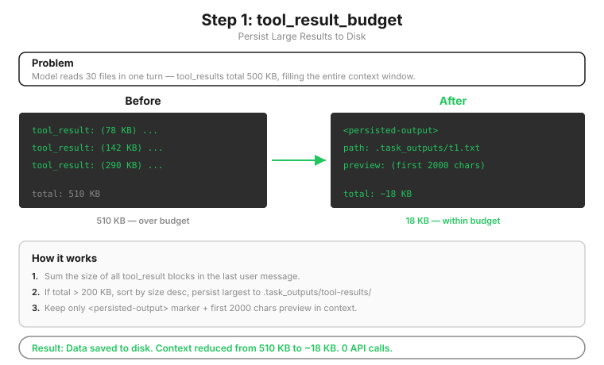
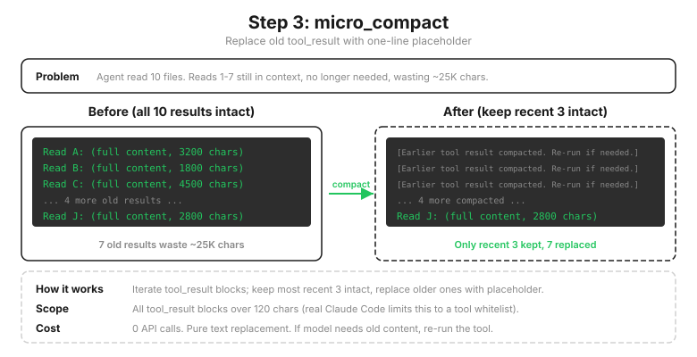
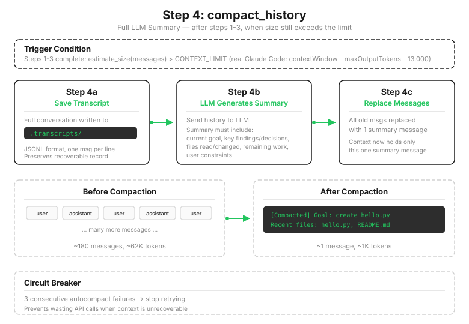

# s08: Context Compact — 上下文总会满，先整理，再总结

[中文](README.zh.md) · [English](README.md) · [日本語](README.ja.md)

s01 → s02 → s03 → s04 → s05 → s06 → s07 → `s08` → [s09](../s09_memory/) → s10 → ... → s20

---

到 s07 为止，Agent 已经会用工具、管权限、派子 Agent、按需加载技能。但任务一长，一个新问题就会冒出来：前几步还好好的，读的文件多了、跑的命令多了，某一次调用突然失败，报 `prompt_too_long`。

这一课就来解决它：这个报错是什么意思，为什么迟早会出现，以及怎么让 Agent 把再长的任务也一直跑下去。


---

## 先搞懂：什么是上下文

写作业的时候，你面前会摊一张草稿纸。题目要求、算到哪一步了、中间结果、查资料抄下来的内容，所有当前要用的信息都写在这张纸上，低头就能看见。

模型也有这么一张"草稿纸"，叫上下文窗口。你说的每句话、它的每次回复、它调工具的指令、工具返回的结果，全部按顺序写在这张纸上。模型思考时，能看到纸上的全部内容。

这张纸有一个特点：大小固定。有的模型大一些，有的小一些，但都有上限。写满了，新内容就写不进去，请求直接失败。

纸上占地方最多的不是对话。你一句我一句的聊天占不了多少空间，真正占地方的是工具结果：

- 读一个 1000 行的代码文件，1000 行内容全部进上下文；
- 跑一次测试，几十 KB 的日志全部进上下文；
- 连续搜十几个文件，结果一条接一条堆上去。

可以算一笔账。假设上下文能装 20 万 token（模型按 token 计数，先按"字"来体感就行），读一个普通文件平均占 5000 token，那读 40 个文件就满了。而一个真实的开发任务，读文件、跑命令、查报错，几十上百次工具调用很正常。

> 只要任务足够长，上下文一定会满。这不是概率问题，是时间问题。

而且写满之前问题就开始了：纸上内容太多，模型容易抓不住重点，关键约束被淹没在旧日志里，看着看着就忘了要求。压缩上下文不只是为了不报错，也是为了让模型一直看得清自己在干什么。

---

## 最直觉的办法，为什么不能先用

第一反应多半是：让模型把前面的内容总结成几句话，不就腾出地方了？

这个办法最后会用到，但不能放在第一步。就像草稿纸写满了，你不会上来就把前几页撕掉重写成提纲。原因有三个：

第一，总结一定丢细节。提纲写得再全，也不如原始草稿信息多。某个函数的参数、一句完整的报错、用户随口提的一个小要求，总结时很容易漏掉；而摘要一旦替换历史，这些细节就不在当前上下文里了，后面想找都找不到。

第二，总结本身有成本。生成摘要要多调一次模型，费时间也费钱。动动手就能整理好的东西，没必要请模型重写一遍。

第三，也是最关键的：占地方最多的内容根本不值得总结。读过的文件还在磁盘上，跑过的命令可以重跑。真需要了再读一遍、再跑一次就能拿回完整内容，没必要一直摊在上下文里。

所以正确的思路和整理草稿纸一样朴素：先做不丢信息的整理，能收起来的收起来，能擦掉的擦掉；实在腾不出地方，最后才写提纲。

接下来的四步就是按这个逻辑排的：越靠前，越不丢信息、成本越低；越靠后，清理力度越大，代价也越高。


---

## 第一步：tool_result_budget — 大结果先转存磁盘

有时不是历史太长，而是最新一批结果太大。Agent 一口气读了几个大文件，最后一条消息里的 `tool_result` 加起来可能超过 200KB。这是最新的结果，不能删；但也不必完整摊在上下文里。

做法和抄资料一样：把完整内容抄进笔记本收好，草稿纸上留一行"这段在笔记本第 5 页"。对应到代码：完整内容写到磁盘，上下文里只留文件路径和开头一段预览。



```python
def tool_result_budget(messages, max_bytes=200_000):
    # 只看最新一条消息里的工具结果
    blocks = [b for b in messages[-1]["content"] if b.get("type") == "tool_result"]
    total = sum(len(str(b["content"])) for b in blocks)

    if total <= max_bytes:      # 总量没超标，不动
        return messages

    # 从最大的结果开始，逐个转存到磁盘
    for block in sorted(blocks, key=lambda b: len(str(b["content"])), reverse=True):
        # 完整内容写进文件，上下文里只留路径 + 前 2000 字符预览
        block["content"] = persist_large_output(block["tool_use_id"], str(block["content"]))
        total = sum(len(str(b["content"])) for b in blocks)
        if total <= max_bytes:
            break
    return messages
```

这一步不丢任何内容，只是换了个地方存放；也不调用模型，程序几毫秒就做完。模型仍然知道内容存在哪里、开头长什么样，之后真需要完整内容，再读回来。

但它只管最新一批结果的"个头"。消息一条条堆上去、越来越多的问题，它不管。

---

## 第二步：snip_compact — 裁掉中间的旧对话

草稿纸写到十几页，真正有用的往往只有两头：最开头是题目要求和规则，最后几页是当前正在算的步骤。中间那些做完的推导，留着只占地方。

`snip_compact` 保留开头和结尾，把中间的旧消息抽走，原位留一句"中间省略了多少条"：

```python
def snip_compact(messages, max_messages=50):
    if len(messages) <= max_messages:   # 消息不多，不用裁
        return messages

    head = safe_head(messages, 3)                  # 开头 3 条：原始任务
    tail = safe_tail(messages, max_messages - 3)   # 尾部：最新进展
    snipped = len(messages) - len(head) - len(tail)

    return head + [
        {"role": "user", "content": f"[snipped {snipped} messages]"}
    ] + tail
```

有一条硬规矩：`assistant` 的 `tool_use` 和它对应的 `tool_result` 不能拆开。拆开了，模型会看到一条来历不明的工具结果，API 直接报错。所以 `safe_head` 和 `safe_tail` 不是简单切片，它们会把切点挪开，保证这两样永远成对出现（实现见 `code.py`）。

这一步减掉的是消息条数。可剩下的消息里，旧 `tool_result` 的内容还在：某条消息里躺着的 30KB 旧文件内容，一个字都没少。

---

## 第三步：micro_compact — 较早的工具结果换成占位符

Agent 连续读了十个文件，最近两三个可能还在对照着用，更早的那些多半不会再看。而这些内容本来就能重新拿到：文件还在磁盘上，命令可以重跑。

`micro_compact` 保留最近 3 条完整结果，更早的、内容又长的，统一换成一句占位说明：



```python
KEEP_RECENT = 3   # 最近 3 条完整保留

def micro_compact(messages):
    results = collect_tool_results(messages)

    # 更早的结果，内容超过 120 字符的，换成占位符
    for _, _, block in results[:-KEEP_RECENT]:
        if len(block.get("content", "")) > 120:
            block["content"] = "[Earlier tool result compacted. Re-run if needed.]"
    return messages
```

注意它和第一步的区别：转存留了底，占位符没有留底。被换掉的内容既不在上下文里，也不在磁盘上，想再看只能重跑一次工具。对文件内容、命令输出这类可再生的东西，这个代价可以接受。

到这里，能收的收了、能擦的擦了，全程没有调用过一次模型。如果上下文还是超限，剩下的只有一条路：让模型出手。

---

## 第四步：compact_history — 整理后仍超限，才生成摘要

前三步都做完，上下文还是太大，才走到这一步。它分三件事：先把完整对话存盘留底，再让模型生成摘要，最后用摘要替换全部历史。



```python
def compact_history(messages):
    transcript_path = write_transcript(messages)  # ① 完整对话先存盘留底
    summary = summarize_history(messages)         # ② 调用模型生成摘要
    return [{
        "role": "user",
        "content": f"[Compacted]\n\n{summary}",   # ③ 用摘要替换全部历史
    }]
```

生成摘要时，提示词里要求模型保留五类信息：当前目标、用户约束、重要发现、改过哪些文件、下一步计划。

这一步清理力度最大，代价也最大：它有损，摘要再详细也会丢细节；它要花一次模型调用。完整历史虽然还在磁盘上，但模型往后每一轮能看到的只有摘要，没写进摘要的细节，对它来说就暂时不存在了。

所以它必须放在最后。前三步能解决的，绝不走到这一步。

---

## 为什么顺序不能乱

四步的排序有两层原因。

第一层是代价和损失的排序：转存无损、裁剪低损、占位可恢复，三步都不调用模型；摘要有损，还要花一次调用。便宜的先跑，贵的后跑，很多时候前三步做完，第四步根本不用触发。

第二层是一条硬依赖：`tool_result_budget` 必须排在 `micro_compact` 前面。两个函数对内容的处理方式不同：转存会把完整内容写进磁盘，占位符只留一句话，什么都不保存。如果 `micro_compact` 先跑，赶上最新一批工具结果超过 3 条，多出来的那几条会先被擦成占位符；等 `tool_result_budget` 再来转存时，手里只剩占位符，没有内容可存了。本来能留底的大结果，就这样变成了只能重跑。

顺序反了不会报错，但会悄悄把"无损"变成"有损"。这种问题比报错更难发现。

---

## 应急：reactive_compact — 报错之后的补救

每轮调用前都会整理，但 `estimate_size` 是估算，估算就有误差；某一轮的工具输出也可能突然特别大。所以 API 仍然可能返回 `prompt_too_long`。这时做一次更激进的整理：完整记录存盘，只留最后 5 条消息，前面全部压成摘要。

```python
def reactive_compact(messages):
    write_transcript(messages)         # 存盘留底
    tail = safe_tail(messages, 5)      # 只留最后 5 条，同样避开配对断点
    summary = summarize_history(messages[:len(messages) - len(tail)])

    return [{
        "role": "user",
        "content": f"[Reactive compact]\n\n{summary}",
    }] + tail
```

它只在已经报错时使用，而且只重试 1 次（`MAX_REACTIVE_RETRIES = 1`）。不设上限的话，一旦压缩后仍然失败，就会陷入"摘要的摘要的摘要"，信息越丢越多，模型最后连自己在干什么都不知道。重试一次还不行，就停下来报错，让人来看。

---

## 放回 Agent Loop

```python
def agent_loop(messages):
    reactive_retries = 0
    while True:
        # 每轮调用模型前，先跑三个整理器（0 次 API 调用）
        messages[:] = tool_result_budget(messages)   # 1 大结果转存
        messages[:] = snip_compact(messages)         # 2 裁中间旧对话
        messages[:] = micro_compact(messages)        # 3 旧结果换占位符

        # 整理完还超限，才触发摘要（1 次 API 调用）
        if estimate_size(messages) > CONTEXT_LIMIT:
            messages[:] = compact_history(messages)

        try:
            response = client.messages.create(
                model=MODEL, system=SYSTEM,
                messages=messages, tools=TOOLS, max_tokens=8000)
        except Exception as e:
            if "prompt_too_long" in str(e).lower() and reactive_retries < MAX_REACTIVE_RETRIES:
                messages[:] = reactive_compact(messages)
                reactive_retries += 1
                continue
            raise

        # ... 执行工具，把结果写回 messages ...
```

一个教学上的简化值得说明：`estimate_size` 用 `len(str(messages))` 当尺子，量的是字符数，不是真实 token 数。严格计数需要 tokenizer，和本章主题关系不大，字符数够用来演示"超限就整理"。教学版的 `CONTEXT_LIMIT` 也故意设得很小（50000 字符），为的是让你亲眼看到摘要被触发。

---

## compact 工具：模型自己举手说该整理了

前面的整理都由程序自动触发。还有一种时机只有模型知道：任务进入了新阶段，前一阶段的细节不再需要。这时可以让模型主动提出整理，办法是给它一个 `compact` 工具：

```python
{"name": "compact",
 "description": "Summarize earlier conversation to free context space.",
 "input_schema": {"type": "object", "properties": {"focus": {"type": "string"}}}}
```

```python
if block.name == "compact":
    messages[:] = compact_history(messages)
    results.append({"type": "tool_result", "tool_use_id": block.id,
                    "content": "[Compacted. Conversation history has been summarized.]"})
    messages.append({"role": "user", "content": results})
    break   # 本轮到此结束，下一轮带着整理后的上下文继续
```

分工很清楚：模型只负责判断"现在适合整理"，真正存档、生成摘要、替换历史的是程序。就像做题做到一半发现草稿纸乱了，举手说"我先整理一下"。整理这个动作，还是要真的做，不能只是嘴上说一句。

---

## 试一下

```bash
cd learn-claude-code
python s08_context_compact/code.py
```

**实验 1：占位符**。让它连续读 5 个文件：

```text
Use read_file separately to read s01_agent_loop/README.md, s02_tool_use/README.md, s03_permission/README.md, s04_hooks/README.md, and s05_todo_write/README.md. Then say done.
```

读完后接着问一句：

```text
Without re-reading, quote the first heading of s01_agent_loop/README.md.
```

`KEEP_RECENT = 3`，所以 5 条结果里最早的 2 条已经被换成 `[Earlier tool result compacted. Re-run if needed.]`。模型要么告诉你早先的结果已被整理，要么重新读一遍。这就是第三步在工作。

**实验 2：大结果转存**。读一个 700 多 KB 的大文件：

```text
Use read_file to read web/src/data/generated/docs.json without a limit. Then say what kind of file it is.
```

结果超过 200KB 预算，会被转存。看两处：`.task_outputs/tool-results/` 目录下多了一个 `toolu_*.txt`，那是完整内容的留底；模型的回答会提到它只看到了预览和路径。这就是第一步在工作。

**实验 3：自动摘要**。读两个加起来超过阈值的文件：

```text
Use read_file to read s08_context_compact/code.py and s09_memory/code.py without a limit. Then explain the main difference between them.
```

这两个文件约 24.7K + 27.1K 字符，加起来恰好越过教学版的 `CONTEXT_LIMIT = 50000`。第二个文件读完后，终端会打出 `[auto compact]` 和 `[transcript saved: ...]`，之后模型是对着一条 `[Compacted]` 开头的摘要继续干活的。这就是第四步在工作。完整对话的留底在 `.transcripts/` 目录里。

---

## 选学：工业级系统还要考虑提示缓存

四步压缩的逻辑到这里讲完了。真实的 Claude Code 里，还有一个约束深刻影响着压缩系统的设计：提示缓存（prompt cache）。

还是草稿纸。纸的最顶部有几行从头到尾不变的内容："你是一个代码助手""你可以用这些工具""要遵守这些规则"。每次调用都重新处理一遍这些固定内容，费时间也费钱。所以模型平台提供了一个优化：把请求开头稳定不变的一段缓存起来，下次请求如果前缀一致，就复用缓存，少算一遍。

在 Anthropic 的 API 里，命中缓存的部分读起来比普通输入便宜得多；但第一次写入缓存有成本，缓存也有有效期。它不是免费的，而是"前缀越稳定，重复调用越划算"的工程优化。

这和压缩顺序的关系在于：缓存看的是前缀是否逐字一致。改了缓存点之前的内容，缓存大概率失效；只改缓存点之后的内容，前面的缓存还有机会复用。所以真实的压缩系统会尽量少动开头：

- 第一步转存，只处理最新一批结果，不碰开头；
- 第二步裁剪，保留最开头的任务和规则，稳定前缀得以留下；
- 第三步占位，处理的是较早但可重跑的工具内容，不动系统提示和工具定义；
- 第四步摘要，会重写整个历史结构，对缓存影响最大，所以放最后。

严谨地说，"从中间动手"也不保证缓存安全：能不能命中，取决于缓存断点的位置、系统提示和工具定义有没有变、前缀是否逐字一致。坚持"先整理尾部和中间、最后才重写历史"，除了少丢信息，还有一个现实的工程理由：让稳定前缀活得久一点。它不能杜绝缓存失效，但能避免没必要的失效。

教学版没有实现 API 级缓存，也不计算缓存断点，只用一套容易观察的代码把取舍讲清楚。真实的 Claude Code 复杂得多：更多中间层、更多兜底机制、围绕缓存的大量优化。但底层逻辑一致：先整理，后总结；先保住可恢复的信息，最后才压成摘要。

---

## 相对 s07 的变更

| 组件       | s07              | s08                    |
| ---------- | ---------------- | ---------------------- |
| 上下文管理 | 无               | 每轮调用前先整理       |
| 工具结果   | 一直留在上下文里 | 大结果转存，旧结果占位 |
| 历史消息   | 一直累积         | 中间旧历史可省略       |
| 超限处理   | 直接失败         | 先整理，不够再摘要     |
| 新增工具   | 无               | `compact`              |

---

## 小结

这一课只有一个核心原则：

> 能整理就先整理，能找回来的就别总结；实在不够，再让模型摘要历史。

四步压缩是四个函数，背后是同一个朴素的排序：无损的先做、零成本的先做，有损的、要花钱的放最后。有了它，Agent 不会再被自己的历史拖垮。

但这只解决了"草稿纸不够写"。有些信息我们希望长期留下来，不用每次重新发现。哪些值得留、怎么留，是 s09 要回答的问题。

<!-- translation-sync: zh@v6, en@v5, ja@v5 -->
