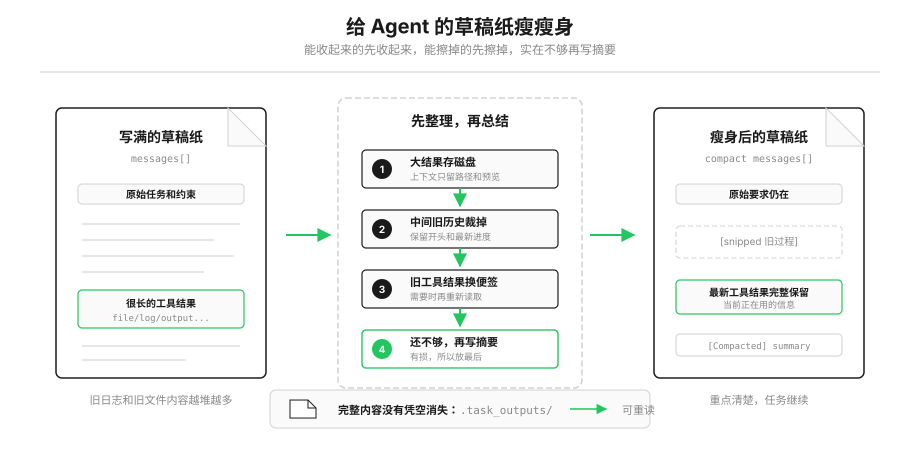

# 第8课 任务一长就报错？给 Agent 的草稿纸瘦瘦身

上一节课我们让 Agent 学会了自主调用工具，读文件、跑命令都能自己完成。但你很快就会遇到一个很现实的问题：
任务刚跑前几步还好好的，读的文件多了、跑的命令多了，它突然就崩了，报一个错：`prompt_too_long`。

这节课我们就来彻底搞懂：这个报错是什么意思？为什么会出现？以及怎么用一套很朴素的思路，让 Agent 能一直把长任务跑下去。



---

## 先搞懂：什么是「上下文」

你写作业的时候，面前会摊一张草稿纸。
题目要求、你算到哪一步了、中间算出的结果、查资料抄下来的内容……所有当前要用的信息，你都会写在这张草稿纸上，低头就能看见。

模型也有这么一张「草稿纸」，我们叫它**上下文窗口**。
你说的每一句话、它的每一次回复、它调用工具的指令、工具返回的结果，所有内容都会按顺序写在这张纸上。模型思考的时候，能直接看到纸上的全部内容。

但这张草稿纸有个特点：**它的大小是固定的**。
有的模型草稿纸大一点，有的小一点，但终归有上限。写满了，就再也写不下新东西了，程序自然就会报错。

很多人以为草稿纸上占地方最多的是对话，其实不是。
你一句、我一句的聊天，占的空间很小。真正疯狂占地方的，是工具返回的结果：

- 读一个 1000 行的代码文件，这 1000 行内容要完整写进草稿纸；
- 跑一次测试命令，输出几十 KB 的日志，也要完整写进去；
- 连续搜十几个文件，结果一条接一条堆上去。

我们可以算一笔账：
假设一张草稿纸能写 20 万字，读一个普通文件平均要占 5000 字。那只读 40 个文件，草稿纸就快被写满了。
而一个真正的开发任务，读文件、跑命令、查错误，工具调用几十上百次都很正常。
所以结论很直白：

> 只要任务足够长，草稿纸迟早会写满。这是所有 Agent 都会遇到的根本问题。

写满了还不只是报错这么简单。
哪怕还没到写满的程度，纸上内容太多、密密麻麻，模型也容易找不到重点——关键的要求被淹没在一堆旧日志里，它看着看着就忘了约束，容易犯低级错误。

所以我们要做「上下文压缩」，不只是为了不报错，更是为了让模型一直能清晰、高效地干活。

---

## 最容易想到的办法，为什么不能直接用？

很多人第一反应：这还不简单？让模型把前面的内容总结成几句话，不就省地方了？

这个思路没错，但它绝对不能是第一步。
就像你草稿纸写满了，不会上来就把前面几页撕下来重写成提纲。为什么？因为有三个很现实的代价：

第一，**总结一定会丢细节**。
提纲写得再全，也不如原始草稿信息多。很多细碎但关键的东西——比如某个函数的参数、一句完整的报错信息、你随口提的一个小要求——总结的时候很容易就被漏掉了。而且一旦换成提纲，这些细节在当前草稿纸上就消失了，后面想找都找不到。

第二，**总结本身也要花成本**。
让模型写摘要，相当于让它额外多做一次工作，既费时间，又要多花一次调用的开销。如果动动手指整理一下就能解决的事，根本没必要麻烦模型重新写一遍。

第三，也是最重要的：**很多内容根本不值得总结**。
草稿纸上占地方最多的，是读过的文件、跑过的命令结果。这些东西有一个共同的特点：它们本来就存在你的电脑里，文件就在磁盘上，命令也可以重新运行。
真的需要了，再读一遍、再跑一次就能拿到完整内容，根本没必要一直抄在草稿纸上占地方。

所以正确的思路非常朴素，和你整理草稿纸的逻辑一模一样：
> 先做完全不丢信息的整理，能收起来的先收走，能擦掉的直接擦掉；实在腾不出地方了，最后一步才去写总结提纲。

我们接下来要讲的四步压缩方法，就是严格按照这个逻辑排的顺序：越靠前，越不丢信息、越省事；越靠后，清理力度越大，但代价也越高。

---

## 第一步：太长的内容，先抄到本子上收起来

你肯定遇到过：草稿纸上抄了一大段资料，半页纸都被它占了。
这时候最省事的办法是什么？
把这段内容完整抄到笔记本里收好，草稿纸上只留一行小字：「这段资料在XX笔记本第5页，需要再翻」。
内容一点没丢，但草稿纸瞬间就腾出了半页空间。

我们的第一步 `tool_result_budget` 干的就是这件事。

有时候不是对话多，就是单条工具结果太大——比如 Agent 一口气读了好几个大文件，最后这一条结果就占了巨大的空间。它是最新的结果，肯定不能直接删掉，但也没必要完整摊在草稿纸上。

我们写一个函数来处理它：
```python
def tool_result_budget(messages, max_bytes=200_000):
    # 1. 先找到最新一条消息里的所有工具结果
    blocks = [b for b in messages[-1]["content"] if b.get("type") == "tool_result"]
    total_size = sum(len(str(b["content"])) for b in blocks)

    # 2. 总大小没超标，就不用动
    if total_size <= max_bytes:
        return messages

    # 3. 从最大的结果开始，逐个存成本地文件
    for block in sorted(blocks, key=lambda b: len(str(b["content"])), reverse=True):
        # 把完整内容存到磁盘，草稿纸上只留路径和一小段预览
        block["content"] = persist_large_output(block["tool_use_id"], str(block["content"]))
        total_size = sum(len(str(b["content"])) for b in blocks)
        if total_size <= max_bytes:
            break
    return messages
```

逻辑非常简单：
- 先看看最新的工具结果加起来有多大；
- 没超过阈值就不管；
- 超过了，就从最大的那个开始，把完整内容存成电脑里的文件，上下文里只留下文件在哪、开头大概是什么。

这一步是性价比最高的整理：
**完全不丢信息，只是换了个地方存放；也不用麻烦模型，程序自己几毫秒就做完了。**
所以它永远是我们整理的第一步。

---

## 第二步：中间的旧草稿，直接收起来

草稿纸写了十几页的时候，你会发现：真正有用的内容其实只有两头。
- 最开头：原始的题目要求、规则限制；
- 最后几页：你当前正在算的步骤、最新的结果。

中间夹着的好多页，都是已经做完的过程推导、用过就没用的中间结果，留着纯占地方。

这时候你会怎么做？
把中间这几页草稿纸抽出来夹进文件夹，只留开头的题目和最后的当前进度。中间空缺的地方，随手写一句「中间省略了8页过程」，自己知道就行。

我们的第二步 `snip_compact` 就是这个思路。

```python
def snip_compact(messages, max_messages=50):
    # 消息总数没超过限制，就不用裁剪
    if len(messages) <= max_messages:
        return messages

    # 取开头3条（一般是原始任务要求）
    head = safe_head(messages, 3)
    # 取尾部的最新消息
    tail = safe_tail(messages, max_messages - 3)
    # 算一下中间裁掉了多少条
    snipped_count = len(messages) - len(head) - len(tail)

    # 拼起来：开头 + 一句省略说明 + 结尾
    return head + [
        {"role": "user", "content": f"[snipped {snipped_count} messages]"}
    ] + tail
```

这里有个小细节要注意：
裁剪的时候，不能把「模型调用工具」和「工具返回结果」这一对消息拆成两半。如果拆了，模型就会看到一条没头没尾的结果，程序直接就报错了。
所以代码里的 `safe_head` 和 `safe_tail` 不是简单的列表切片，它会自动避开这种断点，保证工具调用和结果永远是成对出现的。

这一步同样不用模型参与，程序瞬间就能做完。它只会丢掉一些中间过程的对话，核心的任务要求和当前状态都完整保留，信息损失非常小。

---

## 第三步：用过的旧资料，擦掉留个便签

整理完前两步，你再看草稿纸，还会发现一类东西：
之前你查了好几个参考资料，都完整抄在了纸上。最新的两三个你还在经常对照着看，但更早的那些，已经很久没翻过了。

这些内容，你没必要一直完整留着。
把它们擦掉，在旁边贴个小便签：「更早的资料在文件柜里，需要再去拿」。真用到的时候，再查一遍就是了。

我们的第三步 `micro_compact`，干的就是这件事——给较早的工具结果换占位符。

```python
# 保留最近 3 条完整的工具结果
KEEP_RECENT = 3

def micro_compact(messages):
    # 找出所有的工具结果
    results = collect_tool_results(messages)
    
    # 除了最近的3条，更早的、内容又长的，都换成提示
    for _, _, block in results[:-KEEP_RECENT]:
        if len(block.get("content", "")) > 120:
            block["content"] = "[Earlier tool result compacted. Re-run if needed.]"
    return messages
```

逻辑也很直白：
- 最近 3 条工具结果，完整保留，因为大概率还在用；
- 更早的那些，如果内容又比较长，就统一换成一句说明：「更早的工具结果已整理，需要的话重新运行就能获取」。

这些文件内容、命令输出，都是可以重新跑出来的，所以擦掉也没关系，属于几乎零损失的整理。
同样，这一步也不需要调用模型，纯文本替换，速度极快。

---

## 第四步：实在装不下了，再整理提纲

前面三步都做完，相当于你把草稿纸上能收的都收了、能擦的都擦了。
如果这时候草稿纸还是快写满了，那才走到最后一步：把前面的内容整理成一份提纲。

这就是第四步 `compact_history`。

```python
def compact_history(messages):
    # 1. 先把完整对话存到文件里留底，万一以后要查
    transcript_path = write_transcript(messages)
    # 2. 调用模型，把历史对话生成一份摘要
    summary = summarize_history(messages)
    # 3. 用摘要替换掉原来的旧历史
    return [{
        "role": "user",
        "content": f"[Compacted]\n\n{summary}",
    }]
```

生成摘要的时候，我们会要求模型必须保留五类最重要的信息：
1.  当前的核心目标是什么
2.  用户提过哪些要求和限制
3.  过程中有什么重要发现
4.  哪些文件已经被修改过
5.  接下来打算做什么

这一步的清理力度最大，但代价也最高：
- 它是**有损的**：摘要再详细，也一定会丢失很多细节；
- 它**需要调用模型**：要额外花时间、花成本。

也正因为如此，它永远是最后一步。
前面三步能解决的问题，绝对不走到这一步。

---

## 为什么顺序绝对不能乱？

讲到这里你应该已经能自己回答这个问题了。
不是代码写死了必须这么跑，而是这个顺序本身就符合「代价从小到大、损失从低到高」的逻辑：

1.  先把超大结果存去磁盘 → 完全无损，零成本
2.  再裁掉中间旧对话 → 极低损失，零成本
3.  再换掉旧工具结果 → 可恢复，零成本
4.  实在不行才生成摘要 → 有损，有成本

你肯定不会反过来：上来先把所有内容写成提纲，再去存大文件。真到了写提纲那一步，细节早就丢了，后面再整理也没有意义。

这个「先整理、后总结；先无损、后有损」的思路，就是整个上下文压缩系统最核心的设计思想。

---

## 万一写着写着突然满了怎么办？

正常情况下，我们每次动笔写新内容之前，都会按上面四步先整理一遍草稿纸。
但有时候也会有意外：比如估算错了剩余空间，或者某一次工具返回的结果特别大，写着写着突然就写不下了，直接报错。

这时候我们有一个应急方案，叫「反应式整理」：
```python
def reactive_compact(messages):
    # 先把完整对话存盘留底
    write_transcript(messages)
    # 只保留最后 5 条最新消息
    tail = safe_tail(messages, 5)
    # 前面所有历史全部压缩成摘要
    summary = summarize_history(messages[:len(messages) - len(tail)])
    
    return [{
        "role": "user",
        "content": f"[Reactive compact]\n\n{summary}",
    }] + tail
```

说白了就是更激进地压缩：只留最后几行正在写的内容，前面全部换成提纲，先保证能继续写下去。

但这个办法不能反复用。
要是次次都报错、次次都压缩，就会变成「提纲的提纲的提纲」，信息会越丢越多，到最后模型都不知道自己在干什么。
所以我们一般只允许重试 1 次，再不行就要停下来检查问题了。

---

## 把整理放进 Agent 的主循环

最后，我们把这套整理逻辑放进 Agent 的主循环里，让它每一轮干活之前，自动先整理一遍草稿纸。

```python
def agent_loop(messages):
    reactive_retries = 0
    while True:
        # 每轮调用模型前，按顺序整理上下文
        messages[:] = tool_result_budget(messages)
        messages[:] = snip_compact(messages)
        messages[:] = micro_compact(messages)
        
        # 整理完还是超限，就触发摘要
        if estimate_size(messages) > CONTEXT_LIMIT:
            messages[:] = compact_history(messages)

        try:
            response = client.messages.create(
                model=MODEL, system=SYSTEM,
                messages=messages, tools=TOOLS, max_tokens=8000
            )
        except Exception as e:
            # 如果报了长度错误，且还没重试过，就应急整理一次
            if "prompt_too_long" in str(e).lower() and reactive_retries < MAX_REACTIVE_RETRIES:
                messages[:] = reactive_compact(messages)
                reactive_retries += 1
                continue
            raise

        # ... 执行工具，把结果写回 messages ...
```

核心顺序再强调一次，很好记：
**存大文件 → 裁旧对话 → 换旧结果 → 实在不行写摘要**

---

## 还有一种情况：模型自己举手说该整理了

前面讲的整理，都是程序在每次调用模型前自动做的。
但真实工作里还有一种很常见的时刻：任务进入了新阶段，或者模型自己发现上下文已经有点乱了。

这时候可以把 `compact` 也做成一个工具，交给模型主动调用。
它不是让模型自己偷偷删除历史，而是让模型发出一个请求：「现在适合整理一下」。
真正改 `messages` 的，仍然是外面的程序。

代码里对应的逻辑大概是这样：
```python
TOOLS = [
    # ... 其他工具 ...
    {
        "name": "compact",
        "description": "Summarize earlier conversation to free context space.",
        "input_schema": {"type": "object", "properties": {"focus": {"type": "string"}}},
    },
]

if block.name == "compact":
    messages[:] = compact_history(messages)
    results.append({
        "type": "tool_result",
        "tool_use_id": block.id,
        "content": "[Compacted. Conversation history has been summarized.]",
    })
    messages.append({"role": "user", "content": results})
    break
```

注意这里的分工：
- 模型只负责判断「也许该整理了」；
- 程序负责真正保存完整记录、生成摘要、替换历史；
- 当前这一轮到这里结束，下一轮再带着整理后的上下文继续干活。

这就像你做题做到一半，自己发现草稿纸乱了，于是举手说：「我先整理一下再继续。」
整理动作还是你真的去做，不能只是嘴上说一句「我整理好了」。

---

## 动手试一试

现在你可以亲手跑一跑，看看每一步整理都是怎么生效的。

先进入对应的文件夹运行程序：
```bash
cd learn-claude-code
python s08_context_compact/code.py
```

### 实验1：连续读多个文件
输入这个指令：
```
Use read_file separately to read README.md, s01_agent_loop/README.md, s02_tools/README.md, s03_permissions/README.md, and s04_hooks/README.md. Then briefly compare what each lesson adds.
```
看看对话里最早的 1-2 个文件内容，是不是变成了 `Earlier tool result compacted` 的提示。
这就是第三步的「旧结果换占位符」在工作。

这里故意读 5 个文件，是因为代码里 `KEEP_RECENT = 3`。
最近 3 条工具结果会保留，更早的长结果才会被换成便签。

### 实验2：读取一个超大的文件
输入：
```
Use read_file to read web/src/data/generated/docs.json without a limit. Then summarize only what kind of file it is.
```
看看超大的输出结果，是不是只显示了开头一小段，还标注了保存的文件路径。
这就是第一步的「大结果转存磁盘」在工作。

### 实验3：让上下文超过自动摘要阈值
输入：
```
Use read_file separately to read s08_context_compact/code.py, s08_context_compact/README.zh.md, and s08_context_compact/s08 Context Compact — 上下文总会满，先整理，再总结.md. Then summarize their differences.
```
这几个文件加起来已经接近教学版的 `CONTEXT_LIMIT = 50000`。
看看终端里会不会出现 `[auto compact]`，对话里会不会出现 `[Compacted]` 开头的摘要消息。
这就是第四步的「全量摘要」被触发了。

---

## 选学拓展：工业级系统还要多考虑一件事

学到这里，你已经理解了四层压缩的核心逻辑：按「信息损失从小到大、处理成本从低到高」排序，能整理就不总结。

但在真实的 Claude Code 这类工业级产品里，还有一个非常重要的隐藏约束，也深刻影响着压缩系统的设计——**提示缓存（Prompt Cache）**。

### 什么是提示缓存？
还是用草稿纸来打比方。
我们的草稿纸最顶部，总有几行固定不变的内容：比如「你是一个代码助手」「你可以使用这些工具」「请遵守这些规则」。这些系统提示从任务开始到结束，几乎从来不会改动。

如果每一次调用模型，都要把这几行固定内容重新计算一遍，既费时间又费钱。
所以模型平台提供了一个优化：**把请求开头一段稳定不变的内容缓存起来**。
之后如果新的请求仍然使用同一段前缀，平台就可以复用缓存，减少重复计算。

这份提前印好、可以反复复用的固定抬头，就是「提示缓存」。
在 Anthropic 的接口里，命中缓存时，读取缓存内容的价格会比普通输入便宜很多；但第一次写入缓存本身也有成本，而且缓存还有有效时间。
所以它不是免费的魔法，而是一种「稳定前缀越多，重复调用越划算」的工程优化。

### 它和压缩顺序有什么关系？
提示缓存看的是「被缓存的那段前缀」是否还能对上。
如果你改动了缓存点之前的内容，缓存大概率就命不中；如果你只改动缓存点之后的内容，前面的缓存就还有机会继续复用。

这就是为什么真实的压缩系统会尽量珍惜开头稳定的内容：
- 第一步存大结果：通常只处理最新工具结果，尽量不碰开头；
- 第二步裁中间对话：保留最开头的原始任务和规则，让稳定前缀更容易留下来；
- 第三步换旧工具结果：优先处理较早但可重跑的工具内容，而不是改系统提示和工具定义；
- 第四步全量摘要：会重写历史结构，最可能影响缓存，所以放在最后。

这里要说得严谨一点：
**不是所有「从中间动手」都一定不破坏缓存。**
真实能不能命中，还要看缓存断点放在哪里、系统提示和工具定义有没有变化、被缓存的前缀是不是逐字一致。
如果缓存点刚好在某段旧工具结果之后，那你改掉这段旧结果，也可能影响后面的缓存命中。

换句话说：
我们坚持「先整理尾部和中间、最后才重写历史」，除了减少信息损失，还有一个现实工程原因：**尽量让稳定前缀活得更久一点**。
它不能保证缓存永远不失效，但能减少没必要的缓存失效。

### 教学版 vs 生产版
我们这节课讲的四层压缩，是简化后的教学实现，核心是帮你理解「先无损、后有损」的设计思想。
教学版没有真的实现 API 级提示缓存，也没有精确计算缓存断点。
它只是用一套容易观察的代码，把工业系统里最重要的取舍讲清楚：能用普通整理解决的，就不要急着让模型总结；能少动稳定前缀的，就不要随手把前面的历史重写掉。

真实的 Claude Code 压缩系统会复杂得多：它还有更多中间层、更多兜底机制、更精细的保真补偿，以及围绕缓存做的大量优化。
但底层的核心逻辑，和你今天学到的是一致的：**先整理，后总结；先保留可恢复信息，最后才压成摘要。**

## 本节课小结

这节课我们其实只讲了一个核心道理：
> 能整理就先整理，能找回来的就别总结；实在腾不出空间了，再让模型写摘要。

四层压缩看起来是四个函数，背后其实是非常朴素的做事逻辑——用最小的代价，解决最实际的问题。

有了这层能力，Agent 就不会被自己的历史拖垮，再长的任务也能一直跑下去。
但这还不够。现在我们只是在「给草稿纸瘦身」，可那些真正重要的信息，我们希望它能长期留下来，不用每次都重新找。

下一节课，我们就来解决这个问题：哪些信息值得被长期记住。
