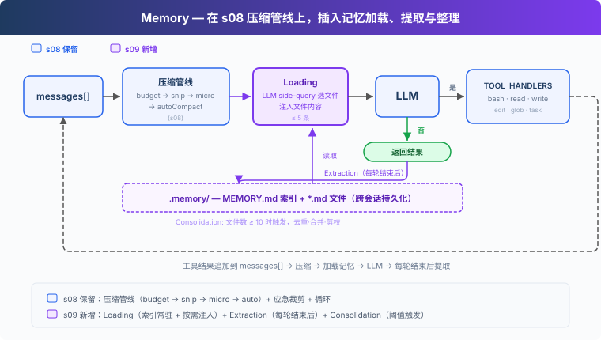
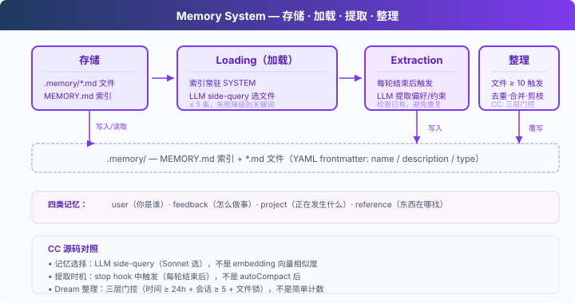

# s09: Memory — Compaction Loses Detail, So Keep Important Things Outside Context

[中文](README.zh.md) · [English](README.md) · [日本語](README.ja.md)

s01 → ... → s07 → s08 → `s09` → [s10](../s10_system_prompt/) → s11 → ... → s20
> *"Compaction loses detail; important things belong outside context"* — a file store, an index, and on-demand loading survive compaction and new sessions.
>
> **Harness layer**: Memory — knowledge that accumulates across compaction and sessions.

---

The previous lesson ended with a question: which information deserves to last?

Consider a real example. You told the Agent, "Indent with tabs, not spaces." Forty turns later, s08 produces a summary and that sentence probably becomes "the user has code-style preferences." The actual preference is gone. The next day is worse: a new session starts with a new `messages`, so even the summary does not exist. A rule taught yesterday is untaught today.

The scratch-paper metaphor needs one final piece. Scratch paper fills up and gets reorganized; that is unavoidable. But some facts never belonged on scratch paper. "This teacher grades strictly" or "I often make sign errors in this kind of problem" are lessons that cross individual assignments. They belong in a separate notebook that you check before each task.

This lesson gives the Agent that notebook.



---

## Why Not Put It in the System Prompt?

The intuitive design is to write important preferences into a fixed file and inject it into the system prompt at startup.

The direction is right, but two questions remain. First, who writes the file? Preferences appear casually in everyday conversation — "use tabs rather than spaces" is not a form submission. Requiring the user to maintain a preference file manually means the system effectively does not exist. Second, making everything permanent recreates s07's cost problem: as memories accumulate, every turn resends all of them, even though 90% are irrelevant to the current task.

s07 already gave us the shape of the answer: **keep the index present and load content on demand.** Memory is a writable version of the skill system. Skills in s07 are human-authored and read-only; memories in s09 are written by the Agent, grow over time, and need maintenance.

A writable system must answer four questions: how to store, how to read, when to write, and what to do when there are too many entries.



---

## Storage: One File per Memory, Plus an Index

Each memory is a Markdown file in `.memory/`, with metadata in frontmatter:

```markdown
---
name: user-preference-tabs
description: User prefers tabs for indentation
type: user
---

User prefers using tabs, not spaces, for indentation.
**Why:** Consistency with existing codebase conventions.
**How to apply:** Always use tabs when writing or editing files.
```

There are four `type` values, each answering a different question:

| Type | Question | Example |
|------|----------|---------|
| user | Who are you? | "Use tabs, not spaces" |
| feedback | How should work be done? | "Do not mock the database" |
| project | What is happening? | "The auth rewrite is compliance-driven" |
| reference | Where can something be found? | "The pipeline bug is in Linear INGEST" |

`MEMORY.md` is the index. It contains one line per memory and is rebuilt after every write:

```python
def write_memory_file(name, mem_type, description, body):
    slug = name.lower().replace(" ", "-")
    (MEMORY_DIR / f"{slug}.md").write_text(
        f"---\nname: {name}\ndescription: {description}\ntype: {mem_type}\n---\n\n{body}\n"
    )
    _rebuild_index()   # Keep the index synchronized with the files
```

---

## Reading: Keep the Index Present, Inject Bodies Temporarily

The index follows s07's pattern and enters SYSTEM:

```python
def build_system() -> str:
    index = read_memory_index()
    memories_section = f"\n\nMemories available:\n{index}" if index else ""
    return (
        f"You are a coding agent at {WORKDIR}."
        f"{memories_section}\n"
        "Relevant memories are injected below. Respect user preferences from memory."
        ...
    )
```

Bodies load on demand. At the start of each user turn, `select_relevant_memories()` sends the recent conversation and catalog to a lightweight model side query. It chooses only clearly relevant entries, up to five:

```python
prompt = (
    "Given the recent conversation and the memory catalog below, "
    "select the indices of memories that are clearly relevant. "
    "Return ONLY a JSON array of integers, e.g. [0, 3]. ..."
)
```

If the side query fails because of an API or JSON error, the code falls back to keyword matching. A rough selection is better than no selection.

The easiest mistake is how selected bodies enter the request. The teaching version **splices them into a copy of the current request and never writes them into `messages` history.**

```python
request_messages = messages.copy()
request_messages[memory_turn] = {
    **messages[memory_turn],
    "content": memories_content + "\n\n" + messages[memory_turn]["content"],
}
response = client.messages.create(..., messages=request_messages, ...)
```

Calling `messages.append()` directly has two immediate consequences: the same memory is reinjected on every turn, making history ever larger; and s08's compaction pipeline treats injected memory text as ordinary messages, placeholdering, trimming, and summarizing it unpredictably. Injection must be temporary and assembled fresh for each request, leaving stored history clean.

---

## Writing: Extract at the End, from the Pre-Compaction Conversation

Users do not always say "remember this." Preferences are scattered through ordinary conversation, so something must listen for them. `extract_memories()` is that listener. It runs when a turn finishes and the model stops calling tools:

```python
if response.stop_reason != "tool_use":
    extract_memories(pre_compress)   # Use the snapshot from before compaction
    consolidate_memories()
    return
```

`pre_compress` is a hard requirement. Every loop iteration runs the s08 compaction pipeline. By shutdown, earlier conversation may already have been trimmed or replaced with placeholders. If "prefer tabs to spaces" happened to fall in the removed region, extracting from compacted history means reconstructing from fragments. The loop therefore saves a pre-compaction snapshot on every iteration, and extraction always sees the full text. This locks s08 and s09 together in execution order: compaction may shrink freely, but extraction must read the original.

The extraction prompt also receives the existing catalog and returns content only when something is genuinely new, avoiding ten copies of one preference. But the model's answer is only a proposal, not permission to write. Every candidate carries a `scope`: `persistent` means it should survive into later sessions, while `current_task` covers one-off commands, temporary paths, and restrictions that belong only to the current work.

`should_store_memory()` is the final admission check. It writes only `scope="persistent"` candidates with complete fields, rejects phrases such as "this session" or "current task," and compares names, descriptions, and bodies with memories already on disk. This prevents a sentence such as "do not create files in this session" from quietly becoming a rule next week even if the extractor classifies it incorrectly.

---

## Consolidation: Merge as Memories Accumulate, but Preserve the Order of Operations

Memory files accumulate duplicates, stale facts, and contradictions. When their count reaches a threshold — ten in the teaching version — consolidation asks the model to merge and deduplicate everything while preserving important preferences:

```python
try:
    response = client.messages.create(...)          # 1 Obtain the consolidated list first
    items = json.loads(match.group())               # 2 Confirm it parses
    for f in MEMORY_DIR.glob("*.md"):               # 3 Only now remove old files
        if f.name != "MEMORY.md":
            f.unlink()
    for mem in items:
        write_memory_file(...)                      # 4 Write the replacements
except Exception:
    pass                                            # Any failure leaves old files untouched
```

This order follows the same instinct as s08's "save before summarizing": **obtain and validate the replacement before destroying the original.** Reverse the order — delete first, call the API second — and one network failure erases every memory with no backup.

> Real Claude Code calls consolidation Dream. Four gates control it: at least 24 hours since the previous run, scan throttling, changes in at least five sessions, and a file lock against concurrent runs. A limited-permission fork Agent performs the work. Memory selection is likewise a model side query rather than vector retrieval. User memory spans sessions, while session memory spans compaction. The teaching version reduces these controls to one threshold and three functions, but the four responsibilities stay the same.

---

## Changes from s08

| Component | Before (s08) | After (s09) |
|-----------|--------------|-------------|
| Memory | None; preferences degrade through summaries | Store + load + extract + consolidate |
| New functions | — | `write_memory_file`, `select_relevant_memories`, `load_memories`, `extract_memories`, `consolidate_memories` |
| Storage | — | `.memory/MEMORY.md` index + `.memory/*.md` files |
| Tools | 9 | 6 — narrowed to bash, read_file, write_file, edit_file, glob, task to focus on memory |
| Loop | Compaction only | Inject memory + compact + extract at finish + consolidate periodically |

---

## Try It

```sh
cd learn-claude-code
python s09_memory/code.py
```

1. `I prefer using tabs for indentation, not spaces. Remember that.`: at shutdown, look for `[Memory: extracted N new memories]`. `.memory/` should gain a `.md` file and `MEMORY.md` should gain one index line.
2. `Create a Python file called test.py`: check whether its indentation uses tabs.
3. Enter `q`, **restart the program**, and ask `What are my preferences?`: this is a new session with a new `messages`, but the preference remains. That is the dividing line from s08: summaries do not survive sessions; memory does.
4. Continue through several unrelated topics. The side query injects only relevant memories; unrelated ones remain untouched on disk.

---

## What's Next

Memory, compaction, and tools now exist. Look back at the SYSTEM prompt: identity is one hardcoded string, the skill catalog another fragment, and the memory index another, assembled differently in each lesson. Changing projects or tool sets means editing code again.

s10 System Prompt → Sections plus runtime assembly. Different projects and tools produce different prompts.

<!-- translation-sync: zh@v2, en@v2, ja@v2 -->
