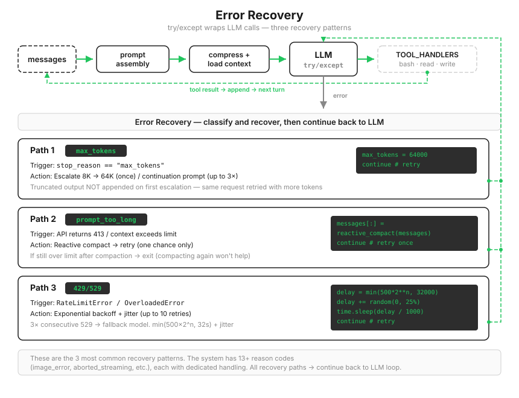

# s11: Error Recovery — 错误不是结束，是重试的开始

[中文](README.zh.md) · [English](README.md) · [日本語](README.ja.md)

s01 → ... → s09 → s10 → `s11` → [s12](../s12_task_system/) → s13 → ... → s20
> *"错误不是终点, 是重试的起点"* — 升级 token、压缩上下文、切换模型。
>
> **Harness 层**: 韧性 — 主循环遇到错误时分类并恢复。

---

前十课的代码有一个共同的假设：每次 API 调用都成功。打破它只需要一行报错：

```
Error: 529 overloaded
```

Agent 当场崩溃。没有重试，没有降级，干了二十分钟的任务直接付诸东流。而在生产环境里，429 限流、529 过载、网络抖动不是意外，是日常，一天撞上几次很正常。



---

## 套一个万能重试，为什么不行

第一反应：`try/except` 包住，失败就重来。

```python
while True:
    try:
        response = client.messages.create(...)
        break
    except Exception:
        time.sleep(1)   # 再试一次总会好的？
```

三个坏法立刻显形。`prompt_too_long` 重试一万次结果也一样，因为错误不是瞬态的，是请求本身太胖，重试治不了这种病。固定间隔的重试会把 429 打得更狠：所有客户端同一秒失败、同一秒重来，服务端刚喘口气又被踩一脚。最阴的是它会掩盖真 bug：代码里的 `TypeError` 也被它无限重试，你永远看不到那条真正该修的报错。

结论先立住：**恢复动作必须匹配错误性质。** 教学版把错误分成四类，各走各的路：回答太长的（截断）、请求太胖的（超限）、等等就好的（瞬态）、无药可救的（其他）。

---

## 路径 1：输出被截断，先加空间，再让它续写

模型写到一半 token 用完，`stop_reason` 是 `"max_tokens"`。分两级处理：

```python
if response.stop_reason == "max_tokens":
    # 第一级：升到 64K，重发同一请求。注意：截断的输出不追加进 messages
    if not state.has_escalated:
        max_tokens = ESCALATED_MAX_TOKENS      # 8000 -> 64000
        state.has_escalated = True
        continue
    # 第二级：64K 还不够，保存截断输出，注入续写提示，最多 3 次
    messages.append({"role": "assistant", "content": response.content})
    if state.recovery_count < MAX_RECOVERY_RETRIES:
        messages.append({"role": "user", "content": CONTINUATION_PROMPT})
        state.recovery_count += 1
        continue
    return
# 正常完成才追加回复
messages.append({"role": "assistant", "content": response.content})
```

第一级有个容易做反的细节：升级重试时，截断的那份输出**不进** `messages`。空间从 8K 翻到 64K，同一个请求干净地重发一遍，多数情况一次过。要是先把残缺输出存了再重试，历史里就永远留着半截废稿，还会和重发的完整版重复。

第二级才开始拼接：残稿存档，追加一句续写提示（"直接接着写，不道歉、不复述"），让模型从断口续。次数封顶 3 次，再多说明任务本身要拆，续写不解决问题。

还要注意检查顺序：`max_tokens` 的判断在"追加回复"**之前**。这条顺序错了，第一级的"不追加"就无从谈起。

---

## 路径 2：请求太胖，瘦一次身，只瘦一次

API 报 `prompt_too_long`，说明上下文超了硬限制。这类错误的解药是瘦身，不是重试：

```python
except Exception as e:
    if is_prompt_too_long_error(e):
        if not state.has_attempted_reactive_compact:
            messages[:] = reactive_compact(messages)   # 只保最后 5 条 + 一句说明
            state.has_attempted_reactive_compact = True
            continue
        # 瘦过一次还超，退出。再瘦也不会更小
        ...
        return
```

一个教学简化要说明：这里的 `reactive_compact` 只做截尾（保留最后 5 条消息），不调模型生成摘要。LLM 式的应急摘要 s08 已经完整讲过，这一章不重复造它，专注恢复框架本身。

只试一次的理由和 s08 相同：截尾之后还超限，说明单条消息就大得离谱，继续压缩只会陷进"压了还超、超了再压"的死循环。

---

## 路径 3：瞬态故障，退避有讲究

429 和 529 才是重试的正主，但重试要带两样东西：指数退避和抖动。

```python
def retry_delay(attempt, retry_after=None):
    if retry_after:                                   # 服务器指定了等多久，听它的
        return retry_after
    base = min(BASE_DELAY_MS * (2 ** attempt), 32000) / 1000   # 0.5s, 1s, 2s ... 封顶 32s
    jitter = random.uniform(0, base * 0.25)           # 加 0~25% 随机抖动
    return base + jitter
```

指数是对服务端的礼貌：它已经过载了，重试间隔逐倍拉开，给它喘息的空间。抖动是对同类的礼貌：成千上万个客户端同一毫秒失败，如果都按整点重试，下一波洪峰和上一波一样高；每人随机错开一点，洪峰就摊平了。

529 还有一层升级：连续 3 次过载，说明这个模型短期内指望不上，切到备用模型（配置了 `FALLBACK_MODEL_ID` 才切，没配就继续退避）：

```python
if state.consecutive_529 >= MAX_CONSECUTIVE_529:
    if FALLBACK_MODEL:
        state.current_model = FALLBACK_MODEL
        state.consecutive_529 = 0
```

计数器在任何一次成功后清零，偶发的 529 不积累。整套重试封顶 10 次，用完了抛 `Max retries exceeded`，绝不无限等。

---

## 剩下的：无药可救，留痕退出

不属于以上三类的错误（认证失败、参数错误、真正的代码 bug），唯一正确的处理是不处理：

```python
messages.append({"role": "assistant", "content": [
    {"type": "text", "text": f"[Error] {name}: {str(e)[:200]}"}]})
return
```

但退出前把错误写进对话留痕。静默崩溃是最差的行为：用户回来只看到 Agent 消失了，不知道发生过什么。错误写进 `messages`，用户看得到，下一轮对话模型也看得到。

三层机制各管一段，互不越界：`with_retry` 在最内层吃掉瞬态错误，外层 `except` 接住超限和不可救的，`stop_reason` 检查处理截断。分类清楚了，每条路径都短得一眼能看完。

> 真实 Claude Code：每轮调用后判定的 reason/transition 有十几种（流式中止、图像错误、hook 阻断、token 预算续跑等各有专门路径）；切换备用模型时会清空待发消息并向用户提示"因高负载切换"；续写还有收益递减检测——连续 3 次续写的增量不足 500 token，就判定继续无益，主动停手。

---

## 相对 s10 的变更

| 组件 | 之前 (s10) | 之后 (s11) |
|------|-----------|-----------|
| 错误处理 | 无（一碰就崩溃） | 四类错误分路恢复 + 指数退避 |
| 新常量 | — | `ESCALATED_MAX_TOKENS=64000`, `MAX_RETRIES=10`, `BASE_DELAY_MS=500`, `MAX_CONSECUTIVE_529=3` |
| 新函数 | — | `with_retry`, `retry_delay`, `reactive_compact`, `is_prompt_too_long_error`, `RecoveryState` |
| 工具 | bash, read_file, write_file (3) | 不变 |
| 循环 | 裸调用 LLM | try/except 包裹 + `continue` 重试 |

---

## 试一下

```sh
cd learn-claude-code
python s11_error_recovery/code.py
```

1. **截断路径（看运气，但常能触发）**：`Write a single Python file implementing a complete tic-tac-toe game with an AI opponent, full docstrings and type hints, at least 500 lines`。如果输出真的超过 8K token，会看到 `[max_tokens] escalating 8000 -> 64000`；
2. **不可恢复路径（确定复现）**：把 `.env` 里的 `MODEL_ID` 改成一个不存在的名字（如 `claude-nonexistent`），随便问一句。观察 `[unrecoverable]` 日志，以及对话里留下的 `[Error] NotFoundError: ...` 消息——留痕退出，不是静默消失。试完记得改回来；
3. **瞬态路径（可遇不可求）**：429/529 没法按需制造，但真撞上时你会看到 `[429 rate limit] retry 1/10, wait 0.5s` 这样的日志，间隔逐次翻倍。知道这些标签长什么样，生产环境里第一眼就能认出它在自愈。

---

## 接下来

Agent 现在抗揍了。但它处理的任务仍然是一次性的：你给它一个任务，它做完，结束。任务之间的依赖关系（先做 A 才能做 B）、任务的持久化（进程重启后清单还在吗）、多个执行者认领同一批任务，这些 s05 那个内存里的 TODO 列表都给不了。

s12 Task System → 任务是有依赖、有状态、持久化的图。这是多 Agent 协作的地基。

<!-- translation-sync: zh@v2, en@v1, ja@v1 -->
