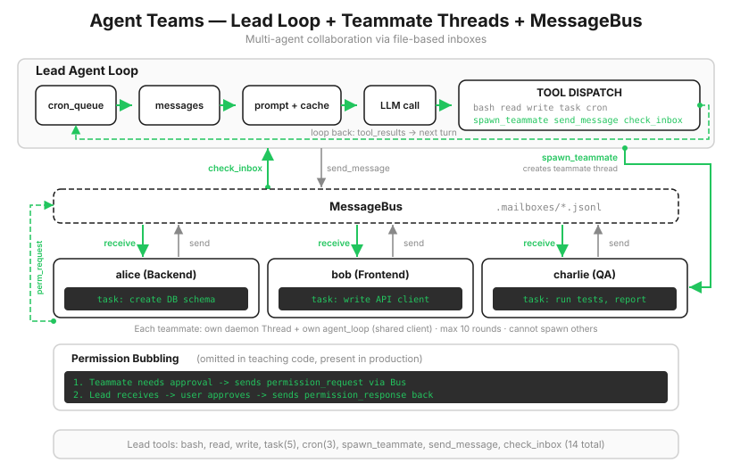

# s15: Agent Teams — 1 人で無理なら、チームを組む

[中文](README.zh.md) · [English](README.md) · [日本語](README.ja.md)

s01 → ... → s13 → s14 → `s15` → [s16](../s16_team_protocols/) → s17 → s18 → s19 → s20
> *「1 人で無理なら、チームを組む」* — ファイル受信箱と teammate thread。
>
> **Harness 層**: チーム — マルチ Agent 協調と message bus。

---

「バックエンド全体をリファクタリングする」という仕事を広げると、認証モジュール、データベース層、API ルート、テストという 4 つの作業になります。1 つの Agent が直列に進めると、API ルートに着手するころには、認証モジュールの細部が context から押し出されています。

s06 の subagent で分担できるでしょうか。あと一歩足りません。`spawn_subagent` は blocking call です。1 人を送り出すと main Agent は戻るまでその場で待つため、4 つの仕事は結局順番待ちになります。しかも subagent の通信経路は 1 回の戻り値だけです。途中で「データベースの schema がタスク説明と合わない」と気づいても、戻って質問する手段がありません。

本当に必要なのは臨時の手伝いではなく、同僚です。同僚には subagent が持たない 2 つの特徴があります。**同時に働くこと**と、**いつでも伝言できること**です。同時に働く方法は s13 がすでに示しました（thread）。いつでも伝言できる仕組みが、この章の主役です。



---

## 同僚は return せず、メッセージを送る

関数呼び出しの通信モデルは 1 回限りの request-response です。呼び出し元は待ち、呼び出し先が return すると経路は閉じます。チーム協調には別のモデルが必要です。各自が mailbox を持ち、誰でも好きなときに投函でき、受信者は手が空いたときに読みます。

`MessageBus` はその mailbox システムで、直接見通せるほど素朴に実装されています。

```python
class MessageBus:
    def send(self, from_agent, to_agent, content, msg_type="message"):
        msg = {"from": from_agent, "to": to_agent,
               "content": content, "type": msg_type, "ts": time.time()}
        inbox = MAILBOX_DIR / f"{to_agent}.jsonl"
        with open(inbox, "a") as f:                  # 送信 = 相手のファイルへ 1 行追加
            f.write(json.dumps(msg) + "\n")

    def read_inbox(self, agent) -> list[dict]:
        inbox = MAILBOX_DIR / f"{agent}.jsonl"
        if not inbox.exists():
            return []
        msgs = [json.loads(line) for line in inbox.read_text().splitlines() if line.strip()]
        inbox.unlink()                               # 受信 = 読後に削除（消費型）
        return msgs

    def peek(self, agent) -> bool:
        inbox = MAILBOX_DIR / f"{agent}.jsonl"
        return inbox.exists() and inbox.stat().st_size > 0   # 内容に触れず、存在だけ確認
```

なぜメモリ上の queue ではなくファイルなのでしょう。理由は 2 つあります。まず可観測性です。`.mailboxes/` ディレクトリがそのまま存在し、いつでも `cat` すれば誰が誰に何を伝えているか分かります。マルチ Agent システムのデバッグでは、ログよりはるかに便利です。次に拡張性です。ファイルは自然にプロセス境界を越えます。今日の teammate が thread でも、明日は独立 process や別マシンに変えられ、mailbox はそのまま使えます。

2 つの境界も明確にしておきます。読取は消費型で、読み終えるとファイルを削除します。受け取ったメッセージはその場で処理する必要があり、失えば予備はありません。また教材版には file lock がなく、極端なタイミングでは 2 人の書き手が行を混在させる可能性があります。実際の Claude Code は、各 append を `proper-lockfile` で保護します。

---

## Teammate: 同じループに名前と mailbox を足す

以前からの規則が 3 度目も当てはまります。teammate は s06 の subagent と同じく s01 ループの別コピーで、違うのは設定だけです。自分の system prompt に名前と役割を持ち、自分の mailbox を持ち、各ラウンドの前に受信を確認します。

```python
def spawn_teammate_thread(name: str, role: str, prompt: str) -> str:
    system = (f"You are '{name}', a {role}. "
              f"Use tools to complete tasks. Send results via send_message to 'lead'.")

    def run():
        messages = [{"role": "user", "content": prompt}]
        status = "max_rounds"
        rounds = 0
        for _ in range(MAX_TEAMMATE_ROUNDS):
            rounds += 1
            inbox = BUS.read_inbox(name)             # 毎ラウンド先に mailbox を確認
            if inbox:
                messages.append({"role": "user",
                                 "content": f"<inbox>{json.dumps(inbox)}</inbox>"})
            response = client.messages.create(
                model=MODEL, system=system, messages=messages[-20:],   # sliding window
                tools=sub_tools, max_tokens=8000)
            ...
            if response.stop_reason != "tool_use":
                status = "completed"
                break
        report = build_teammate_report(status, messages, rounds)
        BUS.send(name, "lead", json.dumps(report),
                 "result" if status == "completed" else "error")
        active_teammates.pop(name, None)             # roster から自分を削除

    threading.Thread(target=run, daemon=True).start()
```

ツールセットは今回も絞ります。`bash`、`read_file`、`write_file`、`send_message` だけで、`spawn_teammate` は含めません。teammate がさらに人を増やせないようにする、s06 から続く再帰防止の規則です。context 管理には s08 の圧縮パイプラインではなく、`messages[-20:]` の sliding window を使います。teammate は最大 10 ラウンドと短命で、直近 20 メッセージが生涯全体を覆うため、4 段階の整理は割に合いません。

10 ラウンドは実行予算であり、完了の証明ではありません。正常に停止した場合だけ `status="completed"` を返します。上限に達したら `status="max_rounds"`、API が失敗したら `status="error"` とし、どちらも非成功メッセージとして、最後の有効な要約と実行ラウンド数を送ります。Lead は「完了した」と「動作が止まった」を区別できます。

Lead 側には 3 つのツールを追加します。人を呼ぶ `spawn_teammate`、伝言する `send_message`、受信を確認する `check_inbox` です。

---

## Lead のターミナル: Request-response から event loop へ

最初の 14 章の main program は同じ形でした。`input()` であなたを待ち、1 turn 実行し、また待ちます。今は teammate の報告がいつ届くか分からず、その瞬間にあなたが Enter を押すことも期待できないため、この形では動きません。

main program を event loop に変えます。2 つの発生源、あなたの入力とバックグラウンドの動きが同じ queue に合流し、先に来たものから処理します。

```python
def inbox_poller():
    while True:
        time.sleep(1)
        if BUS.peek("lead") or has_pending_background():
            events.put(("wake", None))       # メールまたはバックグラウンド完了: 1 turn の wake-up を要求

while True:
    kind, payload = events.get()
    if kind == "user":
        history.append({"role": "user", "content": payload})
    else:  # wake
        inbox = BUS.read_inbox("lead")
        ...
        if not parts:
            continue                          # 前の wake が空にしていればスキップ
        history.append({"role": "user", "content": "\n".join(parts)})
    agent_loop(history, context)
```

2 つの防御は、それぞれ現実に起きる失敗へ対応します。

**wake は冪等でなければなりません。** poller は毎秒確認するため、1 件の teammate メッセージに対して wake event が 2 つ並ぶことがあります。1 つ目が mailbox を空にしたら、2 つ目は「何もない」と判断してスキップする必要があります。この `continue` がなければ、各メッセージに空の API 呼び出しが 1 回おまけで付いてきます。

**poller は roster を見てはいけません。** 直感的には「生きている teammate がいる間だけメールを確認する」と書きたくなります。しかし teammate は、最後の要約を送ってから自分を roster から削除し、この 2 操作は atomic ではありません。roster を条件にすると、削除直後に見えるようになった最後のメールが永遠に受信されない可能性があります。そのため poller が信頼するのは mailbox だけです。送信者が roster に残っているかにかかわらず、メールがあれば wake します。

Lead は teammate を起動した後、`check_inbox` を繰り返す必要もありません。system prompt は一度 control を返し、メール到着時の event が次の turn を起こすよう求めます。それでもモデルが空の poll を続ける場合は、1 回の呼び出しに設けた tool round 上限で `agent_loop()` が terminal へ control を返します。

> 実際の Claude Code では teammate は 10 ラウンドで終わらず、仕事を終えると idle loop に入って mailbox の横で待ち、`shutdown_request` を受け取って初めて退場します。mailbox の書込には file lock を使います。チーム固有の hook event、`TeammateIdle` と `TaskCompleted` もあり、外部システムが動作を追加できます。

---

## s14 からの変更点

| コンポーネント | 変更前 (s14) | 変更後 (s15) |
|------|-----------|-----------|
| Agent 数 | 1 | 1 lead + N teammate thread |
| 通信 | なし | `MessageBus` file mailbox（`.mailboxes/*.jsonl`） |
| 新しいツール | — | `spawn_teammate`, `send_message`, `check_inbox`（合計 14） |
| main program | `input()` による request-response | event loop（ユーザー入力 + wake event） |
| teammate のライフサイクル | — | 最大 10 ラウンド。completed / max_rounds / error を報告して roster から削除 |

---

## 試してみる

```sh
cd learn-claude-code
python s15_agent_teams/code.py
```

1. **並行処理と自動 wake-up**: `Spawn two teammates: 'poet' (a poet) who writes a short poem to poem.md, and 'critic' (a critic) who reviews the first paragraph of README.md. Wait for both reports.` `[teammate] poet spawned` と `[teammate] critic spawned` がほぼ同時に現れ、双方の `[bus]` メッセージが交互に流れます。報告が戻ると、何も入力しなくてもターミナルが `[wake: N inbox ...]` を表示して新しい turn を始め、最後は `[all teammates done]` になります。
2. **通信そのものを見る**: teammate に `Spawn a teammate 'worker' who runs 'sleep 15' and then writes done.md` のような遅い仕事を渡し、実行中に Lead へ `Run ls -la .mailboxes/` と伝えます。mailbox ファイルがそこにあり、この協調システムのインフラ全体が数個の JSONL ファイルにすぎないと分かります。
3. **消費型の読取**: すべて終わったあと `Check your inbox` と入力すると、おそらく `(inbox empty)` が返ります。メッセージが失われたのではなく、wake-up の仕組みが先に受け取り、会話へ注入しました。読後削除する mailbox のコピーは 1 つだけで、先に取った側のものになります。この動作は体験しておく価値があります。

---

## 次へ

teammate は仕事と通信ができるようになりましたが、すべて自由形式です。メッセージに書式はなく、Lead が teammate を止めたくても見ているしかありません。thread を直接殺せば、ファイルを書いている途中かもしれません。

s16 Team Protocols → メッセージに種類と ID を追加し、shutdown には handshake、request には acknowledgement を求めます。

<!-- translation-sync: zh@v2, en@v2, ja@v2 -->
