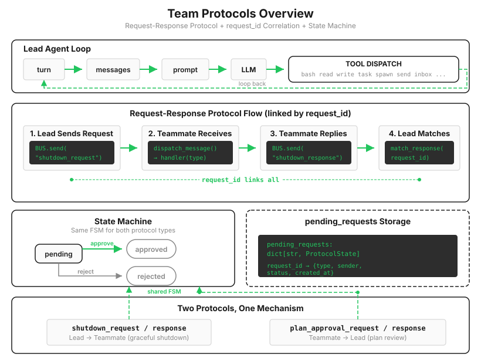

# s16: Team Protocols — 队友之间要有约定

[中文](README.zh.md) · [English](README.md) · [日本語](README.ja.md)

s01 → ... → s14 → s15 → `s16` → [s17](../s17_autonomous_agents/) → s18 → s19 → s20
> *"队友之间要有约定"* — request-response 模式驱动协商。
>
> **Harness 层**: 协议 — Agent 之间的结构化握手。

---

s15 的队友能干活、能捎话，但捎的全是自由文本。两个场景一上强度就露馅。

**关机。** Lead 想让 Alice 停工。发一句"你可以停了"？Alice 的模型可能把它理解成建议、理解成夸奖、甚至理解成新任务。直接杀线程？她写了一半的文件就烂在磁盘上。

**审批。** Bob 要重构认证模块，高风险操作，理应先交计划、批了再动。可"我打算这么干"和"可以，去吧"都是普通聊天，Lead 同时在等两个人的计划时，收到一句"好的"，是谁对哪件事的好的？

两个场景的形状一模一样：一方发请求，另一方给答复，答复要能对上是回的哪个请求。聊天靠模型理解，理解就有歧义；协作要的是不会歧义的那部分，也就是**协议：给消息加上机器可查的字段。**



---

## 三个字段，一台状态机

缺的东西数出来正好三样：类型（这是关机令，不是闲聊）、编号（这条答复对应哪次请求）、状态（这事办到哪一步了）。落成代码：

```python
@dataclass
class ProtocolState:
    request_id: str    # req_042317，每次请求唯一
    type: str          # "shutdown" | "plan_approval"
    sender: str
    target: str
    status: str        # pending | approved | rejected
    payload: str

pending_requests: dict[str, ProtocolState] = {}
```

答复回来时，用编号对账，三道验证一道都不能少：

```python
def match_response(response_type: str, request_id: str, approve: bool):
    state = pending_requests.get(request_id)
    if not state:
        return   # ① 编号不认识：不是我发出的请求
    if state.type == "shutdown" and response_type != "shutdown_response":
        return   # ② 类型不匹配：拿关机回执答复计划审批，拒收
    if state.status != "pending":
        return   # ③ 已经结案：重复答复直接忽略
    state.status = "approved" if approve else "rejected"
```

每道验证挡一种翻车。没有编号，Lead 并发等两份答复时必然串线。没有类型校验，字段填错的消息会污染错误的请求。没有结案检查，网络重发的答复能把已经 approved 的状态再翻一遍。第三条还有个名字：幂等，同一条消息处理两次和一次效果相同，分布式系统的基本礼貌。

---

## 一条硬约束：消费入口必须唯一

s15 说过信箱是消费式的，读完即删。现在信箱里混进了协议答复，一个隐患就埋下了：Lead 有两条读信路径（`check_inbox` 工具、主循环的唤醒），如果其中一条直接调 `BUS.read_inbox`，一封 `shutdown_response` 被它掏走却没过 `match_response` 登记，`pending_requests` 里那个请求就永远悬在 pending。

修法是收口：所有读信都走同一个函数，路由先行，返回在后：

```python
def consume_lead_inbox(route_protocol: bool = True) -> list[dict]:
    msgs = BUS.read_inbox("lead")
    for msg in msgs:
        req_id = msg.get("metadata", {}).get("request_id", "")
        if req_id and msg.get("type", "").endswith("_response"):
            match_response(msg["type"], req_id, msg["metadata"].get("approve", False))
    return msgs
```

消费式存储加多个消费者，等于必须统一入口。这条规矩不限于本章，任何"读了就没了"的数据源都适用。

---

## 关机握手：先回执，再退场

有了协议地基，关机变成一次干净的握手。Lead 侧登记请求并发出：

```python
def run_request_shutdown(teammate: str) -> str:
    req_id = new_request_id()
    pending_requests[req_id] = ProtocolState(request_id=req_id, type="shutdown",
                                             sender="lead", target=teammate,
                                             status="pending", payload="")
    BUS.send("lead", teammate, "Please shut down gracefully.",
             "shutdown_request", {"request_id": req_id})
```

队友侧的循环里多了一层分发：协议消息按类型走处理器，普通消息照旧注入对话：

```python
if msg_type == "shutdown_request":
    BUS.send(name, "lead", "Shutting down gracefully.",
             "shutdown_response", {"request_id": req_id, "approve": True})
    return True   # 先回执，再走退场流程
```

先回执再退场，顺序有讲究：万一收尾路径上哪步出错，Lead 至少已经知道请求送达了，不会对着一个死掉的队友无限等待。

顺带，s15 那个"10 轮封顶"在本章兑现了升级：队友干完活不再退场，而是进入待命循环，一秒看一次信箱。来了新任务就回去干活，来了 `shutdown_request` 才收尾离开。队友的生命周期从"计数器归零"变成了"听候调遣"，这正是 s15 对照行里预告的真实形态。

---

## 计划审批：同一台状态机，换个方向

审批流用的是完全相同的机制，只是请求方反过来，队友发起、Lead 裁决：

```
Bob: submit_plan("重构认证模块：先加测试，再改接口...")   → plan_approval_request (req_xxx)
Lead: review_plan(req_xxx, approve=True)                → plan_approval_response
Bob 的对话里被注入: [Plan approved] Proceed with the task.
```

答复还必须唤醒已经进入待命的队友。`wait_for_teammate_message()` 收到 `plan_approval_response` 后，先把批准或驳回写进 Bob 的对话，再返回一轮新的模型调用。少了这一步，批复虽然安稳躺在信箱里，Bob 却会一直睡在旁边。

一个 `request_id` 关联机制、一台 pending → approved/rejected 状态机，服务两种协议。以后要加第三种（比如资源申请），照葫芦画瓢即可，这就是把"约定"做成结构的回报。

必须诚实交代边界：**这是协议级审批，不是代码级门禁。** `submit_plan` 之后，队友的线程照常运转，工具照常可调，"等批复再动手"靠的是模型自觉。想要硬约束，得在工具分发层拦截未获批准的操作。s03 讲过问答层放行不等于边界层放行，这一课的教学版只建了问答层，边界层留白。

> 真实 Claude Code：关机是三向协议，队友可以回 `shutdown_rejected` 附上理由（"手头还有活"），确认后系统自动清理终端面板、解除名下任务、把成员移出编制；执行门控是真的拦截，未获批准的高风险操作过不了工具层，不靠模型自觉。

---

## 相对 s15 的变更

| 组件 | 之前 (s15) | 之后 (s16) |
|------|-----------|-----------|
| 消息 | 自由文本 | +type / request_id / metadata 结构 |
| 协议 | 无 | `ProtocolState` 状态机（pending → approved/rejected） |
| 队友生命周期 | 10 轮封顶 | 待命循环，`shutdown_request` 才退场 |
| Lead 新工具 | — | `request_shutdown`, `request_plan`, `review_plan` |
| 队友新工具 | — | `submit_plan` |
| 信箱消费 | 各读各的 | `consume_lead_inbox` 统一入口 + 协议路由 |

---

## 试一下

```sh
cd learn-claude-code
python s16_team_protocols/code.py
```

1. **体面关机**：`Spawn a teammate 'alice' (a writer) to write a haiku to haiku.md, wait for her result, then ask her to shut down.`。完整链路都有日志：`[protocol] shutdown_request → alice (req_xxxxxx)`，然后 `[protocol] alice approved shutdown`，最后 `[protocol] shutdown ✓ (req_xxxxxx: approved)`。一个编号从发出到结案；
2. **计划审批**：`Spawn 'bob' (an engineer) and ask him to submit a plan for adding a config file, then approve his plan.`。观察 `plan_approval_request` 带着编号进 Lead 信箱、`review_plan` 之后 Bob 收到 `[Plan approved]` 才动手；
3. **待命循环**：实验 1 里 alice 交完稿到你让她关机之间，她既没退出也没占着终端，安静守着信箱。对比 s15 的队友干完就散，这就是"听候调遣"的差别。

---

## 接下来

协议让协作有了规矩，但分工还是 Lead 一手包办："Alice 做这个，Bob 做那个。"看板上挂着十个任务，Lead 就得点十次名。

s12 的任务系统早就有 `claim_task` 了。能不能让队友自己看板、自己认领、做完自己拿下一个，Lead 只管出题？

s17 Autonomous Agents → 队友自组织，不需要领导分配。

<!-- translation-sync: zh@v2, en@v2, ja@v2 -->
