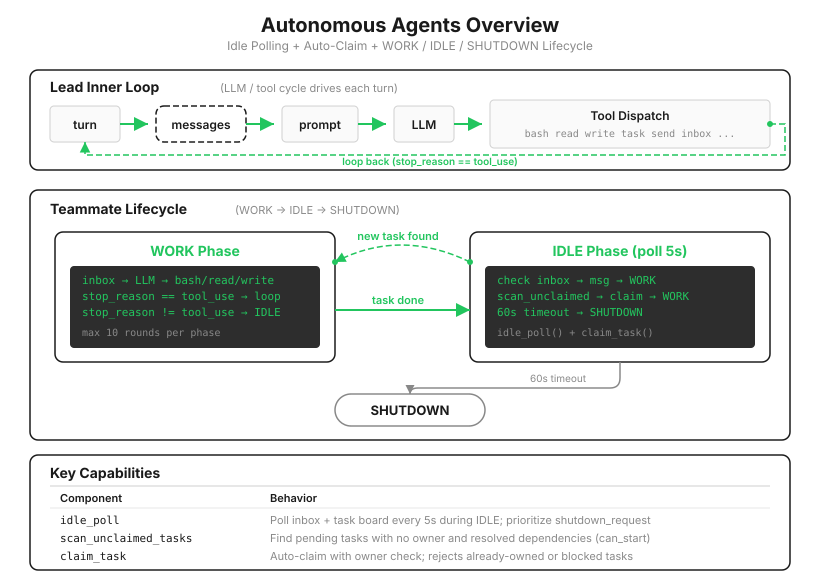

# s17: Autonomous Agents — 不等 Lead 派活，空了自己上看板认领

[中文](README.zh.md) · [English](README.md) · [日本語](README.ja.md)

s01 → ... → s15 → s16 → `s17` → [s18](../s18_worktree_isolation/) → s19 → s20

> *"不等 Lead 派活，空了自己上看板认领"* — 空闲时轮询，有任务就认领。
>
> **Harness 层**: 自治 — 队友自组织，不依赖 Lead 分配。

---

s16 的团队有规矩了，但分工方式还停留在点名："Alice 做这个，Bob 做那个。"看板上挂十个任务，Lead 就得点十次名。团队一大，Lead 的全部轮次都花在当调度员上，而它每一轮都是真金白银的 API 调用。更僵的是时序：Lead 正忙着审批计划时，干完活的队友只能干等，明明看板上还挂着没人碰的任务。

成熟的团队不是这么运转的。任务板是公开的，谁有空谁上去拿。这一课把分工从"推"翻转成"拉"：**任务不再被分配，任务被认领。**

s12 埋的那颗种子在这里发芽：任务文件里的 `owner` 字段和 `claim_task` 的归属检查，当时看着多余，现在正是多个 Agent 抢活不打架的地基。



---

## 生命周期：WORK 冲刺，IDLE 巡逻，没活自己下班

三章下来，队友的生命形态一直在进化：s15 干完 10 轮就散伙，s16 干完待命、听候裁决，s17 干完自己找下一份活。代码上是一个两态循环：

```python
while True:
    # WORK：一轮冲刺（最多 10 个 LLM 轮次），干手头的活
    for _ in range(10):
        ...  # 查信箱、调模型、执行工具

    # IDLE：巡逻。5 秒看一眼，60 秒没收获就收工
    idle_result = idle_poll(name, messages, name, role)
    if idle_result in ("shutdown", "timeout"):
        break
```

巡逻的优先级写得很清楚，信箱高于看板：

```python
def idle_poll(agent_name, messages, name, role) -> str:
    for _ in range(IDLE_TIMEOUT // IDLE_POLL_INTERVAL):   # 60s / 5s = 12 次
        time.sleep(IDLE_POLL_INTERVAL)

        inbox = BUS.read_inbox(agent_name)
        if inbox:
            ...                      # shutdown_request → 回执退场
            return "work"            # 普通消息 → 注入对话，回去干活

        unclaimed = scan_unclaimed_tasks()
        if unclaimed:
            result = claim_task(unclaimed[0]["id"], agent_name)
            if "Claimed" in result:  # 认领成功才算数
                return "work"
    return "timeout"                 # 60 秒一无所获，自行退场
```

`timeout` 分支值得停一下：没活干的员工自己下班。这不是省事，是省钱——一个空转巡逻的线程虽然不调模型，但它永远不退场的话，进程里会积攒一堆僵尸队友。60 秒是教学参数，生产系统会配更长的窗口，或者改成通知 Lead 由它裁决去留。

---

## 抢活：先到先得，抢输了继续巡逻

看板扫描只挑真正能干的活，三个条件缺一不可：

```python
def scan_unclaimed_tasks() -> list[dict]:
    unclaimed = []
    for f in sorted(TASKS_DIR.glob("task_*.json")):
        task = json.loads(f.read_text())
        if (task.get("status") == "pending"      # 还没人做
                and not task.get("owner")        # 没有主
                and can_start(task["id"])):      # 依赖全部完成（s12 的检查）
            unclaimed.append(task)
    return unclaimed
```

两个队友同时在巡逻，同时看见同一个任务，怎么办？答案在 `claim_task` 的返回值检查里。s12 写下的归属检查此刻生效：先写入的人把状态改成 `in_progress`，后来的人调 `claim_task` 会得到 `"Task xxx is in_progress, cannot claim"`。所以认领后必须验证返回值，`"Claimed" in result` 才算抢到，抢输了打一行 `[idle] claim failed` 继续巡逻，下一圈再找别的活。

诚实的边界还是那条：教学版没有文件锁，两个线程在同一毫秒各自读到 `pending` 再各自写入的窗口依然存在。真实系统在文件锁内重读再判定（s12 的对照行讲过）。教学版接受这个小窗口，换来的是代码一眼能看懂"乐观认领 + 失败重试"这个模式本身。

---

## 身份重注入：跑得久的人会忘了自己是谁

队友的上下文用 `messages[-20:]` 滑动窗口（s15 的设计）。短命队友没问题，可自治队友是长跑选手：认领一个又一个任务，窗口一路向前滑，最初那句"你是 alice，一个 poet"迟早被挤出窗外。失去身份的队友会答非所问，甚至把自己当成 Lead 开始指挥别人。

所以外层循环每次开始时检查，消息列表太短（意味着刚起步或刚被截过）就把身份补回去：

```python
if len(messages) <= 3:
    messages.insert(0, {"role": "user",
        "content": f"<identity>You are '{name}', role: {role}. "
                   f"Continue your work.</identity>"})
```

这和 s08 摘要保五类信息、s09 记忆抗压缩是同一根神经：**上下文会流失，凡是必须活下来的信息，都要有人负责再放回去。** 身份是多 Agent 系统里最不能丢的那一条。

> 真实 Claude Code：空闲的 teammate 不会直接退场，而是给 Lead 发 `idle_notification`，去留由 Lead 或超时策略决定；认领走文件锁防竞态。教学版的"60 秒自行下班"是把这套裁决收成了一个常量。

---

## 相对 s16 的变更

| 组件 | 之前 (s16) | 之后 (s17) |
|------|-----------|-----------|
| 分工方式 | Lead 点名分配 | 队友自己扫板认领（拉模式） |
| 队友生命周期 | WORK → 待命 → 被裁 | WORK → IDLE 巡逻 → 自动认领 / 超时自退 |
| 队友工具 | 5 个 | 8 个（+`list_tasks`, `claim_task`, `complete_task`） |
| 新函数 | — | `scan_unclaimed_tasks`, `idle_poll` |
| 身份维护 | 无 | 消息列表变短时重注入 `<identity>` |

---

## 试一下

```sh
cd learn-claude-code
python s17_autonomous_agents/code.py
```

1. **纯拉式流水线**：`Create three tasks: write a haiku to a.md, write a limerick to b.md, write a couplet to c.md. Then spawn two teammates 'w1' and 'w2', both poets, with the prompt "Check the task board and work autonomously."`。Lead 从头到尾没有分配过任何一个任务，看 `[idle] w1 auto-claimed` 和 `[idle] w2 auto-claimed` 交错出现，三个任务被两个人分食，谁快谁多干；
2. **抢活失败的现场**：实验 1 里多半能看到一行 `[idle] claim failed: Task ... is in_progress`。那是两个人同时盯上了同一个任务，输家没有崩溃也没有重复干活，打了行日志继续巡逻。这一行日志就是 s12 归属检查的价值；
3. **自己下班**：三个任务全部完成后，别再创建新任务，等 60 秒。`[idle] w1 timeout (60s)`、`[teammate] w1 finished` 相继出现，没活干的员工自己走了，不留僵尸线程。

---

## 接下来

队友们自治了，新的麻烦也来了：两个队友各自认领的任务恰好要改同一个文件，一个刚写完，另一个跟着覆盖。任务隔离了，文件系统没有隔离，这是 s06 就说过的话，现在它成了真问题。

s18 Worktree Isolation → 给每个任务一间独立工位：git worktree，各改各的副本，改完再合。

<!-- translation-sync: zh@v2, en@v1, ja@v1 -->
