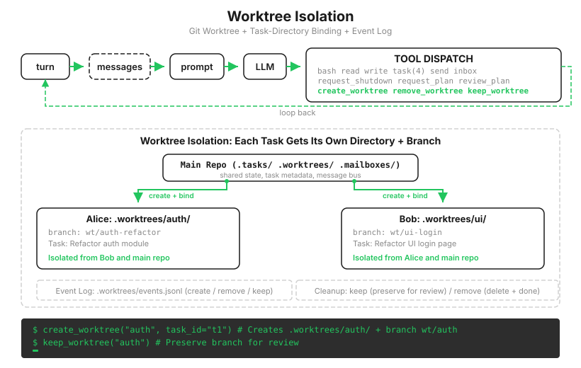

# s18: Worktree Isolation — 各干各的，互不干扰

[中文](README.zh.md) · [English](README.md) · [日本語](README.ja.md)

s01 → ... → s16 → s17 → `s18` → [s19](../s19_mcp_plugin/) → s20

> *"各干各的目录, 互不干扰"* — 任务管目标, worktree 管目录, 按 ID 绑定。
>
> **Harness 层**: 隔离 — 并行执行的目录隔离。

---

s06 有句话当时听着像免责声明："对话上下文隔离了，文件系统没有隔离。"到 s17，它成了会真实爆炸的雷。

Alice 和 Bob 各自认领了任务，都在同一个目录里干活。Alice 的任务要改 `config.py`，Bob 的任务也要。后写的覆盖先写的；更阴的版本是两人各自读了旧文件、各自改完写回，合出来一个谁都没想要的杂交体。出了问题也没法回滚，`git diff` 里两个人的改动搅在一起，分不清哪行是谁的。

s15 到 s17 回答了"谁干什么"（任务板）和"怎么说话"（信箱），一直没回答"在哪干"。



---

## 加锁，为什么不是答案

第一反应是加锁。锁整个仓库？并行退化成串行，s15 组队的意义清零。按文件加锁？先要回答"这个任务会碰哪些文件"，可任务开工前连模型自己都不知道答案；就算知道，两个任务交叉持锁就是死锁的标准配方。

换个思路，这个问题 git 二十年前就解决了：人手一个工作副本，各改各的，最后合并。`git worktree` 是比 clone 轻得多的版本——同一个仓库，长出多个工作目录，各挂一条分支，共享同一份 `.git` 历史。

worktree 这项能力属于 Git，不是 Agent Harness 自己发明的。Harness 负责决定何时创建、把哪项任务绑进去、让队友切到哪个工作目录、记录创建时的提交，以及什么时候可以安全清理。本课实现的是围绕 Git 的这段生命周期，不是重写一套隔离机制。

一句话立住本课的设计：**隔离不靠锁，靠副本。**

---

## 开工位：名字先过安检

```python
VALID_WT_NAME = re.compile(r'^[A-Za-z0-9._-]{1,64}$')

@dataclass(frozen=True)
class WorktreeRecord:
    name: str
    path: str
    branch: str
    base_commit: str
    task_id: str = ""

def create_worktree(name: str, task_id: str = "") -> str:
    err = validate_worktree_name(name)      # 名字不合法，当场拒绝
    if err:
        return f"Error: {err}"
    ok, base_commit = run_git(["rev-parse", "HEAD"])
    if not ok:
        return f"Git error: cannot record base commit: {base_commit}"
    path = WORKTREES_DIR / name             # .worktrees/<name>
    branch = f"wt/{name}"
    ok, result = run_git(["worktree", "add", str(path), "-b", branch, "HEAD"])
    if not ok:
        return f"Git error: {result}"
    save_worktree_record(WorktreeRecord(
        name, str(path.resolve()), branch, base_commit.strip(), task_id))
    if task_id:
        bind_task_to_worktree(task_id, name)
    log_event("create", name, task_id)      # 审计日志：只记成功的事
```

名字校验是老朋友第三次登场：s02 的 `safe_path` 拦文件路径，s07 的注册表拦技能名，这里的正则拦工位名。`../../etc` 这种名字一旦拼进路径，worktree 就开到工作区外面去了。凡是模型给的字符串要拼进路径，就必须先过安检，这条规矩到哪一课都不变。

`log_event` 的位置也有讲究：写在 `run_git` 成功之后。反过来先记日志再执行，失败的操作会留下一条"成功"的审计记录，日志从证据变成谎言。

`WorktreeRecord` 和审计日志不是一回事。它保存准确的分支、路径和 `base_commit`，后面才能证明这里究竟新增了什么。记录丢失或与目录对不上时，普通清理直接拒绝，不靠猜。

---

## 绑定：工位是任务的属性，不是认领

```python
def bind_task_to_worktree(task_id: str, worktree_name: str):
    task = load_task(task_id)
    task.worktree = worktree_name    # 只写这一个字段
    save_task(task)                  # 状态保持 pending
```

注意它刻意不做的事：不改状态、不设 owner。绑定只回答"这个任务该在哪间工位干"，不回答"谁来干"。这样 s17 的自治机制原封不动：任务仍然挂在板上等人认领，谁抢到谁去那间工位。两个机制正交，各管各的字段。

队友这边的变化只有一处：认领到绑定了工位的任务，它的 `bash`/`read_file`/`write_file` 全部切到工位目录里执行。Alice 在 `.worktrees/auth/` 里改 `config.py`，Bob 在 `.worktrees/ui/` 里改 `config.py`，改的是两个物理文件，谁也踩不着谁。

---

## 收工位：先数一数，再动手删

工位用完要拆，拆之前必须回答一个问题：里面还有没有没带走的东西？

```python
def remove_worktree(name: str, discard_changes: bool = False) -> str:
    path = WORKTREES_DIR / name
    record, record_error = load_worktree_record(name)
    if not discard_changes:
        if record_error:
            return f"Cannot verify worktree: {record_error}"
        verified, files, commits, detail = _inspect_worktree_changes(
            path, record.base_commit)
        if not verified:
            return f"Cannot verify worktree: {detail}"
        if files > 0 or commits > 0:
            return (f"Worktree '{name}' has {files} uncommitted file(s) "
                    f"and {commits} new commit(s) since creation. "
                    "Use discard_changes=true to force removal, "
                    "or keep_worktree to preserve for review.")
    branch = record.branch if record else f"wt/{name}"
    remove_args = ["worktree", "remove"]
    if discard_changes:
        remove_args.append("--force")
    run_git([*remove_args, str(path)])
    run_git(["branch", "-D" if discard_changes else "-d", branch])
    log_event("remove", name)
```

默认拒绝删除有变更的工位。未提交文件来自 `git status`，新提交来自 `git rev-list base_commit..HEAD`。检查不依赖 upstream，因为新开的 worktree 往往根本没有远端跟踪分支。创建记录丢了、Git 命令失败了、提交数读不出来，也一律按"无法证明安全"处理，而不是当作零。

这是 s08"先存盘再摘要"、s09"先拿到新清单再删旧文件"的同一根神经，第三次出现：**销毁之前，先确认没有孤儿数据。** 想象反面：队友刚提交完还没合并，Lead 随手一句"清理工位"，`branch -D` 下去，几小时的工作蒸发，日志里只有一行体面的 remove。

真想删有两条显式出路：`discard_changes=true` 表示"我知道我在丢什么"，`keep_worktree` 表示"留着分支，人来审"。危险动作可以做，但必须是说出口的决定，不能是默认行为。

> 真实 Claude Code：worktree 有两条路径——`EnterWorktree` 把当前会话整个切进去（进程级 chdir），AgentTool 的 `isolation: "worktree"` 只包住某个子 Agent、不动全局目录，无改动的临时工位自动清理。它没有任务-工位绑定字段，任务系统和 worktree 是两套独立系统，靠模型理解上下文来关联；教学版的 `worktree` 字段是刻意的教学简化。

---

## 相对 s17 的变更

| 组件 | 之前 (s17) | 之后 (s18) |
|------|-----------|-----------|
| 工作目录 | 全员共用 WORKDIR | 每任务可绑定独立 worktree |
| Task 字段 | id/subject/.../blockedBy | +`worktree` |
| 新函数 | — | `create_worktree`, `bind_task_to_worktree`, `remove_worktree`, `keep_worktree`, `validate_worktree_name` |
| 清理依据 | 无 | `WorktreeRecord` 保存路径、分支和创建时提交 |
| 审计 | 无 | `.worktrees/events.jsonl` 生命周期日志 |
| 队友执行 | 都在主目录 | 绑定任务时 cwd 切到工位 |

---

## 试一下

```sh
cd learn-claude-code
python s18_worktree_isolation/code.py
```

1. **隔离的正面现场**：`Create two tasks: 'write auth notes to notes.md' and 'write UI notes to notes.md'. Create worktrees wt-auth and wt-ui, bind one task to each. Spawn alice and bob to work autonomously.`。两个任务写的是同名文件 `notes.md`，最后却各自完好：`cat .worktrees/wt-auth/notes.md` 和 `cat .worktrees/wt-ui/notes.md`，内容不同，互不覆盖。这就是"靠副本隔离"的直接证据；
2. **安检**：`Create a worktree named ../../escape`。名字过不了正则，一句报错弹回来，工作区外面干干净净；
3. **拆工位的闸门**：等实验 1 的队友干完，`Remove worktree wt-auth`。它有未合并的提交，删除被拒，报错里写清了有几个文件几个提交、以及两条显式出路。这一拒绝就是本课最值钱的一行代码。

---

## 接下来

团队能并行、能隔离、能收工了。回头看 Agent 的工具箱：bash、文件、任务、团队，全是我们亲手写的。可用户手里还有自己的系统：公司内部的 Jira、自建的部署平台，总不能每接一家就往 `code.py` 里焊一套工具。

s19 MCP Plugin → 插件协议。外部工具按标准接入，Agent 不用知道它们是谁写的。

<!-- translation-sync: zh@v2, en@v2, ja@v2 -->
