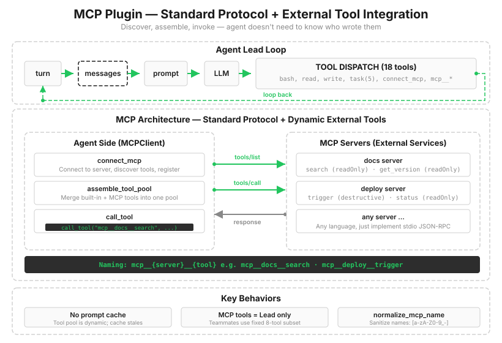

# s19: MCP Tools — External Tools through a Standard Protocol

[中文](README.zh.md) · [English](README.md) · [日本語](README.ja.md)

s01 → ... → s17 → s18 → `s19` → [s20](../s20_comprehensive/)

> *"External tools, standard protocol"* — Discover, assemble, and call tools without the agent needing to know who wrote them.
>
> **Harness layer**: Plugins — external capabilities connect through a standard protocol.

---

Take inventory of the toolbox: bash, files, tasks, teams, and worktrees were all written directly into `code.py`. Now a user asks, "Let the agent query our company's Jira and our custom deployment platform."

The old s02 slogan still seems applicable: define one item, register one line. But something is wrong this time. You must write the Jira tools, then the deployment tools, then rewrite everything for the next company's systems and ship another version. Tool authors and harness authors become permanently coupled, while the world's systems are far too numerous to implement one by one.

The problem is the direction of coupling: the harness knows every concrete tool. To undo it, the harness should know only two things: how to discover tools and how to call them. Think of USB. Every manufacturer builds its own device, but the port follows one standard. In the agent world, that standard is MCP, the Model Context Protocol.



---

## Discovery: Ask at Runtime, Do Not Hardcode at Compile Time

The first step in connecting an MCP server is not registering its tools. It is asking, "what do you have?"

```python
def connect_mcp(name: str) -> str:
    mcp_client = MOCK_SERVERS[name]()          # Establish the connection
    mcp_clients[name] = mcp_client
    tool_names = [t["name"] for t in mcp_client.tools]   # Tools are discovered
    return (f"Connected to MCP server '{name}'. "
            f"Discovered {len(mcp_client.tools)} tools: {', '.join(tool_names)}")
```

The server reports its own tool inventory. Each tool has a name, description, and parameter schema in exactly the same shape as the hand-written `TOOLS` from s02. The harness does not need to know which endpoints Jira offers in advance; it learns when the connection is made. That is discovery.

The teaching servers are in-process mocks: one `docs` documentation service and one `deploy` deployment service. Real MCP uses JSON-RPC over stdio or HTTP to communicate with separate processes. But the shape, connect, discover, call, return a result, is the same. The teaching version preserves that shape and removes the transport.

---

## Naming: The Prefix Is the Namespace

Discovered tools cannot be poured directly into the tool pool. They must be renamed first:

```python
def normalize_mcp_name(name: str) -> str:
    return _DISALLOWED_CHARS.sub('_', name)    # Replace everything outside [a-zA-Z0-9_-] with underscores

prefixed = f"mcp__{safe_server}__{safe_tool}"  # mcp__docs__search
```

The prefix prevents collisions. Both the `docs` and `deploy` servers may expose a tool called `status`; after adding `mcp__{server}__`, they are independent and can never collide with a built-in such as `bash`. Normalization is the inspection philosophy making a fourth appearance: s02 guarded paths, s07 guarded skill names, and s18 guarded worktree names. Server-provided names are external input, and a name with unexpected characters can make the API reject the entire request.

---

## Assembly: Built-in and External Tools Enter the Same Pool

```python
def assemble_tool_pool() -> tuple[list[dict], dict]:
    tools = list(BUILTIN_TOOLS)
    handlers = dict(BUILTIN_HANDLERS)
    for server_name, mcp_client in mcp_clients.items():
        for tool_def in mcp_client.tools:
            prefixed = f"mcp__{normalize_mcp_name(server_name)}__{normalize_mcp_name(tool_def['name'])}"
            tools.append({"name": prefixed,
                          "description": tool_def.get("description", ""),
                          "input_schema": tool_def.get("inputSchema", {})})
            handlers[prefixed] = (
                lambda *, c=mcp_client, t=tool_def["name"], **kw: c.call_tool(t, kw))
    return tools, handlers
```

To the model, the assembled pool has no distinction between "built-in" and "external." `mcp__docs__search` and `read_file` look identical: each is a name plus a schema. The dispatch mechanism from s02 works unchanged, which is the compounding return from choosing table-driven dispatch at the start.

The handler lambda contains an old Python trap worth naming. The intuitive `lambda **kw: mcp_client.call_tool(tool_def["name"], kw)` closes over loop variables. After the loop ends, every handler points to the **last** tool, so calling `search` might execute `get_version`. Default arguments, `c=mcp_client, t=tool_def["name"]`, freeze the values when the lambda is defined, giving every handler its own binding. This is late binding, a trap to consider whenever creating closures inside a loop.

Assembly is not a one-time operation. `agent_loop` assembles the pool again after every tool round. If the model calls `connect_mcp` in one round, the new tools are present in the next. The cost must also be explicit: when the tool list changes, the request's `tools` parameter changes, invalidating the prompt-cache prefix discussed in s08's optional section. The comparison in s10 said that `mcp_instructions` is the only volatile segment in the real system; this is why. MCP is the one runtime-variable part of the tool pool.

---

## Annotations: External Tools Describe Themselves

Look at the mock server's tool definitions. `search` carries `{"readOnlyHint": true, "destructiveHint": false}`, while `deploy.trigger` carries the opposite values. These are structured annotations, not words appended to a description. We know whether a built-in tool reads or writes because we implemented it. For an external tool, its server can only declare its intended behavior.

`assemble_tool_pool()` keeps those annotations in `MCP_TOOL_ANNOTATIONS` under the prefixed tool name. They are host metadata, so they are not flattened into the description or sent as part of the model-facing tool schema. s19 preserves the information but does not enforce a permission policy yet; s20 is where the `PreToolUse` gate consumes it.

One more layer of honesty is required: annotations come from the server, and a server can lie. MCP defines them as hints, not authorization. A real connector must combine them with server trust and local policy. This course connects only explicitly registered in-process mock servers, but it keeps the boundary visible rather than teaching that `readOnlyHint=true` is proof of safety.

---

## Changes from s18

| Component | Before (s18) | After (s19) |
|------|-----------|-----------|
| Tool source | All built in and fixed at compile time | Built-in + MCP discovery, variable at runtime |
| New type | — | `MCPClient` (discovery + invocation) |
| New functions | — | `connect_mcp`, `assemble_tool_pool`, `normalize_mcp_name` |
| Naming | Bare names | MCP tools use the `mcp__{server}__{tool}` prefix |
| Tool pool | Static `TOOLS` | Reassembled after every tool round |
| Annotations | — | Structured host metadata keyed by the prefixed tool name |

---

## Try It

```sh
cd learn-claude-code
python s19_mcp_plugin/code.py
```

1. **The moment of discovery**: `Connect to the docs MCP server, then list what tools you have now.` After `[mcp] connected: docs → ['search', 'get_version']`, the model can name new tools such as `mcp__docs__search`. They are in the pool.
2. **Calls from one pool**: `Search the docs for "authentication" and also read README.md`. An external tool and a built-in tool are called together in one round; to the model, there is no difference.
3. **Connecting a missing server**: `Connect to the jira MCP server`. The response is `Unknown server 'jira'. Available: docs, deploy`. The error includes the valid inventory, so the model can correct itself.
4. **Preserving annotations**: `Connect to deploy and check the status of service 'web'`, then try `Trigger a deployment of 'web'`. Both tools run because s19 has not connected the permission gate. The distinction remains in `MCP_TOOL_ANNOTATIONS`; s20 will use it before dispatch instead of trying to infer risk from the tool name.

---

## Next

With MCP connected, the last piece of the toolbox is in place. Looking back over nineteen chapters, each added one mechanism in an independent demo. But a real agent is not nineteen demos; it is one process where compaction, memory, permissions, teams, and scheduling all operate around the same loop at once.

s20 Comprehensive Agent → Combine the first nineteen chapters into one complete harness. Many mechanisms, one loop.

<!-- translation-sync: zh@v3, en@v3, ja@v3 -->
