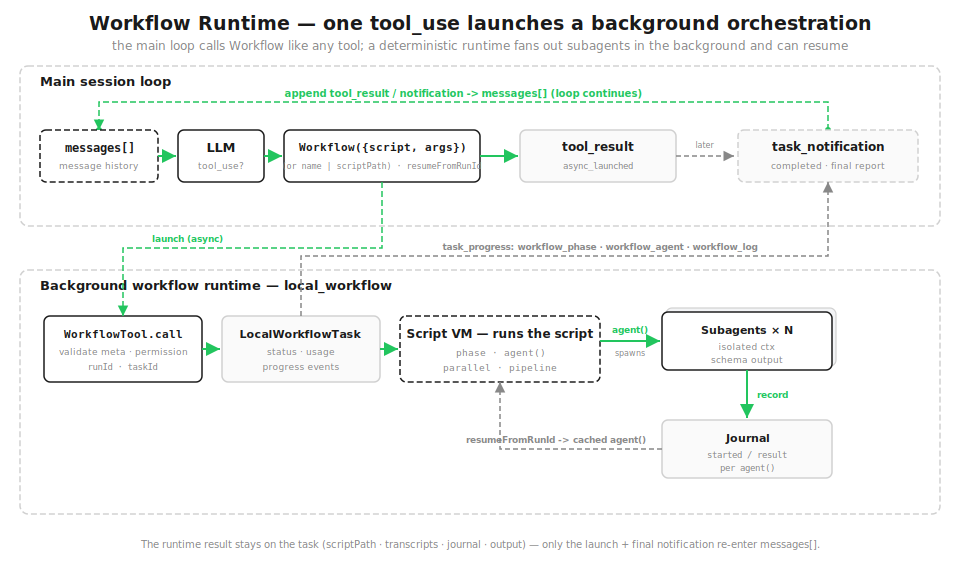

# s21: Workflow Runtime — モデルは単ステップ、スクリプトはオーケストレーション

[中文](README.zh.md) · [English](README.md) · [日本語](README.ja.md)

s01 → ... → s19 → s20 → `s21`

> *"1 回の tool_use で、バックグラウンドでオーケストレーション一式を走らせる"* — `Workflow` ツールが決定的で再開可能な script runtime を起動し、subagent の群れを fan out する。
>
> **Harness 層**: オーケストレーション — single-agent loop の上に、決定的な multi-agent script runtime を一層加える。

---

## 問題

s01 から s20 まで、loop は model 駆動で単ステップだ：毎 round で model が tool を 1 つ選び、結果を `messages[]` に戻し、また 1 round。オープンエンドな task ではこれが最善——次に何をするかは、context を見て model にその場で決めさせる。

しかし、一部の仕事は **agent の群れを決定的にオーケストレーション**する必要がある。大きな変更を review する例：10 個の dimension を並行で問題探し → 各 finding にそれぞれ adversarial な verification を dispatch → 集約して dedup → severity で sort。このオーケストレーションの形は固定で、欲しいのは：

- **並行**、1 つずつ待たない；
- **決定的**、同じ入力で同じ構造が出る；
- **再開可能**、途中で落ちても、もう終わった部分はやり直さない。

これを model が main loop で 1 ステップずつ駆動するのは、遅いし、非決定的だし、落ちたら最初からだ。このとき欲しいのは「もう 1 round 会話する」ことではなく、**オーケストレーションをコードとして書く**ことだ。

## 解決策

Claude Code は tool pool に `Workflow` ツールを置く。あなた（あるいは `ultracode` trigger 下の model）がそれに **script** を渡し、script は `agent() / parallel() / pipeline() / phase()` という primitive で、オーケストレーションを決定的なコードとして書く。

main loop は 1 回の `tool_use` だけを見て、**即座に** `async_launched` を受け取る——本当の実行は**バックグラウンド runtime** の中で進み、progress を報告し、journal を disk に書く。script 内の中間結果は変数に入り、会話には入らない。`resumeFromRunId` は変更していない `agent()` を journal cache にヒットさせ、中断点から再開できる。



計画は会話の 1 round ではなく、コードだ：

```python
SAMPLE_META = {"name": "review-changes", "description": "...", "phases": ["Review", "Verify"]}

async def sample_workflow(ctx, args):
    ctx.phase("Review")
    results = await ctx.pipeline(DIMENSIONS, audit, verify)   # 各 dimension が独立で audit -> verify を走る
    confirmed = [f for r in results if r for f in r["confirmed"]]
    ctx.log(f"confirmed {len(confirmed)} real finding(s)")
    return {"confirmed": confirmed}
```

## 仕組み

### Workflow ツール：バックグラウンド起動、main loop は 1 回の tool_use だけ

`Workflow`（別名 `RunWorkflow`）は main agent の tool pool にある。trigger が来る——明示的な「workflow を実行/作成」、保存済みの `/コマンド`、あるいは `ultracode` の高 effort path——と、model は `Workflow(...)` の `tool_use` を出す。`WorkflowTool.call` が引数を parse し、meta を検証し、permission を通し、`local_workflow` task を登録し、そして **即座に** `async_launched` を返す。main loop は block せず先へ進む；workflow はバックグラウンドで走る。

```python
class WorkflowTool:
    async def call(self, meta, script_fn, args=None, resume_from_run_id=None):
        validate_meta(meta)
        check_permission(meta)
        run_id = resume_from_run_id or create_run_id(meta)
        task = LocalWorkflowTask(create_task_id(run_id), run_id, meta)
        task.event("async_launched", runId=run_id, taskId=task.task_id)   # 即座に返す
        ...                                                                # 残りはバックグラウンド
```

> 実際の Claude Code：tool は即座に `{status:'async_launched', taskId, taskType:'local_workflow', runId, summary, transcriptDir, scriptPath}` を返し、バックグラウンド task は後で完了する。

### script と meta：最初の文

script の**最初の文**は必ず `export const meta = { name, description, phases }` で、しかも純粋な literal でなければならない——変数も、関数呼び出しも、連結も不可。runtime は何かを実行する前にまずそれを parse する：`name`/`description` が task と UI を駆動し、`phases` が progress group に名前を付ける。不正な入力は直ちに `WorkflowInputError`。

```python
def validate_meta(meta):
    if not meta.get("name") or not meta.get("description"):
        raise WorkflowInputError("meta requires `name` and `description`")
    if "phases" in meta and not isinstance(meta["phases"], list):
        raise WorkflowInputError("meta.phases must be a list")
    return meta
```

> 実際の Claude Code：`parseWorkflowScript` は meta が最初の文かつ純粋な literal であることを強制する；教学版は dict をそのまま受け取る。

### オーケストレーション primitive：agent / parallel / pipeline / phase / log / workflow

script は 1 つの context の中で走り、その中で使える global は**これらのオーケストレーション primitive だけ**だ。script 自身は file を直接読み書きせず、shell も走らせない——本当の codebase の読み書きは、**subagent** が自分の tool permission で行う。primitive は `ExecutionState` の method だ：

| primitive | 役割 |
|------|------|
| `agent(prompt, {schema, label, phase})` | subagent を 1 つ fan out |
| `parallel(thunks)` | **barrier**：全部を並行で走らせ、まとめて待つ |
| `pipeline(items, *stages)` | item ごとに stage 分け、**barrier なし** |
| `phase(title)` | progress group（upsert） |
| `log(message)` | progress 行 |
| `workflow(name, args)` | nested sub-workflow（1 層のみ） |

`pipeline` がデフォルト——各 item が独立で全 stage を通り、item A が stage 3 にいる間に item B はまだ stage 1 かもしれない；「前 stage の全結果をまとめて」が本当に必要なときだけ `parallel` という barrier を使う。

```python
async def pipeline(self, items, *stages):
    async def run_item(item, idx):
        value = item
        for stage in stages:                       # 各 item が独立で全 stage を走る
            value = await stage(value, item, idx)
        return value
    return await asyncio.gather(*[run_item(it, i) for i, it in enumerate(items)])
```

> 実際の Claude Code：同名の primitive は VM が script context に注入する；さらに `args`、`budget`（`budget.total/spent/remaining`）、agent 数上限（1000）、並行 semaphore もある。

### 構造化出力：agent({schema}) + StructuredOutput

`agent({schema})` は subagent に schema に一致した JSON object を返させる（1 回の `StructuredOutput` 呼び出し経由）。runtime は schema で検証し、不一致なら 1 回 retry する。こうして下流のコードが消費するのは、また parse し直す散文ではなく、**object** だ。

```python
result = self.runner.run(prompt, schema, label)
if schema is not None:
    ok, err = SimpleJsonSchema(schema).validate(result)
    if not ok:                                       # 1 回 nudge して retry、ダメなら raise
        result = self.runner.run(prompt + "\n\nReturn valid JSON.", schema, label)
        ok, err = SimpleJsonSchema(schema).validate(result)
        if not ok:
            raise WorkflowInputError(f"agent({{schema}}) invalid output: {err}")
```

> 実際の Claude Code：`SimpleJsonSchema` + `StructuredOutput` tool + schema retry。

### バックグラウンド task と progress event

`LocalWorkflowTask` は status/usage を持ち、SDK 風の event stream を外へ出す：`task_started` → 一連の `task_progress`（`workflow_phase` / `workflow_agent` / `workflow_log` の batch を載せる）→ 最後の `task_notification`（completed / failed / stopped、output file・token 数・tool call 数・経過時間付き）。main session はこれらを event として見る；loop に再び入るのは最後の notification だけだ。

```python
class LocalWorkflowTask:
    def progress_event(self, ptype, **data):         # workflow_phase / workflow_agent / workflow_log
        self.progress.append({"type": ptype, **data})
        print(f"  progress   {ptype} ...")
```

> 実際の Claude Code：progress は task status に畳み込まれ、`task_progress.workflow_progress` として UI/SDK へ送られる。

### ストレージ：snapshot + journal

run が終わると 5 つのものを書く。すべて `~/.claude/projects/<project>/<session>/` の下だ：snapshot `<runId>.json`、output `<runId>.output.json`、journal `<runId>.journal.jsonl`、script `scripts/<runId>.js`、subagent transcript `subagents/workflows/<runId>/`。保存済みの workflow は `.claude/workflows/`（project）か `~/.claude/workflows/`（user）に置く。

journal が resume の鍵だ——各 `agent()` の結果を、1 行ずつ記録する：

```python
class WorkflowJournal:
    def record(self, key, value):
        self._f.write(json.dumps({"key": key, "value": value}) + "\n")
        self._f.flush()
        self.cache[key] = value
```

### resume：runId から cache を再利用

`Workflow({scriptPath, resumeFromRunId, args})` は **script を再実行する**が、各 `agent()` は**決定的な semantic key** を計算する：journal にある key はその場で cache 結果を返し（再実行しない）、変更していないものは全部ヒット；変更したものとその後だけが本当に走る。

肝は、key が**並行順序に依存してはいけない**ことだ——`parallel`/`pipeline` 内の agent の完了順は不定なので、key は競合する counter ではなく、呼び出し内容（kind・label・prompt・schema）の安定 hash から計算する。

```python
def key(self, kind, label, prompt, schema):
    basis = f"{kind}|{label}|{prompt}|{json.dumps(schema, sort_keys=True)}"
    return f"{kind}-{_stable_hash(basis) % 10**10:010d}"

# agent() 内:
cached = self.journal.cached(key)
if cached is not MISS:
    self.task.progress_event("workflow_agent", label=label, status="cached")
    return cached
```

> 実際の Claude Code：同じく「決定的 semantic key + journal cache」；同一 session 内で resume 前に完了した `agent()` は cache を返し、その後のものは実際に走る。

### 決定性：再現可能が前提

resume が成立するには、script が再現可能でなければならない。だから runtime は `Date.now()`、引数なしの `new Date()`、`Math.random()` を script context から取り除き、Node API も与えない。同じ script + 同じ args → 同じ key → 100% cache ヒット。教学版は安定 hash で key を計算して同じ効果に達する（実際の版はこれらの非決定的なソースを除いた sandbox VM の中で JS script 全体を走らせる）。

### まとめて走らせる

サンプル workflow `review-changes`：`pipeline` が各 review dimension を独立に「audit → verify」へ通す——audit は schema 付きの `agent()` で問題を探し、verify は `parallel()` で各 finding にそれぞれ adversarial な verification subagent を割り当て、最後に `isReal` のものだけを残して severity で sort する。

```python
async def sample_workflow(ctx, args):
    ctx.phase("Review")

    async def audit(_v, dimension, _i):
        out = await ctx.agent(f"Review the changed files for {dimension} issues.",
                              schema=FINDINGS_SCHEMA, label=f"audit:{dimension}", phase="Review")
        return {"dimension": dimension, "findings": out["findings"]}

    async def verify(audited, dimension, _i):
        ctx.phase("Verify")
        verdicts = await ctx.parallel([                       # 各 finding を独立で adversarial に verify
            (lambda f=f: ctx.agent(f"Adversarially verify ... {f['title']}",
                                   schema=VERDICT_SCHEMA, label=f"verify:{dimension}:{f['title']}"))
            for f in audited["findings"]])
        return {"dimension": dimension,
                "confirmed": [f for f, v in zip(audited["findings"], verdicts) if v and v["isReal"]]}

    results = await ctx.pipeline(DIMENSIONS, audit, verify)
    ...
```

## s20 からの変更

| | s20 総合体 | s21 Workflow Runtime |
|--|-----------|---------------------|
| loop | 単一、model 駆動 | main loop は不変；その上に決定的なオーケストレーション層 |
| 次のステップを誰が決めるか | model が round ごとに | script があらかじめ書き定める |
| 複数 agent | s06 subagent、一度きりの fan-out | スクリプト化・再現可能・再開可能な batch オーケストレーション |
| 新しい仕組み | — | script DSL、バックグラウンド task、progress event、journal/resume、構造化出力、決定的 VM |

s21 は main loop を置き換えない——tool layer に `Workflow` を露出し、その裏で `local_workflow` runtime を起動する：**1 つの workflow が N 個の agent loop を決定的に駆動する**。s06 の subagent は model がその場で一度 fan out するもの；s21 はオーケストレーションを再生可能な script として書くものだ。

## 試す

```bash
python s21_workflow_runtime/code.py          # review-changes を起動、event stream を見る
python s21_workflow_runtime/code.py resume   # 前回の runId で再開、各 agent() が journal cache にヒット
```

観察：1 回の launch → `async_launched` → バックグラウンドの `workflow_phase` / `workflow_agent` progress → `task_notification`；結果は task に残る。`resume` では `agents=0 tokens=0`（全部 cache ヒット）、結果は 1 文字も違わない。

## これから

オーケストレーションは agent 能力の上のもう 1 層だ：**main loop は単ステップを、script はチーム全体を司る**。仕事を決定的で再開可能な script として書けば、model は「round ごとの駆動者」から「script に scheduling される実行ユニット」へと変わる——同じ `agent()` が、main loop では model にその場で呼ばれ、workflow では script に batch でオーケストレーションされる。

これから：[s22 Goal Loop](../s22_goal_loop/) — オーケストレーションは仕事を扇出して main loop を離れる；次章はその逆で、目標が制御を引き戻す：満たされるまで turn を終わらせない。

<!-- translation-sync: zh@v1, en@v1, ja@v1 -->
