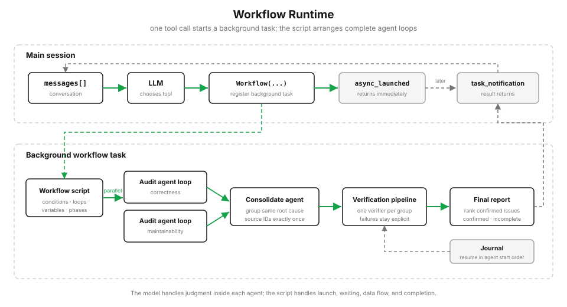

# s21: Workflow Runtime：模型决定单步，脚本决定编排

[中文](README.zh.md) · [English](README.md) · [日本語](README.ja.md)

s01 → ... → s19 → s20 → `s21`

> *“一件事怎么做，交给模型判断；一批事情按什么顺序做，交给脚本安排。”*
>
> **Harness 层：编排。** 把稳定、重复、适合并行的多 Agent 流程写成代码。

---



从 s01 到 s20，下一步做什么一直由模型决定。模型读取上下文、选择工具、观察结果，再决定下一步。对于开放任务，这仍然是最合适的方式。

但有些任务的执行顺序已经很明确。比如审查一个大改动：

1. 找到需要检查的文件；
2. 并行检查不同方面；
3. 把描述同一根因的报告归并在一起；
4. 对归并后的每个问题做独立验证；
5. 排序并生成一份报告。

这里真正需要模型判断的是“代码有没有问题”和“这条发现是否成立”。至于什么时候并行、结果交给谁验证、最后怎样汇总，不必每一轮都让模型重新决定。

Workflow 做的事情，就是把这部分安排写进脚本。

## 把安排写进代码

Claude Code 保存的 Workflow 是 JavaScript。脚本使用普通的条件、循环和变量组织工作，需要理解和判断的步骤交给 `agent()`：

```javascript
export const meta = {
  name: "review-changes",
  description: "Review changed files and verify every finding",
}

const audits = await pipeline(args.files, file =>
  agent(`Review ${file} for correctness problems.`, { label: file })
)

return audits.filter(Boolean)
```

这一课使用 Python 重建运行时，让后台任务、并发、失败和恢复过程更容易看清。示例 Workflow 的核心结构如下：

```python
async def review_changes(context, args):
    context.phase("Review")

    audits = await context.parallel([
        lambda dimension=dimension: context.agent(
            f"检查目标文件中的 {dimension} 问题",
            schema=FINDINGS_SCHEMA,
            label=f"audit:{dimension}",
        )
        for dimension in REVIEW_DIMENSIONS
    ])

    findings = []
    for dimension, result in zip(REVIEW_DIMENSIONS, audits):
        if not result.ok:
            continue
        for finding in result.value["findings"]:
            findings.append({
                "source_id": f"r{len(findings)}",
                "dimension": dimension,
                **finding,
            })

    context.phase("Consolidate")
    grouping = await context.agent(
        f"按同一根因归并这些报告：{findings}",
        schema=CONSOLIDATION_SCHEMA,
        label="consolidate",
    )
    consolidated = validate_consolidation(findings, grouping)

    async def verify(finding, _original, _index):
        verdict = await context.agent(
            f"独立验证这条发现：{finding}",
            schema=VERDICT_SCHEMA,
            label=f"verify:{finding['title']}",
        )
        return finding if verdict["confirmed"] else {}

    context.phase("Verify")
    verdicts = await context.pipeline(consolidated, verify)

    return [
        result.value for result in verdicts
        if result.ok and result.value
    ]
```

语言不同，分工没有变：模型负责需要判断的步骤，脚本负责启动、等待、传递结果和收尾。

## 一次启动，后台完成

Workflow 是主 Agent 的一个工具。模型调用它之后，工具先注册一个本地任务，再立即返回：

```python
job = asyncio.create_task(self._execute(...))
self.registry.register(task, job)

return {
    "status": "async_launched",
    "taskId": task_id,
    "runId": run_id,
}
```

主会话拿到的是任务凭条，不需要等整套流程跑完。后台任务继续推进，并依次产生阶段、Agent 和最终完成事件。

## agent() 启动的是完整子 Agent

`agent()` 不是一次普通文本补全。每个子 Agent 都有自己的消息记录和工具循环，可以读取文件、查看 diff，再决定是否继续调用工具。

```python
for _turn in range(30):
    response = client.messages.create(
        model=model,
        messages=messages,
        tools=READ_ONLY_TOOLS,
    )
    messages.append({"role": "assistant", "content": response.content})

    tool_results = []
    for block in response.content:
        if _block_type(block) != "tool_use":
            continue
        output = self._run_tool(
            _block_value(block, "name"),
            _block_value(block, "input", {}),
        )
        tool_results.append({
            "type": "tool_result",
            "tool_use_id": _block_value(block, "id"),
            "content": output,
        })

    if tool_results:
        messages.append({"role": "user", "content": tool_results})
        continue

    return AgentRun(value=_extract_text(response.content))
```

示例审查只提供只读工具。`read_file` 带有稳定的行号，后续发现可以准确指向证据。`glob` 从 Git 已跟踪和未忽略的文件中匹配，并限制返回数量和字符数，避免一次宽泛搜索把 `.worktrees` 或大量生成文件送回模型。Workflow 如果需要修改文件，仍然应该沿用前面课程中的权限检查和 worktree 隔离，而不是让多个写入任务直接共享一个目录。

## parallel() 和 pipeline()

`parallel()` 适合彼此独立、需要一起汇总的工作：

```python
audits = await context.parallel([
    lambda: audit("correctness"),
    lambda: audit("maintainability"),
])
```

它会并行启动所有分支，等全部结束后按输入顺序返回结果。

`pipeline()` 适合让每一项连续经过多个阶段：

```python
results = await context.pipeline(
    findings,
    verify,
)
```

同一项会按顺序经过各阶段，不同项之间仍然可以并行。一个发现已经完成验证时，另一个发现可能还在读取相关代码。

## 先保证形状，再判断内容

Workflow 中的返回值会继续交给代码处理，因此字段必须稳定。`agent(schema=...)` 要求子 Agent 最后提交符合 Schema 的结构化结果：

```python
{
    "findings": [
        {
            "title": "...",
            "severity": "high",
            "evidence": "..."
        }
    ]
}
```

Schema 只解决“返回值能不能被下游代码使用”，不能证明内容正确。

审查 Agent 返回了合法的 `findings` 数组，只能说明字段齐全。发现是否真实、所述原因和影响能否由代码推出，仍然要交给另一个 Agent 独立验证。格式检查和内容验证解决的是两个不同问题，不能因为 JSON 合法就直接相信结论。

## 同一根因只验证一次

不同审查维度可能发现同一个问题，但标题通常不会完全相同。标题是展示文本，不能直接当作去重键。

脚本先给每条原始发现分配 `r0`、`r1` 这样的来源编号，再让一个 Consolidate Agent 判断哪些报告描述的是同一根因：

```json
{
  "groups": [
    {
      "source_ids": ["r0", "r1"],
      "title": "percentage() 没有处理除数为零",
      "evidence": "两条报告都指向同一个缺失的零值分支"
    }
  ]
}
```

模型负责语义归并，但只有同一次修改能够解决组内全部报告时才会合并；拿不准就保持分开。脚本检查每个来源编号必须出现且只能出现一次，并从原始报告中保留最高严重度和全部审查维度。随后每个归并结果只启动一个 Verify Agent。

如果归并结果遗漏、重复或捏造了来源编号，程序把错误写入 `incomplete`，退回逐条验证。原始发现不会因为归并失败而静默消失。

即使所有分支都顺利完成，报告也不能证明代码中的问题已经全部找出。并行审查可以扩大检查范围，但不会让模型判断变成完备检查。

## 失败不能静默消失

并行任务可能遇到超时、限流、无效输出或工具错误。如果异常被直接变成 `None`，汇总阶段就无法区分：

- 这个分支检查过，但没有发现问题；
- 这个分支根本没有完成检查。

所以 `parallel()` 和 `pipeline()` 返回明确的 `Outcome`：

```python
Outcome(ok=True, value=result)
Outcome(ok=False, error="RuntimeError: request timed out")
```

已经验证的发现可以继续进入报告，没有完成的审查、归并或验证分支则列入 `incomplete`。部分结果仍然有用，但不能把失败当成“没有问题”。

## 中断以后从哪里继续

每次 `agent()` 启动时，运行时会记录它的顺序、输入和结果。恢复时从第一个调用开始比较：

```text
原运行：A → B → C → D
新运行：A → B → C' → D

恢复：  A、B 使用已有结果
        C' 重新执行
        D 重新执行
```

一旦遇到没有完成或已经变化的步骤，后面的步骤全部重新执行。这样不会把旧流程后半段的结果错误地接到新流程上。

并行执行时，完成顺序可能变化，因此 journal 记录的是启动顺序，不是哪个 Agent 最先返回。

journal 比较的是 `agent()` 的调用输入，不会判断目标文件是否已经变化。`resume` 用来继续同一次运行；代码或输入数据已经更新时，应启动一次新运行。

## 运行限制由整次 Workflow 共享

并发信号量、Agent 调用数量和使用量属于整次运行，而不是某一个步骤。使用量分别记录 Agent 数、模型 API 调用次数、token 和工具调用次数。嵌套 Workflow 也共享这些限制，不能通过创建子 Workflow 绕开上限。

权限检查发生在启动之前。没有明确允许的 Workflow 应该询问用户；直接运行本课脚本本身就代表用户已经同意启动内置示例。

## 跑起来看看

先安装依赖并准备 `.env`：

```bash
pip install -r requirements.txt

# .env
ANTHROPIC_API_KEY=...
MODEL_ID=...
```

运行内置审查 Workflow：

```bash
python s21_workflow_runtime/code.py
```

也可以指定一个目标文件：

```bash
python s21_workflow_runtime/code.py s20_comprehensive/code.py
```

中断后恢复上一次运行：

```bash
python s21_workflow_runtime/code.py resume
```

你会依次看到：

```text
async_launched
task_started
workflow_phase
workflow_agent
task_notification
```

输出和 journal 保存在 `s21_workflow_runtime/.runtime/`，该目录只用于本地运行，不会提交到仓库。

## 相对 s20 的变化

| | s20 综合体 | s21 Workflow Runtime |
|---|---|---|
| 谁决定下一步 | 模型根据上下文逐轮决定 | 脚本执行已经明确的安排 |
| 多 Agent | 模型临场派出子 Agent 或队友 | 脚本批量启动并汇总子 Agent |
| 中间结果 | 回到消息记录 | 保存在脚本变量中 |
| 执行方式 | 当前会话内逐步推进 | 本地任务在后台推进 |
| 中断恢复 | 依赖会话和任务状态 | 按 Agent 启动顺序复用已完成前缀 |

每一个 `agent()` 内部仍然运行原来的 Agent Loop，脚本只负责安排多个 Agent 的执行顺序。

不是所有任务都应该写成 Workflow。需求还在变化、下一步依赖现场判断时，继续使用原来的 Agent Loop。只有执行顺序稳定，而且值得重复运行时，才把它写进代码。

下一章：[s22 Goal Loop](../s22_goal_loop/) 会在每轮结束时检查完成条件。Workflow 结束只代表脚本执行完了，不一定代表用户的最终目标已经满足。

<!-- translation-sync: zh@v4, en@v4, ja@v4 -->
