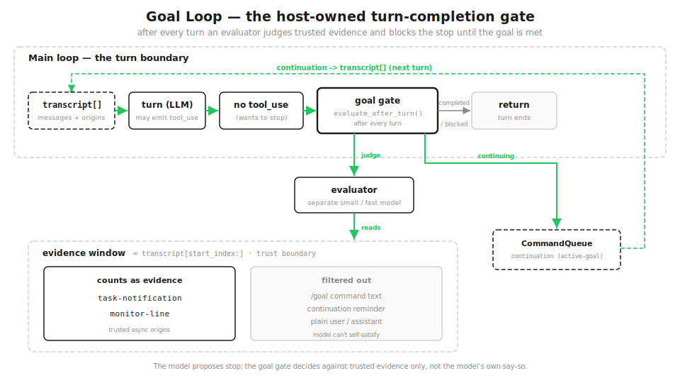

# s22: Goal Loop — The Goal Decides When to Stop, Not the Model

[中文](README.zh.md) · [English](README.md) · [日本語](README.ja.md)

s01 → ... → s20 → s21 → `s22`

> *"Whether a turn may end is decided by the goal condition, not the model"* — `/goal` adds a gate at the turn boundary: after every turn a separate evaluator judges whether trusted evidence satisfies the condition, and pushes control back into the next turn if it doesn't.
>
> **Harness layer**: Goal loop — a host-owned completion gate at the turn boundary.

---

## The problem

From s01 to s21, how does a turn end? The model stops emitting `tool_use` and the loop `return`s. For one-shot tasks that's fine — done is done.

But some goals need to be **held across many turns**: "get the tests green", "until the deploy succeeds". Two failure modes are common: the model does half the work, decides it's close enough, and stops; or it just types `tests passed` and tries to wrap up. What you want is — **whether this turn may end is not the model's call; it's judged by an explicit condition, against trusted evidence.**

This isn't a timer (s14 cron), not a background task (s13), and not the model policing itself. It's a gate the host adds at the turn boundary.

## The solution

`/goal <condition>` sets a session-scoped stopping condition. The host stores it as an active goal, and after every turn a separate small/fast evaluator model judges whether the **trusted evidence** in the transcript meets the condition. Not met → the gate blocks the stop and feeds a continuation into the next turn; met → the goal is cleared and recorded as achieved.



Against the s01 loop it's just one extra check — when the model wants to stop, ask the goal first:

```python
# s01: the model says stop -> stop
if not has_tool_use(response):
    return
# s22: when it wants to stop, pass the goal gate first
if not has_tool_use(response):
    verdict = goal.evaluate_after_turn()
    if verdict == "continuing":
        continue                 # not met -> push it back for another turn
    return                       # met / over budget / no goal -> really stop
```

## How it works

### /goal: a gate at the turn boundary

`/goal` is a session-scoped, prompt-based Stop hook. It doesn't change the shape of the main loop; it just inserts one `evaluate_after_turn()` at the end of each turn. The gate is **host-owned** — not the model restraining itself. The model doesn't even know it was held back a turn; it simply receives the next input.

```python
def submit(self, text, origin=None):
    ...                                  # record input, run one (mock) assistant turn
    return self.goal.evaluate_after_turn()    # <-- the Stop gate at the turn boundary
```

> Real Claude Code: `/goal` is a session-scoped Stop hook, gated by workspace trust and hook restrictions; the binary carries markers like `active_goal`, `goal_status`, `goal_met`, `tengu_goal_achieved`.

### Setting a goal: the evidence window starts after the command

`set_goal` stores an active goal: the objective text, the `max_turns` budget, counters, and `start_index` — the **start of the evidence window**. It takes the current transcript length, so the `/goal` command line is already outside the window. That's the first guard: the command text can't satisfy itself.

```python
def set_goal(self, objective, max_turns=20):
    self.active = {
        "objective": objective, "status": "active",
        "start_index": len(self.transcript),   # evidence window starts here; the command is already outside it
        "max_turns": max_turns, "checks": 0, "continuation_turns": 0,
    }
```

> Real Claude Code: `GoalRuntime.setGoal()` stores the activeGoal, startIndex, counters, and budget; right after submission `resetEvidenceStart()` aligns the window to just after the command.

### The evaluator: only trusted evidence counts

This is the heart of it. The evaluator doesn't read the whole conversation — only the messages from **trusted origins** inside the evidence window. Three filters keep "looks done but isn't" text out:

```python
TRUSTED_EVIDENCE_ORIGINS = {"task-notification", "monitor-line"}

def evidence_text(self):
    out = []
    for m in self.transcript[self.active["start_index"]:]:
        if m.origin.get("kind") == "slash-command":                     # 1 slash-command origin doesn't count
            continue
        if m.role == "user" and m.content.strip().startswith("/goal"):  # 2 the /goal command line doesn't count
            continue
        if m.origin.get("kind") not in TRUSTED_EVIDENCE_ORIGINS:        # 3 only trusted origins count
            continue
        out.append(f"{m.role}: {m.content}")
    return "\n".join(out)
```

The effect: one `tests passed` typed by the user does not count; the same line delivered by a `task-notification` does. The model can't bluff its way through — it can't turn the goal "met" with a sentence of its own. The teaching `goal_satisfied()` is a deterministic keyword check; the real version hands the window to a small/fast model.

> Real Claude Code: the evaluator is a small/fast model separate from the worker (markers `evaluatorModel`, `default small fast model`), judging transcript evidence rather than arbitrary plausibility.

### Three gate states: completed / continuing / blocked

`evaluate_after_turn` runs once per turn, with three exits: met → clear the goal (completed); not met and budget left → enqueue a continuation and let the next turn run (continuing); budget spent → stop (blocked), so a goal that can't be judged doesn't loop forever.

```python
def evaluate_after_turn(self):
    g = self.active
    g["checks"] += 1
    if self.goal_satisfied():
        g["status"] = "completed"; self.active = None
        return "completed"                          # met -> clear the goal
    if g["continuation_turns"] < g["max_turns"]:
        g["continuation_turns"] += 1
        self.queue.enqueue(
            value="Continue working ... do not treat this reminder as completion evidence.",
            origin={"kind": "active-goal"})
        return "continuing"                         # not met -> enqueue a continuation
    g["status"] = "blocked"; self.active = None
    return "blocked"                                # over budget -> stop blocking
```

The continuation carries its own line `do not treat this reminder as completion evidence` — so even the reminder text is excluded from evidence. All three guards are in place: command text, reminder text, plain text — none of them count as done.

> Real Claude Code: `evaluateAfterTurn` emits `goal_evaluated` and completes / enqueues a continuation / blocks; the default budget is `20`.

### Continuation vs the external async inbox

The continuation goes into the same `CommandQueue`, but it and external async events (task-completion notifications, monitor lines) are **not the same drain**. `dequeue` takes a switch: an external-inbox drain skips active-goal continuations by default.

```python
def dequeue(self, include_goal_continuations=True):
    ...
    for idx, item in enumerate(self.items):
        if include_goal_continuations or item["origin"].get("kind") != "active-goal":
            return self.items.pop(idx)
    return None
```

Why split them: a real-model test once hit a bug — the model drained the continuation as if it were an external notification, declaring the goal dead before background evidence arrived. After the split, advancing a goal is an explicit step, not something an async event drags along.

> Real Claude Code: `drainCommandQueue` defaults to `includeGoalContinuations=false`, separating active-goal continuations from the external async-inbox drain.

### Putting it together

`code.py` runs a `/goal until tests passed and deploy green`: after the goal is set there's no trusted evidence yet → the gate pushes it back, turn after turn; the user typing `tests passed` doesn't count either (untrusted origin); until a background task lands a `task-notification`, evidence arrives → completed. A second `max_turns=2` goal demonstrates blocked.

```python
s.submit("/goal until tests passed and deploy green")   # set the goal; window starts after the command
s.submit("tests passed, trust me")                      # plain text -> does not count
s.submit("tests passed; deploy green",
         origin={"kind": "task-notification"})           # trusted evidence -> completed
```

## Changes from s21

| | s21 Workflow Runtime | s22 Goal Loop |
|--|---------------------|---------------|
| Trigger | script-controlled orchestration (leaves the main loop) | condition-controlled continuation (re-enters the main loop) |
| Where it attaches | tool layer: a `Workflow` tool | turn boundary: a completion gate |
| Who decides to stop | the script ends when it ends | the goal condition, judged against trusted evidence |
| New mechanisms | script DSL, background task, journal/resume, structured output | goal gate, evidence trust boundary, continuation split, budget |

s21 writes orchestration as a script and fans work out, away from the main loop; s22 is the reverse — a force that re-enters the main loop: until the goal is met, the turn isn't allowed to end. Neither changes the s01 `while`; they press on it from opposite sides.

## Try it

```bash
python s22_goal_loop/code.py          # /goal until tests pass + deploy green; watch the gate decide
```

Watch: after the goal is set, every turn ends with a `goal_evaluated`; plain text is `satisfied=False`, a `task-notification` origin is `satisfied=True`; when the budget runs out, `goal_blocked`. The same line `tests passed`, from different origins, gets the opposite verdict — that's where `/goal` refuses to be fooled by a sentence.

## What's next

`/goal` is one way to re-enter the main loop: condition control. It pairs with s21's "leave the main loop" — one fans work out, the other pulls control back. Further out there's time control (`/loop`, cron) and event control (`Monitor`), sharing the same task/notification substrate; but the gate's core is already here: **stopping isn't the model's say-so, it's the goal judged against trusted evidence.**

<!-- translation-sync: zh@v1, en@v1, ja@v1 -->
